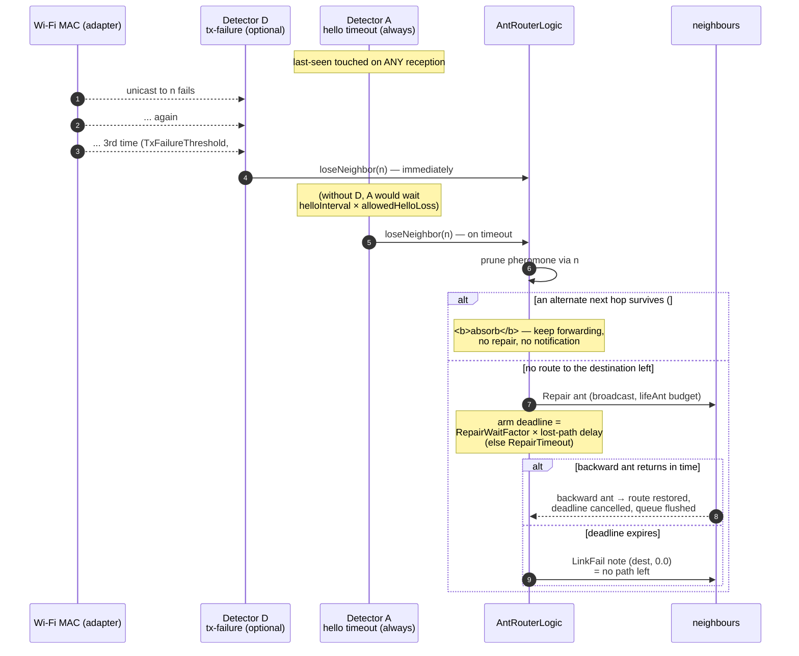

# ADR-0008: Neighbour-liveness via two detectors; the provider is advisory

- **Status:** Accepted — implementation tracked in
  item 05
- **Date:** 2026-06-25

## Context

AntHocNet must notice when a neighbour disappears so it can purge that
neighbour's pheromone and trigger repair/notification. The spec defines detection
two ways ([1] §3.5):

> "Nodes can detect link failures ... when unicast transmissions fail, or when
> expected periodic [hello] messages were not received."

The codebase already has an `INeighborProvider` port whose `neighbors()` returns
the link layer's current one-hop set, and item 05
additionally proposes a core-side last-seen map expiring neighbours on
`t_hello × allowed_hello_loss`. That leaves **two notions of "neighbour"** that
can disagree (a node still in `neighbors()` but silent for 3 hellos; or expired
by the core but still adjacent at the MAC), and item 05 never said which one is
allowed to *declare a neighbour gone*. Today only NS-2 detects loss (failed
unicast); **NS-3 detects nothing**, so dead-link pheromone persists and data is
sent into the void.

## Decision

Use **both** detectors — they are complementary, not competing — and both feed a
single `loseNeighbor(n)`:

- **Hello-timeout (core timer) — the portable coverage path, and primary.** The
  core tracks last-seen per neighbour (touched on any reception) and expires on
  `helloInterval × allowedHelloLoss` via `onMaintenanceTick()`. This is the
  spec's detection mechanism, is simulator-agnostic, and is the **only** detector
  NS-3 has — so it is mandatory and fixes the NS-3 correctness gap. It also
  covers **idle** neighbours a node isn't actively transmitting to (the MAC is
  silent for those).
- **MAC transmit-failure (adapter signal) — a fast-path accelerator.** When a
  unicast to a next hop fails (NS-2 link-failure callback; NS-3 WiFi MAC / ARP
  tx-error hook), the adapter calls the same `loseNeighbor` immediately rather
  than waiting for the timeout. It is never the *sole* detector and never
  required for correctness.
- **`INeighborProvider` is advisory only.** It answers "who can I hello / who is a
  candidate," never "who is alive." Pheromone-table membership is driven by
  reception + explicit loss events; the provider must not evict.
- Hello broadcasts (and thus the liveness tick) run **independently of the
  diffusion gate** ([ADR-0007](0007-proactive-diffusion-gated.md)): turning
  proactive/diffusion off suppresses only the hello pheromone payload, not the
  hellos themselves.

## The two detectors on one timeline

Detector A is a timer; detector D is an event. They race, and whichever fires
first calls the same `loseNeighbor(n)` — so the diagram below is the *fast*
case (D wins) and the *portable* case (only A exists) drawn together.

Reading the race is the point of having two: **A alone is correct but slow**
(it must wait out the hello budget, and on a mobile field that is the
reconvergence tail), while **D alone is fast but blind** — it only ever fires
for a neighbour this node is actively transmitting to, so an idle neighbour
that walks away is invisible to it. Neither is redundant.

## Alternatives considered

- **Make `INeighborProvider` authoritative** — the core diffs successive
  `neighbors()` snapshots and emits loss for anything that vanished. Simpler core
  (no last-seen map, no timer), uses ground truth — but it is **not** the spec
  mechanism, ties "neighbour loss" to each simulator's MAC/table semantics
  (diverging NS-2 vs NS-3 behaviour and breaking reproducibility /
  cross-validation), and would not translate to a real deployment. Rejected.
- **Single detector only.** Hello-timeout alone is slow to react on an active
  link that just broke; MAC-failure alone misses idle neighbours and gives NS-3
  nothing portable. Either alone is strictly worse than both. Rejected.

## Consequences

- NS-3 gets working neighbour-loss detection from the hello-timeout path
  (mandatory), closing the dead-link-pheromone gap; NS-2 keeps its fast MAC path
  and gains the timeout as a backstop.
- Detection *policy* (thresholds, notification) lives in `core/`; the detection
  *signal* (a TX failed) is a simulator event delivered through the adapter —
  the clean reading of golden rule #2.
- `INeighborProvider`'s contract is clarified to "advisory adjacency, never
  authoritative for removal" (the port's doc comment and item 05 should say so).
- Reproducibility and NS-2/NS-3 cross-validation are preserved because the
  authoritative detector is the simulator-agnostic core timer, not a per-MAC
  neighbour table.
