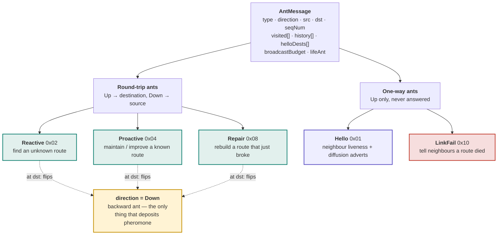
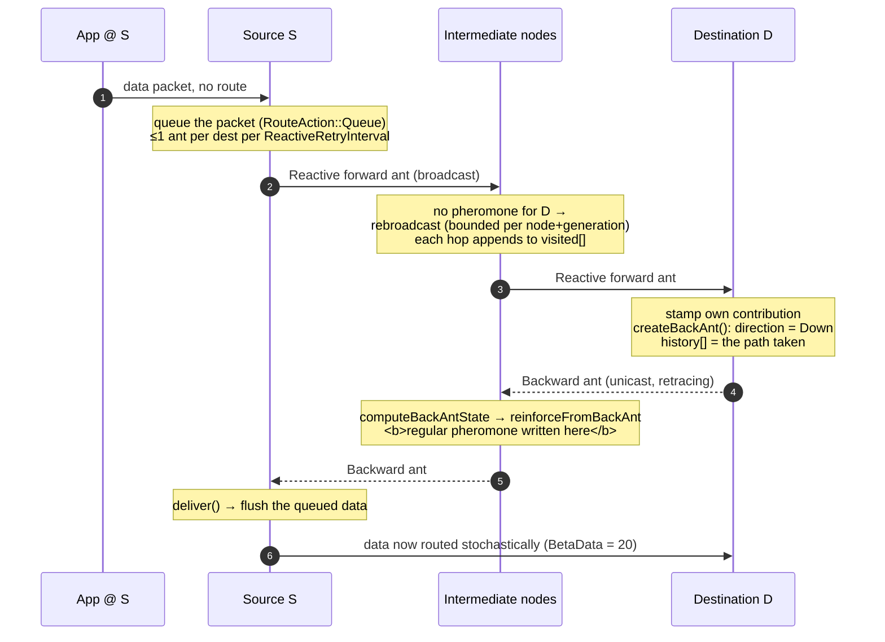
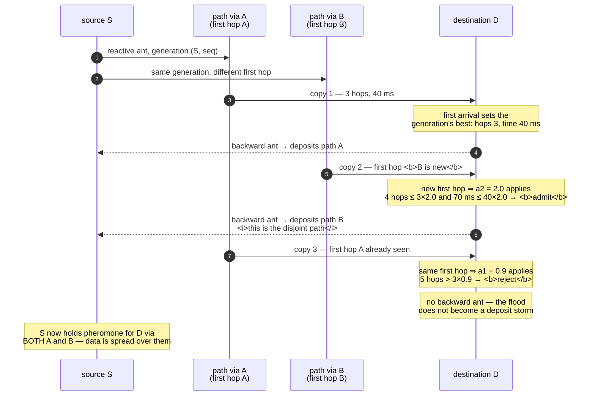
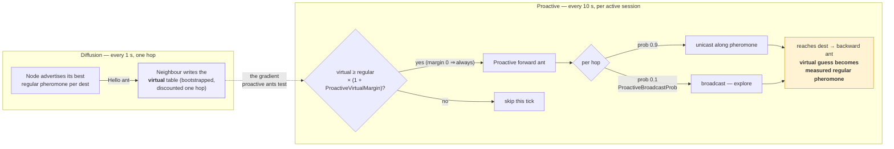
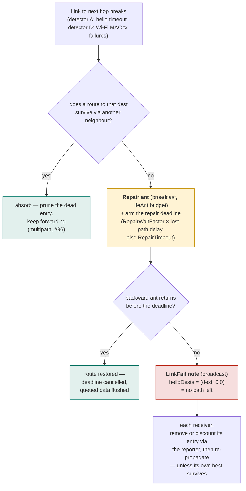

# The ant types

AntHocNet's control plane is five ant types travelling in two directions. This
page is the reference: what triggers each ant, how it moves, what it changes,
and which switch turns it off. The *idea* behind them is in
[`ant-colony-routing.md`](ant-colony-routing.md); where they sit in the software
is [`software-layers.md`](software-layers.md); which ones are live in each
network regime is [`network-regimes.md`](network-regimes.md) §6.

Types and directions are declared in
[`core/include/anthocnet/core/ant_message.h`](../core/include/anthocnet/core/ant_message.h)
and all handling lives in one pure function —
`AntRouterLogic::onReceiveAnt()` in
[`core/src/ant_router_logic.cpp`](../core/src/ant_router_logic.cpp).

## 1. Taxonomy: five types, two directions

The wire values match the legacy `ANTTYPE*` bit flags so old traces stay
comparable. **Direction is orthogonal to type**: three types make a round trip
(forward out, backward home), two are one-way notifications that are never
answered.

The single most important row of the next table: **only a backward ant writes
regular pheromone.** Forward ants gather evidence; hello adverts write the
*virtual* table; LinkFail removes or discounts entries. Nothing else reinforces.

## 2. Comparison table

| | **Hello** | **Reactive** | **Proactive** | **Repair** | **LinkFail** |
|---|---|---|---|---|---|
| Wire value | `0x01` | `0x02` | `0x04` | `0x08` | `0x10` |
| Purpose | neighbour liveness; carry diffusion adverts | discover a route nobody has | maintain and improve an in-use route | rebuild a route that just broke | announce that a route died |
| Trigger | timer, every `HelloInterval` (1 s) | data packet with no route (≤1 per dest per `ReactiveRetryInterval` 0.25 s) | maintenance tick per active session (`ProactiveInterval` 10 s, session `SessionTtl` 5 s) | link/tx failure with no surviving route to that dest | neighbour loss, or repair deadline expiring |
| Direction | Up only | Up, then Down | Up, then Down | Up, then Down | Up only |
| Transport | broadcast, one hop | broadcast flood (unicast if `EnableDirectedReactive`) | unicast along pheromone; broadcast with prob `ProactiveBroadcastProb` 0.1 per hop to explore | broadcast | broadcast, hop by hop |
| Flood bound | none — one hop, consumed locally | **not** per-ant (`broadcastBudget = -1`); bounded per (node, generation) by `reactiveMaxBroadcasts` (#169/#173) | `proactiveMaxBroadcasts` per path (#45) | `repairMaxBroadcasts` per path; plus `lifeAnt` lifetime | `repairMaxBroadcasts`; absorbed early if an alternate survives (#96) |
| Payload | `helloDests[]` = (dest, best regular pheromone) adverts | `visited[]` path stack | `visited[]` path stack | `visited[]` + `lifeAnt` | `helloDests[]` = (dest, new best) — `0` means *no path left* |
| Writes | **virtual** pheromone + neighbour set | nothing on the way out | nothing on the way out | nothing on the way out | removes/discounts **regular** pheromone at each receiver |
| Answered by | — (consumed locally, never re-forwarded) | backward ant | backward ant | backward ant (which also cancels the repair deadline) | — |
| Gate | `HelloInterval`; adverts need `EnableProactive` + `EnableDiffusion` | `EnableReactive` | `EnableProactive` | `EnableRepair` | `EnableLinkFail` (propagation only — the local pheromone update still applies) |
| Hop ceiling | 1 | `maxPathLength` | `maxPathLength` | `maxPathLength` | — |

And the direction that does the writing:

| | **Backward ant** (`direction = Down`) |
|---|---|
| Created | at the destination of any Reactive / Proactive / Repair forward ant |
| Transport | unicast, retracing `history[]` hop by hop |
| Writes | **regular** pheromone at every node it passes — `computeBackAntState()` rebuilds the deposit from the carried path, `reinforceFromBackAnt()` applies it |
| Deposit value | from `ILinkMetric` (default `ClassicMetric`, the paper's Eq. 2 over path time and hop count) |
| Side effects | cancels a pending repair deadline for that destination; at the origin, returns `deliver()` so the adapter flushes queued data |

## 3. Lifecycle: reactive route setup

The core loop — a data packet with no route, and what it costs to get one.

Multipath (`EnableMultipath`, on by default) is what makes step 6 happen more
than once: later same-generation ants are admitted through the acceptance band
(a1 = 0.9, a2 = 2.0 for a *new first hop*), so several backward ants deposit
along several paths.

That band is the protocol's headline claim, so it is worth seeing the copies
compete rather than taking it on trust. One flood, one generation `(src, seq)`,
three copies arriving at the destination:

Two asymmetries in that band do the work, and both are thesis values
([#177](https://github.com/danieljoppi/AntHocNet/issues/177)):

- **a1 = 0.9 is *below* 1.0**, so for an already-seen first hop the band
  *suppresses* rather than admits — only ants better than the best so far get
  through. (The 2004 paper says 1.5; the 2007 thesis reports its authors ran
  0.9, "in order to only allow the best ants through", and the thesis
  supersedes.)
- **a2 = 2.0 is deliberately permissive**, applied only when the first hop is
  one no accepted ant of this generation used. That is the mechanism actively
  *rewarding* disjointness rather than merely tolerating it — which is why
  a2 must stay ≥ a1, or the mechanism penalises exactly what it exists to
  create.

## 4. Lifecycle: proactive maintenance and diffusion

Two mechanisms that only exist while a flow is active. Hello adverts build the
*virtual* table; proactive ants turn a promising virtual entry into a real,
measured one.

`ProactiveVirtualMargin` defaults to **0** (send every tick) — the thesis's 10 %
gate was measured harmful in
[#180](https://github.com/danieljoppi/AntHocNet/issues/180): it compares a
bootstrapped estimate against a measured one, which suppressed nearly all
maintenance and tripled reactive rediscovery.

## 5. Lifecycle: failure, repair, and the death notice

The only path where an ant *removes* pheromone rather than adding it.

A LinkFail note carries the reporter's *new best* pheromone per destination, not
just "dead": a non-zero value lets receivers re-bootstrap a discounted entry
instead of dropping the destination entirely. `LinkfailNotifyInterval` (5 s)
rate-limits notes about the same destination so one flapping link cannot storm
the network ([#20](https://github.com/danieljoppi/AntHocNet/issues/20)).

## 6. How to see them at runtime

The types are not just a design abstraction — they are counted and traceable:

- **`--diag`** on `anthocnet-compare` / `isl-grid` prints per-type Tx/Rx tallies
  (`hello`, `reactive`, `proactive`, `repair`, `linkfail`, each split
  forward/backward), plus first-delivery time, per-flow route-setup latency
  ([#23](https://github.com/danieljoppi/AntHocNet/issues/23)), link-failure
  origin/propagation/suppression counters
  ([#20](https://github.com/danieljoppi/AntHocNet/issues/20)) and pheromone-table
  gauges ([#133](https://github.com/danieljoppi/AntHocNet/issues/133)).
- **ns-3 trace sources** `Tx` and `Rx` on
  `ns3::anthocnet::RoutingProtocol` carry `(type, direction, broadcast)` per ant,
  so an experiment can histogram the control plane without patching the core.
- **`nrl` / `nrl_bytes`** aggregate all of it into the overhead the benchmark
  tables report — control packets (and bytes) per delivered data packet.

The planned ant-type **ablation matrix**
([#244](https://github.com/danieljoppi/AntHocNet/issues/244)) turns the gate
column of §2 into an experiment: disable one type at a time and measure what
each actually buys.

## See also

- [`ant-colony-routing.md`](ant-colony-routing.md) — the concepts: stigmergy, ACO, AntNet, and how AntHocNet's mechanisms follow from them.
- [`software-layers.md`](software-layers.md) — where ants sit in the stack, and the switch that gates each mechanism.
- [`network-regimes.md`](network-regimes.md) §6 — which ant types are live, redundant, or inert on MANET vs satellite ISL.
- [`configuration.md`](configuration.md) — every attribute named above, with its default and provenance.
- [`wire-format.md`](wire-format.md) — the canonical on-wire ant layout and version byte.
