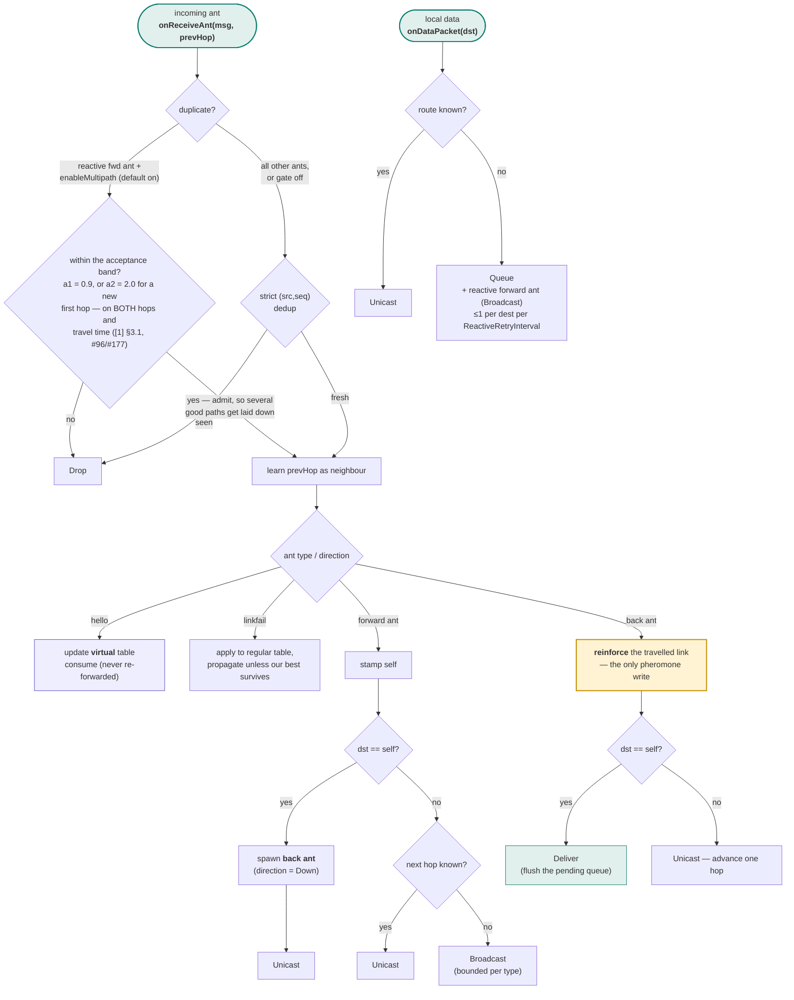

# Architecture

AntHocNet is implemented as one simulator-agnostic algorithm core with a thin
adapter per simulator. The core never includes an NS-2 or NS-3 header; the
adapters never reimplement routing logic.

```
                +-------------------------------------------+
                |                  core/                    |
                |  (simulator-agnostic C++, no sim deps)    |
                |                                           |
                |  PheromoneTable      AntMessage (POD)     |
                |  PheromoneEngine     VisitedPath (vector) |
                |  AntHistoryTracker   AntRouterLogic       |
                |                       -> RouteDecision     |
                |  Ports: IClock IRng INeighborProvider     |
                |         ITimerScheduler                   |
                +----------------+--------------------------+
                                 |
              implements ports   |   returns RouteDecisions
                                 |
        +------------------------+------------------------+
        |                                                 |
+-------v---------+                             +---------v---------+
|     ns2/        |                             |       ns3/        |
| AntHocNetAgent  |                             | RoutingProtocol : |
|  : Agent        |                             | Ipv4RoutingProtocol|
| AntPacketHeader |                             | AntHeader:ns3::Hdr |
| Ns2Clock/Ns2Rng |                             | Ns3Clock/Ns3Rng   |
| + source patch  |                             | + contrib module  |
+-----------------+                             +-------------------+
```

## The core

### Value types

- **`AntMessage`** — a plain, copyable description of an ant: type, direction,
  src/dst, `seqNum` (32-bit), timing, `broadcastBudget`, the visited/history
  stacks, and hello adverts. The back-ant deposit state (prevHop/hops/pathTime/
  pheromone) is transient — recomputed from `history`, not carried (ADR-0009).
  This replaces the original header-resident `AntTimeEntry**` malloc'd arrays.
- **`VisitedPath`** — `std::vector<AntHop>`; `AntHop` is `{node, time}`.
- **`AntMessageCodec`** — canonical little-endian wire format, reused by both
  adapters and round-trip tested.

### Stateful components

- **`PheromoneTable`** — regular/virtual pheromone maps keyed by
  `(neighbor, destination)`, the neighbour set, and per-table destination sets.
  Stochastic next-hop selection takes its randomness from an injected `IRng`.
- **`PheromoneEngine`** — the evaporation/reinforcement math
  (`evaporate`, `reinforce`, `updateRegular`, `updateVirtual`, `cleanNeighbor`).
- **`AntHistoryTracker`** — `(src, seqNum)` duplicate detection, FIFO-capped.
- **`AntRouterLogic`** — owns the above plus the node address and sequence
  counter. It is pure: `onReceiveAnt()` / `onDataPacket()` return
  `RouteDecision`s; they never touch a simulator.

### Pluggable link metrics

- **`ILinkMetric`** — the strategy that turns a backward ant's `LinkObservation`
  into a pheromone value. `ClassicMetric` is the canonical Eq.2 formula and the
  default; a metric is pure (const, observation-only), so it never reaches for
  the simulator, clock, or RNG.
- **`metrics::find` / `metrics::get`** (`link_metric_registry.h`) — the shared
  name → instance mapping both adapters resolve through, so `"classic"` means
  the same thing on NS-2 and NS-3. Lookup returns a **non-owning** pointer to a
  process-lifetime instance (metrics are stateless, so one instance is shared by
  every node, and `AntRouterLogic`'s raw `const ILinkMetric*` can never dangle).
  An unknown name is an error — `find` returns `nullptr`, `get` throws — never a
  silent fall back to classic. With no selection at all nothing consults the
  registry and `AntRouterLogic` uses `ClassicMetric` as before.

### Ports

The adapters implement these so the core stays I/O-free:

| Port | NS-2 | NS-3 |
|------|------|------|
| `IClock` | `Scheduler::instance().clock()` | `Simulator::Now()` |
| `IRng` | `Random` | `UniformRandomVariable` |
| `INeighborProvider` | pheromone-table view | pheromone-table view |
| `ITimerScheduler` | `Scheduler::schedule` | `Simulator::Schedule` |

## Decision flow

Two entry points, both pure, both returning `RouteDecision`s the adapter
executes.



`RouteDecision { action, nextHop, message }` with
`action ∈ {Unicast, Broadcast, Queue, Deliver, Drop, None}`. The adapter maps
each action onto its simulator (schedule a send, enqueue, deliver to the local
transport, or drop).

## Adapter responsibilities

The adapters do only what is intrinsically simulator-specific:

- convert packet headers ⇄ `AntMessage`;
- carry out `RouteDecision`s (send/queue/deliver/drop);
- own the periodic timers (hello, proactive, maintenance);
- hold the pending-packet queue and, for NS-2, the link-failure callback.
