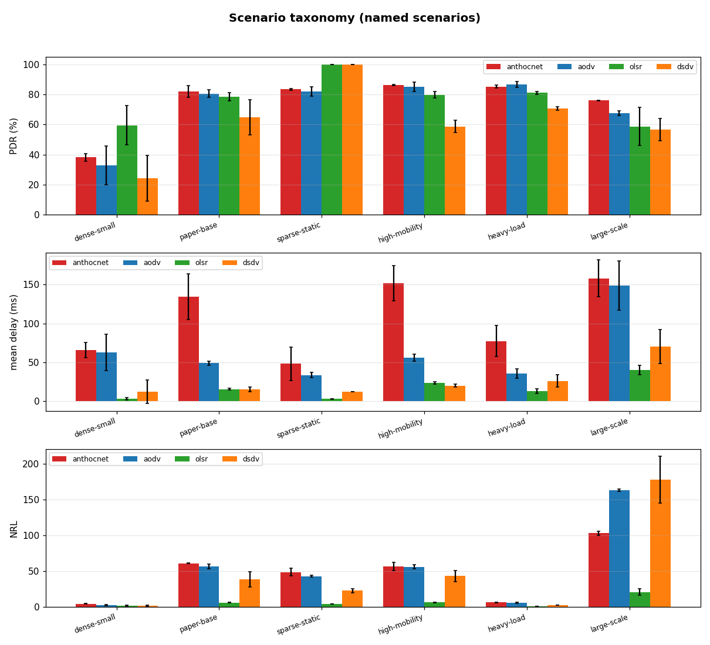

# Benchmarks

AntHocNet measured against the standard NS-3 MANET routing protocols
(**AODV**, **OLSR**, **DSDV**) on an identical scenario — same node layout,
mobility and traffic, driven from the same RNG runs so every protocol sees the
same realisations. Metrics come from an NS-3 `FlowMonitor`:

- **PDR** — packet-delivery ratio (received / sent), %, over the CBR data flows.
- **mean delay** — average end-to-end delay of delivered packets, ms.
- **99th-percentile delay** — the paper's QoS/jitter metric; a small tail of
  very-high-delay packets is how AODV loses out in the original results.
- **throughput** — application bytes delivered per second, kbps.
- **NRL** — normalized routing load: routing-control packets transmitted (each
  hop) per data packet delivered, counted uniformly at the IP layer.

The table below is a small, fast scenario used for a quick regression signal.
To reproduce the **paper's base scenario** (50 nodes, 1500×300 m, random-waypoint
at 20 m/s with 30 s pause, 20 CBR sources, 300 m range, 900 s) and its sweeps,
use the `paper` preset — it is heavy, so it is a manual run, not part of CI:

```bash
make install-ns3 NS3DIR=/path/to/ns-3-dev
cd /path/to/ns-3-dev
./ns3 configure --enable-examples \
  --enable-modules='anthocnet;wifi;mobility;applications;aodv;olsr;dsdv;flow-monitor;point-to-point'
./ns3 build
./ns3 run "anthocnet-compare --scenario=paper --runs=5"               # base scenario
./ns3 run "anthocnet-compare --scenario=paper --areaX=2500 --runs=5"  # area sweep
./ns3 run "anthocnet-compare --scenario=paper --pause=0 --runs=5"     # mobility sweep

# the quick scenario the table below uses (averaged CSV):
bash /path/to/AntHocNet/ns3/tools/run-comparison.sh "$PWD" 10 20 40 300 5
```

## Scenario taxonomy & sweeps

A single scenario is a poor verdict on a MANET protocol — performance swings with
density, mobility, load and scale. The harness therefore classifies results
across a **scenario taxonomy** plus the paper's **parameter sweeps**, driven by
`ns3/tools/run-scenarios.py` and plotted by `ns3/tools/make-charts.py` (figures
in [`docs/benchmarks/`](benchmarks/), regenerated by the manual
**Scenario matrix + charts** workflow).

Named scenarios (each a `--scenario`/flag preset of `anthocnet-compare`):

| scenario | class | what it stresses |
|---|---|---|
| `dense-small` | dense / low-mobility | the fast CI regime; AntHocNet's hard case |
| `paper-base` | sparse / mobile | the paper's base scenario (AntHocNet's design regime) |
| `sparse-static` | sparse / static | connectivity-limited but stable (pause=900) |
| `high-mobility` | sparse / high-mobility | constant motion (pause=0) |
| `heavy-load` | dense / heavy-load | many flows / higher CBR |
| `large-scale` | large / mobile | 100 nodes |

Parameter sweeps follow the paper (Di Caro/Ducatelle/Gambardella, PPSN VIII 2004,
§4), each varying one axis of the base scenario, reported as line charts of
PDR / mean+99th-percentile delay / NRL vs. the swept parameter:

- **area** (Fig. 1): long edge 1500→2500 m — longer paths, sparser network.
- **pause** (Fig. 2): pause time 0 (constant motion) → 900 s (static).
- **scale** (Fig. 3): terrain ×f, nodes ×f² (50→200 nodes).

Unlike the paper (AODV only), every baseline (AODV/OLSR/DSDV) is run on identical
realisations, so the classification covers all of them.

## Validation anchors (known-expected results)

A benchmark is only trustworthy if it reproduces a *known* result on a reference
scenario. We anchor against scenarios whose expected behaviour is documented in
the literature, so an off absolute number is caught as a **harness/config bug**
rather than mistaken for a protocol property (see [#24](https://github.com/danieljoppi/AntHocNet/issues/24)).

| anchor | configuration | expected (literature) | what it checks |
|---|---|---|---|
| single-hop sanity | ~10 nodes, 300×300 m, 300 m range, light load | PDR ≈ **100%** (all in range, ~1 hop) | the wifi/IP/app stack delivers at all |
| **Broch/Perkins field, low mobility** | 50 nodes, 1500×300 m, RWP, **pause = 900 s** (≈ static) | **AODV ≈ 90–100% PDR** (Broch et al., *MobiCom* 1998; Perkins, AODV) | the channel/PHY calibration target |
| Broch pause-sweep | as above, pause 0 → 900 s | AODV PDR **rises** with pause; DSDV worst under high mobility | the trend/shape, not one point |
| ns-3 `manet-routing-compare` | upstream example | community-calibrated AODV/OLSR/DSDV numbers | an in-simulator witness independent of this repo |

**Why this matters here.** The `paper-base` preset *is* the Broch/Perkins
1500×300 m / 50-node field, where AODV is known to deliver ~90–100% at low
mobility. The harness reports **AODV ≈ 22%** there — far below the known value. The
stock-baseline control (`manet-baselines`, which links no AntHocNet code) confirms
this is the *scenario/harness config*, not our module (stock-only ≈ harness
baselines).

**Root cause (resolved — [#51](https://github.com/danieljoppi/AntHocNet/issues/51)).**
The single-hop sanity anchor did **not** read ~100%: a **2-node, 1-flow, in-range,
static** link delivered only ~50% (`tx=121 rx=61`), confirmed real by independent
app/sink counters (`appTx==fmTx`, `appRx==fmRx`) — a **stock single-hop 802.11
unicast loss of ~50% per frame**, inherited by every protocol before any multi-hop
effect. Drop-point tracing localized it: with no `RemoteStationManager` set,
`WifiHelper` installs ns-3's default `IdealWifiManager`, whose SNR feedback under
the 0-loss disk model alternates unicasts between 1 Mbit/s (delivers) and DSSS
11 Mbit/s (**never** delivers in this stack — a pinned `constant11` radio scores
0% PDR and even loses ARP replies) — exactly one packet in two. All harnesses now
pin the paper's fixed 2 Mbit/s radio (`ConstantRateWifiManager`,
`DsssRate2Mbps` data / `DsssRate1Mbps` control), restoring the 2-node anchor to
**100.0%**; `--rateManager` still reaches `ideal`/`arf`/other fixed rates for A/B.
The earlier "300 m partitions the field / adopt ~600 m" reading is superseded —
see the [#24 correction](https://github.com/danieljoppi/AntHocNet/issues/24#issuecomment-4828992577).

**Acceptance / do-not-do-yet.** The single-hop anchor must deliver ≈100% (and stock
**AODV ≈ 90%** on the low-mobility Broch field — `paper-benchmark` with
`harness=baselines pause=900 speed=1`) **before** absolute numbers are trusted or the
taxonomy is re-baselined. **Re-baselining and any "adopt a larger range as default"
change are blocked on the [#51](https://github.com/danieljoppi/AntHocNet/issues/51)
fix** — doing it sooner would bake the single-hop penalty into the baseline. The
*relative* comparison (identical per-protocol realisations) is valid throughout.

**Enforcement ([#59](https://github.com/danieljoppi/AntHocNet/issues/59)).** With
#51 fixed, the first two anchors are **blocking CI gates**, run on the stock
`manet-baselines` harness by
[`ns3/tools/check-anchors.sh`](../ns3/tools/check-anchors.sh) with floors kept in
one file, [`ns3/tools/anchors.yml`](../ns3/tools/anchors.yml): the single-hop
anchor (AODV + DSDV, PDR ≥ 99, measured 100.0) runs on every push/PR in `ci.yml`
(inside the ns-3.42 `ns3-build` job), and both it and the Broch low-mobility AODV
floor (PDR ≥ 85, vs. ≈ 92.5 measured, ~90 literature) run in `benchmarks.yml`
*before* the results table/charts are regenerated — a regressed anchor fails the
workflow and blocks the publish step, so a #51-style channel/config regression can
no longer silently corrupt the published numbers. Recalibration is a one-line
edit to `anchors.yml`.

## Results

The per-scenario tables and the taxonomy chart below are regenerated and
committed automatically on every merge to the default branch by the `benchmarks`
workflow (it runs the discrete named scenarios across all baselines and renders
[`benchmarks/discrete-summary.png`](benchmarks/)), so they track the current
code. The heavier parameter sweeps are produced on demand by the manual
**Scenario matrix + charts** workflow.

<!-- BENCHMARK-TABLE-START -->
_Scenario taxonomy — mean of 2 run(s) per scenario, every baseline on identical realisations. Generated by `run-scenarios.py`; charts by `make-charts.py`._




#### dense-small — dense / low-mobility

| protocol | PDR % | mean delay (ms) | 99th delay (ms) | throughput (kbps) | NRL |
|----------|------:|----------------:|----------------:|------------------:|----:|
| anthocnet | 36.5 | 79.4 | 1968.5 | 8.10 | 2.466 |
| aodv | 32.8 | 62.8 | 2138.0 | 7.30 | 2.288 |
| olsr | 59.4 | 3.3 | 14.0 | 7.54 | 1.274 |
| dsdv | 24.2 | 12.4 | 6.0 | 5.38 | 1.482 |


#### paper-base — sparse / mobile

| protocol | PDR % | mean delay (ms) | 99th delay (ms) | throughput (kbps) | NRL |
|----------|------:|----------------:|----------------:|------------------:|----:|
| anthocnet | 74.5 | 148.4 | 2049.5 | 3.70 | 41.179 |
| aodv | 80.5 | 49.2 | 1018.5 | 4.47 | 56.618 |
| olsr | 78.5 | 15.5 | 43.0 | 4.02 | 5.968 |
| dsdv | 64.8 | 15.4 | 572.5 | 3.46 | 38.349 |


#### sparse-static — sparse / static

| protocol | PDR % | mean delay (ms) | 99th delay (ms) | throughput (kbps) | NRL |
|----------|------:|----------------:|----------------:|------------------:|----:|
| anthocnet | 76.4 | 41.5 | 1041.5 | 3.79 | 35.545 |
| aodv | 81.9 | 33.7 | 786.0 | 4.55 | 42.929 |
| olsr | 100.0 | 3.0 | 15.0 | 5.21 | 4.217 |
| dsdv | 99.9 | 12.2 | 134.5 | 5.27 | 22.569 |


#### high-mobility — sparse / high-mobility

| protocol | PDR % | mean delay (ms) | 99th delay (ms) | throughput (kbps) | NRL |
|----------|------:|----------------:|----------------:|------------------:|----:|
| anthocnet | 81.1 | 159.6 | 2056.0 | 4.03 | 41.632 |
| aodv | 85.1 | 56.1 | 1154.0 | 4.73 | 56.000 |
| olsr | 79.7 | 23.7 | 1009.0 | 4.03 | 6.233 |
| dsdv | 58.7 | 20.2 | 965.5 | 3.11 | 43.127 |


#### heavy-load — dense / heavy-load

| protocol | PDR % | mean delay (ms) | 99th delay (ms) | throughput (kbps) | NRL |
|----------|------:|----------------:|----------------:|------------------:|----:|
| anthocnet | 77.5 | 102.7 | 2019.5 | 54.83 | 4.115 |
| aodv | 86.6 | 35.6 | 702.0 | 61.40 | 5.535 |
| olsr | 81.0 | 12.9 | 359.0 | 54.24 | 0.439 |
| dsdv | 70.6 | 26.2 | 830.5 | 50.04 | 2.562 |


#### large-scale — large / mobile

| protocol | PDR % | mean delay (ms) | 99th delay (ms) | throughput (kbps) | NRL |
|----------|------:|----------------:|----------------:|------------------:|----:|
| anthocnet | 69.2 | 187.7 | 2063.0 | 3.93 | 72.065 |
| aodv | 67.4 | 148.7 | 1935.0 | 3.62 | 163.429 |
| olsr | 58.7 | 40.5 | 1019.0 | 3.03 | 20.660 |
| dsdv | 56.4 | 70.3 | 1050.0 | 2.97 | 177.841 |


<!-- BENCHMARK-TABLE-END -->

## How to read this

These are MANET results: PDR and delay depend heavily on node density,
mobility and offered load, and single-seed runs are noisy — hence the
multi-run averaging. AntHocNet is a research protocol; AODV/OLSR/DSDV are
mature, heavily-tuned implementations. The point of this harness is a fair,
repeatable **re-validation** that AntHocNet routes and delivers in the same
regime as the established protocols, not a claim that any one protocol always
wins. Cross-simulator (NS-2 vs NS-3) parity is likewise not claimed — the
MAC/PHY models differ (see [cross-validation.md](cross-validation.md)).
