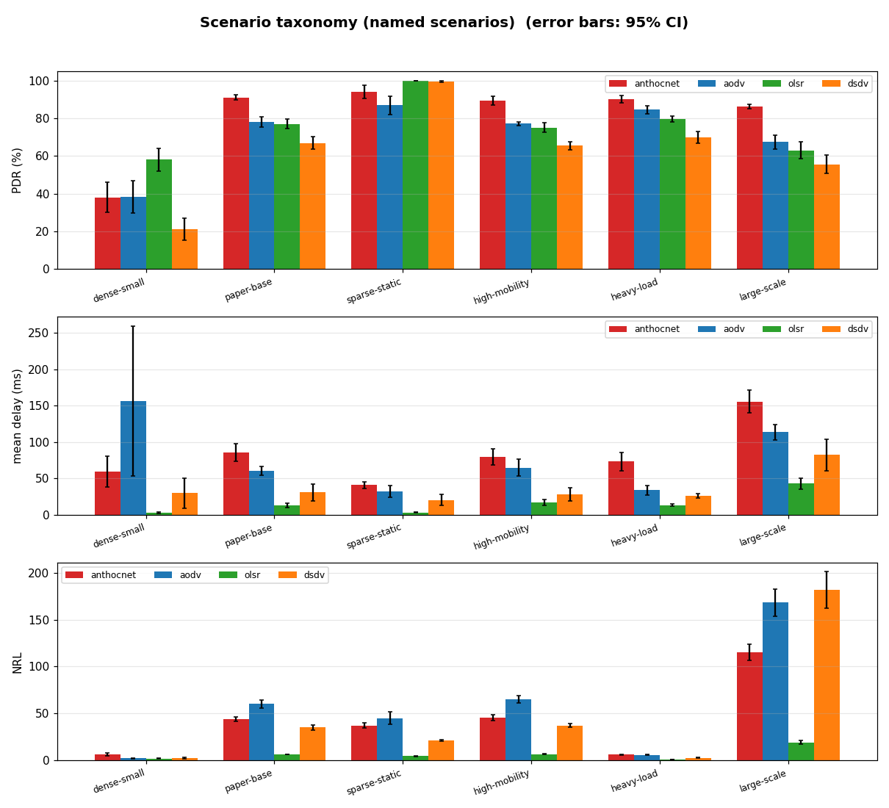

# Benchmarks

Two regimes, two suites, one protocol build ([ADR-0015](adr/0015-satellite-substrate-lives-in-the-image.md)
— the build never forks; only the scenario harness and the baselines change):

| Regime | Suite | Baselines | Status |
|---|---|---|---|
| **MANET** (original) | this page — discrete taxonomy + sweeps, wifi field | AODV / OLSR / DSDV | per-merge refresh + manual campaigns |
| **Satellite** (ISL) | [satellite/isl-grid.md](benchmarks/satellite/isl-grid.md) — +Grid torus, point-to-point ISLs | same, until [#216](https://github.com/danieljoppi/AntHocNet/issues/216)'s precomputed-shortest-path control lands | manual dispatch + per-PR analytic anchor/determinism gates; no committed results yet |

A number is only comparable **within** its regime — the regimes differ in what
routing even has to solve ([network-regimes.md](network-regimes.md)). Everything
below this table is the **MANET** suite.

AntHocNet measured against the standard NS-3 MANET routing protocols
(**AODV**, **OLSR**, **DSDV**) on identical scenarios — same node layout,
mobility and traffic, driven from the same RNG runs so every protocol sees the
same realisations. Metrics come from an NS-3 `FlowMonitor`. This page is the
index: the headline cross-scenario summary, plus a link to every detail page.

| Page | What is on it |
|---|---|
| [metrics.md](benchmarks/metrics.md) | What PDR, mean delay, delay99, jitter, dOff50/dOff90, throughput, NRL and `nrl_bytes` mean — and their caveats (#57/#54 survivorship, #132). |
| [methodology.md](benchmarks/methodology.md) | Reproduce commands, the scenario taxonomy & sweeps, ns-3 build profiles (`default` vs `release`/`-opt`, #123), and the validation anchors + #59 enforcement / #129 determinism gate. |
| **Scenarios** | |
| [dense-small](benchmarks/scenarios/dense-small.md) | dense / low-mobility — the fast CI regime; AntHocNet's hard case. |
| [paper-base](benchmarks/scenarios/paper-base.md) | sparse / mobile — the paper's base scenario (AntHocNet's design regime). |
| [sparse-static](benchmarks/scenarios/sparse-static.md) | sparse / static — connectivity-limited but stable (pause=900). |
| [high-mobility](benchmarks/scenarios/high-mobility.md) | sparse / high-mobility — constant motion (pause=0). |
| [heavy-load](benchmarks/scenarios/heavy-load.md) | dense / heavy-load — many flows / higher CBR. |
| [large-scale](benchmarks/scenarios/large-scale.md) | large / mobile — 100 nodes. |
| **Sweeps** | |
| [area](benchmarks/sweeps/area.md) | Paper Fig. 1 — long edge 1500→2500 m. |
| [pause](benchmarks/sweeps/pause.md) | Paper Fig. 2 — pause time 0→900 s. |
| [scale](benchmarks/sweeps/scale.md) | Paper Fig. 3 — terrain ×f, nodes ×f² (50→200 nodes). |
| **Satellite suite** | |
| [satellite/isl-grid.md](benchmarks/satellite/isl-grid.md) | The ISL-grid regime: harness, analytic anchors, how to dispatch, and what it is waiting on (#216). |
| [benchmarks/README.md](benchmarks/README.md) | How the figures and this folder are generated. |

## Results

The summary below and the per-scenario pages it links to are regenerated and
committed automatically on every merge to the default branch by the `benchmarks`
workflow (it runs the discrete named scenarios across all baselines and renders
[`benchmarks/discrete-summary.png`](benchmarks/)), so they track the current
code. The heavier parameter sweeps are produced on demand by the manual
**Scenario matrix + charts** workflow.

> **Reading the table below.** It is regenerated by the `benchmarks` workflow on
> every merge, so it always reflects current `main` — including the three
> protocol corrections of July 2026:
> [#88](https://github.com/danieljoppi/AntHocNet/issues/88) (`T_hop` 50 ms → 3 ms),
> [#169](https://github.com/danieljoppi/AntHocNet/issues/169) (the reactive
> broadcast budget was a hop limit on discovery, not a flood bound) and
> [#173](https://github.com/danieljoppi/AntHocNet/issues/173) (removing it left
> the flood unbounded in dense graphs), plus v1.1.0's two-factor acceptance band
> ([#177](https://github.com/danieljoppi/AntHocNet/issues/177)).
>
> **These are 2-run `--quick` values.** Run-to-run dispersion (`pdr_sd`, on the
> per-scenario pages) has reached 6 pp on the sparse scenarios — wider than many
> of the gaps visible here. Treat a small difference between two columns as
> noise; the manual campaign workflow at `runs=5` is what settles a comparison,
> and `runs=20` is what the thesis used ([#58](https://github.com/danieljoppi/AntHocNet/issues/58)).
>
> The **sweep** pages are a separate, older vintage — produced by the manual
> campaign workflow, not regenerated on merge, and each carries its own vintage
> note. [fidelity.md](fidelity.md) holds the standing correction record.

<!-- NOTE TO EDITORS: do not quote values from the generated table in the prose
     above. The table is machine-updated on every merge; this paragraph is not,
     so any number written here goes stale silently and then contradicts the
     table three lines below it. That has now happened four times (#175, #189,
     #220, and again after the v1.1.0 refresh). Describe what to look for, not
     what the values are. -->

<!-- BENCHMARK-TABLE-START -->
_Scenario taxonomy — **PDR % ± 95% CI**, mean of 2 run(s) per scenario, every baseline on identical realisations. Full per-scenario metrics (delay, tail, NRL, jitter) are on the linked pages. Generated by `run-scenarios.py`; charts by `make-charts.py`._

| scenario | class | anthocnet | aodv | olsr | dsdv |
|---|---|---:|---:|---:|---:|
| [dense-small](benchmarks/scenarios/dense-small.md) | dense / low-mobility | 38.0 ± 28.8 | 32.8 ± 116.6 | 59.4 ± 117.0 | 24.2 ± 135.4 |
| [paper-base](benchmarks/scenarios/paper-base.md) | sparse / mobile | 80.4 ± 52.6 | 80.5 ± 22.4 | 78.5 ± 25.3 | 64.8 ± 104.2 |
| [sparse-static](benchmarks/scenarios/sparse-static.md) | sparse / static | 89.1 ± 61.7 | 81.9 ± 28.2 | 100.0 ± 0.0 | 99.9 ± 0.1 |
| [high-mobility](benchmarks/scenarios/high-mobility.md) | sparse / high-mobility | 82.5 ± 9.9 | 85.1 ± 28.8 | 79.7 ± 18.4 | 58.7 ± 37.5 |
| [heavy-load](benchmarks/scenarios/heavy-load.md) | dense / heavy-load | 85.9 ± 22.2 | 86.6 ± 17.2 | 81.0 ± 7.7 | 70.6 ± 10.0 |
| [large-scale](benchmarks/scenarios/large-scale.md) | large / mobile | 78.6 ± 16.4 | 67.4 ± 14.0 | 58.7 ± 114.0 | 56.4 ± 66.6 |

<!-- BENCHMARK-TABLE-END -->

## How to read this

These are MANET results: PDR and delay depend heavily on node density,
mobility and offered load, and single-seed runs are noisy — hence the
multi-run averaging. AntHocNet is a research protocol; AODV/OLSR/DSDV are
mature, heavily-tuned implementations. The point of this harness is a fair,
repeatable **re-validation** that AntHocNet routes and delivers in the same
regime as the established protocols, not a claim that any one protocol always
wins. Cross-simulator (NS-2 vs NS-3) parity is likewise not claimed — the
MAC/PHY models differ (see [cross-validation.md](cross-validation.md)).

Absolute numbers carry a further caveat: they are gated on the validation
anchors, and the *relative* comparison (identical per-protocol realisations) is
the part that is valid throughout — see
[methodology.md](benchmarks/methodology.md#validation-anchors-known-expected-results).
