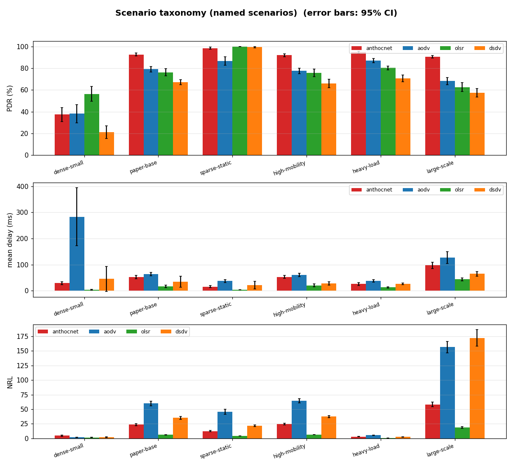

# Benchmarks

Two regimes, two suites, one protocol build ([ADR-0015](adr/0015-satellite-substrate-lives-in-the-image.md)
— the build never forks; only the scenario harness and the baselines change):

| Regime | Suite | Baselines | Status |
|---|---|---|---|
| **MANET** (original) | this page — discrete taxonomy + sweeps, wifi field | AODV / OLSR / DSDV, plus the **oracle** upper bound ([#415](https://github.com/danieljoppi/AntHocNet/issues/415)) on the [grid](benchmarks/grid.md#the-oracle-control-how-much-of-the-shortfall-is-routing) | per-merge refresh + manual campaigns |
| **Satellite** (ISL) | [satellite/isl-grid.md](benchmarks/satellite/isl-grid.md) — +Grid torus, point-to-point ISLs | same, plus the **exact** (`approx=0`) oracle control — the [#216](https://github.com/danieljoppi/AntHocNet/issues/216) gap, now closed by v1.5.0 phase 3 | manual dispatch + per-PR analytic anchor/determinism gates; results published on that page |

A number is only comparable **within** its regime — the regimes differ in what
routing even has to solve ([network-regimes.md](network-regimes.md)). Everything
below this table is the **MANET** suite.

AntHocNet measured against the standard NS-3 MANET routing protocols
(**AODV**, **OLSR**, **DSDV**) on identical scenarios — same node layout,
mobility and traffic, driven from the same RNG runs so every protocol sees the
same realisations. Metrics come from an NS-3 `FlowMonitor`. This page is the
index: the headline cross-scenario summary, plus a link to every detail page.

| Page | What is on it |
|---|---|
| [metrics.md](benchmarks/metrics.md) | What PDR, mean delay, delay99, jitter, dOff50/dOff90, throughput, NRL and `nrl_bytes` mean — and their caveats (#57/#54 survivorship, #132), including the phase-3 rule that **`delay99` must not be compared across arms whose PDR differs materially** (use `##COMMON##` `p99C`) and how to read the oracle arm's asserted-zero NRL. |
| [methodology.md](benchmarks/methodology.md) | Reproduce commands, the scenario taxonomy & sweeps, ns-3 build profiles (`default` vs `release`/`-opt`, #123), and the validation anchors + #59 enforcement / #129 determinism gate. |
| **Scenarios** | |
| [dense-small](benchmarks/scenarios/dense-small.md) | dense / low-mobility — the fast CI regime; AntHocNet's hard case. |
| [paper-base](benchmarks/scenarios/paper-base.md) | sparse / mobile — the paper's base scenario (AntHocNet's design regime). |
| [sparse-static](benchmarks/scenarios/sparse-static.md) | sparse / static — connectivity-limited but stable (pause=900). |
| [high-mobility](benchmarks/scenarios/high-mobility.md) | sparse / high-mobility — constant motion (pause=0). |
| [heavy-load](benchmarks/scenarios/heavy-load.md) | dense / heavy-load — many flows / higher CBR. |
| [large-scale](benchmarks/scenarios/large-scale.md) | large / mobile — 100 nodes. |
| **Sweeps** | |
| [area](benchmarks/sweeps/area.md) | Paper Fig. 1 — long edge 1500→2500 m. |
| [pause](benchmarks/sweeps/pause.md) | Paper Fig. 2 — pause time 0→900 s. |
| [scale](benchmarks/sweeps/scale.md) | Paper Fig. 3 — terrain ×f, nodes ×f² (50→200 nodes). |
| **Grid** | |
| [mobility × channel](benchmarks/grid.md) | The six-cell grid — {rwp, ssrwp, gaussmarkov} × {tworay, nakagami} — re-baselined at `dd171e5e` after the [#496](https://github.com/danieljoppi/AntHocNet/issues/496) hello-timer fix (`TimerJitter = 0.05`, `ReconvHoldCap = 200 ms`), with the oracle in the same dispatch; the oracle reproduces the pre-#496 #431 table in 6 / 6 cells, which is the attribution control. **AntHocNet beats AODV on PDR, NRL and `delay99` in all six cells** (paired, p ≤ 9.6 × 10⁻⁵) and leads delivery everywhere (+6.1…+13.3 pp over OLSR, whose column is offered-based since [#510](https://github.com/danieljoppi/AntHocNet/issues/510)); it sits 0.23–1.09 pp below the oracle on two-ray and 5.4–7.9 pp below it under Nakagami. **Scoped** ranking-stability statement: AntHocNet first in delivery and the overhead ordering (`olsr < anthocnet < dsdv < aodv`) stable everywhere; the AODV–OLSR delivery order is cell-dependent (AODV ahead in gaussmarkov-tworay since #510, OLSR ahead in the other five); the tail depends on the channel — OLSR best under two-ray (AntHocNet second), AntHocNet best under fading (OLSR worst). The v1.5.0 phase-3 oracle analysis (gap decomposition, `approx=1` quoting rule) stays on the page as the pre-#496 record. Not comparable with the pages above. |
| **Transport** | |
| [tcp](benchmarks/tcp.md) | v1.4.0's TCP arm — goodput over `TcpCubic` at the paper base scenario, 20 seeds + a 20-seed UDP control. The delivery ranking **reorders** under TCP (AODV 3rd → last, DSDV rises, anthocnet–olsr a statistical tie): a transport-layer claim that does not name its transport is unsupported. Measured *after* `v1.3.0`. |
| [static mesh](benchmarks/static-mesh.md) | The static Wi-Fi mesh family ([#484](https://github.com/danieljoppi/AntHocNet/issues/484)): the paper field with no mobility, 20 seeds, with the exact oracle. With the [#496](https://github.com/danieljoppi/AntHocNet/issues/496) hello-timer fix, AntHocNet delivers **99.28 %** and beats AODV on every metric: 95.98 % PDR, a 10.5 ms vs 266.7 ms delay99, and 8.84 vs 39.39 NRL. OLSR still leads at 100 % and 3.56 NRL. The pre-#496 numbers (88.0 %, the [#494](https://github.com/danieljoppi/AntHocNet/issues/494) `ReconvHoldCap` finding) were the timer artifact: paired +11.28 pp, 20/20 seeds. Measured *after* `v1.6.0`. |
| [FANET](benchmarks/scenarios/fanet.md) | The FANET family ([#300](https://github.com/danieljoppi/AntHocNet/issues/300)): `--scenario=fanet`, 30 UAVs in a 1000 × 1000 × 300 m box, 3-D Gauss-Markov at 10–30 m/s, six arms (AOMDV and the 100 ms oracle included), 20 seeds, plus a partition-bound sparse cell. **AntHocNet leads every protocol in both cells:** 94.41 % PDR in the main cell, 2.70 pp below the oracle and +11.48 pp over AODV, with lower NRL, `delay99` and energy per bit than AODV. OLSR and DSDV collapse on stale next hops at these speeds. The OLSR column is offered-based ([#510](https://github.com/danieljoppi/AntHocNet/issues/510)). There is no geographic arm in 3-D. A 3-D cell is not comparable with the planar pages. |
| **Protocol arms** | |
| [reinjection](benchmarks/reinjection.md) | v1.5.0 phase 2 — the [#46](https://github.com/danieljoppi/AntHocNet/issues/46) MAC-failure detector's first 20-seed publishable A/B (ΔPDR **+5.55 / +6.54 pp**, 20/20 sign-consistent), the direct measurement that **~65–67 %** of its re-injections are of already-delivered packets, the detector-off reorder collapse (0.1745/0.2301 → 0.0010/0.0009) that pins AntHocNet's fading reordering on duplicates, and the `MaxReinjectPerPacket` cap frontier — measured at `7471447`, shipped default unchanged. |
| **Campaign plans** | |
| [v1.5.0 re-baseline](benchmarks/v1.5.0-campaign.md) | The campaign — how the hold-cap flip, the re-injection cap sweep, the publishable detector A/B and the oracle control folded into **one** ordered set of dispatches instead of three overlapping ones. **Complete (2026-08-14): all three measurement phases published.** Flip merged as #411, grid re-baselined at `a1daa7a`, cap × detector measured at `7471447` with no default change ([reinjection.md](benchmarks/reinjection.md)), and [phase 3](benchmarks/v1.5.0-campaign.md#phase-3-the-oracle-control) — the oracle control at `40b434d`, six grid cells plus the satellite torus, three a-priori assertions passing at 20 seeds, the hop rule passing *vacuously* where a naive version would have failed. |
| **Satellite suite** | |
| [satellite/isl-grid.md](benchmarks/satellite/isl-grid.md) | The ISL-grid regime: harness, analytic anchors, how to dispatch — and the [#216](https://github.com/danieljoppi/AntHocNet/issues/216) result, including the **only cell where the oracle is exact** (`mode=wired approx=0`: the graph *is* the wiring, so the bound is proven rather than approximate). The MANET grid's oracle numbers are `approx=1` and cannot be read that strongly. |
| [benchmarks/README.md](benchmarks/README.md) | How the figures and this folder are generated. |

## Results

The summary below and the per-scenario pages it links to are regenerated and
committed automatically on every merge to the default branch by the `benchmarks`
workflow (it runs the discrete named scenarios across all baselines and renders
[`benchmarks/discrete-summary.png`](benchmarks/)), so they track the current
code. The heavier parameter sweeps are produced on demand by the manual
**Scenario matrix + charts** workflow.

> **Reading the table below.** It is regenerated by the `benchmarks` workflow on
> every merge, so it always reflects current `main` — including the three
> protocol corrections of July 2026:
> [#88](https://github.com/danieljoppi/AntHocNet/issues/88) (`T_hop` 50 ms → 3 ms),
> [#169](https://github.com/danieljoppi/AntHocNet/issues/169) (the reactive
> broadcast budget was a hop limit on discovery, not a flood bound) and
> [#173](https://github.com/danieljoppi/AntHocNet/issues/173) (removing it left
> the flood unbounded in dense graphs), plus v1.1.0's two-factor acceptance band
> ([#177](https://github.com/danieljoppi/AntHocNet/issues/177)).
>
> **These are 2-run `--quick` values.** Run-to-run dispersion (`pdr_sd`, on the
> per-scenario pages) has reached 6 pp on the sparse scenarios — wider than many
> of the gaps visible here. Treat a small difference between two columns as
> noise; the manual campaign workflow at `runs=5` is what settles a comparison,
> and `runs=20` is what the thesis used ([#58](https://github.com/danieljoppi/AntHocNet/issues/58)).
>
> The **sweep** pages are a separate, older vintage — produced by the manual
> campaign workflow, not regenerated on merge, and each carries its own vintage
> note. [fidelity.md](fidelity.md) holds the standing correction record.

<!-- NOTE TO EDITORS: do not quote values from the generated table in the prose
     above. The table is machine-updated on every merge; this paragraph is not,
     so any number written here goes stale silently and then contradicts the
     table three lines below it. That has now happened four times (#175, #189,
     #220, and again after the v1.1.0 refresh). Describe what to look for, not
     what the values are. -->

<!-- BENCHMARK-TABLE-START -->
_Scenario taxonomy — **PDR % ± 95% CI**, mean of 10 run(s) per scenario, every baseline on identical realisations. Full per-scenario metrics (delay, tail, NRL, jitter) are on the linked pages. Generated by `run-scenarios.py`; charts by `make-charts.py`._

_Measured at [`dac1ca3`](https://github.com/danieljoppi/AntHocNet/commit/dac1ca34ec94ed3b4a50a9a879462e18b6289f79), [run](https://github.com/danieljoppi/AntHocNet/actions/runs/36941648368)._

| scenario | class | anthocnet | aodv | olsr | dsdv |
|---|---|---:|---:|---:|---:|
| [dense-small](benchmarks/scenarios/dense-small.md) | dense / low-mobility | 37.3 ± 6.3 | 38.1 ± 8.4 | 56.2 ± 6.8 | 21.0 ± 5.9 |
| [paper-base](benchmarks/scenarios/paper-base.md) | sparse / mobile | 92.6 ± 1.2 | 79.0 ± 2.5 | 76.1 ± 3.3 | 67.2 ± 2.3 |
| [sparse-static](benchmarks/scenarios/sparse-static.md) | sparse / static | 98.4 ± 0.9 | 86.6 ± 3.9 | 100.0 ± 0.0 | 99.3 ± 0.5 |
| [high-mobility](benchmarks/scenarios/high-mobility.md) | sparse / high-mobility | 92.0 ± 1.4 | 77.6 ± 2.5 | 75.7 ± 3.4 | 66.0 ± 4.0 |
| [heavy-load](benchmarks/scenarios/heavy-load.md) | dense / heavy-load | 94.6 ± 0.9 | 87.0 ± 2.0 | 80.3 ± 1.7 | 70.5 ± 3.1 |
| [large-scale](benchmarks/scenarios/large-scale.md) | large / mobile | 90.5 ± 1.3 | 68.1 ± 3.3 | 62.5 ± 4.1 | 57.4 ± 4.0 |

<!-- BENCHMARK-TABLE-END -->

## How to read this

These are MANET results: PDR and delay depend heavily on node density,
mobility and offered load, and single-seed runs are noisy — hence the
multi-run averaging. AntHocNet is a research protocol; AODV/OLSR/DSDV are
mature, heavily-tuned implementations. The point of this harness is a fair,
repeatable **re-validation** that AntHocNet routes and delivers in the same
regime as the established protocols, not a claim that any one protocol always
wins. Cross-simulator (NS-2 vs NS-3) parity is likewise not claimed — the
MAC/PHY models differ (see [cross-validation.md](cross-validation.md)).

Absolute numbers carry a further caveat: they are gated on the validation
anchors, and the *relative* comparison (identical per-protocol realisations) is
the part that is valid throughout — see
[methodology.md](benchmarks/methodology.md#validation-anchors-known-expected-results).
