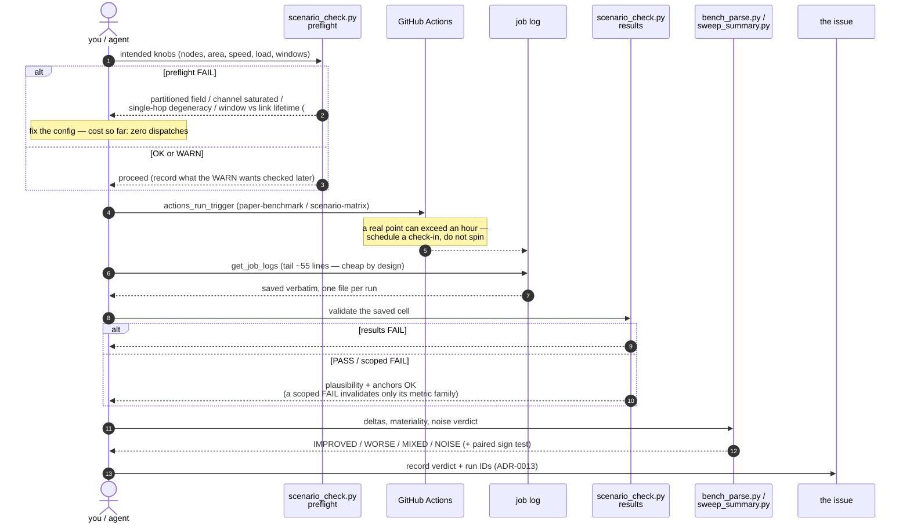

# Benchmark methodology

How the numbers are produced: how to reproduce a run, the scenario taxonomy and
sweeps the harness drives, the ns-3 build profile they run under, and the
validation anchors that gate publishing them. Part of the
[benchmark index](../benchmarks.md); the metric definitions are in
[metrics.md](metrics.md).

## Reproducing a run

The [scenario pages](scenarios/) cover a small, fast scenario set used for a
quick regression signal.
To reproduce the **paper's base scenario** (50 nodes, 1500×300 m, random-waypoint
at 20 m/s with 30 s pause, 20 CBR sources, 300 m range, 900 s) and its sweeps,
use the `paper` preset — it is heavy, so it is a manual run, not part of CI:

```bash
make install-ns3 NS3DIR=/path/to/ns-3-dev
cd /path/to/ns-3-dev
./ns3 configure --enable-examples \
  --enable-modules='anthocnet;wifi;mobility;applications;aodv;olsr;dsdv;flow-monitor;point-to-point'
./ns3 build
./ns3 run "anthocnet-compare --scenario=paper --runs=5"               # base scenario
./ns3 run "anthocnet-compare --scenario=paper --areaX=2500 --runs=5"  # area sweep
./ns3 run "anthocnet-compare --scenario=paper --pause=0 --runs=5"     # mobility sweep

# the quick scenario the tables use (averaged CSV):
bash /path/to/AntHocNet/ns3/tools/run-comparison.sh "$PWD" 10 20 40 300 5
```

### Reproducing a *thesis* run

`--scenario=paper` is the **calibration** field ([#24](https://github.com/danieljoppi/AntHocNet/issues/24));
`--scenario=thesis` is AntHocNet's **own evaluation** field, and is what a
fidelity claim runs on. Its constants come from Ducatelle, *Adaptive Routing in
Ad Hoc Wireless Multi-hop Networks* (PhD thesis, 2007) **§5.1.3**, read from the
PDF ([#58](https://github.com/danieljoppi/AntHocNet/issues/58)):

| axis | thesis §5.1.3 | set by the preset? |
|---|---|---|
| nodes | 100 | ✅ |
| area | 2400 × 800 m | ✅ |
| mobility | random waypoint, speed U[0, **10**] m/s, pause 30 s | ✅ |
| duration | 900 s | ✅ |
| **repetitions** | **20** | ✅ *only when `--runs` is not passed* — see below |
| sessions | 20 UDP, start uniform in [0, 180] s | ✅ |
| traffic | **4 packets/s × 64 B = 2048 bps** per session | ✅ |
| radio | 802.11 DCF, 2 Mbit/s, range **250 m** | ✅ |
| **propagation** | **two-ray** | ❌ — harness default is the `range` disk model |

Two axes therefore need care, and **both must be set explicitly to reproduce a
thesis figure**:

- **Propagation.** The harness defaults to `--propagation=range` (the disk
  model) for every scenario. That is a deliberate #24 disentangler and is *not*
  overridden per-preset, so the thesis's two-ray PHY must be asked for.
- **Repetitions.** `--runs` defaults to **20 under `--scenario=thesis`** (1
  otherwise), but an explicit `--runs=N` always wins — and
  `run-scenarios.py`, `paper-benchmark.yml` and `scenario-matrix.yml` *always*
  pass one. Through any of those paths you must set **`runs=20`** yourself; the
  preset default only applies to a bare command line.

```bash
# the thesis field, faithfully (20 repetitions × 900 s — hours, not minutes):
./ns3 run "anthocnet-compare --scenario=thesis --propagation=tworay --runs=20"
```

Averaging over fewer than 20 runs is a legitimate cheap probe, but it is not a
thesis reproduction: several arguments in this repo have turned on differences
smaller than the dispersion at low run counts, and `pdr_sd` as high as 6.43 has
been observed ([#173](https://github.com/danieljoppi/AntHocNet/issues/173)).
Record the run count next to any number quoted against a thesis figure.

Publishing the results back into these pages is
[`ns3/tools/update-benchmarks.py`](../../ns3/tools/update-benchmarks.py)'s job:
it rewrites the generated block of every page in place, so hand-written prose
outside the `BENCHMARK-TABLE` markers survives regeneration.

```bash
python3 ns3/tools/run-scenarios.py /path/to/ns-3 --out scenarios.csv [--quick]
python3 ns3/tools/make-charts.py     scenarios.csv --outdir docs/benchmarks
python3 ns3/tools/update-benchmarks.py scenarios.csv docs/benchmarks.md
```

### Reproducing via CI (manual dispatch)

No local simulator is needed — the two campaign workflows run inside the
published GHCR images (Actions → workflow → *Run workflow*):

- **Paper benchmark** ([`paper-benchmark.yml`](../../.github/workflows/paper-benchmark.yml))
  — one paper-regime scenario with `--diag`. Inputs mirror `anthocnet-compare`
  flags (`nNodes`, `time`, `runs`, `areaX`/`areaY`, `pause`, `speed`,
  `propagation`, `range`); `harness=baselines` runs the stock-ns-3 control
  (no AntHocNet code linked), and `extraArgs` appends verbatim
  `--ns3::anthocnet::RoutingProtocol::<Attr>=<value>` overrides, so an A/B arm
  is a dispatch, not a branch.
- **Scenario matrix + charts** ([`scenario-matrix.yml`](../../.github/workflows/scenario-matrix.yml))
  — the taxonomy + the area/pause/scale sweeps. A real (non-`quick`) whole
  sweep does **not** fit the 6 h hosted-runner ceiling
  ([#121](https://github.com/danieljoppi/AntHocNet/issues/121)) — dispatch it
  one point per job via `only=<sweep>` + `point=<value>`. A single point too
  big for the ceiling at full seed count (measured: the 98/162/200-node
  scale points at 20 seeds, [#126](https://github.com/danieljoppi/AntHocNet/issues/126))
  splits across dispatches with `runFirst` — seeds cover
  `runFirst..runFirst+runs-1`, and
  [`pool_runs.py`](../../.claude/skills/benchmark-results/pool_runs.py)
  merges the split CSVs back into one aggregate row per point, recomputing
  mean/sd exactly from the pooled #319 per-run rows. With `commit=true`
  the classified CSV lands in `docs/benchmarks/campaign/` and the regenerated
  charts in `docs/benchmarks/`; otherwise everything stays in the run's
  artifacts.

Both take a `version` input naming the ns-3 image tag: `3.42` is the campaign
pin, `3.42-opt` the optimized profile (see build profiles below), and a
release-suffixed tag (e.g. `3.42-v1.1.0`) is **immutable** — pin one for a
citable run and record the run ID with the numbers. The per-merge refresh of
[`../benchmarks.md`](../benchmarks.md) needs no dispatch (`benchmarks.yml`,
every merge to the default branch), and its publish step is gated on the
validation anchors below. Before trusting or comparing dispatched numbers, run
the validation loop in
[`configuration.md` §5](../configuration.md#5-how-to-calibrate-a-parameter)
(`scenario_check.py` preflight/results, `bench_parse.py --ab`).

## Scenario taxonomy & sweeps

A single scenario is a poor verdict on a MANET protocol — performance swings with
density, mobility, load and scale. The harness therefore classifies results
across a **scenario taxonomy** plus the paper's **parameter sweeps**, driven by
`ns3/tools/run-scenarios.py` and plotted by `ns3/tools/make-charts.py` (figures
in [`docs/benchmarks/`](./), regenerated by the manual
**Scenario matrix + charts** workflow).

Named scenarios (each a `--scenario`/flag preset of `anthocnet-compare`):

| scenario | class | what it stresses |
|---|---|---|
| [`dense-small`](scenarios/dense-small.md) | dense / low-mobility | the fast CI regime; AntHocNet's hard case |
| [`paper-base`](scenarios/paper-base.md) | sparse / mobile | the paper's base scenario (AntHocNet's design regime) |
| [`sparse-static`](scenarios/sparse-static.md) | sparse / static | connectivity-limited but stable (pause=900) |
| [`high-mobility`](scenarios/high-mobility.md) | sparse / high-mobility | constant motion (pause=0) |
| [`heavy-load`](scenarios/heavy-load.md) | dense / heavy-load | many flows / higher CBR |
| [`large-scale`](scenarios/large-scale.md) | large / mobile | 100 nodes |

Parameter sweeps follow the paper (Di Caro/Ducatelle/Gambardella, PPSN VIII 2004,
§4), each varying one axis of the base scenario, reported as line charts of
PDR / mean+99th-percentile delay / NRL vs. the swept parameter:

- **[area](sweeps/area.md)** (Fig. 1): long edge 1500→2500 m — longer paths, sparser network.
- **[pause](sweeps/pause.md)** (Fig. 2): pause time 0 (constant motion) → 900 s (static).
- **[scale](sweeps/scale.md)** (Fig. 3): terrain ×f, nodes ×f² (50→200 nodes).

Unlike the paper (AODV only), every baseline (AODV/OLSR/DSDV) is run on identical
realisations, so the classification covers all of them.

## Mobility models (`--mobility`, [#61](https://github.com/danieljoppi/AntHocNet/issues/61))

`anthocnet-compare` takes `--mobility=rwp|ssrwp|gaussmarkov`. `paper-benchmark.yml`
exposes it as a dispatch input.

| value | model | why it exists |
|---|---|---|
| **`rwp`** (default) | `RandomWaypointMobilityModel` | The original evaluation's model, and **the model every published number in this repo was measured under.** The default does not change. |
| `ssrwp` | `SteadyStateRandomWaypointMobilityModel` | Draws initial speed and position from RWP's *stationary* distribution, removing the speed-decay and density transients that make long RWP runs slower than their nominal speed (Yoon et al., INFOCOM 2003). The closest honest comparison to `rwp`. |
| `gaussmarkov` | `GaussMarkovMobilityModel` (α = 0.85) | Temporally correlated velocity/direction, so tracks are smooth rather than sharp waypoint turns. The qualitatively different model, and the one aerial/FANET claims require. |

Three things worth knowing before dispatching a non-default arm:

- **`--pause` is inert under `gaussmarkov`** — a Gauss-Markov node never stops.
  `scenario_check.py preflight` **FAILs** the combination rather than letting a
  pause sweep produce N identical cells and read as "pause has no effect".
  Pass `--pause=0` to state it explicitly.
- **A non-`rwp` arm leaves the published corpus.** Preflight WARNs, because the
  [validation anchors](#validation-anchors-known-expected-results) are
  RWP-specific (the Broch floor especially) and the results are not comparable
  to the published cells. New arms need their own anchor entry or a documented
  reason there isn't one.
- **The `manet-baselines` control harness has no `--mobility`** and is RWP-only.
  The flag is passed to `anthocnet-compare` alone; ns-3 treats an unknown
  command-line argument as fatal, so adding it to the shared argument string
  would kill the [#24](https://github.com/danieljoppi/AntHocNet/issues/24)
  baselines arm outright.

`gaussmarkov` is deliberately two-dimensional — the bounding box has zero
z extent and pitch is fixed at 0 — so nodes stay in the plane the propagation
models and the field geometry assume.

## Channel models (`--propagation`, [#24](https://github.com/danieljoppi/AntHocNet/issues/24) / [#60](https://github.com/danieljoppi/AntHocNet/issues/60))

| value | model | why |
|---|---|---|
| **`range`** (default) | `RangePropagationLossModel` | A hard disk cutoff at `--range`. Reproducible connectivity independent of tx-power/sensitivity defaults — the #24 calibration disentangler. **The model the published corpus was measured under.** |
| `tworay` | `TwoRayGroundPropagationLossModel` | The original evaluation's model: Friis below the crossover distance, 1/d⁴ beyond, so capture and edge losses vary with distance. |
| `nakagami` | two-ray **+** `NakagamiPropagationLossModel` | The fading arm. Nakagami models only the fading envelope, so it is stacked on a distance-dependent model. |

**`nakagami` deliberately reuses `tworay`'s exact path loss** (same `Frequency`,
same `HeightAboveZ`), so the pair `{tworay, nakagami}` is a **controlled
contrast isolating fading alone** rather than two unrelated channels. A
channel-sensitivity axis built from two models that differ in several ways at
once cannot attribute what it finds.

The Nakagami *m*-profile is left at ns-3's defaults (`Distance1` 80 m,
`Distance2` 200 m, `m0` 1.5, `m1` 0.75, `m2` 0.75) — near-Rician close in,
Rayleigh-like further out. Not tuned: an unsourced *m*-profile would be exactly
the kind of invented constant [#88](https://github.com/danieljoppi/AntHocNet/issues/88)
and [#173](https://github.com/danieljoppi/AntHocNet/issues/173) were.

Two consequences the preflight now states at dispatch time rather than leaving
to be discovered:

- **`--range` is inert under `tworay` and `nakagami`.** There is no hard
  cutoff; link existence is governed by tx power against receiver sensitivity.
  The preflight's node-degree and connectivity arithmetic is a *disk-model*
  calculation and is indicative only on these channels.
- **`nakagami` is the harness's first stochastic channel.** Link existence
  includes a random draw, so per-seed dispersion is higher than on the
  deterministic channels and the [runs floor](#runs-floor) should be treated as
  a minimum rather than a target — check interval widths before quoting a tail
  metric. Its RNG draws are pinned per seed by the existing channel
  `AssignStreams` call, so runs stay reproducible
  ([#352](https://github.com/danieljoppi/AntHocNet/issues/352)).

## Transport (`--transport`, [#63](https://github.com/danieljoppi/AntHocNet/issues/63))

`udp` (default) is the paper's CBR/OnOff traffic and what **every published
number was measured under**. `tcp` installs a saturating `BulkSendApplication`
over `TcpSocketFactory`.

**A TCP cell is its own regime, not a variant of the base scenario.** Twenty
saturating flows congest the pinned 2 Mbit/s channel, so its delay and delivery
columns are not comparable with a UDP cell's, and `scenario_check.py preflight`
WARNs to that effect: `BulkSend` ignores `cbrBps`/`pktPerSec`, so the
offered-load and channel-saturation arithmetic does not describe the run.

Saturating rather than rate-matched is a deliberate choice. At the paper's
512 bps (1 packet/s) a TCP congestion window never leaves 1–2 segments, so
reordering — the entire mechanism this arm exists to expose — could not affect
it. A load-matched TCP arm would be comparable to the UDP cells and would have
the finding designed out of it.

Read [`##GOODPUT##`](metrics.md#application-goodput-goodput-63), not `pdr`: the
table there lists the three columns that change meaning under TCP, and why the
reorder columns are absent rather than zero.

The congestion-control variant is recorded in the run's `##CONFIG##` block
(`ns3::TcpL4Protocol::SocketType`), because ns-3's default has changed across
releases and a cell that does not state it is not reproducible against a future
image.

## Statistical policy ([#293](https://github.com/danieljoppi/AntHocNet/issues/293))

Every number published in these pages or in the papers repo carries a **95%
confidence interval**, or is explicitly marked single-run/diagnostic. The
computation lives in
[`.claude/skills/benchmark-results/stats_util.py`](../../.claude/skills/benchmark-results/stats_util.py)
(consumed by `bench_parse.py` / `sweep_summary.py`; self-tested by
`test_stats.py` in `lint.yml`) — change the methods there and here together.

### Runs floor

- **Published points: ≥ 10 runs.** `scenario_check.py results` WARNs on any
  cell below it (a low-run cell is a legitimate cheap probe; it just must not
  be published or quoted).
- **Headline cells and tail-quantile claims: 20 runs** (thesis parity —
  Ducatelle §5.1.3 uses 20 repetitions).
- The floor is **metric-dependent by design**: tail metrics disperse far more
  than PDR. The #110 20-seed headline measured DSDV `delay99` half-widths of
  ±119.90 ms (disk) / ±122.94 ms (two-ray) — an order of magnitude wider,
  relative to the mean, than any other cell, i.e. per-seed bimodality that
  five seeds could not expose. A floor derived from PDR stability would have
  passed that cell at 5 runs. Hence: means may be published at 10; anything
  quoting `delay99` (or another tail quantile) needs 20.

### CI method per metric

| metric family | interval | why |
|---|---|---|
| `pdr`, `delay`, `thrput`, `nrl`, `nrl_bytes` (per-run aggregates, roughly symmetric across seeds) | Student-t, `t_{0.975,n-1} · sd/√n` | standard small-sample CI on a mean |
| `delay99` (a per-run p99), other tail quantiles | **percentile bootstrap** over the per-run values (10 000 resamples, fixed seed — the interval is reproducible byte-for-byte) | the across-seed distribution of a p99 is skewed; a symmetric t-CI on it is not defensible |
| paired A/B differences (identical seeds) | CI on the **per-seed difference** (t for `pdr`/`nrl`, bootstrap for `delay99`) **plus a two-sided Wilcoxon signed-rank test** (exact for n ≤ 25 without ties) | overlapping per-arm CIs do **not** imply non-significance; the paired difference is the honest test |

Significance in an A/B is "the difference CI excludes zero" — when per-seed
`##RUN##` rows are present, this **replaces** `bench_parse.py`'s materiality
thresholds (which remain the fallback for aggregate-only cells). Campaigns
persist the per-run values in a sibling `<out>-runs.csv`
([#319](https://github.com/danieljoppi/AntHocNet/issues/319), rescued
alongside the aggregate CSV), so sweep `delay99` intervals use the bootstrap
once that file exists for a campaign; older aggregate-only CSVs fall back to
the t-CI, which is then a documented approximation. Sweeps that
produce many comparisons get a multiple-comparison note (at α = 0.05, expect
~1 false positive per 20 cells); treat isolated marginal p-values accordingly.

### Warm-up / transient policy

**Nothing is discarded post-hoc, deliberately.** FlowMonitor is installed over
the whole run and every packet from each flow's application start counts —
including packets sent before the protocol has converged a route. Route-setup
and reconvergence cost is part of what this repo measures (the #21/#308 delay
tail lives exactly there); a warm-up cut would quietly delete the finding.
The transient is handled by scenario design instead:

- traffic starts are staggered **uniformly over [0, 180] s** in the
  paper/thesis presets ([0, 5] s elsewhere), so flows do not all pay setup
  simultaneously;
- runs last **900 s**, an order of magnitude above observed convergence
  times, so the steady state dominates every mean;
- per-flow route-setup latency is reported separately (#23: the
  `setupMedS=`/`setupMaxS=`/`flowsNoDelivery=` fields, first delivery − flow
  start), so setup cost is visible rather than averaged away.

The queue-depth sampler starts after a 10% warm-up (diagnostic only, #73); no
published metric is windowed. Steady-state RWP speed decay (#61) remains an
open realism item tracked for the v1.4.0 campaigns, not a statistics one.

### RNG scheme

Per the ns-3 manual: **fixed seed, advancing run number** —
`RngSeedManager::SetSeed(1)`, `SetRun(seed)` with `seed` = 1…N, set at the top
of each `RunOne()`. Every protocol in a comparison sees the **identical
realisation** per run (same topology, mobility, traffic draw), which is what
makes the paired analysis above valid and is protected by the determinism
anchor (#129) below.

**The guarantee: a run's realisation is a function of its seed alone.**
Not of `--runs`, not of `--firstRun`, not of the order of `--protocols`, not of
how a campaign was split across dispatches. Rows for the same seed can therefore
be merged, paired and compared across invocations — which is exactly what the
campaign CSVs, the per-seed A/B pairing and `run-scenarios.py`'s split dispatches
all do.

`SetSeed`/`SetRun` alone do **not** deliver that. ns-3 gives each
`RandomVariableStream` its stream index from a *global* counter at
**construction** time, and neither `SetSeed`, `SetRun` nor `Simulator::Destroy`
resets that counter. Both harnesses build a fresh scenario per run inside one
process (the protocol-major loop in `main`), so run *N* used to draw from
whatever stream indices runs 1…*N*−1 had left behind: the realisation depended on
the run's **position in the process**, not on its seed
([#352](https://github.com/danieljoppi/AntHocNet/issues/352)). So every
stream-consuming helper — position allocator, mobility, wifi channel + devices,
the IPv4 stack, the routing helper for the arm, the flow-start variable and the
OnOff sources — is now pinned with `AssignStreams()` from a **seed-derived base**,
`seed * kStreamStride` (`kStreamStride` = 10⁶ in each of
`ns3/examples/anthocnet-compare.cc`, `ns3/examples/isl-grid.cc` and
`ns3/examples/manet-baselines.cc`, roughly three orders of magnitude above what a
run actually consumes). The stride is enforced at runtime from the counts
`AssignStreams()` returns, so a scenario that one day adds streams aborts loudly
instead of wrapping into the next seed's block. The regression gate is
`ns3/tools/check-seed-independence.py` (CI, ns-3.42 leg), which checks the two
independent halves: same seeds split across invocations, and same seeds with the
protocol list reversed.

Two of those entries are easy to miss and were both missed on the first attempt,
which is the argument for the gate existing at all rather than for trusting a
reading of the code. `DsdvHelper` is the only routing helper with no
`AssignStreams()` wrapper in any ns-3 from 3.36 to 3.48, so DSDV is pinned by
walking the nodes and calling `dsdv::RoutingProtocol::AssignStreams()` directly.
And the IPv4 stack is **not** stream-free: `ArpL3Protocol` owns a
`RandomVariableStream` that de-syncs ARP requests, and on a wifi MANET every
next-hop change resolves through ARP, so an unpinned stack alone kept the gate
red after everything else was pinned.

Scope: **all three ns-3 harnesses are pinned** — `anthocnet-compare`, `isl-grid`
and `manet-baselines`. The last of these was the follow-up gap left open when
#352 first landed; it is closed now, so its rows may be merged across differing
`--runs` and `--protocols` orders like `anthocnet-compare`'s (`isl-grid` is
pinned but has a separate, non-RNG order dependence — see the box below). That
matters beyond tidiness:
`manet-baselines` is both the anchor harness
([`check-anchors.sh`](../../ns3/tools/check-anchors.sh)) and the #24
stock-baseline control that links no AntHocNet code, and its whole purpose —
deciding whether a low absolute PDR is a property of the scenario or an artefact
of our harness — rests on its numbers meaning the same thing as
`anthocnet-compare`'s for the same seed.

How much of that the gate can actually check differs per harness, and the
difference is worth stating rather than implying:

| Harness | structure half | order half | compared over |
|---|---|---|---|
| `anthocnet-compare` | ✅ (`--firstRun`) | ✅ | `##RUN##` rows |
| `manet-baselines` | ✗ — no `--firstRun` | ✅ | per-seed `[diag]` lines |
| `isl-grid` | ✗ — no `--firstRun` | ❌ **fails** ([#362](https://github.com/danieljoppi/AntHocNet/issues/362)) | — |

Neither of the last two exposes a first-run offset, so the structure half cannot
be expressed against them.

> **`isl-grid` rows are not safe to merge across differently-ordered
> invocations.** An order case *was* written for `isl-grid` and it failed, on
> ground the RNG pinning does not cover: both AntHocNet's routing protocol and
> ns-3's own AODV key their per-interface socket tables on
> `std::map<Ptr<Socket>, …>` — i.e. on **heap addresses** — and broadcast in
> that iteration order. On `anthocnet-compare` every node has one wifi
> interface, so those maps hold a single entry and the order cannot vary; on
> `isl-grid` every satellite holds four ISLs, so it varies with whatever the
> allocator did earlier in the process. Half the exposure is upstream, so no
> change under `ns3/examples/` can close it. Measured effect at 4 seeds on a
> 3×3 torus: AODV PDR 98.03 → 99.51 and mean delay 7.47 → 9.65 ms for the same
> seed, purely from reversing `--protocols`. Until
> [#362](https://github.com/danieljoppi/AntHocNet/issues/362) closes, keep every
> satellite comparison inside one invocation with a fixed protocol order —
> which is what `run-scenarios.py` and `check-sat-anchors.sh` already do, so no
> published satellite number is affected. `isl-grid` keeps its own determinism
> gate ([`check-determinism.sh`](../../ns3/tools/check-determinism.sh)), which
> passes: identical invocations *are* reproducible, and that is precisely the
> weaker property.

> **Campaign data produced before #352 carries a structure dependence.** Within
> one invocation it is internally consistent (and per-seed pairing across
> protocols inside it is still valid — every arm of a given run saw the same
> realisation), but **comparing pre-fix rows across differently-shaped
> invocations is invalid**: differing `--runs`/`--firstRun` splits or a differing
> `--protocols` order silently changed the realisation behind a given seed. The
> empirical fingerprint, from two controls differing *only* in split structure
> (7+7+6 vs 4+4+4+4+4, same 20 seeds, same config): the first protocol in the
> list matched on seeds 1–4 and differed on 5–20, and every later protocol
> differed from seed 1 on. Treat any pre-fix cross-structure comparison as
> unsupported and re-run it rather than re-interpreting it.

## Provenance: which version a number was measured at

A benchmark number without a version is not reproducible, however many seeds
stand behind it. Two merges made that concrete
([#365](https://github.com/danieljoppi/AntHocNet/issues/365)):
[#327](https://github.com/danieljoppi/AntHocNet/issues/327) (`ca4deb7`) changed
the protocol — `betaAnts`/`betaData` 2.0 → 20 — and
[#352](https://github.com/danieljoppi/AntHocNet/issues/352) (`e39252f`) changed
the realisation, pinning RNG streams per seed so that "seed 7" no longer denotes
the run it used to. Neither number is wrong; they are simply not the same
experiment.

### The rule

**A merge that changes protocol behaviour or stream assignment invalidates the
published corpus, and the PR that makes it says so.** #327 and #352 both warned
about this in their own commit messages — the warning just had nowhere to land.
It lands here.

Concretely, such a PR must state which published pages its change invalidates,
and either re-measure them or mark them superseded in the same release cycle.

### The current pin: `v1.3.0`

Every number published in `docs/benchmarks/` and in the paper today was measured
**at or before the `v1.3.0` tag** (`19009be`, 2026-08-04), and both invalidating
merges above landed **after** it. Two facts make `v1.3.0` a faithful pin for the
entire corpus rather than a convenient label:

- `git log v1.2.0..v1.3.0 -- core/ ns3/` contains **no routing-behaviour
  change** — the range is benchmark instrumentation, statistics tooling and
  documentation. So although the campaigns were dispatched at several different
  commits (the headline at `8ed44c1`, the sweeps later), they all describe one
  protocol configuration and are mutually comparable.
- `v1.3.0` therefore reproduces every published number. A reader who checks out
  the **default branch** instead will not, and that is expected, not a defect.

The papers repo's Artifact Availability statement pins to `v1.3.0` for exactly
this reason (`danieljoppi/papers#23`).

### Run ID → commit

Every campaign CSV under `docs/benchmarks/campaign/` is named after the Actions
run that produced it, so the run ID is never in doubt. The commit behind that
run ID is answered in two different ways depending on when the run happened, and
the boundary is worth stating plainly rather than blurring.

**From #365 onward: the run says so itself.** The three campaign workflows emit a
[`##PROV##`](metrics.md#measuring-commit-prov-365) line carrying
`commit=`, `run_id=`, `attempt=`, the image tag and the build profile —
`paper-benchmark.yml` and `satellite-benchmark.yml` as the last line of their
compact block, `scenario-matrix.yml` as a step of its own. The mapping therefore
lives in the same artefact as the numbers and survives whatever happens to the
Actions API.

**Before #365: the release pin, not a per-run stamp.** Those runs never recorded
their commit, and the Actions API answers only while a run's logs live. What
*is* certain is the pin established above — the entire pre-`v1.4.0` corpus was
measured at or before `v1.3.0` (`19009be`), and `v1.2.0..v1.3.0` contains no
routing-behaviour change — so `v1.3.0` reproduces any of those cells. That is a
weaker guarantee than a per-run SHA and it is the honest one: reconstructing
per-run commits now would mean guessing from timestamps, and a guessed
provenance that reads like a measured one is exactly the failure this section
exists to prevent.

The per-merge scenario pages are a third case: `benchmarks.yml` regenerates them
on every merge and stamps the measuring commit into the generated block itself
(`update-benchmarks.py --commit`), so those tables name their own SHA. This also
makes staleness visible — when the refresh is starved (eight merges on
2026-07-26 produced none, each push cancelling the run in flight), the stamped
commit visibly lags `main` instead of the page silently claiming to track it.

### What this does not cover

Nothing here decides *which* numbers the paper should quote — that is
[#109](https://github.com/danieljoppi/AntHocNet/issues/109)/[#110](https://github.com/danieljoppi/AntHocNet/issues/110)'s
call. And a stamp is not a re-measurement: a page marked with a superseded
commit stays superseded until someone re-runs it.

## Build profiles: `default` for CI, `release` for campaigns

ns-3 builds under a *build profile*, and until [#123](https://github.com/danieljoppi/AntHocNet/issues/123)
every benchmark minute the project had ever spent ran under the `default` one —
assertions **and** `NS_LOG` compiled in. For simulation-heavy runs that is
typically **2-10x slower** than ns-3's optimized (`release`) profile, which is the single
biggest cost lever on the campaign budget ([#121](https://github.com/danieljoppi/AntHocNet/issues/121)).

| profile | `./ns3 configure` | what it compiles | published as |
|---|---|---|---|
| `default` | no `-d` flag (ns-3's own fallback) | `NS3_ASSERT=ON`, `NS3_LOG=ON`, `-O2 -g` | `ns3:<ver>`, `anthocnet-ns3:<ver>`, `:latest` |
| `release` | `-d release` | `NS3_ASSERT=OFF`, `NS3_LOG=OFF`, `-O3`, **no** `-march=native` | `ns3:<ver>-opt` (ns-3.42 only) |

**The `-opt` image is additional, never a replacement.** CI (`ci.yml`, and
the per-merge `benchmarks.yml` that regenerates the published tables) keeps pulling
the default-profile images on purpose: those assertions have caught real bugs,
and a green run with assertions compiled out is a weaker statement. Only the two
*manual* campaign workflows — `paper-benchmark.yml` and `scenario-matrix.yml` —
accept an `-opt` tag, via their `version` input (e.g. `3.42-opt`).

Only ns-3.42 gets an `-opt` tag: it is the version campaigns pin, and each extra
profile is a second full ns-3 compile in `images.yml`.

### Why the campaign workflows resolve the profile explicitly

Both campaign workflows install the AntHocNet module into the image's `/opt/ns-3`
and **re-run `./ns3 configure`** in the job. That reconfigure is where an
optimized image could quietly stop being optimized. ns-3's `ns3` script only
leaves `-DCMAKE_BUILD_TYPE` off the CMake command line — and so inherits the
cached profile — while it finds the tree already configured; on any path where it
does not (`project_configured()` false), it falls back to `build_profile =
"default"`. Inheriting a profile by omission is not a property worth betting a
six-hour campaign on, and the failure is silent: the run simply costs 2-10x more
and nothing in the CSV says why.

So the workflows resolve the profile in a dedicated step and pass it explicitly:

1. **`NS3_PROFILE` from the image environment** is the source of truth.
   `docker/Dockerfile.ns3` bakes it in (`default` or `release`), so it travels
   with the image through renames, the Docker Hub mirror and release-pinned tags.
2. **Tag suffix as fallback** — `*-opt` → `release` — for images published
   before #123, which carry no such variable.
3. The resolved profile becomes `-d <profile>`, or **the empty string for
   `default`**, so the default path runs the byte-identical configure line it ran
   before #123.

Each job then logs `./ns3 show profile`, so a run's cost (the `##PERF##`
wall-clock line from [#131](https://github.com/danieljoppi/AntHocNet/issues/131))
is always attributable to a profile after the fact.

### Caveats when reading `-opt` numbers

- **Protocol metrics should be unchanged.** The adapter's four `NS_ASSERT`s are
  null-pointer checks with no side effects, and `anthocnet-compare`'s `--diag` /
  `--qdiag` output goes to `std::cout` via trace sources, not `NS_LOG` — so
  diagnostics survive the optimized build. PDR/delay/NRL differences between
  profiles are a red flag, not an expected effect.
- **Why `release` and not `optimized`.** In ns-3's `ns3` script the two profiles
  emit an *identical* CMake command line (`CMAKE_BUILD_TYPE=release`,
  `NS3_ASSERT=OFF`, `NS3_LOG=OFF`, `NS3_WARNINGS_AS_ERRORS=OFF`) with exactly one
  difference: `optimized` also sets `NS3_NATIVE_OPTIMIZATIONS=ON`, adding
  `-march=native -mtune=native`. That is unsafe here — the stock-module libraries
  inside `ns3:<ver>-opt` would be tuned for whichever runner *built* the image,
  while campaigns run on a microarchitecturally mixed hosted fleet, so a job could
  die mid-campaign with `Illegal instruction`. Native tuning also buys very little
  for a pointer-chasing discrete-event simulator. ns-3 exposes no
  `--disable-native-optimizations` flag (it is not in the `ns3` script's
  override list, and unknown `configure` arguments are rejected), so `-d release`
  is *the* way to express "optimized without `-march=native`". The `-opt` tag name
  is kept: it means "the campaign image", not the literal ns-3 profile name.
- **Never compare wall-clock across profiles as a protocol result.** Cost
  comparisons are only meaningful profile-to-profile on the same scenario; the
  sanctioned A/B speed measurement is its own ticket.

## The campaign loop, end to end

Dispatching a run is the easy part; the loop exists so that a number cannot
reach a document without passing the gates. Scripts do the arithmetic and the
verdict — never eyeball a table ([ADR-0014](../adr/0014-agent-skills-are-script-first.md)).



The two gates are not ceremony. `preflight` is what turns a misconfigured
scenario into a zero-cost finding instead of a 115-minute one
([#230](https://github.com/danieljoppi/AntHocNet/issues/230)), and `results` is
what stops a harness regression from being published as a protocol result
([#51](https://github.com/danieljoppi/AntHocNet/issues/51)).

## Which check enforces what

Every invariant that can block a merge or a publish, and where it lives. Anchor
*values* are never duplicated — they are read from
[`ns3/tools/anchors.yml`](../../ns3/tools/anchors.yml).

```mermaid
flowchart TB
    subgraph CI["ci.yml — every push / PR (blocking)"]
        direction TB
        C1["core unit tests · ASan+UBSan"]
        C2["codec fuzz (libFuzzer 60 s)"]
        C3["NS-2 patch round-trip · adapter e2e + valgrind"]
        C4["NS-3 build + module tests<br/>3.36 · 3.41 · 3.42 · 3.47 · 3.48"]
        C5["<b>check-determinism.sh</b><br/>same seed twice ⇒ byte-identical<br/>(wifi + isl-grid, #129)"]
        C9["<b>check-seed-independence.py</b><br/>same seed ⇒ same row across split<br/>structures and protocol order (#352)<br/>compare · manet-baselines"]
        C6["<b>check-anchors.sh single-hop</b><br/>single_hop_pdr_min 99.0 (#51 detector)"]
        C7["<b>check-sat-anchors.sh</b><br/>sat_single_isl_pdr_min 99.0 ·<br/>sat_hop_delay_slack_ms 1.5 (#237)"]
        C8["core coverage (gcov) — <b>report-only</b>, no threshold (#162)"]
    end

    subgraph LINT["lint.yml — every PR"]
        L1["Conventional-Commit PR title"]
        L2["ruff over ns3/tools + skills"]
        L3["<b>test_scenario_check.py</b><br/>every gate rule: one must-fire +<br/>one must-not-fire case"]
    end

    subgraph BENCH["benchmarks.yml — merge to default branch"]
        B1["<b>Validation-anchor gate (blocks publish, #59)</b><br/>check-anchors.sh single-hop<br/>+ broch-low-mobility (aodv PDR ≥ 85.0)"]
        B2["run the taxonomy → tables + charts"]
        B3["auto-commit docs/benchmarks*"]
        B1 --> B2 --> B3
    end

    subgraph MANUAL["manual campaigns"]
        M1["paper-benchmark.yml · scenario-matrix.yml<br/>satellite-benchmark.yml"]
        M2["gated by scenario_check.py<br/>preflight (before) + results (after)"]
        M1 --- M2
    end

    style C5 fill:#e2f0ed,stroke:#0f7f70,stroke-width:2px
    style C9 fill:#e2f0ed,stroke:#0f7f70,stroke-width:2px
    style C6 fill:#e2f0ed,stroke:#0f7f70,stroke-width:2px
    style C7 fill:#e2f0ed,stroke:#0f7f70,stroke-width:2px
    style B1 fill:#fff3d4,stroke:#c48f00,stroke-width:2px
    style L3 fill:#eef,stroke:#5b4fc4
    style C8 fill:#eee,stroke:#888,stroke-dasharray:4 3
```



Two things this map makes obvious that prose kept hiding:

- **The determinism anchor is the quietest and most load-bearing gate.** Nothing
  else in the matrix would catch a change that makes results seed-dependent, and
  every A/B verdict in this repo assumes identical seeds produce identical runs.
  Its companion (#352) is strictly stronger and covers the case determinism
  cannot see: identical invocations were always reproducible, but the same seed
  had to give the same row under a *different* split structure and protocol
  order too, or merged campaign CSVs compare unlike runs.
- **Coverage is the only non-gate in the picture** (dashed): report-only by
  decision, until a floor is chosen from measured evidence
  ([#162](https://github.com/danieljoppi/AntHocNet/issues/162)).

## Validation anchors (known-expected results)

A benchmark is only trustworthy if it reproduces a *known* result on a reference
scenario. We anchor against scenarios whose expected behaviour is documented in
the literature, so an off absolute number is caught as a **harness/config bug**
rather than mistaken for a protocol property (see [#24](https://github.com/danieljoppi/AntHocNet/issues/24)).

| anchor | configuration | expected (literature) | what it checks |
|---|---|---|---|
| single-hop sanity | ~10 nodes, 300×300 m, 300 m range, light load | PDR ≈ **100%** (all in range, ~1 hop) | the wifi/IP/app stack delivers at all |
| **Broch/Perkins field, low mobility** | 50 nodes, 1500×300 m, RWP, **pause = 900 s** (≈ static) | **AODV ≈ 90–100% PDR** (Broch et al., *MobiCom* 1998; Perkins, AODV) | the channel/PHY calibration target |
| Broch pause-sweep | as above, pause 0 → 900 s | AODV PDR **rises** with pause; DSDV worst under high mobility | the trend/shape, not one point |
| ns-3 `manet-routing-compare` | upstream example | community-calibrated AODV/OLSR/DSDV numbers | an in-simulator witness independent of this repo |

**Why this matters here.** The `paper-base` preset *is* the Broch/Perkins
1500×300 m / 50-node field, where AODV is known to deliver ~90–100% at low
mobility. The harness reports **AODV ≈ 22%** there — far below the known value. The
stock-baseline control (`manet-baselines`, which links no AntHocNet code) confirms
this is the *scenario/harness config*, not our module (stock-only ≈ harness
baselines).

**Root cause (resolved — [#51](https://github.com/danieljoppi/AntHocNet/issues/51)).**
The single-hop sanity anchor did **not** read ~100%: a **2-node, 1-flow, in-range,
static** link delivered only ~50% (`tx=121 rx=61`), confirmed real by independent
app/sink counters (`appTx==fmTx`, `appRx==fmRx`) — a **stock single-hop 802.11
unicast loss of ~50% per frame**, inherited by every protocol before any multi-hop
effect. Drop-point tracing localized it: with no `RemoteStationManager` set,
`WifiHelper` installs ns-3's default `IdealWifiManager`, whose SNR feedback under
the 0-loss disk model alternates unicasts between 1 Mbit/s (delivers) and DSSS
11 Mbit/s (**never** delivers in this stack — a pinned `constant11` radio scores
0% PDR and even loses ARP replies) — exactly one packet in two. All harnesses now
pin the paper's fixed 2 Mbit/s radio (`ConstantRateWifiManager`,
`DsssRate2Mbps` data / `DsssRate1Mbps` control), restoring the 2-node anchor to
**100.0%**; `--rateManager` still reaches `ideal`/`arf`/other fixed rates for A/B.
The earlier "300 m partitions the field / adopt ~600 m" reading is superseded —
see the [#24 correction](https://github.com/danieljoppi/AntHocNet/issues/24#issuecomment-4828992577).

**Acceptance / do-not-do-yet.** The single-hop anchor must deliver ≈100% (and stock
**AODV ≈ 90%** on the low-mobility Broch field — `paper-benchmark` with
`harness=baselines pause=900 speed=1`) **before** absolute numbers are trusted or the
taxonomy is re-baselined. **Re-baselining and any "adopt a larger range as default"
change are blocked on the [#51](https://github.com/danieljoppi/AntHocNet/issues/51)
fix** — doing it sooner would bake the single-hop penalty into the baseline. The
*relative* comparison (identical per-protocol realisations) is valid throughout.

**Enforcement ([#59](https://github.com/danieljoppi/AntHocNet/issues/59)).** With
#51 fixed, the first two anchors are **blocking CI gates**, run on the stock
`manet-baselines` harness by
[`ns3/tools/check-anchors.sh`](../../ns3/tools/check-anchors.sh) with floors kept in
one file, [`ns3/tools/anchors.yml`](../../ns3/tools/anchors.yml): the single-hop
anchor (AODV + DSDV, PDR ≥ 99, measured 100.0) runs on every push/PR in `ci.yml`
(inside the ns-3.42 `ns3-build` job), and both it and the Broch low-mobility AODV
floor (PDR ≥ 85, vs. ≈ 92.5 measured, ~90 literature) run in `benchmarks.yml`
*before* the results tables/charts are regenerated — a regressed anchor fails the
workflow and blocks the publish step, so a #51-style channel/config regression can
no longer silently corrupt the published numbers. Recalibration is a one-line
edit to `anchors.yml`. For ad-hoc runs outside CI, the same floors (plus
result-plausibility invariants and pre-dispatch scenario sanity checks) are
enforced locally by
[`.claude/skills/benchmark-results/scenario_check.py`](../../.claude/skills/benchmark-results/scenario_check.py)
(#134), which reads `anchors.yml` rather than duplicating it.

### Grid-arm regression floors — a third kind, and not an anchor
([#61](https://github.com/danieljoppi/AntHocNet/issues/61) / [#60](https://github.com/danieljoppi/AntHocNet/issues/60))

`anchors.yml` also carries `grid_tworay_aodv_pdr_min` and
`grid_nakagami_aodv_pdr_min`, reachable as `--anchor grid-tworay` /
`--anchor grid-nakagami`. **They are not validation anchors, and the difference
is worth keeping straight.**

The wifi anchors above are *literature-derived* (Broch et al.); the satellite
ones are *analytic identities* on a lossless p2p link. Both are external: they
can tell you the number is **wrong**. For AODV under steady-state RWP,
Gauss-Markov or Nakagami fading at the paper base scenario there is **no
published reference value and no analytic identity** — so there is nothing
external to check against, and inventing a figure would be exactly the kind of
unsourced constant [#88](https://github.com/danieljoppi/AntHocNet/issues/88) and
[#173](https://github.com/danieljoppi/AntHocNet/issues/173) turned out to be.

What these two floors do instead is catch a
[#51](https://github.com/danieljoppi/AntHocNet/issues/51)-class harness or
channel regression on arms **CI never runs** — a 4-hour campaign cell is not a
per-merge gate, so without them a broken substrate would be discovered only by
reading the results. They are derived from our own 20-seed measurement
([grid](grid.md)), so they validate that the substrate still works, **not** that
the number is right. Recalibrate them against a re-measurement, never against a
literature claim.

Two consequences of that provenance:

- **They are keyed by channel, not by cell.** AODV moves only 2.7 pp across the
  three mobility models on two-ray and 6.3 pp on Nakagami, so one floor per
  channel covers the worst mobility case without six near-duplicate thresholds.
- **The margins are deliberately generous** (~11 % below the worst measured
  two-ray cell, ~18 % below the worst fading one — wider there because link
  existence includes a random draw). A floor that false-fires gets ignored, and
  then it is not a gate ([#229](https://github.com/danieljoppi/AntHocNet/issues/229)).

Picking the wrong one is a loud error rather than a quiet pass: a healthy
Nakagami reading checked against `grid-tworay` FAILs, and there is a test case
pinning that.

### Satellite validation anchors ([#237](https://github.com/danieljoppi/AntHocNet/issues/237))

The anchors above are **literature-derived and approximate** ("AODV ≈ 90–100%")
because a wifi channel is stochastic — the best available reference is somebody
else's measurement. The satellite/ISL topology
([`isl-grid`](../../ns3/examples/isl-grid.cc), [#214](https://github.com/danieljoppi/AntHocNet/issues/214))
is different in kind: a point-to-point link has **no contention and no loss
model**, so the expected values are **analytic**. The anchor is a derivation,
not a remembered number, and a wrong substrate, image or topology cannot hide
behind "that looks plausible".

Notation: `d` = per-ISL one-way delay (`--islDelayMs`), `h` = hop count,
`s` = serialisation + queueing (small, bounded).

| anchor | configuration | expected (derived) | what it checks |
|---|---|---|---|
| `single-isl` | 2 satellites, 1 ISL, stock AODV | **PDR = 100%** — a p2p link drops nothing | that the link/IP/app stack delivers at all on this device. The ISL analogue of the single-hop anchor, and the same lesson as [#51](https://github.com/danieljoppi/AntHocNet/issues/51) |
| `hop-delay` | 4×4 torus, both default flows at `h = 2`, uniform `d` | **delay ∈ [h·d, h·d + s]** | topology construction, delay application **and** routing optimality in one number |

**Why `hop-delay` is the strongest number this repo produces.** Its *lower*
bound is physics: a packet cannot arrive faster than propagation, so
`delay < h·d` is impossible and means either the channel delay is not being
applied ([#200](https://github.com/danieljoppi/AntHocNet/issues/200)'s
load-bearing unknown) or the path is not the `h`-hop one it claims
([#226](https://github.com/danieljoppi/AntHocNet/issues/226)). Its *upper* bound
is nearly as sharp, because one extra hop costs a whole `d` — far more than the
serialisation slack. On the 4×4 torus the wrap makes opposite corners near
neighbours (`min(3, 4−3) = 1` step per dimension, so `h = 2`), predicting 10 ms
at `d = 5`; the measured value is **10.39 ms**
([#214](https://github.com/danieljoppi/AntHocNet/issues/214), CI run
30190452648), i.e. 0.39 ms of serialisation over an exact floor.

**Identity anchor.** The determinism gate also runs on the ISL topology
(`check-determinism.sh <dir> isl-grid`) rather than being assumed to follow from
the wifi case: the grid exercises a different device and channel plus the
post-[#203](https://github.com/danieljoppi/AntHocNet/issues/203) multi-interface
next-hop resolution, whose peer map is built from received hellos — an ordering
a container-iteration bug could perturb without ever showing on a
single-interface wifi node.

**Enforcement.** [`ns3/tools/check-sat-anchors.sh`](../../ns3/tools/check-sat-anchors.sh),
thresholds in the same [`anchors.yml`](../../ns3/tools/anchors.yml)
(`sat_single_isl_pdr_min`, `sat_hop_delay_slack_ms`). Both anchors and the ISL
determinism gate run in `ci.yml` on the ns-3.42 leg only — per
[ADR-0015](../adr/0015-satellite-substrate-lives-in-the-image.md), satellite CI
is pinned to one ns-3 version.

**Still to come** (#237): these are the three anchors runnable *without* a
satellite substrate. `S3` delay-linearity (sweep `d`, delay must scale linearly)
and `S4` diameter-scaling follow from the same script with different flags;
`S6` image-equivalence and `S7` substrate-presence-null need the image from
[#234](https://github.com/danieljoppi/AntHocNet/issues/234) and are what will
validate *it* — S7 in particular tests ADR-0015's "one binary" premise directly,
by requiring `isl-grid` to give **identical** numbers with and without a
substrate installed.

**Determinism anchor ([#129](https://github.com/danieljoppi/AntHocNet/issues/129)).**
One further anchor's expected result is not a number but *identity*: golden
rule 3 (AGENTS.md) routes all randomness through `IRng` and all time through
`IClock`, so **the same seed twice must produce byte-identical results**.
[`ns3/tools/check-determinism.sh`](../../ns3/tools/check-determinism.sh) runs a
small, fast `anthocnet-compare` scenario twice with identical parameters and
diffs the per-protocol metric rows (build chatter and timing-dependent log
noise are filtered out); any difference — a stray `rand()`, an uninjected
wall-clock read, unordered-container iteration feeding a routing decision —
fails the gate and prints both filtered outputs. It runs as a blocking step in
`ci.yml` next to the single-hop anchor (inside the ns-3.42 `ns3-build` job).
Because every relative comparison in these benchmark pages is made on identical
per-protocol realisations, a determinism break would invalidate all of them at
once, which is why this anchor gates every push/PR.
