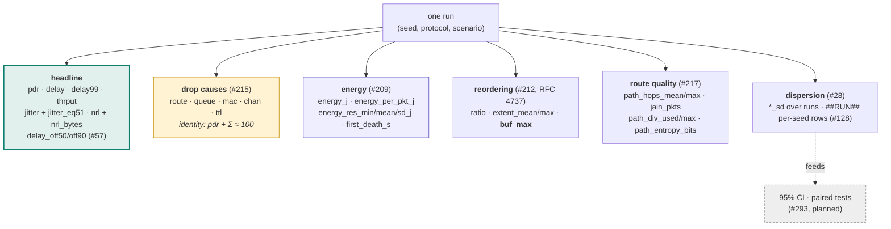
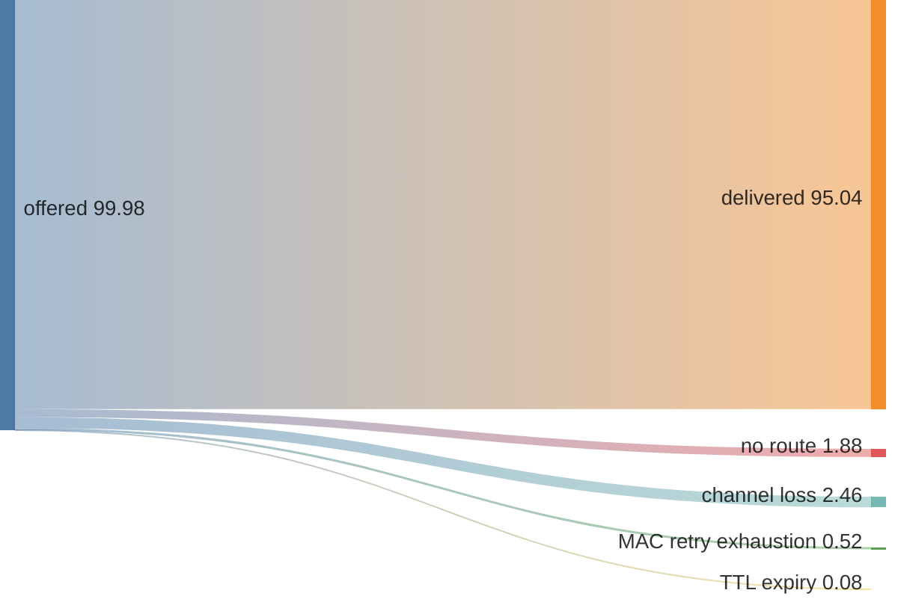
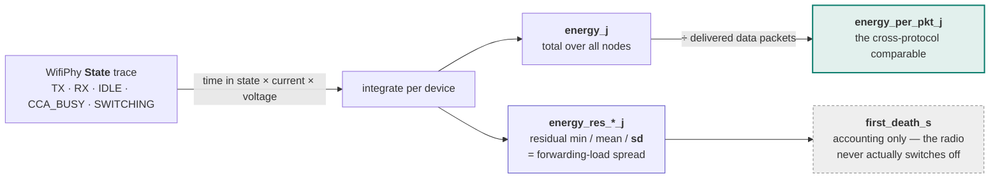

# Benchmark metrics

What each column of every benchmark table means, and what it is *not* safe to
conclude from it. Part of the [benchmark index](../benchmarks.md); the harness,
build profiles and validation anchors are in [methodology.md](methodology.md).

AntHocNet measured against the standard NS-3 MANET routing protocols
(**AODV**, **OLSR**, **DSDV**) on an identical scenario — same node layout,
mobility and traffic, driven from the same RNG runs so every protocol sees the
same realisations. Metrics come from an NS-3 `FlowMonitor`:

- **PDR** — packet-delivery ratio (received / sent), %, over the CBR data flows.
- **mean delay** — average end-to-end delay of delivered packets, ms.
- **99th-percentile delay** — tail of the delivered-packet delay distribution.
  Caveat (#57/#54): across protocols with very different PDR this is
  survivorship-confounded — the extra packets a protocol delivers are precisely
  the hard/late ones — so prefer the offered-load percentiles for cross-protocol
  tail claims.
- **jitter** (`jitter_ms`) — mean delay jitter over delivered packets
  (FlowMonitor `jitterSum` / (rx−1)), ms. Accumulates
  `|delay_i − delay_{i−1}|`, where `delay = arrival − send`.
- **jitterEq51** (`jitter_eq51_ms`) — the **thesis's** delay jitter, eq 5.1,
  ms. **This is a different quantity from `jitter_ms`, not a variant of it**
  ([#89](https://github.com/danieljoppi/AntHocNet/issues/89)):

  ```
  eq 5.1:       Σ |(t_i − t_{i−1}) − (t_{i−1} − t_{i−2})|      normalised by (n−2)
  jitter_ms:    Σ |delay_i − delay_{i−1}|                       normalised by (n−1)
  ```

  Eq 5.1 contains **no send times at all** — it measures how far each
  inter-arrival gap falls from the *previous gap*, where `jitter_ms` measures
  how far each packet's *delay* falls from the previous packet's. Under a
  perfectly periodic source the two differ by one further differencing step,
  which for iid arrival noise inflates eq 5.1 by roughly √2 in scale. There is
  no constant with which to convert one into the other.

  Three properties of the source formula that the implementation had to decide
  and therefore records here:

  - The thesis writes eq 5.1 as a bare **sum**, though every figure caption
    calls it "average delay jitter". A sum scales with packets delivered, so the
    worse-delivering protocol would score better arithmetically — the same
    survivorship trap the offered-load percentiles exist to dodge. We normalise.
  - The normaliser is **(n−2)** per flow: the sum's first well-defined term is
    at `i = 3`. (The thesis writes `i = 2` but references `t_{i−2}` — an
    off-by-one in the source.) Flows with fewer than 3 arrivals contribute
    nothing.
  - It is computed in **arrival order, not sequence order**. The thesis says
    "the time of arrival of the *i*th packet", so a reordered packet
    legitimately registers as jitter. Do not sort by sequence number to
    "fix" this; that would silently change the metric.

  **Which to cite:** paper-parity claims ("reproduces the thesis's jitter
  result") must cite `jitter_eq51_ms`. Cross-protocol comparisons may cite
  either, as long as one is used consistently — both are measured identically
  across all arms on identical realisations. A large divergence between the two
  columns is itself informative: it says the arrival process is bursty in a way
  the delay distribution alone does not show.
- **dOff90** (`delay_off50_ms`/`delay_off90_ms` in the CSV) — delay at the
  50th/90th percentile of *offered* (sent) packets, counting an undelivered
  packet as infinite delay (`inf` / `-1` in the CSV when less than that fraction
  arrived). Monotone-honest: dropping hard packets cannot improve it.
- **throughput** — application bytes delivered per second, kbps.
- **NRL** — normalized routing load: routing-control packets transmitted (each
  hop) per data packet delivered, counted uniformly at the IP layer.
- **nrl_bytes** — byte-normalized routing load: routing-control *bytes*
  transmitted (each hop, same IP-layer counting point as NRL) per data byte
  delivered. Complements packet-count NRL, which flatters protocols that send
  fewer, larger messages — an AntHocNet ant carries its visited path (up to
  `maxPathLength` addresses) while an AODV RREQ is small and fixed. The measured
  packet-vs-byte comparison run is tracked in #132.

## The metric families at a glance

Five families, each measuring a different thing, each with its own validity
rules. What follows the diagram is the per-family detail; this is the map.



**The trap each family carries**, stated once here and in detail below:
`delay99` is survivorship-confounded across protocols (a protocol that drops
hard packets looks better); `drop_queue_pct` misses DSDV's silent shedding
(#229); `energy` absolutes are idle-dominated so only **deltas and spread** are
readable; `reorder ratio/extent` measure route *flapping* rather than
multipath, leaving **`buf_max`** as the honest multipath signal; and
`path_div_*` is unquotable outside the dedicated cell (#230).

## Matched-delivery delay99 (`##MATCH##`, #308, NS-3 only)

`delay99` takes each protocol's tail over **its own** delivered set, and those
sets are not the same size. AntHocNet delivers ~10 pp more than AODV at the
paper base scenario, and some of that surplus is precisely the packets that
waited through a reconvergence. So an unknown part of AntHocNet's worse tail is
**packets AODV never delivered at all**, not slower service of the packets both
carry. That is the survivorship confound named above, and until #308 nothing
measured it.

Every `anthocnet-compare` run now also emits, per run and per protocol:

```
##MATCH## <run> <proto> <rxSelf> <rxMin> <delay99Ms> <delay99MatchedMs>
```

`rxMin` is the smallest delivered count across the protocols **in that run**;
`delay99Matched` re-reads each protocol's 99th percentile at that *absolute*
count — the delay below which `0.99 × rxMin` of its packets arrived. For the
protocol that delivered fewest it equals its own `delay99`; for the others it
is the tail of their fastest `rxMin` packets. `na` means that protocol did not
deliver enough packets to reach the target (it cannot happen for the protocol
that set `rxMin`).

**Read it in one direction only.** If the gap *persists* after truncation, the
delivery surplus cannot account for it — conclusive. If the gap *closes*, that
is consistent with the surplus explaining the tail but does not establish it,
because truncating the slowest packets assumes the surplus is the slow ones
rather than showing it. A closing gap is grounds for per-packet attribution
(#308 phase 1), not its answer.

It is emitted on its own `##MATCH##` marker rather than as extra `##RUN##`
columns, because the `##RUN##` field order is consumed **positionally** by
`bench_parse.py` and the campaign scripts, and appending to it would silently
shift their mapping — the failure mode the `# stddev` cross-check exists to
catch (#293).

### Common-set delay99 (`##COMMON##`, #308 phase 1)

`##MATCH##` *bounds* the confound; it cannot remove it, because truncating by
rank still assumes the surplus deliveries are the slowest ones. Keying by
packet **identity** removes the assumption:

```
##COMMON## <run> <proto> <nSelf> <nCommon> <p99Common> <meanCommon> <p99Surplus> <hopsCommon> <hopsSurplus>
```

`nCommon` is the number of `(flow, seq)` pairs **every** protocol in the run
delivered. `p99Common` / `meanCommon` are that protocol's tail and mean over
exactly those packets — same packets, same seeds, all delivered — so no
population difference remains to confound the comparison. This is the
assumption-free version of the matched measurement.

`p99Surplus` is the tail over the packets this protocol delivered that some
other protocol did not. It tests the hypothesis `##MATCH##` could only assume:
**if a protocol's extra deliveries really are its slow ones, its surplus tail
sits far above its common tail.** Reading the two together is the point — the
common tail says who is actually faster, the surplus tail says why the naive
comparison disagreed.

Per-packet delay comes from `SeqTsSizeHeader`'s send timestamp, which the
reordering trace (#212) already peeks for the sequence number, so this costs
one subtraction per delivered packet.

**`hopsCommon` / `hopsSurplus` (#308 phase 2)** are the same two splits measured
in hops instead of milliseconds, from the IP TTL each delivered packet carried.
They exist because the obvious decomposition of the delay deficit — *is it more
hops, or slower hops?* — was not expressible without them. `hopsMean` (#217)
averages over each protocol's **own** deliveries while `meanCommon` averages
over the **intersection**, so `meanCommon / hopsMean` silently divides one
population by another: the same survivorship confound phase 1 was about,
reappearing in the denominator. `meanCommon / hopsCommon` is a genuine per-hop
cost over one population.

Both are appended at the end of the line, never inserted: the earlier fields are
read positionally.

Worked example, from the phase-2 re-measure ([run
31042812548](https://github.com/danieljoppi/AntHocNet/actions/runs/31042812548),
paper base, disk, 20 seeds) — using the all-delivered basis, which was the only
one available then:

| factor | AntHocNet ÷ AODV |
|---|---|
| hop count | 1.247× |
| ms per hop | 1.35× |
| product | 1.68× (observed mean-delay ratio: 1.68×) |

The decomposition is internally consistent there because both terms use the same
all-delivered basis. What it cannot say is how the split looks on the packets
both protocols carried, where the delay ratio is 1.44× rather than 1.68×. That
is the question `hopsCommon` answers.

### Application goodput (`##GOODPUT##`, #63)

```
##GOODPUT## <run> <proto> <kbps>
```

Application bytes delivered per second, summed over the `PacketSink`s —
**measured at the application, not derived from FlowMonitor.**

Emitted on **every** run, not only TCP ones, and that is deliberate: on the UDP
arm it should track the `thrput` column closely, and the agreement is a free
cross-check that the metric is wired correctly. On TCP the two diverge, and the
gap between them *is* the retransmission overhead.

**On a TCP cell this is the headline, and `pdr` is not.** TCP retransmits until
it succeeds, so FlowMonitor's `txPackets` inflates while `rxPackets` counts each
delivery once: the ratio stops being a delivery fraction. Three columns change
meaning on a TCP cell and must not be compared with a UDP one:

| column | why it breaks under TCP |
|---|---|
| `pdr` | retransmissions inflate the denominator; it is no longer "fraction of offered data delivered" |
| `thrput` | FlowMonitor counts delivered *IP* bytes, so retransmitted segments count as throughput |
| `nrl` | control packets per *delivered data packet* — retransmissions inflate the denominator, which **flatters** whichever protocol reorders most, inverting the metric exactly where it matters |

The reorder columns are **absent** on a TCP cell rather than zero: `RecordRxSeq`
reads a `SeqTsSizeHeader` off the sink's `Rx` trace, which carries whole
datagrams on UDP but byte-stream chunks on TCP, so the hook is not connected at
all. Worth stating plainly — TCP is the arm where reordering matters most, and
it is the arm this instrumentation cannot measure.

### Run provenance (`##CONFIG##`, #369)

```
##CONFIG## scenario=<name> nNodes=.. time=.. runs=.. firstRun=.. areaX=.. \
           areaY=.. speed=.. pause=.. range=.. propagation=.. flows=.. \
           cbrBps=.. rateManager=.. protocols=..
##CONFIG## attr <AttributeName>=<value>          # one line per AntHocNet attribute
```

Not a metric — the configuration the numbers were produced under, emitted into
the compact block ahead of every result row.

It exists because the alternative was tried and failed. The effective knobs
used to live only in the workflow's command echo, which sits roughly 900 lines
above the reachable log tail and disappears with the run: three hold-cap
ablation arms ([#308](https://github.com/danieljoppi/AntHocNet/issues/308))
were cancelled before producing output, their logs expired, and the
`ReconvHoldCap`/`RepairHoldCap` values they were dispatched with are
unrecoverable. A run that cannot state its own configuration is not
reproducible, however many seeds stand behind it.

The `attr` lines report each AntHocNet attribute at its **effective** value.
ns-3 routes `--ns3::anthocnet::RoutingProtocol::X=Y` through
`Config::SetDefault`, which rewrites the TypeId's stored initial value, so
reading it back reports overrides and compiled defaults alike — and a lever
added by a future sweep is carried automatically, with no change here.

Two limits worth stating:

- **Fields are `key=value`, not positional** — unlike `##RUN##`. A misread
  position in a provenance row would misattribute an entire campaign, and
  there is no `# stddev` cross-check to catch it the way there is for the
  metric columns.
- **Baseline protocols' attributes are not dumped.** Nothing in this repo
  sweeps AODV/OLSR/DSDV attributes, so a `--ns3::aodv::…` override would *not*
  be recorded. If that ever becomes a swept lever, this is the place to extend.
- **It does not record the commit.** That is `##PROV##` below, and the split is
  not an oversight — see there.

### Drop-identity counters (`##DROPID##`, #377, NS-3 only, UDP only)

```
##DROPID## <seed> <proto> hopTx=.. hopRx=.. ackedHops=.. macDrops=.. \
           reinjected=.. macTerminal=.. macLost=.. queue=.. hopLoss=.. \
           overlap=.. unackedRx=..
```

Not a metric — the **raw counters behind the drop-cause residual**, one row per
seed per protocol, so the identity in
[Where the drop-cause identity comes from](#where-the-drop-cause-identity-comes-from)
can be audited in counts rather than in percentages.

`drop_chan_pct` is *inferred, not measured* — it is what is left of `hopLoss`
after the counted causes are removed — so it is only non-negative while those
causes are genuinely a subset of `hopLoss`. They were not, and the failure was
large: on every Nakagami cell the residual ran negative, to −13.10 % with 19.85
pp unaccounted ([#377](https://github.com/danieljoppi/AntHocNet/issues/377)).

### Why a retry-limit drop is not a lost packet

802.11 unicast is data → ACK: two transmissions, two independent chances to
fail. The joint outcome that breaks the subset property is **data delivered,
ACK lost**:

| event | `hopTx` | `hopRx` | `macDrops` |
|---|---|---|---|
| data arrives, surfaces at the peer's IP layer | +1 | +1 | — |
| ACK lost; sender retries; peer discards the duplicate | — | — | — |
| retries exhausted, sender gives up | — | — | **+1** |

Contribution to `hopLoss`: **zero**. Contribution to `macDrops`: **one**. Each
occurrence drives the residual negative by one packet — and the packet was
*delivered*, so it is not a drop at all.

That is why the fields below exist, and why `macLost` rather than `macDrops` is
what the residual subtracts:

| field | definition | reads as |
|---|---|---|
| `unackedRx` | `hopRx − ackedHops` | frames that reached the next hop's IP layer with no ACK recorded at the sender — the delivered-but-ACK-lost count |
| `macLost` | `macDrops − unackedRx` | retry-limit drops where the frame genuinely did **not** arrive. A subset of `hopLoss` **by construction**, so the residual cannot go negative for this reason |
| `overlap` | `macLost + queue − hopLoss` | Identically `−drop_chan_pct · tx / 100`. Now ≤ 0 by construction; a positive value means the books overlap for some *other* reason, which is why the gate on it is kept |

**Which columns the correction touches.** `drop_chan_pct` always subtracts
`macLost`. `drop_mac_pct` subtracts it **only where that column is
`macDrops`-based** — i.e. where nothing was re-injected. AntHocNet's
`drop_mac_pct` already reports `macTerminal`, with
[#46](https://github.com/danieljoppi/AntHocNet/issues/46) re-injection removed,
and correcting it a second time would double-count.

Measured at 900 s, 5 seeds, runs
[31288485211](https://github.com/danieljoppi/AntHocNet/actions/runs/31288485211)
(Nakagami) and
[31288489422](https://github.com/danieljoppi/AntHocNet/actions/runs/31288489422)
(two-ray):

| cell | `unackedRx` per run | `drop_chan_pct` before → after | identity `sum` after |
|---|---|---|---|
| nakagami / aodv | 1028 | −6.04 → **+6.72** | 99.87 |
| nakagami / olsr | 1155 | −7.95 → **+6.69** | 100.00 |
| nakagami / dsdv | 1112 | +3.62 → +17.50 | 100.22 |
| two-ray (all) | 0.2 – 8.8 | unchanged to ~0.1 pp | 99.91 – 100.02 |

The three orders of magnitude between the channels is the point: `unackedRx` is
a property of independent per-frame fading, so on two-ray — where reception is
a deterministic function of distance — the correction is a no-op, exactly as it
should be.

**Closed for AntHocNet — the residue was re-injection (#377 → #386).** Its
fading arm lands at `sum` ~**101–103** (1.41 pp over on the #377 probe): the
per-hop books count a re-injected packet's *extra copies* — a packet whose hop
failed, was re-injected by #46 and then travelled on contributes additional
`hopTx`/`macDrops` entries while the identity is end-to-end and counts it once.
That straddle is **expected and documented, not a books error**: the #386
detector A/B measured the identity closing at **exactly 100.00** on both
900 s Nakagami cells with `EnableMacFailureDetector=false` on identical seeds
([#386 comment 5234323092](https://github.com/danieljoppi/AntHocNet/issues/386#issuecomment-5234323092)),
so the whole overshoot is the detector's re-injection traffic. `##REINJ##`
below is the per-packet accounting of the same mechanism; the hop-level bound
(`unackedRx` vs `reinjected`, ≥ 58.8 % per run under fading) was its floor.

**Absent under TCP, not zero.** Every counter is gated on `IsDataIp`, which
tests for UDP on the data port, so a TCP cell would print all zeros — reading
as "no hops, no overlap, identity clean" when nothing was counted at all. Same
rule as `##HOLD##`/`##AIR##`, and the same mistake #382 fixed for the reorder
columns. (Note that `drop_mac_pct` and `drop_chan_pct` are structurally zero on
a TCP cell for this same reason; that is a separate pre-existing gap, tracked
on #63, not something this marker introduces.)

`scenario_check.py results` WARNs when a cell carries `##DROPID##` rows with
`overlap > 0`, naming both figures, so the condition is caught by the gate
rather than by a human noticing a negative percentage.

### Re-injection identity & fate (`##REINJ##`, #386, NS-3 only, AntHocNet + UDP only)

```
##REINJ## <seed> anthocnet events=.. parsed=.. unparsedIcmp=.. \
          unparsedOther=.. ofDelivered=.. pkts=.. \
          pktsDelivBefore=.. pktsDelivAfterOnly=.. pktsNever=.. \
          pktsDupDeliv=.. dupRx=.. postTx=.. postRx=.. \
          l3DropRoute=.. l3DropTtl=.. l3DropOther=.. \
          skips=.. skipsPkts=.. skipsDelivBefore=.. \
          skipsDelivAfterOnly=.. skipsNever=..
```

The **direct counter** behind the `##DROPID##` inclusion–exclusion floor: under
fading, ≥ 58.8 % of the [#46](https://github.com/danieljoppi/AntHocNet/issues/46)
detector-D re-injections are of packets that had *already arrived* at the
destination (`unackedRx` vs `reinjected`, a lower bound). This row measures
that overlap per packet instead of bounding it, and follows what re-injected
packets then do. One row per seed, AntHocNet arm only.

Packet identity is the `(flow, seq)` key the sink-side maps already use:
`flow = (source IP, source UDP port)` — byte-identical to the PacketSink `Rx`
trace's sender address — and `seq` from the `SeqTsSizeHeader`. The adapter's
`MacReinject` trace source fires **at the same statement that increments
`MacReinjectedPackets()`**, so `events` and `##DROPID##`'s `reinjected` are two
readings of one increment; the harness parses the key off the re-injected
packet (UDP header + SeqTs, the queued form) and off each IP hop transmission.

**Event view** (one count per re-injection):

| field | definition | reads as |
|---|---|---|
| `events` | `MacReinject` trace fires | must equal `##DROPID##` `reinjected` — a mismatch is an instrumentation bug (FAIL) |
| `parsed` | fires where the `(flow, seq)` parse succeeded | `parsed + unparsedIcmp + unparsedOther` must equal `events` — every re-injection is either named or classified (FAIL when the books do not close) |
| `unparsedIcmp` / `unparsedOther` | parse failures, split by IP protocol 1 vs anything else | **a finding, not an error** (WARN when non-zero): `NotifyTxError` re-injects *any* non-ant IP payload, so ICMP (e.g. TTL-exceeded) rides the detector too. Measured on the invariance probe: 2 events at one seed the SeqTs identity could not name ([#386](https://github.com/danieljoppi/AntHocNet/issues/386) comment 5233656930). The fate buckets below cover only the parsed events |
| `ofDelivered` | fires where the key was already in the sink's delivered set **at trace-fire time** | re-injections of already-delivered packets. No timestamps needed: traces fire in simulation-event order, so presence in the delivered map means "delivered strictly earlier" |

`ofDelivered` is deliberately **"already delivered AT RE-INJECTION TIME"**, not
"eventually delivered anyway" — a copy that passed the failing hop but had not
yet reached the sink counts as not-yet-delivered here, so it is conservative
against the floor. The eventual-fate buckets below carry the other quantity.

**Packet view** (distinct re-injected `(flow, seq)` keys, classified at end of
run):

| field | definition |
|---|---|
| `pkts` | distinct keys ever re-injected |
| `pktsDelivBefore` | delivered before their **first** re-injection (the waste-certain class) |
| `pktsDelivAfterOnly` | never delivered before first re-injection, delivered by end of run (delivered late — the re-injection plausibly saved them) |
| `pktsNever` | never delivered at all (dropped) |
| `pktsDupDeliv` / `dupRx` | keys the sink delivered ≥ 2 times / total surplus deliveries — duplicate arrivals at the **application layer**, counted by the sink-side `(flow, seq)` books. The [#386 A/B arithmetic](https://github.com/danieljoppi/AntHocNet/issues/386#issuecomment-5235242703) shows FlowMonitor's `rxPackets` does **not** count them materially (a counted `dupRx` would have moved the ON−OFF PDR contrast by ~27 pp; measured +6.4), so FlowMonitor PDR reads unique delivery and `dupRx` measures real duplicate traffic, not metric inflation |
| `postTx` / `postRx` | IP-layer hop transmissions / arrivals of re-injected keys **after** their first re-injection — the hops re-injected packets go on to consume (the wasted-work number); `postTx − postRx` is their post-re-injection in-medium loss |

`pktsDelivBefore + pktsDelivAfterOnly + pktsNever = pkts` exactly;
`scenario_check.py results` FAILs a row where the partition does not sum, and
WARNs when `ofDelivered` falls below the same-seed inclusion–exclusion floor
`reinjected + unackedRx − macDrops` (WARN, not FAIL: the floor is built from
*next-hop arrivals* while `ofDelivered` counts *sink deliveries*, so a small
shortfall can be timing rather than broken books).

**Measured reference (reading 2,
[#386 comment 5234323092](https://github.com/danieljoppi/AntHocNet/issues/386#issuecomment-5234323092)).**
On the 900 s Nakagami cells, both mobility models, 5 seeds each:
`ofDelivered/events` ≈ **0.62–0.63** — the direct rate, above the hop-level
inclusion–exclusion floor on **10/10** seeds; `dupRx` ≈ **0.5 per event**
(duplicate deliveries are not suppressed); `pktsNever` ≈ **2–5 %** of
re-injected keys. n=5 per cell is below the
[#293](https://github.com/danieljoppi/AntHocNet/issues/293) publishable floor —
treat these as the diagnostic reference the checks calibrate against, not as
publishable points. The same reading measured the detector as an *operating
point*: switching it off cost **−6.4 pp PDR** on 5/5 seeds in both cells, so
the re-injection waste these fields expose is currently paid for delivery, not
a free defect.

The trailing `l3DropRoute`/`l3DropTtl`/`l3DropOther` fields attribute the
L3-visible drops of re-injected keys (the pending-queue ageout's error callback
lands in `DROP_ROUTE_ERROR`; TTL exhaustion in `DROP_TTL_EXPIRED`). A key that
ends in `pktsNever` with no L3 drop died in the medium/MAC — the residue the
#377/[#388](https://github.com/danieljoppi/AntHocNet/issues/388) drop identity
is sensitive to. This stage is deliberately isolated (own callback, own trace
connect, fields grouped last) so it can be cut cleanly if an ns-3 version in
the CI matrix rejects the `Ipv4L3Protocol` `Drop` trace signature.

**Capped skips (`skips*` tail, [#402](https://github.com/danieljoppi/AntHocNet/issues/402)).**
These count the `MaxReinjectPerPacket` cap's early-return — a MAC
retry-limit drop the detector matched but the cap refused to re-inject, so the
drop stays **terminal**:

| field | definition |
|---|---|
| `skips` | capped-skip **events** (adapter `MacReinjectSkip` trace fires; includes the unparsed non-data ones) |
| `skipsPkts` | distinct skipped `(flow, seq)` keys. `skips > skipsPkts` is possible under a cap and is not an error: the `ReinjCountTag` budget is **per packet copy**, so duplicated copies at different nodes each carry their own budget and one key can be skipped repeatedly (measured 387 events vs 370 keys on the cap=1 probe cell) |
| `skipsDelivBefore` / `skipsDelivAfterOnly` / `skipsNever` | fate partition of `skipsPkts`, same construction as the `pkts` partition (delivered before the first skip / only by end of run / never). Must sum exactly (`scenario_check` FAILs otherwise) |

The tail exists because the uncapped #388 attribution **breaks under a cap**
(the #402 finding, +8.50 pp residue on the cap=1 probe cell vs +3.32 pp
uncapped): a packet can accumulate re-injections — inflating the per-hop books
— and *then* hit the cap, so its final MAC drop lands in
`macTerminal = macDrops − reinjected` while the same packet's earlier hop
inflation is still in `hopLoss`; when that packet was in fact delivered (the
#377 delivered-but-ACK-lost class, ~3/4 of skip events on the probe cell) the
identity double-counts it. **Cap-aware rule:** the harness's `mac` column
subtracts the delivered-key skip events from the terminal numerator —
`mac = 100·(macDrops − reinjected − (skips − skipsNever))/tx`, with
`skips − skipsNever` evaluated in *event* units (skip events on keys delivered
at any point) — so only never-delivered capped drops count as terminal MAC
loss and delivered-packet skips join the documented #377-class straddle. A
small residual remains and is documented, not hidden: `skipsNever` frames that
*arrived* but were never ACKed (unACKed-but-arrived, bounded by the same #377
mechanism at roughly 0.16 of the never class on the probe cell) are still
counted terminal. Uncapped arms are **structurally unchanged**: the adapter's
`MacReinjectSkip` trace lives inside the `MaxReinjectPerPacket != 0` branch
and can never fire at the default 0, so every `skips*` field reads 0 and the
subtraction vanishes arithmetically — `scenario_check` FAILs `skips > 0` on
any arm whose `##CONFIG##` lacks a non-zero cap. `##DROPID##`'s `macTerminal`
field stays the raw `macDrops − reinjected` so the books remain auditable;
only the `# drops` attribution applies the correction.

**Absence encoding** (the #382 rule, with the #229/#230 controls stated as
numbers):

- **Baselines (AODV/OLSR/DSDV): no row at all.** They have no failure detector
  and no re-injection; a `0` would read as "measured, nothing happened".
  `scenario_check.py results` FAILs any `##REINJ##` row naming a non-AntHocNet
  protocol.
- **TCP cells: no row.** The SeqTs identity does not exist on a byte stream
  (same reason the reorder columns are absent there).
- **`EnableMacFailureDetector=false`: row present, every field `= 0`.** The
  hooks stay connected and the trace simply never fires, so the zeros are
  *measured*. The knob's effective value is in the `##CONFIG## attr` dump, and
  `scenario_check.py results` FAILs `events > 0` alongside
  `EnableMacFailureDetector=false` — preflight cannot enforce this (it never
  sees `extraArgs`), so the coherence check is results-side by design.

### Measuring commit (`##PROV##`, #365)

```
##PROV## commit=<sha> ref=<branch> run_id=<id> attempt=<n> image=<ghcr tag> \
         profile=<default|release> harness=<compare|baselines|isl-grid|scenario-matrix>
```

The other half of provenance: `##CONFIG##` says *how* the run was configured,
`##PROV##` says *which version of the code* was configured that way. A number
carrying only one of the two is not reproducible — the same knobs against a
different protocol build are a different experiment, which is the whole content
of [#365](https://github.com/danieljoppi/AntHocNet/issues/365).

**Emitted by the workflow, not by the harness.** This is the one marker in the
compact block that does not come from `anthocnet-compare`'s stdout, and it
cannot: a simulation binary has no way to know the commit it was built from
short of baking one in at configure time, which would then be wrong for anyone
running it from a dirty tree. The workflow knows it for certain, so the workflow
says it. Three campaign workflows emit the same line:
[`paper-benchmark.yml`](../../.github/workflows/paper-benchmark.yml) and
[`satellite-benchmark.yml`](../../.github/workflows/satellite-benchmark.yml)
append it to their compact blocks; `scenario-matrix.yml` has no compact block —
its numbers travel as a CSV artifact — so it emits the line from a step of its
own, under `if: always()` so a sweep that dies mid-way still stamps the points
that completed.

**Position matters.** It is the *last* line of the block, after `##PERF##`. A
cheap `get_job_logs` tail loses lines from the top, and losing the provenance of
a campaign is worse than losing its wall-clock.

Two limits:

- **`key=value`, not positional**, for the same reason as `##CONFIG##`: a
  misread field here would misattribute a whole campaign, and no `# stddev`
  cross-check exists to catch it.
- **It records the commit the *workflow* checked out**, which is the commit the
  binary was built from in every workflow here because each builds from its own
  checkout. A future workflow that ran a pre-built binary would make the line
  a lie; if one is ever added, it has to stamp the binary's provenance instead.

Runs from before this marker existed (everything up to `v1.3.0`) have no
`##PROV##` line. Their provenance is the release pin documented in
[methodology.md](methodology.md#run-id--commit), not a per-run stamp — the
mapping was never recorded, and inventing one now would be fabrication rather
than recovery.

### Pending-queue hold time (`##HOLD##`, #308 phase 2 step 4)

```
##HOLD## <run> <proto> <setupN> <setupMeanMs> <setupMaxMs> \
                       <reconvN> <reconvMeanMs> <reconvMaxMs> \
                       <repairN> <repairMeanMs> <repairMaxMs>
```

How long delivered data packets waited in AntHocNet's pending queue, split by
why they were waiting: `setup` (first discovery for a destination), `reconv`
(re-discovery after a known route was lost) and `repair` (re-injected after a
MAC transmit failure while a local repair runs). Summed over nodes, per run.

**The measurement is not new — reaching it is.** `HoldStats` has recorded these
since #21/#104, but they were printed only inside the `--diag` line, which the
workflow's compact re-emit never carried. Reading them for the phase-2
decomposition therefore cost a 900-line log tail and still lost three of twenty
seeds. Emitting a number and being able to reach it are different things; this
marker closes the second half.

Measured at the paper base scenario (disk, 900 s, 20 seeds): `reconv` holds
1703 events per run at 93.0 ms mean, `repair` 1959 at 24.0 ms, `setup` 18 at
406.5 ms — together **27.61 ± 1.72 ms per delivered packet**, against an
all-delivered mean-delay gap to AODV of 21.9 ms.

**Two limits, both load-bearing.**

*Counts are hold **events**, not packets.* The pending queue is per node, so a
packet crossing several hops can be held more than once. `setupN + reconvN +
repairN` divided by delivered packets gives **hold events per delivered
packet** (0.476 at the paper base), which is *either* ~48 % of packets held
once *or* fewer packets held repeatedly. These counters cannot tell the two
apart, and the distinction matters for the protocol story.

*Rows appear for AntHocNet only.* AODV also queues during route discovery
(`aodv::RequestQueue`) and OLSR/DSDV do not queue at all, but **none of them is
instrumented**, so no row is printed for them. A row of zeros would assert
"this protocol never held a packet" when the truth is "nobody looked" — the
same reason `##AIR##` prints nothing under `--energyJ=0`. Consequently
`##HOLD##` supports statements about AntHocNet's own delay composition, and
**not** cross-protocol hold comparisons, until the AODV side is measured.

### Channel occupancy (`##AIR##`, #308 phase 2 step 3)

```
##AIR## <run> <proto> <txS> <rxS> <ccaBusyS> <busyPct>
```

The step-2 decomposition split the delay deficit into **36 % extra path length
and 64 % extra cost per hop**, and left one hypothesis standing for the per-hop
half: AntHocNet sends *fewer* control packets than AODV (NRL 36.08 vs 55.39) but
substantially *more* control **bytes** (`nrl_bytes` 42.607 vs 29.133), so it may
simply be putting more airtime on a shared 2 Mbit/s medium that data then queues
behind. That would raise per-hop delay while causing neither MAC drops (0.44 %
vs AODV's 10.43 %) nor queue overflow (`drop_queue` 0.00 for both) — which is
exactly the observed signature, and exactly why it has to be measured rather
than believed.

`txS` / `rxS` / `ccaBusyS` are node-seconds summed over every node: what this
network put on the air, what it decoded, and what it saw as busy-but-not-for-me.
`busyPct` is their sum as a percentage of node-time (`nNodes × time`), i.e. the
fraction of the run an average node saw the medium occupied — normalised so the
number does not silently depend on `--nNodes` or `--time`.

The PHY `"State"` trace is already connected for the energy accounting (#209)
and already carries each state's duration, so this costs no new hook and no
extra simulated work.

**Coupled to the energy model, deliberately visible.** That trace is only
connected when the energy model is on, so `--energyJ=0` (#270) leaves the
occupancy unmeasured. In that case **no `##AIR##` row is printed at all**,
rather than an all-zero row that would read as "the medium was never busy" — the
absence is the signal. `scenario_check.py results` therefore treats a *present*
row with all-zero occupancy and non-zero PDR as a FAIL: packets flew, so the
medium cannot have been idle throughout.

**Distinguishing what this can and cannot show.** It measures whether the
airtime premise is true — is AntHocNet occupying more of the medium? It does
**not** establish that the extra airtime *causes* the per-hop delay. A negative
result kills the hypothesis; a positive one licenses the next measurement, not a
conclusion.

**The one assumption left, and it is checkable.** Cross-protocol keying needs a
flow's `(source IP, source port)` to be identical across protocols in the same
run. It is — topology, addressing and application construction are identical
and identically seeded, only the routing protocol differs — and the output
makes a violation visible rather than silent: `nCommon` collapsing toward zero
means the keys did not line up, which no real routing difference could produce.

> **Adding a marker is two changes, not one.** The harness emitting a
> `##MARKER##` line is only half of shipping it: `paper-benchmark.yml`'s
> *"Compact result block"* step re-emits a **explicit allow-list** of markers at
> the end of the log so one cheap `get_job_logs` tail carries everything. A
> marker missing from that grep still reaches `paper-results.txt` (and the
> artifact, which is proxy-blocked) but sits far above the compact block. That
> is exactly what happened to `##MATCH##` on its first run: `tail_lines=215`
> instead of ~50, and the top row scrolled off anyway, costing one seed out of
> twenty in a paired analysis.

## Where the drop-cause identity comes from

Every offered packet lands in exactly one bucket. That is the whole of #215,
and it is why the identity can be checked rather than trusted — measured
values below are the 20-seed × 900 s disk arm
([run 30772704321](https://github.com/danieljoppi/AntHocNet/actions/runs/30772704321)),
percentages of offered packets:



The five causes plus PDR sum to **99.98 %** here; the residual is data still
queued when the run stopped, which is why the gate WARNs past 1 pp and FAILs
past 5 pp rather than demanding exactly 100. Reading the same picture for
AODV (84.73 delivered, 10.09 MAC) makes the contrast concrete: AntHocNet's
losses are dominated by *route* state, AODV's by *MAC retry exhaustion*.

A cause that accounts for nothing is the failure mode this instrumentation
exists to expose — DSDV's routing-layer queue drops land in no bucket at all
and open an 11.46 pp hole ([#229](https://github.com/danieljoppi/AntHocNet/issues/229)),
which is why DSDV is excluded from cross-protocol drop comparisons.

## How energy is accounted

Not a battery model — an integration of the radio's own state trace, which is
why its absolutes must be read carefully.



Three caveats that decide what may be claimed:

- **Idle dominates.** At the shipped currents the idle draw is ≈0.82 W, so
  total energy is mostly "the radio was switched on", not "the protocol worked
  hard". Absolute joules are near-identical across protocols by construction —
  compare **deltas** and the **residual spread**, never the totals.
- **The modelled NIC is 802.11n while the harness runs 802.11b at 2 Mbit/s.**
  The current values are ns-3's own provenance (Halperin, HotPower'10); they
  are internally consistent, not a claim about the simulated radio.
- **`first_death_s` is bookkeeping.** Energy is integrated but never enforced —
  no node stops transmitting when its budget hits zero, so a "death" marks a
  threshold crossing, not a topology change.

`energy_per_pkt_j` is the one to quote across protocols, because it divides by
what each protocol actually delivered; `energy_res_sd_j` is the one to quote
about *fairness of forwarding load*, since a protocol that funnels traffic
through a few relays drains them faster and widens the spread.

## Drop causes (#215, NS-3 only)

PDR says how many packets went missing. These columns say **why**, as a
percentage of *offered* (sent) packets, so that

```
pdr_pct + drop_route_pct + drop_queue_pct + drop_mac_pct
        + drop_chan_pct  + drop_ttl_pct   ≈ 100
```

Every offered packet is accounted for exactly once: it was delivered, or it
died of one of five causes. That identity is what makes the breakdown readable
— a cause is a *share of the loss*, not a free-floating counter — and
`scenario_check.py results` enforces it (see *Why the identity must close*).

The five causes are measured **identically for all four protocols**, so a
column means the same thing in the AntHocNet arm and in the AODV arm:

- **drop_route_pct** — the routing layer gave up: no route was ever found, or
  the route it was waiting on did not come back in time. Measured from
  FlowMonitor's per-flow drop reasons (`DROP_NO_ROUTE` + `DROP_ROUTE_ERROR`),
  i.e. from the protocol's own error callback, whichever protocol raised it.
- **drop_queue_pct** — the packet was overtaken by congestion at the
  *interface*: the device transmit queue or the traffic-control queue disc was
  full (`DROP_QUEUE` + `DROP_QUEUE_DISC`). This is the "network is drowning in
  its own traffic" signal, not a routing failure.
- **drop_mac_pct** — the link broke under the packet: 802.11 exhausted its
  retry limit on the unicast (`WIFI_MAC_DROP_REACHED_RETRY_LIMIT` on the
  `WifiMac` `DroppedMpdu` trace — the same signal AntHocNet's ADR-0008 detector
  D uses). **Terminal failures only**: AntHocNet re-injects a MAC-dropped data
  packet into its pending queue (#46), and a re-injected packet is not lost —
  its real fate is counted wherever it finally ends up — so re-injections are
  subtracted here rather than counted twice.
- **drop_chan_pct** — sent and never received. Counted as the difference
  between data IP packets handed to a real interface and data IP packets that
  arrived at the next hop's IP layer (the `Ipv4L3Protocol` `Tx`/`Rx` traces,
  the same counting point as NRL), minus the MAC and interface-queue drops
  already attributed above. What remains is genuine on-air loss: collisions,
  capture, a next hop that moved out of range mid-frame, ARP failures. **This
  one can only come from the simulator** — it is the gap between "we sent it"
  and "it arrived", which `core/` by construction cannot see (golden rule 1).
- **drop_ttl_pct** — the IP TTL reached zero (`DROP_TTL_EXPIRE`): the packet
  was forwarded in a loop or along a path longer than the TTL allows. Note this
  is the *IP* TTL on data packets; `Config::maxPathLength` is the analogous
  ceiling on *ants* and does not appear here (ants are control traffic, counted
  by NRL).

Three further columns split `drop_route_pct` for AntHocNet. They are a
**sub-breakdown of that column, not extra causes** — adding them into the
identity would double-count — and they are **blank, never `0`, for the other
protocols**, because the mechanisms simply do not exist there. Blank means "not
applicable"; `0` would mean "applicable and never fired", and the two must stay
distinguishable:

- **drop_setup_pct** — held in the pending queue for a destination this node
  had **never** routed to, and aged out at `QueueTimeout` (or was evicted when
  the queue filled). This is the true *no route* case: discovery never
  succeeded.
- **drop_reconv_pct** — same exit, but for a destination this node **had**
  routed to: a route existed, was lost, and did not return within
  `QueueTimeout`. Reconvergence loss, not discovery failure. Packets
  re-injected after a MAC failure and then aged out land here too — they were
  also waiting for a route that had existed.
- **drop_repair_pct** — released by `DiscardPending` after a **local repair
  timed out** (the paper's §3.5, decision D6). The core counts the repair events
  (`AntRouterLogic::repairDiscards()`); the NS-3 adapter owns the queue and so
  counts the packets.

### Which causes are protocol behaviour, not faults

This is the part that matters when reading a table. Not every drop is a bug.

| Cause | Reading |
|-------|---------|
| **drop_repair_pct** | **Expected, deliberate behaviour.** The AntHocNet paper (§3.4 link failures / §3.5 local repair) chooses to discard the packets buffered behind a failed local repair rather than hold them indefinitely: it trades a slice of PDR for a **bounded delay tail**. A non-zero repair-discard share is the protocol working as specified, and #21's `RepairHoldCap`/`ReconvHoldCap` levers move packets *deliberately* between this column and the delay tail. Read it against `delay99_ms`/`jitter_ms`, never on its own. |
| **drop_reconv_pct** | **Expected under mobility**, in proportion to how fast links break. It is the direct cost of reactive re-discovery; a *rising* share as `pause` falls is the protocol responding to mobility, not degrading. It becomes a finding only when it dominates on a **static** field. |
| **drop_setup_pct** | Expected during the start-up transient and for genuinely unreachable destinations (a partitioned field — `scenario_check.py preflight` warns about those before the run). A large steady-state share means discovery is failing: that is #169's signature. |
| **drop_chan_pct** | **PHY/scenario property, not a protocol property**, up to the control traffic the protocol puts on the air. All four arms share a channel, so compare the column *across* arms: the protocol with the higher share is the one filling the medium. A collapse dominated by this column is [#173](https://github.com/danieljoppi/AntHocNet/issues/173)'s exact signature — and having it as a column is why #215 exists at all, since #173 cost a benchmark campaign, a testbench reproduction and a code audit to reach that same conclusion. |
| **drop_queue_pct** | Congestion, same reading as `drop_chan_pct`: offered load (or control overhead) exceeding what the interface can drain. Cross-check against `--qdiag` and `preflight`'s offered-load fraction. |
| **drop_mac_pct** | Link breakage. Expected under mobility; a high share at low speed points at the PHY setup (`--rateManager`, #51) rather than at routing. |
| **drop_ttl_pct** | **Always a fault signal.** Data should not loop. Anything materially above zero means forwarding loops — read it with `EnableMultipath` and the A1 loop-suppression caveat in the NS-3 adapter. |

### Why the identity must close

The five protocol-agnostic causes come from **three independent books**:
FlowMonitor's per-flow drop reasons, the `Ipv4L3Protocol` `Tx`/`Rx` hop
tallies, and the `WifiMac` retry-limit verdicts. Nothing forces them to agree,
which is what makes their sum a real check rather than an accounting tautology.
`scenario_check.py results` therefore treats a mismatch as a harness
regression, in the same class as the #51 anchor floors:

- **WARN** past 1 percentage point, **FAIL** past 5.
- The tolerance exists for one legitimate residual: data still sitting in a
  routing protocol's pending queue when the run stops. A packet waits there at
  most `QueueTimeout` (3 s), so the residual is bounded by 3 s of offered
  traffic — ≈0.3 % of a 900 s paper run, ≈2.5 % of the 120 s `--quick` preset.
  5 pp leaves plenty of room for that while still catching a #173-scale
  misattribution (tens of pp).
- A negative share in any cause also FAILs: it means two causes are counting
  the same packet.
- **One documented overshoot: the AntHocNet re-injection straddle on fading
  cells.** An AntHocNet fading-cell sum of ~**101–103** is expected, not a
  books error ([#377](https://github.com/danieljoppi/AntHocNet/issues/377)'s
  closure): the per-hop books count a #46-re-injected packet's extra copies
  while the identity is end-to-end. The #386 detector A/B pinned it — on
  identical seeds the same cells read **exactly 100.00** with
  `EnableMacFailureDetector=false`
  ([#386 comment 5234323092](https://github.com/danieljoppi/AntHocNet/issues/386#issuecomment-5234323092)).
  Read the overshoot against `##REINJ##`'s `postTx`/`dupRx`; it scales with
  re-injection volume, not with any misattribution.

If the check fails, **do not read the breakdown** — one of the three books is
wrong (a drop path that fires no error callback, a trace hook that did not
connect on this ns-3 release, a cause counted twice) and every per-cause
conclusion is unsafe until it is fixed.

**The three AntHocNet-only columns are a sub-breakdown of `drop_route_pct`, not
causes on top of it.** `drop_setup_pct + drop_reconv_pct + drop_repair_pct`
partitions `drop_route_pct`: all three exit paths end in the same L3 error
callback, so the parent already contains them. Adding them to the identity
double-counts route failures and manufactures a ~156 % total out of a correct
breakdown — a mistake made once while reading these very columns
([#229](https://github.com/danieljoppi/AntHocNet/issues/229)). The identity has
**five** terms plus PDR. `scenario_check.py` cross-checks the partition
separately (WARN if the three do not reconstruct their parent within 1 pp).

#### What is measurable, per protocol

`drop_queue_pct` comes from `Ipv4FlowProbe`'s `DROP_QUEUE` / `DROP_QUEUE_DISC`
reasons, which observe the **interface and qdisc queues only**. A routing
protocol's own pending queue — the buffer holding packets awaiting a route — is
invisible to them unless the protocol reports its discards through an L3 error
callback.

| Protocol | Routing-layer pending-queue drops |
|---|---|
| **anthocnet** | **Counted.** They run through the error callback, so they land in `DROP_NO_ROUTE` and hence in `drop_route_pct` (further split by the three sub-columns above). This is why AntHocNet's identity closes to within 0.06 pp on every scenario. |
| **aodv** | Counted, same mechanism. |
| **olsr** | Not applicable — OLSR is proactive and does not buffer awaiting a route. |
| **dsdv** | **Not counted.** ns-3's `dsdv::PacketQueue` sheds on `MaxQueueLen` / `MaxQueueTime` without an error callback, so those packets are offered, never delivered, and attributed to no cause. `drop_queue_pct` reads a confident `0.00` on all six scenarios. |

The consequence is bounded but real: it costs **11.46 pp** of the DSDV identity
at `dense-small` (the most congested scenario, so the most buffering) and
≤ 0.73 pp elsewhere. **Do not include DSDV in a cross-protocol drop-cause
comparison** until [#229](https://github.com/danieljoppi/AntHocNet/issues/229)
closes. DSDV's aggregate metrics — PDR, delay, NRL — never depended on the
breakdown and are unaffected.

### Caveats

- **NS-3 only.** The NS-2 adapter has no equivalent instrumentation; see
  [cross-validation.md](../cross-validation.md).
- The human table prints these on a `# drops` line (like `# energy`) rather
  than widening the fixed-width table; the CSV carries all eight columns.
- `# drops` also prints `other=`, the L3 drops in none of the five buckets
  (bad checksum, interface down, fragment timeout — structurally zero in this
  harness). If it is ever non-zero it is the reason the identity misses.

## Route quality: path length, path diversity, fairness (#217, NS-3 only)

AntHocNet's defining property is that it lays and maintains **multiple paths**,
and until #217 the harness measured nothing about paths. These columns are
produced protocol-agnostically from NS-3's own traces for **all four
protocols** — the single-path baselines are the instrumentation's self-check,
not a blank column.

- **path_hops_mean / path_hops_max** — mean and maximum hop count *actually
  traversed by delivered data packets*, where one hop is one transmission (a
  packet delivered to a neighbour is 1 hop). This is what settles whether
  AntHocNet's delay advantage comes from **shorter** paths or from better path
  **selection**: compare `path_hops_mean` alongside `delay_ms`. 0 when nothing
  was delivered (the `nrl` convention).

  *Definition and source.* Taken from the IP TTL observed at the destination's
  `Ipv4L3Protocol` `LocalDeliver` trace — one call per packet handed to the
  local transport, i.e. exactly the packets PDR counts — as
  `hops = (initial TTL − TTL at delivery) + 1`. The initial TTL is NS-3's
  `Ipv4L3Protocol::DefaultTtl` default of 64 (unchanged across the 3.36–3.48 CI
  matrix; nothing in the harness sets a `SocketIpTtlTag`). Every real forwarding
  hop passes through `Ipv4L3Protocol::IpForward`, which decrements the TTL
  exactly once. This is numerically the same quantity as FlowMonitor's
  `FlowStats::timesForwarded + 1` — which accumulates only over delivered
  packets — but observed per packet rather than per flow, which is what makes
  the **maximum** available at all: FlowMonitor exposes only the sum.

- **path_div_used** — **used** path diversity: the mean number of *distinct next
  hops that actually carried a data packet* for a destination, per (node,
  destination) pair, within one `path_div_window_s` window, averaged over the
  cells that carried data. **path_div_max** is the largest such count seen in
  any one cell.

  *Used, not available — and the distinction is the point.* Pheromone entries
  above `minPheromone` are the paths the table makes **available**; a table full
  of pheromone that data never uses would read as diversity that does not
  exist. What is reported here is **usage**: a next hop counts only when a data
  frame it carried was acknowledged.

  *Why a window.* Diversity is *concurrency*. Over a whole run a single-path
  protocol also touches several next hops for one destination — sequentially, as
  routes break and are rediscovered — so a whole-run distinct count would credit
  AODV with multipath it does not have. Counting per window separates
  concurrent spreading from sequential replacement. **Expect the baselines
  (AODV/OLSR/DSDV) to read ≈1**; the residual excess above 1 is route churn
  inside one window, not spreading, and it grows with mobility. A baseline
  reading well above 1, or AntHocNet reading exactly 1, is an instrumentation
  or protocol regression.

  *Source.* The `WifiMac` `AckedMpdu` trace: it fires at the transmitter for
  every unicast MPDU the next hop acknowledged, and the 802.11 header's `Addr1`
  **is** the next hop. It is the only address-bearing transmit hook NS-3 offers
  uniformly to all four protocols (the `Ipv4L3Protocol` traces do not carry the
  gateway), and "acknowledged" makes "carried" literal — a frame the next hop
  never received is not a path that was used. The AntHocNet adapter already
  depends on this trace across the whole CI matrix (#68).

- **path_entropy_bits** — mean Shannon entropy (bits) of the per-next-hop packet
  split within a cell, averaged over the same cells as `path_div_used`. **0 =
  single path**; 1 bit = an even two-way split; it is bounded above by
  log2(`path_div_max`). Reported because the count alone cannot distinguish a
  genuine 50/50 split from 999 packets down one next hop and 1 down another.

- **path_div_window_s** — the window (s) the diversity columns are counted over
  (`--pathWindowS`, default **10 s**), carried in the CSV because it *defines*
  what the diversity number means. Provenance: a repo choice, not a paper value.
  It must be long enough to hold several packets of a flow (the paper base
  scenario offers 1 packet/s per flow, so 10 s ≈ 10 packets) and short enough
  that a single-path protocol rarely replaces a route inside it. Comparisons
  across different window settings are meaningless — check the column matches
  before differencing two runs.

- **jain_pkts** — **Jain's fairness index** over the per-flow delivered-packet
  counts, `J = (Σxᵢ)² / (n·Σxᵢ²)`. `J = 1` when every flow is served equally,
  `J = 1/n` at maximum unfairness (one flow gets everything). `heavy-load` runs
  40 flows and the rest of the table reports only aggregates, so without this
  one starved flow is invisible. This is where stochastic spreading should beat
  single-path protocols.

  *Population.* `n` is the number of source applications actually installed, so
  a flow so starved that not one of its packets ever reached the IP layer — its
  socket send failed for want of a route, which FlowMonitor never records —
  still counts as a **zero** rather than vanishing from the index. (That is a
  deliberate divergence from PDR's denominator, which counts only packets
  FlowMonitor saw offered.)

  *One index, two readings.* Computed over delivered **packet counts**; because
  every flow in this harness sends the same 64-byte payload, the per-flow
  throughput vector is a scalar multiple of the packet-count vector and Jain's
  index is scale-invariant, so the same number is also the throughput-based
  index. If the harness ever gains per-flow packet sizes, the two separate and
  a second column is needed.

### Caveats (route quality)

> **`path_div_*` and `path_entropy_bits` are not publishable at the current
> default window.** The single-path baselines are this metric's self-check, and
> they fail it. OLSR installs exactly one route per destination and so must read
> `path_div_used` ≈ 1.000; on the first full campaign it read **1.428** at
> `heavy-load`, 1.383 at `high-mobility` and 1.344 at `paper-base`. AntHocNet's
> whole range (1.225–1.512) sits *inside* OLSR's.
>
> The cause is the window, not the counter: `path_div_window_s` defaults to
> **10 s**, which is longer than a route survives under mobility, so a single
> route being *replaced* is counted as two concurrent paths. `sparse-static` is
> the control that proves it — the only scenario with no route churn, and the
> only one where the baseline reads ≈ 1 (olsr 1.004) and the separation from
> AntHocNet (1.225) is real.
>
> **The window was swept, and no value works.** Five single points on the
> paper-base knobs, identical config, `--pathWindowS` the only variable:
>
> | window | anthocnet | aodv | olsr | dsdv |
> |---:|---:|---:|---:|---:|
> | 0.5 s | 1.001 | 1.000 | 1.000 | 1.000 |
> | 1.0 s | 1.001 | 1.000 | 1.000 | 1.000 |
> | 2.0 s | 1.002 | 1.002 | 1.000 | 1.001 |
> | 5.0 s | 1.147 | 1.157 | **1.164** | 1.066 |
> | 10.0 s | 1.291 | 1.311 | **1.327** | 1.167 |
>
> Below 2 s every protocol reads ≈ 1.000 — AntHocNet included, so there is no
> signal to have. At 5 s and above the baselines are already past 1.05 **and
> OLSR outranks AntHocNet**. There is no window in between: at 2 s AntHocNet
> ties AODV to three decimals.
>
> **Root cause: the metric is sample-starved at the paper's traffic rate, not
> merely mis-windowed.** A (node, destination, window) cell can only report
> diversity above 1 if at least two packets land in it, so packets-per-cell is
> bounded by `pktPerSec × window` — 1 × 2 s = 2 at paper-base, the bare floor,
> where a cell can only ever read 1.0 or 2.0. Shortening the window to escape
> route churn starves the sample; lengthening it to gather samples lets churn
> dominate. The two bounds cross, which is why the sweep has no solution.
>
> `kDefaultPathWindowS` is therefore **left at 10 s** — no other value is
> better at the paper's 1 pkt/s, and moving it would imply the problem was
> solved. A 900 s re-sweep (w ∈ {2,4,6,10}, runs 30649042555/30649049794/
> 30649059276/30599510462) reproduced the table above point for point.
>
> **Resolution (#230, owner-approved): a dedicated diversity-measurement
> cell.** Raising the offered rate feeds the cells instead of shrinking the
> window past the churn bound: at `--cbrBps=4096 --pathWindowS=2` (8 pkt/s →
> 16 packets per cell; run 30650903707, 900 s) AntHocNet separates from every
> baseline — `divUsed` **1.229** vs aodv 1.133 / olsr 1.090 / dsdv 1.046,
> `entropyBits` 0.163 vs ≤ 0.093, `divMax` 7 vs ≤ 6. Concurrent spreading is
> real and was sample-starved at 1 pkt/s.
>
> Rules for using the cell:
>
> 1. **All `path_div_*`/`path_entropy_bits` claims come from this cell only**
>    (`cbrBps=4096`, `pathWindowS=2`), which is its own load regime (8× the
>    paper rate) and must be labeled as such — never mixed into the headline
>    paper cell, whose diversity columns remain unquotable.
> 2. **Report diversity as excess over the in-run single-path floor**, not as
>    an absolute: at 8 pkt/s even a churn-free window catches AODV's route
>    replacement landing packets on two routes inside one window (measured
>    floor 1.133), so the honest figure is AntHocNet − AODV in the same run
>    (today: **+0.096 used-paths, +0.070 entropy bits**). No (rate, window)
>    pair drives the floor to 1.0 while keeping the cells fed.
> 3. `scenario_check.py` enforces the split: the absolute 1.10 single-path
>    bound applies whenever `path_div_window_s > 2`; at the cell's window it
>    relaxes to a 1.50 sanity ceiling (a baseline above that means the window
>    is not churn-free at the offered rate and the cell is unreadable).
>
> The per-packet-pair concurrency counter remains the clean long-term
> instrument that would retire the floor comparison; #230 keeps it as the
> follow-up. `path_hops_*` and `jain_pkts` are unaffected by all of this and
> readable from any cell.

- **Reactive protocols read one hop high on route-discovery packets.** A
  protocol with no route yet bounces the packet through the loopback device to
  reach `RouteInput` (AODV and this adapter both do); the packet then leaves via
  `IpForward`, costing one TTL decrement that no radio carried. Those packets
  report one hop too many, so `path_hops_mean` for `anthocnet`/`aodv` is a
  slight over-estimate, bounded by (route discoveries)/(delivered packets) — a
  fraction of a percent in the paper scenario, larger where routes break often.
  FlowMonitor's `timesForwarded` counts the same bounce, so this is a property
  of the loopback idiom, not of the TTL route to the number.
- **Diversity is measured on acknowledged unicasts only.** Broadcast frames are
  never acknowledged; that is correct here (routing control must not count as a
  used data path) but it also means a protocol that delivered data over
  broadcast would read 0. None of the four does.
- **Diversity aggregates over every relay, not just sources.** A cell is a
  (node, destination, window) triple, so a node forwarding for one destination
  in a window contributes a 1 whatever the source is doing. That is the
  intended reading — AntHocNet spreads at every hop — but it means the mean is
  diluted by relays that saw only one packet in a window.
- **NS-3 only.** The NS-2 adapter has no equivalent instrumentation; see
  [cross-validation.md](../cross-validation.md).

## Energy (#209, NS-3 only)

Radio energy is integrated directly from each device's `WifiPhy` **"State"
trace** — every state interval contributes `duration × I(state) × V`, with the
TX/RX/idle currents and voltage taken from the same parameters for **all four
protocols**, so the joule columns are comparable across arms exactly the way
PDR and NRL are. (This replaced the ns-3 `BasicEnergySource` +
`WifiRadioEnergyModel` framework in PR #271: `WifiRadioEnergyModel`
cancel-reschedules its battery-depletion event on every PHY state change, and
cancelled ns-3 events stay in the scheduler until their timestamp — ~12 MB of
dead events per simulated second, the #256 OOM. The trace integration
reproduces the framework's numbers within 0.014 % with zero scheduled events;
the upstream report is #272.)

- **energy_j** — total energy consumed over the run, summed over all nodes, J.
- **energy_per_pkt_j** — `energy_j` / data packets delivered, **J per delivered
  packet**. The efficiency figure, and the one that stays comparable across
  protocols sitting at different PDRs: every node's radio is powered for the
  same wall-clock time whatever the protocol does, so total joules alone mostly
  measures the run length, while joules-per-delivered-packet prices the control
  airtime that NRL counts. 0 when nothing was delivered (same convention as
  NRL).
- **energy_res_min_j / energy_res_mean_j / energy_res_sd_j** — residual energy
  across nodes at end of run: minimum, mean, and sample stddev, J. This is
  where routing *fairness* shows up — a protocol that funnels every flow
  through the same relay drains that node first and partitions the network
  early, which PDR and delay cannot see. Read the **spread** (`sd`, and
  `mean − min`), not the absolute level.
- **energy_init_j** — the initial per-node energy the run was configured with
  (`--energyJ`), carried in the CSV so `residual ≤ initial` is checkable
  downstream (`scenario_check.py results`).
- **first_death_s** — sim time at which the first node's cumulative
  consumption reached 90 % of its initial energy, s. **Sentinel `-1` = no node
  died.** The 10 %-remaining threshold is kept from the old
  `BasicEnergyLowBatteryThreshold` semantics so the column means the same
  thing across the PR #271 change — but note the new model records the
  crossing **without switching the radio off**: accounting continues and
  routing is unaffected. That is deliberate — the harness sizes `--energyJ`
  so no death occurs in a normal run (below), making this a reporting marker,
  not a behavioural event; a run where it fires is telling you the scenario
  left the energy-neutral regime. Averaged over the runs that saw a death;
  `-1` when no run did.

### Parameters and their provenance

`--energyJ` (initial energy per node) defaults to **5000 J**, deliberately
sized so that **no node dies in a normal run**: a dying node makes PDR
energy-limited and silently changes the meaning of every other metric in the
taxonomy. Upper bound on one node's draw is the transmit current for the whole
run (0.380 A × 3.0 V = 1.14 W), so the longest scenario the harness runs
(900 s — `--scenario=paper` and `=thesis`) cannot consume more than 1026 J per
node; the realistic idle-dominated draw is ≈0.82 W, i.e. ≈740 J. 5000 J is
≈4.9× that hard bound while remaining a physically plausible cell
(5000 J / 3.0 V = 463 mAh). Raise it for longer runs; lower it to provoke node
deaths deliberately.

The radio currents are ns-3's `WifiRadioEnergyModel` defaults, **restated
explicitly rather than inherited silently** (the [configuration.md](../configuration.md)
provenance rule — unsourced defaults caused #88, #169 and #173) and overridable
with `--txCurrentA` / `--rxCurrentA` / `--idleCurrentA` / `--voltageV`:

| Parameter | Default | Source |
|-----------|---------|--------|
| `--txCurrentA` | 0.380 A | P_tx = 1.14 W at 0 dBm ÷ 3.0 V |
| `--rxCurrentA` | 0.313 A | P_rx = 0.94 W ÷ 3.0 V |
| `--idleCurrentA` | 0.273 A | P_idle = 0.82 W ÷ 3.0 V (also applied to the CCA-busy and switching states, as ns-3 does) |
| `--voltageV` | 3.0 V | `BasicEnergySource` default supply voltage |
| (sleep) | 0.033 A | P_sleep = 0.10 W ÷ 3.0 V; never reached — `AdhocWifiMac` has no power-save state here |

The powers are measurements of a **single-antenna 802.11n NIC** reported in
D. Halperin, B. Greenstein, A. Sheth, D. Wetherall, *"Demystifying 802.11n
power consumption"*, HotPower'10 — the citation ns-3 itself gives in
`src/wifi/model/wifi-radio-energy-model.h`. The values are unchanged across
every ns-3 release the CI matrix covers (3.36–3.48).

### Caveats

- **Energy is model-dependent and not comparable across PHY configurations.**
  The numbers are a function of the radio currents, the supply voltage and the
  PHY/rate/propagation setup, not of the routing protocol alone. Compare energy
  columns only between arms of the *same* harness configuration; never against
  another paper's joules, and never across `--propagation` or `--rateManager`
  settings.
- **The modelled NIC is 802.11n; this harness runs 802.11b DCF at 2 Mbit/s**
  (#51). Absolute joules are therefore an internally consistent yardstick
  across the four protocols, not a measurement of the paper's radio.
- **Idle current is 72 % of transmit current**, so the constant always-on draw
  dominates the absolute totals and the residual *level*. The
  routing-attributable component is the *difference* between arms — read deltas
  and the residual spread, not the absolute joule figure.
- **NS-3 only.** The NS-2 adapter has no energy instrumentation; see
  [cross-validation.md](../cross-validation.md).

## Packet reordering (#212, NS-3 only)

Stochastic multipath forwarding delivers packets out of order **by
construction**: AntHocNet picks the next hop per packet, pheromone-weighted,
across several paths of differing delay, so a packet sent later on a shorter
path can overtake one sent earlier on a longer one.
[configuration.md](../configuration.md) already names this as the cost of a low
`betaData` ("lower = more spread — and more reordering"); these columns measure
it. **Read a non-zero AntHocNet figure as the mechanism working as designed, not
as a fault.** It is a trade, not a defect: what it buys is the load spreading and
the route redundancy that the PDR and NRL columns report. The number that
matters is whether the reordering an application would feel is worth those
gains — which is exactly the question [#179](https://github.com/danieljoppi/AntHocNet/issues/179) (`betaData` 2 → the thesis's 20)
has to answer, and could not before this metric existed.

> **Correction for fading cells (#386).** The gloss above holds on the
> deterministic channels only. Under a fading channel AntHocNet's
> `reorder_ratio` (measured **0.1788** rwp / **0.2408** gaussmarkov on the
> 900 s Nakagami cells) is dominated by the
> [#46](https://github.com/danieljoppi/AntHocNet/issues/46) MAC-failure
> re-injection's **duplicate deliveries**, not by multipath spreading: the
> #386 detector A/B on identical seeds collapses it to **0.0008** (rwp) /
> **0.0007** (gaussmarkov) with
> `EnableMacFailureDetector=false`, a ~250x drop from switching off a
> mechanism that is not multipath
> ([#386 comment 5234323092](https://github.com/danieljoppi/AntHocNet/issues/386#issuecomment-5234323092)).
> The multipath reading stays valid off-fading — the matched two-ray cell
> reads 0.0004, genuinely multipath-scale. On a fading cell, read
> `reorder_ratio` as a re-injection-duplicate gauge (cross-check `##REINJ##`'s
> `dupRx`) and use `reorder_buf_max` with the same caution.

`FlowMonitor` reports per-flow counts and delays, never per-packet order, so
these come from an application-level sequence number instead: the ns-3
`OnOffApplication` sources set `EnableSeqTsSizeHeader`, and every `PacketSink`
reads the sequence number off each delivered datagram. **Packet size is
unchanged** — ns-3 builds the 20-byte `SeqTsSizeHeader` *inside* the configured
64-byte `PacketSize`, so the datagram is still 64 bytes on the wire and no
existing PDR / delay / throughput / NRL number moves.

Metrics are computed **per flow** (keyed by the source socket address, so the
`--sink` converge mode's shared sink still separates flows) and only then
aggregated. A single badly-spread flow is the interesting case and a pooled
number alone would hide it, hence the worst-flow column.

- **reorder_ratio** — out-of-order delivery ratio, pooled over all data flows:
  reordered packets / received packets, in [0,1].
- **reorder_ratio_max** — the same ratio for the **worst single flow**.
- **reorder_extent_mean / reorder_extent_max** — reordering extent over the
  reordered packets, in packets: mean, and the largest seen.
- **reorder_buf_max** — the largest reorder-buffer occupancy, in packets, that a
  receiver would need to hand the delivered packets up in sequence order.

### The exact definitions used

"Reordering" has several non-equivalent definitions in the literature, so the
choice is stated here rather than left implicit. All three follow
[RFC 4737](https://www.rfc-editor.org/rfc/rfc4737) (*Packet Reordering
Metrics*), applied to the receive stream of one flow at the sink:

1. **Reordered / out-of-order** — RFC 4737's `Type-P-Reordered` singleton.
   Maintain `NextExp`, the largest sequence number seen so far plus one. An
   arriving packet with sequence number `s` is **reordered iff `s < NextExp`**;
   when it is not, `NextExp` advances to `s + 1`, and when it is, `NextExp` is
   left alone. `NextExp` never decreases, which is what makes the criterion
   order-preserving. Equivalently — and this is how issue #212 words it — a
   packet counts as reordered when its sequence number is below the running
   maximum for that flow.
   **Loss is not reordering**: a lost packet merely makes `NextExp` jump, and
   the packets that follow are still in order. This matters here, because the
   harness runs at PDRs well below 100 %.
2. **Reordering extent** — RFC 4737's `Type-P-Packet-Reordering-Extent`, the
   position-distance form: for a reordered packet received at position `i` with
   sequence number `s`, the extent is `i − min{ j < i : seq[j] > s }`, i.e. the
   number of positions back, **in the received stream**, to the earliest packet
   received that has a larger sequence number. It is ≥ 1 for every reordered
   packet by construction. This is what distinguishes "one straggler" (a large
   extent on a handful of packets) from "systematically interleaved" (a small
   extent on many). RFC 4737 notes that this position-distance form *tends to
   overestimate* the receiver storage actually needed to restore order — which
   is precisely why the next metric is carried alongside it.
3. **Reorder-buffer occupancy** — the high-water mark of a receiver buffer that
   releases packets in sequence order, defined **over the packets that actually
   arrived**. On each arrival the packet is buffered, then the longest complete
   prefix of the flow's delivered-packet sequence is released; the metric is the
   largest number held at once. Defining it over arrivals rather than over the
   sent sequence is deliberate: a buffer that waits for the literal next
   sequence number stalls forever on the first lost packet, so at this harness's
   PDRs it would measure loss rather than reordering.

Duplicates are not handled specially: `OnOffApplication` emits each sequence
number once and IP-layer unicast forwarding does not duplicate. **On a fading
cell that premise fails**: the #46 re-injection path retransmits packets whose
first copy already arrived (delivered-but-ACK-lost), so the sink can receive
the same `(flow, seq)` more than once — measured at `dupRx` ≈ 1500–2400 per
900 s Nakagami run (#386 comment 5234323092). A duplicate arrives with
`s < NextExp` and is therefore counted as reordered, which is the mechanism
behind the fading correction above. Off-fading the uniqueness assumption holds
and the columns read as documented.

### Instrumentation self-check

Two arms should read ≈ 0 and are the reason to believe the AntHocNet number:

- **AODV, OLSR and DSDV** are single-path — one next hop per destination at a
  time — so the only reordering they can produce is the incidental kind around a
  route change. This is the control a reviewer will look for first.
- **AntHocNet with `--ns3::anthocnet::RoutingProtocol::EnableMultipath=false`**
  collapses to a single next hop and should likewise fall to ≈ 0. That is a free
  validation of the instrumentation itself: if it does not, the metric is
  measuring something other than multipath spreading.

Neither is expected to be exactly zero — a route change can hand consecutive
packets to paths of different length under any protocol — but both should be
small next to the multipath figure.

#### What the self-check actually returned

The floor half passes: on the stable-field scenarios (`sparse-static`,
`paper-base`) every single-path baseline reads **exactly 0.0000** at 93–100 %
PDR. Loss is correctly *not* counted as reordering and the sequence plumbing is
sound.

The discrimination half fails. Pooled over the six scenarios, `reorder_ratio`
reads **anthocnet max 0.0208** against **aodv max 0.0243** — AntHocNet does not
exceed the single-path control. At `dense-small` it is inverted outright:

| | reorder_ratio | reorder_extent_mean | reorder_buf_max |
|---|---:|---:|---:|
| anthocnet | 0.0030 | 5.49 | **151.0** |
| aodv | **0.0243** | **45.80** | 22.6 |

**Why: `reorder_ratio` and `reorder_extent_*` measure route flapping, not
concurrent paths.** RFC 4737 tags *every* subsequent lower-sequence arrival
after one early packet. On the arrival order `1, 10, 2, 3, 4, 5`, packets 2–5
are each `Type-P-Reordered` with extents 1, 2, 3, 4 — a mean extent of 2.5 from
a **single** displacement. That is RFC-correct and the implementation is right;
it simply makes the statistic a function of how often a route switches
*forward*. AODV re-discovers constantly under `dense-small` congestion, and each
re-discovery onto a shorter path is one such event. The fingerprint is a mean
extent above the buffer high-water mark (45.80 vs 22.6) — impossible unless few
displacements are tagging long runs behind them, and now a `scenario_check.py`
WARN.

**`reorder_buf_max` is the honest multipath signal.** It is the receiver-side
buffer depth concurrent paths actually impose, and it separates AntHocNet from
every baseline on **6 of 6** scenarios (anthocnet 12.6–973.8, baselines
0.0–22.6, largest in every scenario). Prefer it. Quote `reorder_ratio` or
`reorder_extent_*` only alongside the caveat above —
[#230](https://github.com/danieljoppi/AntHocNet/issues/230) tracks the
documentation and check work.

### Caveats

- **The `*_max` columns are averaged over the RNG runs** like every other
  column: they are a mean of per-run maxima, not a maximum over runs.
- **Reordering is traffic-pattern dependent.** At the paper's 1 packet/s per
  flow, consecutive packets are 1 s apart and only a path-delay difference of
  that order can reorder them; a denser source reorders far more readily at the
  same routing behaviour. Compare these columns only between arms of the same
  scenario, never across scenarios with different `cbrBps` or `flows`.
- **The reported figures are CSV columns; the human table prints them on a
  `# reorder` line** rather than as table columns, because the table's field
  positions are a parsing contract for `bench_parse.py` and the workflows'
  `##BENCH##` re-emit.
- **NS-3 only.** The NS-2 adapter has no equivalent instrumentation.

Aggregates are means over the RNG runs; the CSV also carries per-metric sample
stddev across runs (`pdr_sd`, `delay_sd`, `delay99_sd`, `nrl_sd`), which the
charts render as error bars, and the human table prints as `# stddev` lines.

**Caveat — the scenario and sweep pages are two different vintages.** Two
protocol defaults were corrected on 2026-07-25. The **scenario** pages are
regenerated on every merge and already include both; the **sweep** pages come
from the manual campaign workflow and do not:

- [#88](https://github.com/danieljoppi/AntHocNet/issues/88) (PR #167, merged):
  `T_hop` 50 ms → **3 ms**, the value stated in the 2007 thesis. It scales the
  hop-count term of every pheromone deposit, so it moves all delay-derived
  metrics. Measured effect on the pause sweep: mean delay −7…−16 %, jitter
  −8…−17 %, delay99 −8…−12 % under mobility, at flat PDR and NRL
  ([#88 measurement](https://github.com/danieljoppi/AntHocNet/issues/88#issuecomment-5079151172)).
- [#169](https://github.com/danieljoppi/AntHocNet/issues/169) (PR #170, merged):
  `reactiveMaxBroadcasts` 2 → **unbounded**. The finite budget was a *hop limit
  on route discovery* — destinations more than ~5 hops away were never found —
  so it affects **PDR and NRL**, not just the delay columns.

So: read a **sweep** page as the pre-fix behaviour, pending re-measurement. Read
a **scenario** page as current — with one exception, because #169's fix exposed
a third defect: [#173](https://github.com/danieljoppi/AntHocNet/issues/173) (P1,
**open**) leaves reactive forward ants bounded neither by a broadcast budget nor
by `(src,seq)` duplicate suppression, so discovery floods combinatorially in
dense graphs. That inflates **NRL** and depresses **PDR** on `large-scale` and
`heavy-load` specifically.

See [docs/fidelity.md](../fidelity.md) and
[configuration.md](../configuration.md) for the provenance of these values.
