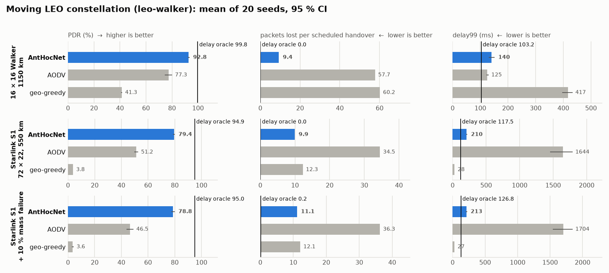
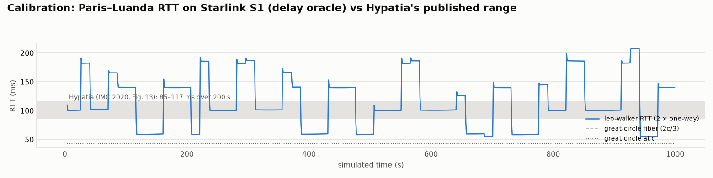

# Satellite suite: the moving constellation (leo-walker)

**Regime:** a time-varying LEO Walker shell — satellites move, ground stations
hand over, ISLs fail and recover. The static ISL torus that came first is
[isl-grid.md](isl-grid.md); why satellites need their own suite at all is
[network-regimes.md](../../network-regimes.md). The substrate decision is
[ADR-0022](../../adr/0022-satellite-substrate-is-stock-ns3-leo.md).

[← Benchmark index](../../benchmarks.md) · [Metrics](../metrics.md) ·
[Methodology](../methodology.md)

> **Provenance — measured at `0b5a65ad`.** Seventeen `satellite-benchmark.yml`
> dispatches with `harness=leo-walker`, one arm per dispatch, on
> `ghcr.io/danieljoppi/ns3:3.48` (default profile), 20 seeds each. Every cell
> carries its run id on its first line and its full `##CONFIG##` line, and
> every cell passes `scenario_check.py` (the #297 handover-clock and
> outage-accounting rules) as committed.
>
> | cell | anthocnet | aodv | olsr | geo-greedy | oracle | oracle-delay |
> |---|---|---|---|---|---|---|
> | `walker16` | [37827387100](https://github.com/danieljoppi/AntHocNet/actions/runs/37827387100) | [37827390737](https://github.com/danieljoppi/AntHocNet/actions/runs/37827390737) | [37827395914](https://github.com/danieljoppi/AntHocNet/actions/runs/37827395914) | [37827410383](https://github.com/danieljoppi/AntHocNet/actions/runs/37827410383) | [37827401516](https://github.com/danieljoppi/AntHocNet/actions/runs/37827401516) | [37827405771](https://github.com/danieljoppi/AntHocNet/actions/runs/37827405771) |
> | `starlink1` | [37827426356](https://github.com/danieljoppi/AntHocNet/actions/runs/37827426356) | [37827430778](https://github.com/danieljoppi/AntHocNet/actions/runs/37827430778) |  | [37827443695](https://github.com/danieljoppi/AntHocNet/actions/runs/37827443695) | [37827433965](https://github.com/danieljoppi/AntHocNet/actions/runs/37827433965) | [37827439616](https://github.com/danieljoppi/AntHocNet/actions/runs/37827439616) |
> | `starlink1-storm` | [37827449496](https://github.com/danieljoppi/AntHocNet/actions/runs/37827449496) | [37827453949](https://github.com/danieljoppi/AntHocNet/actions/runs/37827453949) |  | [37827467035](https://github.com/danieljoppi/AntHocNet/actions/runs/37827467035) | [37827458721](https://github.com/danieljoppi/AntHocNet/actions/runs/37827458721) | [37827462965](https://github.com/danieljoppi/AntHocNet/actions/runs/37827462965) |
> | `hypatia` calibration | | | | | | [37827470132](https://github.com/danieljoppi/AntHocNet/actions/runs/37827470132) |
>
> Cells: `results/cells/leo-<cell>-<arm>.txt`. **Every leo-walker
> number measured before `0b5a65ad` is superseded** — see
> [the pairing bug](#the-cross-plane-pairing-bug-and-the-superseded-runs).

## The cells

All cells: 4 ground-to-ground CBR flows (2 kbit/s each) between six cities
(New York, London, São Paulo, Johannesburg, Tokyo, Sydney), 300 s, minimum
elevation 25°, link delays re-read from ECEF distance every 0.1 s, ISL failure
overlay at 1 % (mean outage 2 s), 10 Mbps links. The handover clock fires
at second 12 of every 15 s — the Starlink reconfiguration interval measured
by Tanveer et al. (WWW 2024), and the phase the LENS trace below confirms.

| cell | shell | what it adds |
|---|---|---|
| `walker16` | 16 planes × 16 sats, 1150 km, 53°, phasing 1 | a small Walker-delta shell: 256 satellites, long hops |
| `starlink1` | 72 × 22, 550 km, 53°, phasing 39 — Starlink shell 1 | the real shell size: 1584 satellites, ~25-hop paths |
| `starlink1-storm` | as `starlink1` | a 10 % mass satellite failure at t = 150 s |

Arms:

- **anthocnet** — this repository, defaults.
- **aodv** — stock ns-3 AODV, the reactive baseline every other suite uses.
- **olsr** — stock ns-3 OLSR, the proactive link-state baseline. walker16
  only (see below).
- **geo-greedy** — an *idealised* greedy geographic comparator: each hop goes
  to the neighbour nearest the destination's serving satellite, with perfect
  global position knowledge and no control traffic. It stands for the
  position-based family the satellite literature proposes, at its best case.
- **oracle** — the precomputed shortest-hop control (#196), re-solved every
  1 s (the oracle module's default `RecomputeInterval`). A delivery bound,
  not a delay bound: one hop count covers links of very different lengths.
- **oracle-delay** — the same oracle with `Metric=delay`: Dijkstra on current
  channel delays, re-solved every 0.1 s on walker16 (`oracleInterval=0`
  follows `--delayUpdate`) and every 1 s on S1 to keep CI time bounded. This
  is the latency bound, and the Hypatia-style control.

OLSR runs on walker16 only. On S1's 1584 nodes its topology flooding is the
practical limit of the harness, not of the substrate (ADR-0022, criterion 5):
even the 256-node walker16 cell took 5 h 54 min of CI for 20 seeds.

## Headline



- **AntHocNet beats AODV on every cell, by more as the shell grows:** +15.5 pp
  PDR on walker16, +28.2 pp on Starlink S1, +32.3 pp under the S1 storm — all
  20 of 20 seeds, Wilcoxon p = 1.9e-06 — with lower mean delay on every cell.
- **The handover is where the difference lives.** AntHocNet loses 9.4–11.2
  packets per scheduled handover; AODV 34.5–57.7. The oracles, which re-solve
  on the new topology instantly, lose ~0.
- **The gap to the bound grows with path length.** AntHocNet is 7.0 pp under
  the delay oracle on walker16 (~9 hops) and 15.5 pp under it on S1 (~25
  hops). That is the residual a 25-hop ant has to cover between two 15 s
  reconfigurations.
- **Greedy geographic forwarding is not a viable comparator on a Walker
  grid**, even idealised — see [the geo-greedy verdict](#the-geo-greedy-verdict).

Tables below are the output of
`python3 ns3/tools/leo-summary.py walker16 starlink1 starlink1-storm`, pasted
unedited; rerun it on the committed cells to reproduce every number.

### `walker16`

| arm | seeds | PDR % | mean delay (ms) | delay99 (ms, boot) | NRL | refused at source % |
|---|---|---|---|---|---|---|
| anthocnet | 20 | 92.84 ± 0.40 | 67.33 ± 1.18 | 140.5 [131.4, 150.9] | 97.63 ± 1.69 | 0.00 |
| aodv | 20 | 77.34 ± 2.58 | 71.97 ± 0.95 | 125.4 [123.0, 128.6] | 92.84 ± 3.24 | 0.00 |
| olsr | 20 | 83.88 ± 0.53 | 67.37 ± 0.47 | 124.7 [123.5, 125.8] | 306.59 ± 1.87 | 2.91 |
| geo-greedy | 20 | 41.35 ± 0.19 | 76.91 ± 2.07 | 417.3 [396.9, 432.2] | 0.00 ± 0.00 | 0.00 |
| *oracle* (bound) | 20 | 98.35 ± 0.12 | 69.85 ± 0.09 | 123.2 [123.0, 123.5] | 0.00 ± 0.00 | 0.00 |
| *oracle-delay* (bound) | 20 | 99.79 ± 0.03 | 61.56 ± 0.05 | 103.2 [103.0, 103.6] | 0.00 ± 0.00 | 0.00 |

AntHocNet − arm, paired per seed (95 % t-CI, Wilcoxon p):

| vs | n | Δ PDR (pp) | Δ mean delay (ms) |
|---|---|---|---|
| aodv | 20 | +15.50 [+12.91, +18.09], p=1.9e-06 | -4.64 [-6.20, -3.07], p=1.3e-05 |
| olsr | 20 | +8.96 [+8.36, +9.56], p=9.6e-05 | -0.04 [-1.34, +1.26], p=0.94 |
| geo-greedy | 20 | +51.50 [+51.06, +51.94], p=9.6e-05 | -9.57 [-12.09, -7.05], p=3.8e-06 |

Handover metric family (sums over seeds; outage = ≥ 3 consecutive lost send attempts):

| arm | startup n / lost | scheduled n / lost | unplanned n / lost | massfail n / lost | other n / lost | lost per scheduled handover | median outage, scheduled (s) | median outage, unplanned (s) |
|---|---|---|---|---|---|---|---|---|
| anthocnet | 1 / 3 | 257 / 2062 | 649 / 4329 | 0 / 0 | 10 / 74 | 9.37 | 2.00 | 1.75 |
| aodv | 2 / 17 | 232 / 12695 | 509 / 7256 | 0 / 0 | 106 / 1223 | 57.70 | 3.25 | 2.25 |
| olsr | 80 / 2789 | 259 / 6009 | 551 / 5685 | 0 / 0 | 55 / 543 | 27.31 | 5.25 | 2.12 |
| geo-greedy | 80 / 41274 | 41 / 13236 | 75 / 998 | 0 / 0 | 0 / 0 | 60.16 | 92.00 | 2.12 |
| oracle | 0 / 0 | 1 / 4 | 252 / 830 | 0 / 0 | 4 / 15 | 0.02 | 1.00 | 0.75 |
| oracle-delay | 0 / 0 | 0 / 0 | 0 / 0 | 0 / 0 | 0 / 0 | 0.00 | — | — |

| arm | hop changes / flow / min | mean hops (delivered) |
|---|---|---|
| anthocnet | 2.07 | 9.29 |
| aodv | 0.76 | 9.05 |
| olsr | 0.83 | 8.65 |
| geo-greedy | 0.84 | 6.33 |
| oracle | 1.02 | 8.72 |
| oracle-delay | 1.08 | 8.76 |

AODV's and OLSR's lower delay99 on walker16 (125 vs 140 ms) is survivorship:
they deliver 15.5 and 9.0 pp fewer packets, and the ones they drop are the
ones a detour would have made late.

**OLSR, the proactive baseline, sits between AODV and AntHocNet.** AntHocNet
delivers +8.96 pp more (20 of 20 seeds, p = 9.6e-05) at the same mean delay
(−0.04 ms, p = 0.94), with a third of OLSR's routing overhead (NRL 97.6 vs
306.6). OLSR loses 27.3 packets per scheduled handover — half of AODV's 57.7,
three times AntHocNet's 9.4 — consistent with its topology view lagging each 15 s
reconfiguration by its TC interval. It is also the only arm that refuses
packets at the source (2.91 %: no route yet), and every one of its 80 flows
(4 × 20 seeds) opens with a startup outage while the first topology floods
converge.

### `starlink1`

| arm | seeds | PDR % | mean delay (ms) | delay99 (ms, boot) | NRL | refused at source % |
|---|---|---|---|---|---|---|
| anthocnet | 20 | 79.43 ± 0.41 | 84.61 ± 1.18 | 210.2 [205.1, 215.7] | 955.45 ± 17.11 | 0.00 |
| aodv | 20 | 51.23 ± 1.18 | 108.48 ± 5.40 | 1644.1 [1461.1, 1785.0] | 904.16 ± 24.48 | 0.00 |
| geo-greedy | 20 | 3.81 ± 0.01 | 25.29 ± 0.45 | 27.9 [27.0, 28.9] | 0.00 ± 0.00 | 0.00 |
| *oracle* (bound) | 20 | 95.27 ± 0.34 | 78.66 ± 0.11 | 132.1 [132.0, 132.2] | 0.00 ± 0.00 | 0.00 |
| *oracle-delay* (bound) | 20 | 94.92 ± 0.22 | 74.89 ± 0.07 | 117.5 [116.7, 118.5] | 0.00 ± 0.00 | 0.00 |

AntHocNet − arm, paired per seed (95 % t-CI, Wilcoxon p):

| vs | n | Δ PDR (pp) | Δ mean delay (ms) |
|---|---|---|---|
| aodv | 20 | +28.20 [+26.90, +29.50], p=1.9e-06 | -23.86 [-28.97, -18.75], p=1.9e-06 |
| geo-greedy | 20 | +75.62 [+75.21, +76.03], p=9.6e-05 | +59.32 [+57.97, +60.68], p=1.9e-06 |

Handover metric family (sums over seeds; outage = ≥ 3 consecutive lost send attempts):

| arm | startup n / lost | scheduled n / lost | unplanned n / lost | massfail n / lost | other n / lost | lost per scheduled handover | median outage, scheduled (s) | median outage, unplanned (s) |
|---|---|---|---|---|---|---|---|---|
| anthocnet | 0 / 0 | 592 / 5958 | 1573 / 11779 | 0 / 0 | 100 / 538 | 9.93 | 2.25 | 1.75 |
| aodv | 6 / 820 | 399 / 20705 | 874 / 16701 | 0 / 0 | 276 / 7453 | 34.51 | 5.12 | 2.25 |
| geo-greedy | 80 / 83762 | 40 / 7353 | 0 / 0 | 0 / 0 | 0 / 0 | 12.26 | 47.00 | — |
| oracle | 2 / 7 | 7 / 27 | 693 / 2354 | 0 / 0 | 17 / 66 | 0.04 | 1.00 | 0.75 |
| oracle-delay | 1 / 4 | 7 / 25 | 782 / 2671 | 0 / 0 | 22 / 77 | 0.04 | 1.00 | 0.75 |

| arm | hop changes / flow / min | mean hops (delivered) |
|---|---|---|
| anthocnet | 8.71 | 25.60 |
| aodv | 1.86 | 20.70 |
| geo-greedy | 1.37 | 4.14 |
| oracle | 2.82 | 23.75 |
| oracle-delay | 2.83 | 24.23 |

On S1, AntHocNet's control overhead (NRL 955) is in the same range as AODV's
(904), on a 1584-node shell — the cost question
[#207](https://github.com/danieljoppi/AntHocNet/issues/207) asked. It pays
for that with 4.7× the hop-change rate of AODV: ants keep moving traffic to
the currently-shortest path, which is what the delay result shows. The oracle
arms' "unplanned" outages are the 1 s re-solve interval on S1 meeting the 1 %
ISL failure overlay — a cost of the bound's sampling, not of routing.

### `starlink1-storm`

| arm | seeds | PDR % | mean delay (ms) | delay99 (ms, boot) | NRL | refused at source % |
|---|---|---|---|---|---|---|
| anthocnet | 20 | 78.79 ± 1.04 | 90.04 ± 1.95 | 212.8 [208.1, 217.4] | 957.42 ± 63.39 | 0.00 |
| aodv | 20 | 46.49 ± 2.39 | 111.82 ± 5.71 | 1704.0 [1546.8, 1841.3] | 1018.31 ± 63.81 | 0.00 |
| geo-greedy | 20 | 3.60 ± 0.48 | 25.48 ± 0.63 | 27.4 [26.6, 28.4] | 0.00 ± 0.00 | 0.00 |
| *oracle* (bound) | 20 | 95.08 ± 0.29 | 81.75 ± 1.34 | 134.2 [133.2, 135.7] | 0.00 ± 0.00 | 0.10 |
| *oracle-delay* (bound) | 20 | 94.95 ± 0.26 | 78.51 ± 1.29 | 126.8 [125.3, 128.4] | 0.00 ± 0.00 | 0.10 |

AntHocNet − arm, paired per seed (95 % t-CI, Wilcoxon p):

| vs | n | Δ PDR (pp) | Δ mean delay (ms) |
|---|---|---|---|
| aodv | 20 | +32.30 [+30.03, +34.57], p=1.9e-06 | -21.78 [-27.29, -16.27], p=1.9e-06 |
| geo-greedy | 20 | +75.19 [+73.94, +76.44], p=1.9e-06 | +64.56 [+62.35, +66.77], p=1.9e-06 |

Handover metric family (sums over seeds; outage = ≥ 3 consecutive lost send attempts):

| arm | startup n / lost | scheduled n / lost | unplanned n / lost | massfail n / lost | other n / lost | lost per scheduled handover | median outage, scheduled (s) | median outage, unplanned (s) |
|---|---|---|---|---|---|---|---|---|
| anthocnet | 0 / 0 | 612 / 6610 | 1528 / 11347 | 42 / 354 | 85 / 510 | 11.15 | 2.25 | 1.75 |
| aodv | 6 / 410 | 378 / 21513 | 716 / 14792 | 18 / 5404 | 297 / 8116 | 36.28 | 5.62 | 2.50 |
| geo-greedy | 80 / 84112 | 38 / 7184 | 2 / 14 | 0 / 0 | 0 / 0 | 12.11 | 47.00 | 1.75 |
| oracle | 3 / 10 | 28 / 124 | 714 / 2428 | 0 / 0 | 11 / 42 | 0.21 | 1.00 | 0.75 |
| oracle-delay | 1 / 4 | 23 / 99 | 776 / 2613 | 0 / 0 | 19 / 68 | 0.17 | 1.00 | 0.75 |

| arm | hop changes / flow / min | mean hops (delivered) |
|---|---|---|
| anthocnet | 9.22 | 26.64 |
| aodv | 1.79 | 20.37 |
| geo-greedy | 0.94 | 5.16 |
| oracle | 3.39 | 24.47 |
| oracle-delay | 3.59 | 24.81 |

The mass failure costs AntHocNet 0.6 pp of PDR and costs AODV 4.7 pp. The
outage table says why: AntHocNet's 42 mass-failure outages lost 354 packets
in total (≈ 8 each, a few seconds of traffic); AODV's 18 lost 5404 (≈ 300
each — the flow stays black until a route error finally reaches the source
and a fresh discovery succeeds).

## Calibration

The model is circular orbits on a spherical Earth with propagation-only
links (ADR-0022), so calibration asks one thing: **are the delays and the
reconfiguration timing the right size?** Two external references answer it.

### Against Hypatia: Paris–Luanda RTT on Starlink S1

Hypatia (Kassing et al., IMC 2020, Fig. 13) publishes the Paris–Luanda RTT
over 200 s on Starlink S1 (72 × 22, 550 km, 53°, minimum elevation 25°, path
re-solved every 100 ms): **85–117 ms**. The `hypatia` cell reproduces that
setup — `--pairs=hypatia`, the delay oracle re-solved every 0.1 s, 1000 s,
one flow.



| | min | p25 | p50 | p75 | p95 | max |
|---|---|---|---|---|---|---|
| leo-walker RTT (ms) | 54.8 | 77.2 | 101.0 | 140.3 | 186.4 | 207.5 |

- **The median sits inside Hypatia's band** (101.0 ms), and 33.5 % of the
  seconds fall inside 85–117 ms. Mean path length is 20.8 hops.
- **The spread is wider than Hypatia's, and the cause is known:** leo-walker
  gives each ground station *one* serving satellite (the highest one) and
  hands over on the 15 s clock; Hypatia lets the station use *any* visible
  satellite and picks whichever minimises the end-to-end path. The plateaus
  in the chart are exactly the 15 s-to-minutes stretches where the serving
  satellite on one end is a poor entry point into the grid (high plateaus) or
  an unusually good one (low plateaus, under Hypatia's floor). The minimum
  (54.8 ms) stays above the 43.4 ms great-circle-at-c line; nothing is
  faster than physics.
- **What this means for the routing results:** the single-serving-satellite
  GSL makes every arm's paths longer than an any-visible-satellite model
  would, by the same geometry for every arm. It moves absolute delays; it
  does not favour an arm.

### Against LENS: one day of a real Starlink dish

LENS (Zhao & Pan, MMSys 2024; dataset CC BY-SA 4.0) publishes raw 10 ms ping
traces from Starlink dishes to their point of presence. One full day of the
`bruhl` dish (Brühl → Frankfurt PoP, 2026-10-06, 24 hourly traces, 5.96 M
pings) summarised by `ns3/tools/lens-calibration.py`; derived numbers only,
in `results/cells/lens-bruhl-20261006.txt`:

| | min | p5 | p50 | p95 | p99 | loss |
|---|---|---|---|---|---|---|
| LENS `bruhl` RTT (ms) | 11.4 | 16.0 | 20.8 | 33.6 | 47.2 | 0.186 % |

- **Delay:** a dish-to-PoP RTT is one bent-pipe hop (dish → satellite →
  gateway, and back). At 550 km and 25° minimum elevation the propagation-only
  floor for that is 7.3–15.0 ms; LENS's 11.4 ms minimum and 20.8 ms median
  are that floor plus scheduling and queueing that leo-walker does not model.
  The model's propagation is the right size; its RTTs are lower bounds.
- **Timing — the 15 s clock is confirmed in the wild:** binning loss by UTC
  second mod 15, LENS loss peaks at **phases 11 and 12** (0.399 % and 0.230 %
  against a ~0.16 % baseline on every other phase), and median RTT steps up
  at phase 12 (21.2 ms against 20.6–20.9). leo-walker's handover clock fires
  at phase 12 (`clock=15 clockOffset=12`). The scheduled-handover class in
  the tables above is placed where the real network puts it.

## The geo-greedy verdict

Greedy geographic forwarding — the family behind most "position-based LEO
routing" proposals — is given every advantage here: perfect global
positions, zero control traffic, a forced uplink at the ground station, and
the destination's *serving satellite* (not the city) as the target. It still
delivers 41 % on walker16 and **under 4 %** on Starlink S1.

The failure is structural, not tuning. On a Walker +grid, a satellite's four
neighbours sit fore/aft in its own plane and left/right in the adjacent
planes. Reaching a destination across planes needs, at some point, a hop
that does not reduce Euclidean distance to the target — the grid is a
lattice wrapped on a sphere, and the greedy-progress invariant has local
minima everywhere planes cross. The 80 "startup" outages per cell are every
flow on every seed (4 × 20) beginning inside a local minimum — stuck for a
median ~200 s on walker16 and for essentially the whole 300 s run on S1,
until satellite motion happens to carry the flow's entry point out of it. Face/perimeter routing, the planar-graph repair that makes
greedy forwarding complete in 2-D, has no 3-D equivalent with the same
guarantee. geo-greedy's low delay on S1 (25 ms) is survivorship: the only
flows it delivers are the short ones.

## The cross-plane pairing bug and the superseded runs

The first leo-walker paired each satellite with the **same slot** in the
neighbouring plane. With Walker phasing, the same slot in the next plane is
not the nearest satellite there: on S1, same-slot cross links averaged
1470.7 km against 636.9 km for the best constant shift, and the Hypatia
calibration came out near 274 ms — almost 3× the published range. An
independent Python model of the shell reproduced the 3×, and the fix
(`0b5a65ad`) picks one constant slot shift for the whole shell — the one
that minimises the mean cross-link length at t = 0 — with the seam plane
pairing to its nearest satellite.

Each cell's `# anchor isl` line records the choice, and the CI smoke
(`tools/checks/check-leo-walker.sh`) asserts it is no longer on average than
same-slot pairing and shorter than the in-plane chord:

| shell | chosen shift (slots) | cross mean | same-slot mean | in-plane chord |
|---|---|---|---|---|
| walker16 | 15 (≡ −1) | 1838.4 km | 2527.3 km | 2934.5 km |
| starlink1 | 21 (≡ −1) | 636.9 km | 1470.7 km | 1969.9 km |

**Every leo-walker cell measured before `0b5a65ad` was re-run and is
superseded;** none was published. The longer cross links had made every arm's
paths longer by the same geometry, so the arm *ranking* did not change — but
the absolute delays and the calibration did, and only the re-run numbers are
on this page.

## Threats to validity

- **Circular orbits, spherical Earth.** The stock ns-3.48 model; no J2, no
  eccentricity, no TLEs. Results are about routing over Walker geometry and
  delay, not orbital precision (ADR-0022).
- **Propagation-only links.** ISL and GSL delays are distance / c; no PHY,
  no weather, no queueing at the gateway. RTTs are lower bounds (the LENS
  comparison above).
- **Single serving satellite per station.** The main cause of the wider
  Hypatia spread; it lengthens every arm's paths alike.
- **The oracle bounds are sampled, not continuous.** The hop oracle re-solves
  every 1 s everywhere; the delay oracle every 0.1 s on walker16 and every
  1 s on S1, to keep the 20-seed CI run bounded. Their "unplanned" outages
  are that sampling meeting the ISL failure overlay.
- **AODV is order-dependent in ns-3** ([#362](https://github.com/danieljoppi/AntHocNet/issues/362)):
  stock AODV keys socket maps on heap addresses. Each arm runs alone in its
  own dispatch here, so no arm's numbers depend on another's.
- **10 Mbps links, 2 kbit/s flows.** The load is light on purpose — this is a
  reachability-under-motion test, not a capacity one. Congestion on ISLs is
  [#206](https://github.com/danieljoppi/AntHocNet/issues/206)'s question.
- **No OLSR on S1.** Proactive link-state flooding on 1584 nodes exceeds the
  CI budget; it is measured on walker16 only, where 20 seeds already took
  5 h 54 min.

## Reproduce

```bash
# one arm of one cell, locally in the 3.48 image (S1, 20 seeds)
./ns3 run "leo-walker --csv --protocols=anthocnet --planes=72 --sats=22 --phasing=39 \
  --altitude=550 --inclination=53 --minElevation=25 --time=300 --runs=20 \
  --islDown=0.01 --oracleInterval=1"

# the tables on this page, from the committed cells
python3 ns3/tools/leo-summary.py walker16 starlink1 starlink1-storm

# the charts
python3 ns3/tools/family-charts.py
```

In CI: `satellite-benchmark.yml`, `harness=leo-walker`, one arm per dispatch,
with the cell's flags in `extraArgs`.
