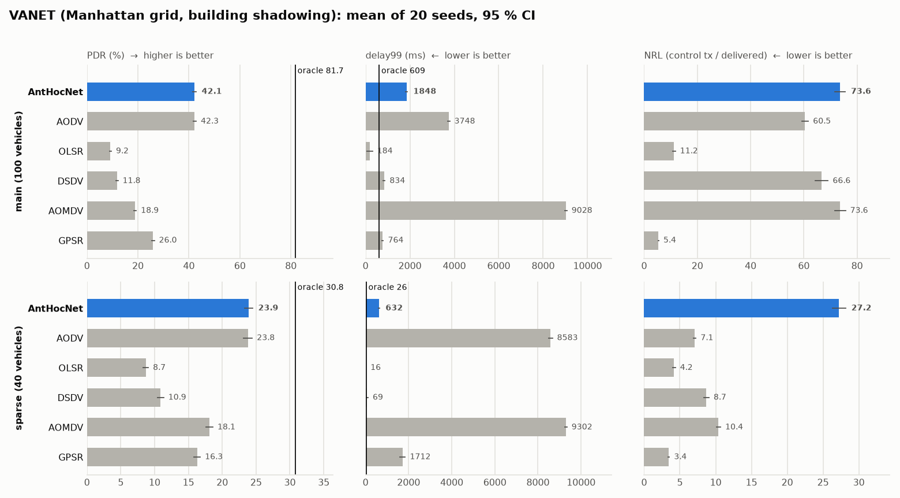

# Scenario: vanet

**Class:** VANET — vehicles on a street grid, corridor-shaped links, buildings that cut line of sight ([#301](https://github.com/danieljoppi/AntHocNet/issues/301), [#488](https://github.com/danieljoppi/AntHocNet/issues/488))

[← Benchmark index](../../benchmarks.md) · [Metrics](../metrics.md) · [Methodology](../methodology.md)

> **A separate family, not a variant of the MANET corpus.** Vehicles move on
> the 1-D streets of a 2-D grid, and the radio is shadowed by the buildings
> between the streets. Its cells are **not comparable** with the MANET pages:
> read them against each other and against the [VANET anchors](#anchors),
> never against the Broch floor, which is RWP-only.

## What it stresses

Vehicular ad hoc networks in a city. Three things change against the open
MANET field:
- **mobility is street-shaped**: vehicles follow streets and turn at
  intersections (the Manhattan model), so relative motion is either
  head-on/same-direction along one street or across an intersection;
- **links are corridor-shaped**: buildings cut line of sight, so a vehicle
  hears its own street far further than the parallel one 200 m away;
- **links break at corners**: a vehicle that turns loses line of sight to its
  former street within metres, so route churn is driven by turns, not only by
  distance.

The preset is built so that the main cell measures **routing**, and a second
cell measures the **partition** regime deliberately.

## Configuration

`--scenario=vanet` (added in [#488](https://github.com/danieljoppi/AntHocNet/issues/488)).
The preset carries **scenario knobs only**
([ADR-0019](../../adr/0019-network-families-change-the-evaluation-not-the-protocol.md)):
no AntHocNet attribute is changed for this family. Every value below can be
overridden on the command line; an explicit flag always wins.

| cell | vehicles | field (m) | grid | mobility | speed (m/s) | flows | per-flow rate | time (s) | propagation |
|---|---|---|---|---|---|---|---|---|---|
| **`vanet`** (main) | **100** | 800 × 800 | 4 × 4 blocks of 200 m, 20 m streets | Manhattan | U(10, 20) | 20 | 4 × 64 B/s (2048 bps) | 900 | urban |
| `vanet` + `--nNodes=40` (sparse) | **40** | 800 × 800 | 4 × 4 blocks of 200 m, 20 m streets | Manhattan | U(10, 20) | 20 | 4 × 64 B/s (2048 bps) | 900 | urban |

Flows start uniformly in [0, 180] s, as in the `paper` preset. The oracle
control recomputes its graph every **100 ms** under this preset, as under
`fanet` (see [the oracle](#the-oracle-on-the-street-grid)).

### The mobility model (`--mobility=manhattan`)

The Manhattan model of Bai, Sadagopan & Helmy (IMPORTANT, INFOCOM 2003)¹, the
model BonnMotion's ManhattanGrid implements:
- streets are the block edges, border streets included;
- a vehicle starts at a uniform point of the street network (placement is
  length-weighted over all streets), heading either way along its street;
- at each intersection it goes straight with probability 0.5 and turns left
  or right with 0.25 each, the probabilities of the Camp, Boleng & Davies
  survey²; a choice that would leave the field is redrawn among the valid
  ones, and a dead end turns the vehicle back;
- each block-to-block leg is driven at a speed drawn U(speedMin, speed);
- there are no pauses, so `--pause` is inert and the preset sets it to 0.

It is built **in the harness**, as `WaypointMobilityModel` waypoints from one
pinned RNG stream, rather than imported as a BonnMotion trace (#488 scope 1
suggested the import). That needs no Java toolchain in CI and no committed
trace files, and a run stays a function of its seed alone (#352): every arm on
a seed sees the identical vehicle schedule.

**Two simplifications against BonnMotion**, recorded rather than hidden:
BonnMotion perturbs speed at every update interval, while this model draws one
speed per leg; and BonnMotion supports pauses, which this model omits.

### The channel (`--propagation=urban`)

The same two-ray ground path loss as the `tworay` arm (identical frequency and
antenna height, so `{tworay, urban}` isolates the buildings alone), plus the
deterministic building shadowing of Sommer, Eckhoff, German & Dressler
(WONS 2011)³, the obstacle model Veins ships:

    L_obs = 9 dB × (walls cut) + 0.4 dB/m × (metres inside buildings)

at Veins' shipped defaults. The buildings are the grid's blocks, inset by half
the street width from each street centre line.

## Provenance

Each value is either **sourced** (a published setup uses it or brackets it)
or **chosen** (a decision this repo made, with its reason). Nothing is left
unlabelled: unsourced constants were the root cause of #88, #169 and #173.

| knob | value | kind | where it comes from |
|---|---|---|---|
| mobility | Manhattan grid, turns 0.5 / 0.25 / 0.25 | sourced | Bai, Sadagopan & Helmy (2003)¹ introduce the Manhattan model for urban movement; the turn probabilities are the Camp, Boleng & Davies survey's². |
| field | 800 × 800 m | chosen, from the sourced setup | Bai & Helmy run their Manhattan patterns on 1000 × 1000 m¹. Under the urban channel that field needs ~145 vehicles to clear the 2·ln(n) connectivity line (#488 preflight), and per-seed cost grows faster than quadratically in nodes (`scale` sweep: 98.2 min/seed at 162 nodes). 800 × 800 m reaches the same line at 95–100 vehicles. |
| blocks | 4 × 4 of 200 m | **assumption** | Neither source fixes a block length. 200 m is a city-block order of magnitude, and it keeps the block shorter than the radio's line-of-sight reach (the two-ray decode radius, 423.3 m), so a street is one or two hops long. Recorded as an assumption, not a citation. |
| street width | 20 m | **assumption** | Sets the building footprint (180 × 180 m per block). Not from a source; recorded as an assumption. |
| vehicles | **100** main, **40** sparse | chosen for density | The #488 preflight's road-network degree (a fixed-seed Monte Carlo over street pairs, applying the two-ray margin against the building loss) is 9.6 at 100 vehicles, clearing 2·ln(100) = 9.2, so the main cell measures routing. At 40 vehicles — Bai & Helmy's count¹ — it is 3.8, right at ln(40) = 3.7, so that cell partitions and is kept as the deliberate sparse cell, like FANET's 250 m cell. The estimate matches the harness: the oracle's measured graph on the main preset averages degree 9.1. |
| speed | U(10, 20) m/s | chosen, inside the sourced envelope | 36–72 km/h, urban arterial speeds, inside the #298 urban envelope (10–40 m/s). Bai & Helmy sweep maxima of 1–60 m/s¹. The 10 m/s floor (`--speedMin`) keeps vehicles moving, since the model has no stops. |
| channel | two-ray + Sommer building shadowing | sourced | Sommer et al. (2011)³: 9 dB per wall, 0.4 dB/m inside, Veins' defaults. **Threat to validity:** those constants were fitted at 5.9 GHz (802.11p), and this harness keeps its 2.4 GHz 802.11b radio (ADR-0019: a family changes the scenario, not the stack). Lower frequency penetrates walls somewhat better, so the buildings here are, if anything, slightly too opaque. |
| traffic | 20 CBR flows, 4 × 64-byte packets/s | sourced | Bai & Helmy (2003)¹: 20 CBR sources, 4 packets/s, 64 bytes. The per-flow rate equals the AntHocNet thesis's (Ducatelle 2007 §5.1.3). Offered load is 41 kbps, about 2 % of the 2 Mbit/s channel, so the cell measures routing, not congestion. |
| time | 900 s | sourced | Bai & Helmy (2003)¹, and the `paper`/`thesis` horizon. |

1. F. Bai, N. Sadagopan, A. Helmy, "IMPORTANT: a framework to systematically
   analyze the Impact of Mobility on Performance of RouTing protocols for
   Adhoc NeTworks", *IEEE INFOCOM 2003*. The values above are read from the
   authors' extended chapter, F. Bai and A. Helmy, "A Survey of Mobility
   Models in Wireless Adhoc Networks", ch. 2
   ([PDF](https://www.cise.ufl.edu/~helmy/papers/IMPORTANT-Mobility-Chapter-2.pdf)),
   §3–§5: 40 nodes, 1000 × 1000 m, 900 s, 250 m range, 20 CBR sources at
   4 packets/s of 64 bytes, maximum speeds 1–60 m/s.
2. T. Camp, J. Boleng, V. Davies, "A survey of mobility models for ad hoc
   network research", *Wireless Communications and Mobile Computing* 2(5),
   483–502 (2002): the Manhattan model's 0.5 straight / 0.25 left / 0.25 right.
3. C. Sommer, D. Eckhoff, R. German, F. Dressler, "A computationally
   inexpensive empirical model of IEEE 802.11p radio shadowing in urban
   environments", *WONS 2011*; the defaults are those of Veins' obstacle
   configuration (`db-per-cut 9`, `db-per-meter 0.4`).

**Preflight** (#488): both cells pass with WARNs only. The family WARN says
the cell is its own family; the sparse cell (`--nodes 40`, degree 3.8 against
ln(40) = 3.7) additionally WARNs that partitions are likely, which is its
purpose.

```
python3 tools/bench/scenario_check.py preflight \
  --nodes 100 --areaX 800 --areaY 800 --blocksX 4 --blocksY 4 \
  --mobility manhattan --propagation urban --speed 20 --pause 0 \
  --flows 20 --cbrBps 2048 --time 900 --pathWindowS 2
```

The street-grid degree replaces the strip/disk rule, which is wrong for a
road network: nodes live on the 1-D edges of a 2-D grid, and a disk around a
vehicle mostly covers buildings. Link lifetime at 20 m/s over the 423 m
line-of-sight reach is about 10.6 hello periods, so `HelloInterval` is not a
concern by the #481 rule; corner turns break links sooner than that bound,
which the route-stability metrics measure directly.

## Anchors

The Broch AODV floor is RWP-only and does not transfer. The VANET family has
its own **analytic** anchors, gated in CI on the 3.42 leg
([`tools/checks/check-anchors.sh`](../../../tools/checks/check-anchors.sh), floors in
[`ns3/tools/anchors.yml`](../../../ns3/tools/anchors.yml)). Both run the preset
shrunk to a single 280 × 280 m block with 20 vehicles, and route only stock
AODV and the oracle control.

| anchor | field | expected (derived) | measured | what it checks |
|---|---|---|---|---|
| `vanet-single-hop` | one block, street width 279 m (a 1 m building) | the 396 m block diagonal is inside the 423.3 m two-ray decode radius and no line of sight is cut, so every flow is one hop: **PDR ≈ 100 %**, oracle **hopsMean ≈ 1.00** | AODV 99.5 %, oracle 99.9 %, hopsMean 1.00 | the street grid, mobility and channel deliver at all |
| `vanet-building` | one block, street width 100 m (a 180 × 180 m building) | vehicles on opposite streets lose line of sight and must relay around a corner: oracle **hopsMean > 1.2**; a channel that ignored the building reads the single-hop 1.00 | AODV 80.4 %, oracle 99.6 %, hopsMean 1.36 | the buildings are honoured end to end |

The harness's own CI smoke (`tools/checks/check-manhattan.sh`) adds the
invariants the anchors do not: every vehicle is on a street at t = 0 and
mid-run, every arm delivers on the urban field, the oracle keeps 66 edges
against 236 under plain two-ray on the same field, and a same-seed rerun is
byte-identical.

## The oracle on the street grid

The oracle derives its graph per pair under this channel (`decode-los-approx`,
[ns3/baselines/oracle/README.md](../../../ns3/baselines/oracle/README.md)): inside the two-ray
decode disk, a pair is a link iff the deterministic two-ray + building chain
reaches the decode floor. Both models are deterministic, so the evaluation
draws no random numbers and every arm sees the same channel. It is flagged
`approx=1` for the same reason as `tworay`: decoding under load also depends
on interference, which no per-pair rule carries.

**Recompute cadence: 100 ms.** At the 1 s default the oracle lagged the
corner turns: on the `vanet-building` field with 10 vehicles it delivered
48.3 % against AODV's 50.5 %, so it was not a bound. At 100 ms it delivers
99.6 % there. The preset sets 100 ms as `fanet` does (#506); the oracle is the
measuring instrument, not a protocol under test, so this is not the
per-family protocol default ADR-0019 forbids.

## Results

**Provenance.** `paper-benchmark.yml` at `main` @ `1a923576` (the #536
merge), image `3.42-opt`, 900 s, seven arms (anthocnet, aodv, olsr, dsdv,
aomdv, gpsr, oracle), seeds 1–20 per cell, `--scenario=vanet` with the
inputs `nNodes`, `areaX=800`, `areaY=800`, `pause=0`, `speed=20`,
`propagation=urban`, `mobility=manhattan`; seeds split with
`extraArgs=--firstRun=N`.

| cell | runs |
|---|---|
| main (100 vehicles, 4 seeds per job) | [37638802518](https://github.com/danieljoppi/AntHocNet/actions/runs/37638802518) (1–4), [37638813699](https://github.com/danieljoppi/AntHocNet/actions/runs/37638813699) (5–8), [37638825144](https://github.com/danieljoppi/AntHocNet/actions/runs/37638825144) (9–12), [37638836620](https://github.com/danieljoppi/AntHocNet/actions/runs/37638836620) (13–16), [37638847225](https://github.com/danieljoppi/AntHocNet/actions/runs/37638847225) (17–20) |
| sparse (40 vehicles, 10 seeds per job) | [37638857489](https://github.com/danieljoppi/AntHocNet/actions/runs/37638857489) (1–10), [37638868141](https://github.com/danieljoppi/AntHocNet/actions/runs/37638868141) (11–20) |

Cells: `docs/benchmarks/cells/vanet-{main,sparse}.txt`, 140 `##RUN##` rows
each (20 seeds × 7 arms). A main-cell job took 3.5–4 h (about 50 min per
seed, seven arms); a sparse-cell job 1.2–2 h.

**`scenario_check.py results`:** WARN only, 0 FAIL, on both cells. The WARNs
are the oracle's `approx=1` and partition notes, the #230 path-diversity
caveat, and the matched-hop note below. One rule did FAIL on the first read
and is now scoped, with its evidence:

> **The oracle matched-hop check is not a bound on a moving street grid.**
> On the packets every arm delivered, the oracle took 2.1–3.0 hops against
> every arm's ~1.0–1.2 (sparse cell, 20/20 seeds). That is the #506
> mechanism #519 scoped off 3-D fields: the "same" packet is forwarded at
> different instants in each arm (AODV's matched `delay99` is 8.8 s), and
> the oracle re-routes per hop over a graph whose links flip at every
> corner. **Control:** the same cell nearly static (0.01–0.02 m/s, 3 seeds)
> gives oracle 2.400 against AntHocNet 2.400, AODV 2.405, OLSR 2.411 — no
> excess, so the per-pair building rule is not missing links.
> `scenario_check.py` now reports the excess once per file as a WARN when
> `##CONFIG##` names `mobility=manhattan` above 1 m/s; a near-static grid
> keeps the FAIL as its control.



_Bars: mean of 20 seeds per arm, AntHocNet highlighted; whiskers: 95 % CI (t for PDR and NRL, bootstrap for delay99). The vertical line is the oracle control (not drawn for NRL, where it is 0 by construction). Drawn by [`ns3/tools/family-charts.py`](https://github.com/danieljoppi/AntHocNet/blob/main/ns3/tools/family-charts.py) from the committed cells `vanet-{main,sparse}.txt`; the tables below carry every value._

Means ± 95 % t-CI half-width over 20 seeds; paired deltas are per seed
(t-CI, Wilcoxon p). Energy is per delivered bit.

### Main cell (`vanet`, 100 vehicles)

| protocol | PDR % | mean delay (ms) | `delay99` (ms) | NRL | energy (mJ/bit) |
|---|---|---|---|---|---|
| **anthocnet** | **42.10 ± 0.66** | 166.5 ± 3.7 | 1848 ± 43 | 73.59 ± 1.94 | 5.52 ± 0.11 |
| aodv | **42.26 ± 0.60** | 318.9 ± 11.2 | 3749 ± 48 | 60.45 ± 1.27 | 5.43 ± 0.09 |
| gpsr | 25.95 ± 0.50 | 34.5 ± 1.4 | 764 ± 42 | 5.39 ± 0.13 | 8.80 ± 0.21 |
| aomdv | 18.87 ± 0.48 | 1060.4 ± 28.9 | 9028 ± 49 | 73.60 ± 2.07 | 11.97 ± 0.35 |
| dsdv | 11.81 ± 0.38 | 23.5 ± 1.3 | 834 ± 44 | 66.64 ± 2.48 | 19.22 ± 0.72 |
| olsr | 9.19 ± 0.38 | 15.4 ± 1.7 | 184 ± 134 | 11.23 ± 0.52 | 24.53 ± 1.14 |
| oracle (100 ms) | 81.70 ± 0.45 | 18.8 ± 1.1 | 609 ± 71 | 0.00 | 2.74 ± 0.03 |

| AntHocNet minus | ΔPDR (pp) | ΔNRL | Δ`delay99` (ms) | Δenergy (mJ/bit) |
|---|---|---|---|---|
| aodv | −0.16 [−0.58, +0.26], p = 0.34 | +13.14 [+11.39, +14.89] | **−1901** [−1953, −1849] | +0.092 [+0.033, +0.151] |
| gpsr | **+16.15** [+15.77, +16.52] | +68.19 [+66.31, +70.08] | +1084 [+1023, +1145] | **−3.277** [−3.401, −3.153] |
| aomdv | **+23.23** [+22.77, +23.68] | −0.01 [−2.32, +2.30], p = 0.99 | **−7180** [−7250, −7110] | **−6.444** [−6.712, −6.175] |
| dsdv | **+30.28** [+29.83, +30.74] | +6.95 [+4.58, +9.32] | +1014 [+939, +1089] | **−13.698** [−14.337, −13.059] |
| olsr | **+32.91** [+32.47, +33.34] | +62.35 [+60.60, +64.11] | +1664 [+1538, +1790] | **−19.003** [−20.051, −17.955] |
| oracle | −39.60 [−40.19, −39.01] | +73.59 | +1239 [+1151, +1326] | +2.780 [+2.688, +2.871] |

Every interval that excludes zero has Wilcoxon p ≤ 9.6 × 10⁻⁵.

### Sparse cell (`--nNodes=40`, the partition regime)

| protocol | PDR % | mean delay (ms) | `delay99` (ms) | NRL | energy (mJ/bit) |
|---|---|---|---|---|---|
| **anthocnet** | **23.90 ± 0.56** | 35.1 ± 1.2 | 632 ± 35 | 27.22 ± 0.93 | 3.79 ± 0.09 |
| aodv | **23.79 ± 0.65** | 906.0 ± 22.9 | 8583 ± 101 | 7.06 ± 0.19 | 3.78 ± 0.10 |
| aomdv | 18.09 ± 0.52 | 1162.5 ± 32.2 | 9302 ± 50 | 10.39 ± 0.30 | 4.95 ± 0.14 |
| gpsr | 16.29 ± 0.46 | 99.4 ± 6.8 | 1712 ± 143 | 3.44 ± 0.10 | 5.80 ± 0.16 |
| dsdv | 10.90 ± 0.45 | 13.4 ± 2.0 | 69 ± 49 | 8.71 ± 0.36 | 8.31 ± 0.34 |
| olsr | 8.68 ± 0.39 | 6.0 ± 1.3 | 16 ± 1 | 4.19 ± 0.19 | 10.38 ± 0.46 |
| oracle (100 ms) | 30.79 ± 0.52 | 6.1 ± 0.3 | 26 ± 1 | 0.00 | 2.90 ± 0.05 |

AntHocNet minus AODV: ΔPDR +0.11 [−0.20, +0.42] (p = 0.32), ΔNRL +20.16
[+19.36, +20.95], Δ`delay99` **−7951 ms** [−8058, −7844]. AntHocNet leads
AOMDV, GPSR, DSDV and OLSR by +5.81, +7.60, +13.01 and +15.21 pp (all
20/20 seeds). Even the oracle delivers only 30.8 %: 40 vehicles on this grid
are partitioned most of the time, which is the cell's purpose.

### What the numbers say

- **AntHocNet ties AODV on delivery in both cells**, and every other arm
  trails both. This is the first family where AntHocNet does not lead
  delivery outright (see the four-family statement below).
- **The tail is AntHocNet's clear win over AODV**: half of AODV's
  `delay99` in the main cell and a thirteenth of it in the sparse cell. AODV
  buffers packets for seconds during route discovery; AntHocNet delivers or
  drops them sooner.
- **Overhead is AntHocNet's cost.** Its NRL is the highest of the arms that
  deliver comparably: +13.1 over AODV in the main cell, 3.9× AODV's in the
  sparse cell. It ties AOMDV's in the main cell. Energy per delivered bit is
  level with AODV (+0.09 mJ/bit) and far below every other arm.
- **The gap to the oracle is the widest of any family: 39.6 pp.** The oracle
  delivers 81.7 % on the same field, so the network is connected most of the
  time; the protocols lose the difference.

**Where AntHocNet's losses go** (drop decomposition, % of offered, mean over
the jobs' compact blocks):

| main cell | route (reconv / repair) | queue | MAC | channel | TTL |
|---|---|---|---|---|---|
| anthocnet | **39.9** (36.2 / 3.9) | 0.0 | 7.1 | 10.3 | 0.7 |
| aodv | 13.2 | 5.6 | 21.4 | 16.7 | 0.7 |
| oracle | 7.5 (partition) | 0.0 | 6.1 | 4.7 | 0.0 |

AntHocNet loses **36 % of its traffic to reconvergence**: packets that
arrive while a route is being re-established and outlive the 200 ms
`ReconvHoldCap`. The route-stability metrics (`##ROUTE##`, #294) show why:

| main cell | median route setup (s) | `pathChg` | median path lifetime (s) | mean hops |
|---|---|---|---|---|
| anthocnet | 1.17 ± 0.18 | 0.38 | **0.75** | 4.83 |
| aodv | 1.76 ± 0.33 | 0.23 | 1.32 | 3.56 |
| oracle | 0.27 | 0.42 | 0.50 | 3.72 |

Read the single-path arms for churn: AntHocNet's `pathChg` and path
lifetime also count its deliberate multipath spreading
([metrics.md](../metrics.md#route-stability-route-294-item-4-ns-3-only-udp-only)). The oracle's
shortest path changes every **0.50 s** (median) and AODV's routes live
**1.32 s**: the topology turns over in about one hello period. Buildings cut
line of sight the moment a vehicle turns a corner, so links die far sooner
than distance alone predicts. The #488 preflight's link-lifetime rule
(range / 2·speed = 10.6 hello periods) reasons from distance and
**overestimates link life on this channel**: it passed a cell whose shortest
paths change twice per hello period. AntHocNet's routes are also longer than
AODV's (4.83 against 3.56 hops), so each crosses more of those breaks.

This is the knob-watchlist item #301 named (`HelloInterval` vs link
lifetime, hold caps under corridor-shaped reconvergence). ADR-0019 forbids
retuning per family before a measured A/B, so it is recorded as a follow-up,
[#537](https://github.com/danieljoppi/AntHocNet/issues/537), not changed here: a paired `HelloInterval` / `ReconvHoldCap` A/B on
this cell, and a corner-aware link-lifetime rule for the preflight.

### Threats to validity

- **Radio.** 802.11b at 2.4 GHz with Sommer constants fitted at 5.9 GHz
  (Provenance). Buildings here are, if anything, slightly too opaque.
- **Mobility.** One speed per block leg and no stops (traffic lights,
  queues): real urban traffic clusters at intersections, which this model
  does not.
- **The oracle.** `approx=1`, and its matched-hop numbers are not a bound on
  a moving grid (above). Its delivery is a bound here: it leads every arm on
  every seed in both cells.
- **No Veins confirmation.** The Veins/SUMO arm (#485) is deferred with the
  OMNeT++ adapter; these numbers are ns-3 only.

## Ranking stability across four families

ADR-0019 keeps the protocol configuration identical across families, so a
ranking that changes between them is a property of the network. Every number
below is on CBR sources (#521) with OLSR's PDR offered-based (#510):
[MANET grid](../grid.md#restated-on-cbr-sources-521) (six cells),
[static mesh](../static-mesh.md#restated-on-cbr-sources-521),
[FANET](fanet.md#restated-on-cbr-sources-521) (main cell) and this page's
VANET main cell.


_Each dot is AntHocNet − AODV averaged over 20 paired seeds, with its 95 % paired t-CI; filled = the CI excludes 0. delay99 is per-seed relative to AODV's (%), since its scale differs by an order of magnitude between families. Drawn by [`ns3/tools/family-charts.py`](https://github.com/danieljoppi/AntHocNet/blob/main/ns3/tools/family-charts.py) from the committed cells listed in the paragraph above._

| | MANET grid (6 cells) | static mesh | FANET main | VANET main |
|---|---|---|---|---|
| delivery leader | **AntHocNet**, every cell | **OLSR** (+0.49 pp over AntHocNet), DSDV +0.32 | **AntHocNet** (+8.32 pp over AODV) | **AntHocNet = AODV** (−0.16 pp, p = 0.34) |
| AntHocNet vs AODV, PDR | +10.8 … +21.0 pp | +2.05 pp | +8.32 pp | tie |
| AntHocNet vs AODV, NRL | −23.9 … −28.0 | −13.0 | −0.36 | **+13.1** |
| AntHocNet vs AODV, `delay99` | −164 … −372 ms | −205 ms | −293 ms | −1901 ms |
| gap to the oracle (PDR) | AntHocNet above it on two-ray; 4.2–8.0 pp below on Nakagami | 0.6 pp | 2.45 pp | **39.6 pp** |
| OLSR | 78–89 % | **leads** | 47.9 % | 9.2 % (last) |

**What holds in every family:**
- **AntHocNet beats AODV on the tail.** `delay99` is lower in every cell of
  every family, from −164 ms (MANET) to −1901 ms (VANET).
- **AntHocNet delivers at least as much as AODV** everywhere, and strictly
  more everywhere except VANET.

**What does not hold:**
- **"AntHocNet delivers most" is a claim about open mobile fields.** It
  holds on every MANET cell and both FANET cells. It fails on the static mesh
  (OLSR and DSDV lead) and becomes a tie with AODV on the street grid.
- **AntHocNet's overhead advantage over AODV vanishes and reverses as links
  shorten.** −24 to −28 NRL on MANET, −13 on the static mesh, −0.4 on FANET,
  **+13.1 on VANET**: its proactive ants and repair keep sampling links that
  live under one hello period.
- **OLSR is the family-sensitive protocol.** It leads the static mesh,
  delivers 78–89 % on MANET, 47.9 % on FANET and 9.2 % on VANET: its
  topology tables hold next hops that a corner or a fast flight has already
  broken.
- **The distance to the oracle grows with how abruptly links break**: none
  on two-ray MANET, a few points on Nakagami and FANET, 39.6 pp when
  buildings cut links at every corner. VANET is where a better protocol has
  the most room, and where AntHocNet's reconvergence (36 % of its losses) is
  the measured place to look.

## Provenance of the numbers

Per-seed rows: `docs/benchmarks/cells/vanet-{main,sparse}.txt`. Statistics
from `stats_util` (t-CI, Wilcoxon signed-rank). Drop decomposition from the
`# drops` compact blocks, `##ROUTE##` from the per-seed rows. Reproduce with
`paper-benchmark.yml` at `1a923576` and the inputs in the provenance block
above.
