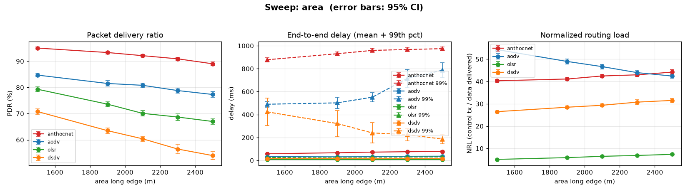

# Sweep: area

**Varies:** area long edge (m) — 1500 → 2500 m, in five points.

[← Benchmark index](../../benchmarks.md) · [Metrics](../metrics.md) · [Methodology](../methodology.md)

## What it varies

Reproduces **Fig. 1** of the AntHocNet paper (Di Caro/Ducatelle/Gambardella,
PPSN VIII 2004, §4): the base scenario's long edge is extended from 1500 m to
2500 m while node count and traffic stay fixed, so paths get longer and the
network gets sparser. Unlike the paper (AODV only), every baseline
(AODV/OLSR/DSDV) is run on identical realisations.

Defined as `SWEEPS["area"]` in
[`ns3/tools/run-scenarios.py`](../../../ns3/tools/run-scenarios.py)
(`scenario=paper`, `areaX` ∈ {1500, 1900, 2100, 2300, 2500}).

## How it is produced

Sweeps are **too heavy for the per-merge `benchmarks` workflow**, which runs
only the discrete scenarios. They come from the manual **Scenario matrix +
charts** workflow (`scenario-matrix.yml`), which renders `sweep-area.png` into
[`docs/benchmarks/`](../) and uploads the classified CSV; the table below is
filled in by pointing `update-benchmarks.py` at that CSV.

Raw sweep data rescued from expired artifacts lives in
[`../campaign/`](../campaign/). The published table below comes from the
**2026-08-03 20-seed re-run** (runs `30850317400` / `30850325638` /
`30850333760` / `30850342363` / `30850350287`, one point per job, `3.42-opt`
image, 900 s, range/disk PHY), rescued as `../campaign/308503*-run.csv` and
summarizable with the `benchmark-results` skill's `sweep_summary.py`. The
superseded pre-#88/#169 5-seed data remains at
[`30031902395-area-disk.csv`](../campaign/30031902395-area-disk.csv).

## Results

> **Post-#88/#169, 20 seeds, 95% CIs.** These numbers include the `T_hop`
> = 3 ms fix ([#88](https://github.com/danieljoppi/AntHocNet/issues/88), PR
> #167) and the reactive-hop-cap removal
> ([#169](https://github.com/danieljoppi/AntHocNet/issues/169), PR #170), and
> meet the [methodology](../methodology.md#statistical-policy-293) runs floor.
> Versus the superseded 5-seed data, AntHocNet's PDR moved **+1.1 to
> +13.3 pp** across the sweep (baselines moved ≤ ~1 pp, consistent with the
> 5→20 run-count change) — the re-run existed precisely because #88/#169
> invalidated the old numbers. The delay99 column carries the known #21 tail
> (remediation tracked in
> [#308](https://github.com/danieljoppi/AntHocNet/issues/308)). Do not quote
> `path_div_*`/`entropy` from these cells
> ([#230](https://github.com/danieljoppi/AntHocNet/issues/230) window
> caveat).

<!-- BENCHMARK-TABLE-START -->
_Sweep `area` — mean of 20 run(s) per point, every baseline on identical realisations; ± is the 95% CI half-width (#293). Generated by `run-scenarios.py`; chart by `make-charts.py`._

| area long edge (m) | protocol | PDR % ±95 | mean delay (ms) ±95 | 99th delay (ms) ±95 | throughput (kbps) | NRL ±95 | jitter (ms) | dOff90 (ms) |
|---:|----------|----------:|--------------------:|--------------------:|------------------:|--------:|------------:|------------:|
| 1500 | anthocnet | 95.0 ± 0.4 | 57.8 ± 1.9 | 878.0 ± 18.8 | 6.24 | 40.325 ± 0.60 | 93.59 | 322.2 |
| 1500 | aodv | 84.7 ± 0.7 | 32.5 ± 1.6 | 489.8 ± 26.1 | 5.59 | 54.292 ± 1.13 | 49.03 | inf |
| 1500 | olsr | 79.3 ± 0.9 | 7.6 ± 0.6 | 25.5 ± 1.1 | 4.96 | 5.095 ± 0.10 | 10.60 | inf |
| 1500 | dsdv | 70.8 ± 1.1 | 15.4 ± 1.2 | 423.1 ± 119.9 | 4.70 | 26.486 ± 0.37 | 25.10 | inf |
| 1900 | anthocnet | 93.3 ± 0.5 | 66.7 ± 2.2 | 930.4 ± 16.5 | 6.12 | 41.114 ± 0.61 | 105.81 | 547.4 |
| 1900 | aodv | 81.5 ± 1.0 | 31.2 ± 1.8 | 501.8 ± 47.6 | 5.38 | 48.982 ± 1.08 | 44.74 | inf |
| 1900 | olsr | 73.6 ± 0.8 | 7.9 ± 0.7 | 28.3 ± 1.3 | 4.43 | 5.894 ± 0.09 | 10.50 | inf |
| 1900 | dsdv | 63.5 ± 1.0 | 15.7 ± 1.2 | 321.3 ± 113.7 | 4.22 | 28.476 ± 0.53 | 23.89 | inf |
| 2100 | anthocnet | 92.1 ± 0.4 | 72.2 ± 3.2 | 959.4 ± 13.6 | 6.05 | 42.481 ± 0.69 | 114.14 | 762.3 |
| 2100 | aodv | 80.8 ± 0.9 | 32.1 ± 1.3 | 551.6 ± 40.7 | 5.33 | 46.659 ± 0.98 | 45.14 | inf |
| 2100 | olsr | 70.1 ± 1.0 | 7.2 ± 0.5 | 28.6 ± 1.0 | 4.09 | 6.476 ± 0.14 | 8.97 | inf |
| 2100 | dsdv | 60.4 ± 1.0 | 14.3 ± 1.1 | 239.2 ± 88.8 | 4.01 | 29.355 ± 0.53 | 21.74 | inf |
| 2300 | anthocnet | 90.9 ± 0.5 | 75.7 ± 3.6 | 967.0 ± 13.7 | 5.96 | 42.992 ± 0.77 | 118.24 | inf |
| 2300 | aodv | 78.8 ± 0.9 | 35.5 ± 2.4 | 715.4 ± 79.8 | 5.20 | 43.966 ± 1.00 | 49.27 | inf |
| 2300 | olsr | 68.7 ± 1.3 | 7.8 ± 0.7 | 29.6 ± 1.1 | 3.90 | 6.870 ± 0.19 | 10.06 | inf |
| 2300 | dsdv | 56.5 ± 1.8 | 15.3 ± 1.4 | 225.1 ± 54.0 | 3.76 | 30.761 ± 1.04 | 22.42 | inf |
| 2500 | anthocnet | 89.0 ± 0.7 | 77.6 ± 3.9 | 974.6 ± 13.7 | 5.84 | 44.214 ± 1.24 | 121.09 | inf |
| 2500 | aodv | 77.3 ± 1.1 | 36.6 ± 2.4 | 786.2 ± 66.4 | 5.10 | 42.434 ± 1.01 | 49.97 | inf |
| 2500 | olsr | 67.0 ± 1.0 | 7.8 ± 0.6 | 30.6 ± 1.5 | 3.68 | 7.357 ± 0.20 | 9.97 | inf |
| 2500 | dsdv | 54.0 ± 1.5 | 16.0 ± 1.8 | 185.4 ± 42.4 | 3.58 | 31.533 ± 0.90 | 22.27 | inf |

<!-- BENCHMARK-TABLE-END -->
