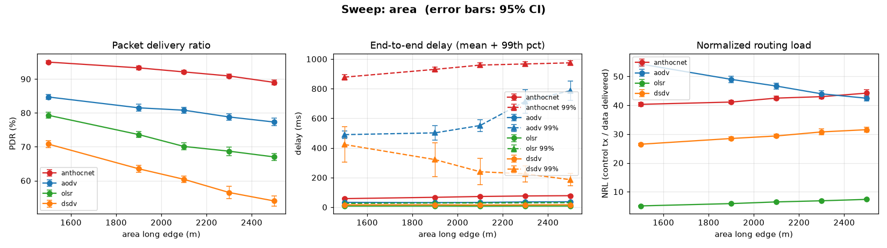
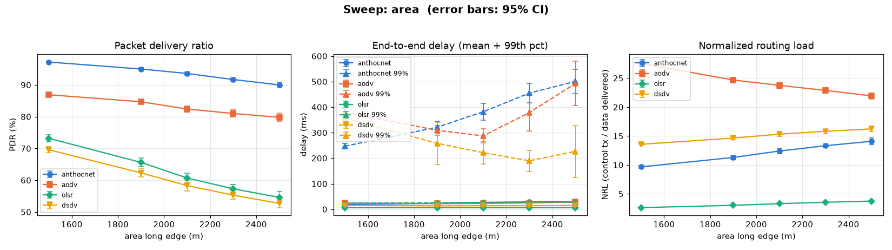

# Sweep: area

**Varies:** area long edge (m) — 1500 → 2500 m, in five points.

[← Benchmark index](../../benchmarks.md) · [Metrics](../metrics.md) · [Methodology](../methodology.md)

> **Provenance — measured at `v1.3.0`.** Every number on this page was
> produced by the campaign runs named below, all of which predate the
> [`v1.3.0`](https://github.com/danieljoppi/AntHocNet/releases/tag/v1.3.0) tag
> (`19009be`). No commit between `v1.2.0` and that tag changes routing
> behaviour, so **checking out `v1.3.0` reproduces these cells.** The default
> branch will not: it has since changed the pheromone weighting
> ([#327](https://github.com/danieljoppi/AntHocNet/issues/327), `betaAnts`/
> `betaData` 2.0 → 20) and the per-seed RNG stream assignment
> ([#352](https://github.com/danieljoppi/AntHocNet/issues/352)), either of
> which moves measured values. See
> [Provenance](../methodology.md#provenance-which-version-a-number-was-measured-at)
> and [#365](https://github.com/danieljoppi/AntHocNet/issues/365).

> **Restated on CBR sources ([#521](https://github.com/danieljoppi/AntHocNet/issues/521)).** The pinned table below was
> measured at half the documented offered load. A 20-seed re-measure on
> `main` is under [Restated on CBR sources](#restated-on-cbr-sources-521)
> at the end of this page.

> **OLSR's PDR column is inflated ([#510](https://github.com/danieljoppi/AntHocNet/issues/510)).** These cells
> predate the fix that counts a send stock OLSR *refuses* at the source as an
> offered packet ([PR #511](https://github.com/danieljoppi/AntHocNet/pull/511), `f480d0ae`). Before it, OLSR's PDR
> was computed over the ticks it had a route for. This page stays pinned to
> `v1.3.0` and is not re-measured. The offered-based value below is estimated
> from this table's own columns, as
> `thrput_olsr / thrput_aodv × PDR_aodv`. On these aggregate rows the same
> estimate reproduces AntHocNet's and DSDV's reported PDR to within ~0.6 pp,
> which is the throughput rounding.
>
> | area long edge (m) | OLSR PDR as published | offered-based estimate | DSDV PDR |
> |---|---|---|---|
> | 1500 | 79.3 | ≈ 75.2 (-4.1) | 70.8 |
> | 1900 | 73.6 | ≈ 67.1 (-6.5) | 63.5 |
> | 2100 | 70.1 | ≈ 62.0 (-8.1) | 60.4 |
> | 2300 | 68.7 | ≈ 59.1 (-9.6) | 56.5 |
> | 2500 | 67.0 | ≈ 55.8 (-11.2) | 54.0 |
>
> The correction reaches 11.2 pp. Where it brings OLSR within about
> 2 pp of DSDV, do not quote an OLSR-over-DSDV ordering from this page.
> AntHocNet, AODV and DSDV are unaffected.

## What it varies

Reproduces **Fig. 1** of the AntHocNet paper (Di Caro/Ducatelle/Gambardella,
PPSN VIII 2004, §4): the base scenario's long edge is extended from 1500 m to
2500 m while node count and traffic stay fixed, so paths get longer and the
network gets sparser. Unlike the paper (AODV only), every baseline
(AODV/OLSR/DSDV) is run on identical realisations.

Defined as `SWEEPS["area"]` in
[`ns3/tools/run-scenarios.py`](../../../ns3/tools/run-scenarios.py)
(`scenario=paper`, `areaX` ∈ {1500, 1900, 2100, 2300, 2500}).

## How it is produced

Sweeps are **too heavy for the per-merge `benchmarks` workflow**, which runs
only the discrete scenarios. They come from the manual **Scenario matrix +
charts** workflow (`scenario-matrix.yml`), which renders `sweep-area.png` into
[`docs/benchmarks/`](../) and uploads the classified CSV; the table below is
filled in by pointing `update-benchmarks.py` at that CSV.

Raw sweep data rescued from expired artifacts lives in
[`results/campaign/`](../../../results/campaign/). The published table below comes from the
**2026-08-03 20-seed re-run** (runs `30850317400` / `30850325638` /
`30850333760` / `30850342363` / `30850350287`, one point per job, `3.42-opt`
image, 900 s, range/disk PHY), rescued as `results/campaign/308503*-run.csv` and
summarizable with the `benchmark-results` skill's `sweep_summary.py`. The
superseded pre-#88/#169 5-seed data remains at
[`30031902395-area-disk.csv`](../../../results/campaign/30031902395-area-disk.csv).

## Results

> **Post-#88/#169, 20 seeds, 95% CIs.** These numbers include the `T_hop`
> = 3 ms fix ([#88](https://github.com/danieljoppi/AntHocNet/issues/88), PR
> #167) and the reactive-hop-cap removal
> ([#169](https://github.com/danieljoppi/AntHocNet/issues/169), PR #170), and
> meet the [methodology](../methodology.md#statistical-policy-293) runs floor.
> Versus the superseded 5-seed data, AntHocNet's PDR moved **+1.1 to
> +13.3 pp** across the sweep (baselines moved ≤ ~1 pp, consistent with the
> 5→20 run-count change) — the re-run existed precisely because #88/#169
> invalidated the old numbers. The delay99 column carries the known #21 tail
> (remediation tracked in
> [#308](https://github.com/danieljoppi/AntHocNet/issues/308)). Do not quote
> `path_div_*`/`entropy` from these cells
> ([#230](https://github.com/danieljoppi/AntHocNet/issues/230) window
> caveat).

<!-- BENCHMARK-TABLE-START -->
_Sweep `area` — mean of 20 run(s) per point, every baseline on identical realisations; ± is the 95% CI half-width (#293). Generated by `run-scenarios.py`; chart by `make-charts.py`._

| area long edge (m) | protocol | PDR % ±95 | mean delay (ms) ±95 | 99th delay (ms) ±95 | throughput (kbps) | NRL ±95 | jitter (ms) | dOff90 (ms) |
|---:|----------|----------:|--------------------:|--------------------:|------------------:|--------:|------------:|------------:|
| 1500 | anthocnet | 95.0 ± 0.4 | 57.8 ± 1.9 | 878.0 ± 18.8 | 6.24 | 40.325 ± 0.60 | 93.59 | 322.2 |
| 1500 | aodv | 84.7 ± 0.7 | 32.5 ± 1.6 | 489.8 ± 26.1 | 5.59 | 54.292 ± 1.13 | 49.03 | inf |
| 1500 | olsr | 79.3 ± 0.9 | 7.6 ± 0.6 | 25.5 ± 1.1 | 4.96 | 5.095 ± 0.10 | 10.60 | inf |
| 1500 | dsdv | 70.8 ± 1.1 | 15.4 ± 1.2 | 423.1 ± 119.9 | 4.70 | 26.486 ± 0.37 | 25.10 | inf |
| 1900 | anthocnet | 93.3 ± 0.5 | 66.7 ± 2.2 | 930.4 ± 16.5 | 6.12 | 41.114 ± 0.61 | 105.81 | 547.4 |
| 1900 | aodv | 81.5 ± 1.0 | 31.2 ± 1.8 | 501.8 ± 47.6 | 5.38 | 48.982 ± 1.08 | 44.74 | inf |
| 1900 | olsr | 73.6 ± 0.8 | 7.9 ± 0.7 | 28.3 ± 1.3 | 4.43 | 5.894 ± 0.09 | 10.50 | inf |
| 1900 | dsdv | 63.5 ± 1.0 | 15.7 ± 1.2 | 321.3 ± 113.7 | 4.22 | 28.476 ± 0.53 | 23.89 | inf |
| 2100 | anthocnet | 92.1 ± 0.4 | 72.2 ± 3.2 | 959.4 ± 13.6 | 6.05 | 42.481 ± 0.69 | 114.14 | 762.3 |
| 2100 | aodv | 80.8 ± 0.9 | 32.1 ± 1.3 | 551.6 ± 40.7 | 5.33 | 46.659 ± 0.98 | 45.14 | inf |
| 2100 | olsr | 70.1 ± 1.0 | 7.2 ± 0.5 | 28.6 ± 1.0 | 4.09 | 6.476 ± 0.14 | 8.97 | inf |
| 2100 | dsdv | 60.4 ± 1.0 | 14.3 ± 1.1 | 239.2 ± 88.8 | 4.01 | 29.355 ± 0.53 | 21.74 | inf |
| 2300 | anthocnet | 90.9 ± 0.5 | 75.7 ± 3.6 | 967.0 ± 13.7 | 5.96 | 42.992 ± 0.77 | 118.24 | inf |
| 2300 | aodv | 78.8 ± 0.9 | 35.5 ± 2.4 | 715.4 ± 79.8 | 5.20 | 43.966 ± 1.00 | 49.27 | inf |
| 2300 | olsr | 68.7 ± 1.3 | 7.8 ± 0.7 | 29.6 ± 1.1 | 3.90 | 6.870 ± 0.19 | 10.06 | inf |
| 2300 | dsdv | 56.5 ± 1.8 | 15.3 ± 1.4 | 225.1 ± 54.0 | 3.76 | 30.761 ± 1.04 | 22.42 | inf |
| 2500 | anthocnet | 89.0 ± 0.7 | 77.6 ± 3.9 | 974.6 ± 13.7 | 5.84 | 44.214 ± 1.24 | 121.09 | inf |
| 2500 | aodv | 77.3 ± 1.1 | 36.6 ± 2.4 | 786.2 ± 66.4 | 5.10 | 42.434 ± 1.01 | 49.97 | inf |
| 2500 | olsr | 67.0 ± 1.0 | 7.8 ± 0.6 | 30.6 ± 1.5 | 3.68 | 7.357 ± 0.20 | 9.97 | inf |
| 2500 | dsdv | 54.0 ± 1.5 | 16.0 ± 1.8 | 185.4 ± 42.4 | 3.58 | 31.533 ± 0.90 | 22.27 | inf |

<!-- BENCHMARK-TABLE-END -->

## Restated on CBR sources (#521)

> **Re-measured on constant-bit-rate sources.** Until
> [#521](https://github.com/danieljoppi/AntHocNet/issues/521) every source ran ns-3's default 1 s on / 1 s off, so the
> pinned table above was taken at half the documented offered load. That
> table stays as the dated `v1.3.0` record.
>
> **Provenance.** `main` @ `3edbab6a`, `3.42-opt`, 900 s, range/disk PHY,
> 20 seeds per point, one point per `scenario-matrix` job: runs
> [37233283127](https://github.com/danieljoppi/AntHocNet/actions/runs/37233283127) (1500), [37233284897](https://github.com/danieljoppi/AntHocNet/actions/runs/37233284897) (1900), [37233286413](https://github.com/danieljoppi/AntHocNet/actions/runs/37233286413) (2100), [37233288164](https://github.com/danieljoppi/AntHocNet/actions/runs/37233288164) (2300) and
> [37233289720](https://github.com/danieljoppi/AntHocNet/actions/runs/37233289720) (2500).
> Rescued as `results/campaign/<run>-run.csv` (aggregate) and
> `<run>-run-runs.csv` (per seed).
> `scenario_check.py results`: 0 FAIL; the WARNs are the #230 path-diversity
> window caveat and route-flap reorder notes. OLSR's PDR is offered-based
> ([#510](https://github.com/danieljoppi/AntHocNet/issues/510)), so the estimate table at the top of this page does not apply
> to this block.
>
> **Attribution.** This is not a CBR-only A/B. `3edbab6a` also carries
> every change after `v1.3.0` that the provenance note names (#327
> pheromone weighting, #352 RNG streams), plus #510 (OLSR accounting) and
> #522 (TTL compensation). `sweep_summary.py --vs` the pinned CSVs reports
> its baseline control as FAIL, as expected: every arm's offered load
> doubled. Quote this block's within-point orderings and paired deltas,
> not its difference from the pinned table.
>
> _Sweep `area` — mean of 20 run(s) per point, every baseline on identical realisations; ± is the 95% CI half-width (#293). Rendered with `update-benchmarks.py`'s sweep builder from the rescued CSVs._
>
> 
>
> | area long edge (m) | protocol | PDR % ±95 | mean delay (ms) ±95 | 99th delay (ms) ±95 | throughput (kbps) | NRL ±95 | jitter (ms) | dOff90 (ms) |
> |---:|----------|----------:|--------------------:|--------------------:|------------------:|--------:|------------:|------------:|
> | 1500 | anthocnet | 97.2 ± 0.2 | 18.4 ± 0.7 | 247.0 ± 10.0 | 12.80 | 9.660 ± 0.26 | 27.64 | 47.2 |
> | 1500 | aodv | 86.9 ± 0.6 | 24.4 ± 0.7 | 380.1 ± 13.1 | 11.45 | 27.531 ± 0.38 | 36.85 | inf |
> | 1500 | olsr | 73.2 ± 1.1 | 6.1 ± 0.5 | 23.6 ± 0.8 | 9.64 | 2.620 ± 0.04 | 7.94 | inf |
> | 1500 | dsdv | 69.6 ± 0.9 | 14.7 ± 0.8 | 357.7 ± 83.2 | 9.17 | 13.566 ± 0.17 | 23.25 | inf |
> | 1900 | anthocnet | 95.0 ± 0.4 | 23.3 ± 1.0 | 321.4 ± 23.0 | 12.52 | 11.293 ± 0.34 | 34.93 | 137.3 |
> | 1900 | aodv | 84.7 ± 0.7 | 22.0 ± 0.8 | 309.2 ± 19.0 | 11.16 | 24.679 ± 0.49 | 31.52 | inf |
> | 1900 | olsr | 65.6 ± 1.3 | 6.1 ± 0.5 | 25.4 ± 1.0 | 8.64 | 3.026 ± 0.07 | 7.51 | inf |
> | 1900 | dsdv | 62.3 ± 1.2 | 13.4 ± 0.7 | 258.3 ± 82.2 | 8.21 | 14.639 ± 0.30 | 20.24 | inf |
> | 2100 | anthocnet | 93.6 ± 0.5 | 26.5 ± 1.5 | 381.9 ± 33.1 | 12.32 | 12.403 ± 0.47 | 39.50 | 166.2 |
> | 2100 | aodv | 82.4 ± 1.0 | 22.8 ± 1.5 | 287.4 ± 27.6 | 10.85 | 23.749 ± 0.54 | 30.95 | inf |
> | 2100 | olsr | 60.7 ± 1.6 | 6.5 ± 0.5 | 27.0 ± 1.3 | 7.99 | 3.313 ± 0.08 | 7.95 | inf |
> | 2100 | dsdv | 58.3 ± 1.6 | 13.9 ± 1.0 | 221.7 ± 45.2 | 7.67 | 15.314 ± 0.41 | 20.23 | inf |
> | 2300 | anthocnet | 91.7 ± 0.5 | 28.8 ± 1.0 | 454.9 ± 37.3 | 12.08 | 13.316 ± 0.35 | 42.75 | inf |
> | 2300 | aodv | 81.0 ± 1.1 | 25.1 ± 1.8 | 378.6 ± 73.0 | 10.68 | 22.878 ± 0.50 | 32.53 | inf |
> | 2300 | olsr | 57.3 ± 1.3 | 6.0 ± 0.5 | 27.6 ± 1.0 | 7.54 | 3.544 ± 0.08 | 7.06 | inf |
> | 2300 | dsdv | 55.3 ± 1.2 | 14.0 ± 1.3 | 189.8 ± 41.2 | 7.28 | 15.810 ± 0.39 | 19.61 | inf |
> | 2500 | anthocnet | 90.0 ± 0.8 | 30.2 ± 1.5 | 500.8 ± 47.1 | 11.85 | 14.088 ± 0.53 | 44.81 | inf |
> | 2500 | aodv | 79.8 ± 1.3 | 28.1 ± 1.8 | 492.5 ± 87.0 | 10.51 | 21.933 ± 0.53 | 34.47 | inf |
> | 2500 | olsr | 54.6 ± 1.8 | 6.1 ± 0.6 | 27.8 ± 1.7 | 7.19 | 3.756 ± 0.12 | 7.39 | inf |
> | 2500 | dsdv | 52.7 ± 1.4 | 14.7 ± 1.6 | 226.9 ± 101.5 | 6.94 | 16.231 ± 0.43 | 19.64 | inf |
>
> **Paired per-seed deltas** (mean ± 95 % CI half-width, 20 seeds; *ns* =
> the CI spans zero):
>
> | long edge (m) | ΔPDR anthocnet − aodv (pp) | Δ`delay99` anthocnet − aodv (ms) | ΔNRL anthocnet − aodv | ΔPDR olsr − dsdv (pp) |
> |---:|---|---|---|---|
> | 1500 | **+10.3 ± 0.6** | **−133 ± 13** | **−17.87 ± 0.41** | +3.52 ± 0.47 |
> | 1900 | **+10.3 ± 0.6** | +12 ± 31 (ns) | **−13.39 ± 0.49** | +3.25 ± 0.58 |
> | 2100 | **+11.2 ± 0.9** | +95 ± 39 | **−11.35 ± 0.48** | +2.37 ± 0.60 |
> | 2300 | **+10.7 ± 1.2** | +76 ± 92 (ns) | **−9.56 ± 0.45** | +2.00 ± 0.53 |
> | 2500 | **+10.2 ± 0.9** | +8 ± 76 (ns) | **−7.85 ± 0.34** | +1.86 ± 0.52 |
>
> **What holds and what changed versus the pinned table:**
> - **The delivery ordering holds:** AntHocNet > AODV > OLSR > DSDV at
>   every point. AntHocNet's lead over AODV is +10.2 to +11.2 pp, against
>   +10.3 to +12.1 pp pinned. It leads OLSR by +24.0 to +35.4 pp and DSDV
>   by +27.5 to +37.3 pp.
> - **OLSR over DSDV is significant but small** (+1.9 to +3.5 pp). On the
>   pinned page, the #510 estimate put it within ~2 pp at 2100 and 2500 m.
> - **AntHocNet's tail is no longer the worst.** Its `delay99` is 247 to
>   501 ms, against 878 to 975 ms pinned. It is below AODV's at 1500 m,
>   level at 1900/2300/2500 m, and above only at 2100 m. Against DSDV it is
>   below at 1500 m (−111 ± 87 ms), level at 1900 m, and above from
>   2100 m. It is above OLSR's at every point.
> - **AntHocNet's NRL is below AODV's at every point.** Pinned, the two
>   crossed at 2500 m. NRL is per delivered packet, so doubling the offered
>   data lowers every arm's NRL.
