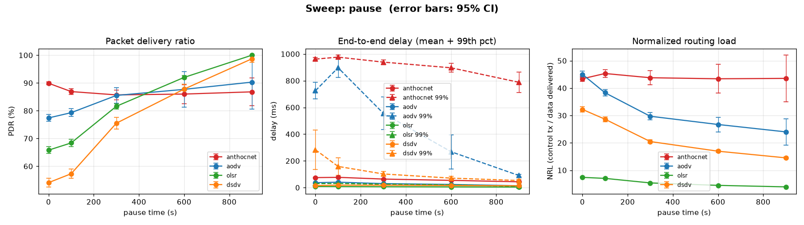

# Sweep: pause

**Varies:** pause time (s) — 0 (constant motion) → 900 s (static).

[← Benchmark index](../../benchmarks.md) · [Metrics](../metrics.md) · [Methodology](../methodology.md)

## What it varies

Reproduces **Fig. 2** of the AntHocNet paper (Di Caro/Ducatelle/Gambardella,
PPSN VIII 2004, §4): the random-waypoint pause time is swept from 0 to 900 s,
taking the field from constant motion to effectively static. It is also the
shape checked by the **Broch pause-sweep** validation anchor — AODV PDR must
*rise* with pause, and DSDV must be worst under high mobility (see
[methodology.md](../methodology.md#validation-anchors-known-expected-results)).
Unlike the paper (AODV only), every baseline is run on identical realisations.

Defined as `SWEEPS["pause"]` in
[`ns3/tools/run-scenarios.py`](../../../ns3/tools/run-scenarios.py)
(`scenario=paper areaX=2500`, `pause` ∈ {0, 100, 300, 600, 900}).

## How it is produced

Sweeps are **too heavy for the per-merge `benchmarks` workflow**, which runs
only the discrete scenarios. They come from the manual **Scenario matrix +
charts** workflow (`scenario-matrix.yml`), which renders `sweep-pause.png` into
[`docs/benchmarks/`](../) and uploads the classified CSV; the table below is
filled in by pointing `update-benchmarks.py` at that CSV.

Raw sweep data rescued from expired artifacts lives in
[`../campaign/`](../campaign/). The published table below comes from the
**2026-08-03 20-seed re-run** (runs `30850273352` / `30850282055` /
`30850291550` / `30850299279` / `30850306777`, one point per job, `3.42-opt`
image, 900 s, range/disk PHY), rescued as `../campaign/308502*-run.csv` and
summarizable with the `benchmark-results` skill's `sweep_summary.py`. The
superseded pre-#88/#169 5-seed data remains at
[`30031904151-pause-disk.csv`](../campaign/30031904151-pause-disk.csv).

## Results

> **Post-#88/#169, 20 seeds, 95% CIs.** These numbers include the `T_hop`
> = 3 ms fix ([#88](https://github.com/danieljoppi/AntHocNet/issues/88), PR
> #167) and the reactive-hop-cap removal
> ([#169](https://github.com/danieljoppi/AntHocNet/issues/169), PR #170), and
> meet the [methodology](../methodology.md#statistical-policy-293) runs floor.
> Versus the superseded 5-seed data, AntHocNet's PDR moved **+9.8 to
> +26.9 pp** across the sweep (baselines moved ≤ ~1.5 pp, consistent with the
> 5→20 run-count change) — the re-run existed precisely because #88/#169
> invalidated the old numbers. The delay99 column carries the known #21 tail
> (remediation tracked in
> [#308](https://github.com/danieljoppi/AntHocNet/issues/308)). Do not quote
> `path_div_*`/`entropy` from these cells
> ([#230](https://github.com/danieljoppi/AntHocNet/issues/230) window
> caveat).

<!-- BENCHMARK-TABLE-START -->
_Sweep `pause` — mean of 20 run(s) per point, every baseline on identical realisations; ± is the 95% CI half-width (#293). Generated by `run-scenarios.py`; chart by `make-charts.py`._

| pause time (s) | protocol | PDR % ±95 | mean delay (ms) ±95 | 99th delay (ms) ±95 | throughput (kbps) | NRL ±95 | jitter (ms) | dOff90 (ms) |
|---:|----------|----------:|--------------------:|--------------------:|------------------:|--------:|------------:|------------:|
| 0 | anthocnet | 89.9 ± 0.6 | 74.6 ± 3.3 | 961.5 ± 10.7 | 5.90 | 43.404 ± 0.87 | 115.93 | inf |
| 0 | aodv | 77.4 ± 1.3 | 36.4 ± 2.1 | 725.3 ± 61.5 | 5.11 | 45.026 ± 1.19 | 50.01 | inf |
| 0 | olsr | 65.8 ± 1.2 | 8.1 ± 0.7 | 29.5 ± 1.3 | 3.67 | 7.395 ± 0.21 | 10.67 | inf |
| 0 | dsdv | 54.1 ± 1.6 | 14.8 ± 1.6 | 283.0 ± 146.6 | 3.60 | 32.211 ± 0.99 | 22.00 | inf |
| 100 | anthocnet | 86.9 ± 1.1 | 76.7 ± 3.9 | 976.2 ± 14.7 | 5.70 | 45.321 ± 1.36 | 121.00 | inf |
| 100 | aodv | 79.3 ± 1.4 | 40.4 ± 3.3 | 897.1 ± 72.2 | 5.23 | 38.289 ± 1.23 | 54.38 | inf |
| 100 | olsr | 68.4 ± 1.4 | 7.6 ± 0.6 | 30.9 ± 1.2 | 3.81 | 7.030 ± 0.20 | 9.13 | inf |
| 100 | dsdv | 57.3 ± 1.7 | 18.0 ± 2.4 | 158.3 ± 66.4 | 3.81 | 28.637 ± 0.87 | 21.59 | inf |
| 300 | anthocnet | 85.7 ± 1.8 | 63.7 ± 3.3 | 939.0 ± 17.1 | 5.63 | 43.775 ± 2.58 | 103.92 | inf |
| 300 | aodv | 85.5 ± 2.9 | 29.7 ± 3.5 | 556.2 ± 122.0 | 5.64 | 29.717 ± 1.36 | 37.33 | inf |
| 300 | olsr | 81.6 ± 1.0 | 6.4 ± 0.5 | 25.6 ± 0.7 | 4.93 | 5.374 ± 0.14 | 5.78 | inf |
| 300 | dsdv | 75.5 ± 2.0 | 17.7 ± 3.1 | 101.8 ± 18.8 | 5.02 | 20.484 ± 0.57 | 18.57 | inf |
| 600 | anthocnet | 86.0 ± 3.4 | 54.0 ± 4.5 | 896.4 ± 32.6 | 5.65 | 43.398 ± 5.24 | 89.93 | inf |
| 600 | aodv | 87.7 ± 6.4 | 23.3 ± 3.6 | 268.2 ± 127.8 | 5.79 | 26.710 ± 2.66 | 26.21 | inf |
| 600 | olsr | 92.0 ± 0.6 | 5.2 ± 0.3 | 20.7 ± 0.5 | 5.84 | 4.478 ± 0.09 | 2.87 | 66.2 |
| 600 | dsdv | 87.8 ± 1.8 | 15.7 ± 2.8 | 70.7 ± 13.5 | 5.83 | 16.954 ± 0.39 | 14.31 | inf |
| 900 | anthocnet | 86.8 ± 5.1 | 43.2 ± 6.7 | 788.0 ± 76.9 | 5.70 | 43.541 ± 8.47 | 74.00 | inf |
| 900 | aodv | 90.3 ± 9.6 | 13.7 ± 1.4 | 90.3 ± 9.7 | 5.96 | 24.010 ± 4.84 | 10.65 | inf |
| 900 | olsr | 100.0 ± 0.0 | 4.0 ± 0.2 | 10.3 ± 0.9 | 6.58 | 3.931 ± 0.07 | 0.35 | 7.7 |
| 900 | dsdv | 98.7 ± 1.3 | 13.6 ± 2.3 | 52.9 ± 10.1 | 6.56 | 14.524 ± 0.34 | 10.18 | inf |

<!-- BENCHMARK-TABLE-END -->
