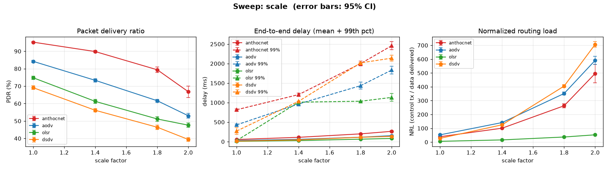

# Sweep: scale

**Varies:** scale factor f — terrain ×f, nodes ×f² (50 → 200 nodes).

[← Benchmark index](../../benchmarks.md) · [Metrics](../metrics.md) · [Methodology](../methodology.md)

## What it varies

Reproduces **Fig. 3** of the AntHocNet paper (Di Caro/Ducatelle/Gambardella,
PPSN VIII 2004, §4): terrain is scaled by f and node count by f², holding node
density roughly constant while the network grows. Unlike the paper (AODV only),
every baseline is run on identical realisations.

Defined as `SWEEPS["scale"]` in
[`ns3/tools/run-scenarios.py`](../../../ns3/tools/run-scenarios.py) — the points
are f = 1.0 (50 nodes, 1500×500 m), 1.4 (98, 2100×700), 1.8 (162, 2700×900) and
2.0 (200, 3000×1000).

## How it is produced

Sweeps are **too heavy for the per-merge `benchmarks` workflow**, which runs
only the discrete scenarios. They come from the manual **Scenario matrix +
charts** workflow (`scenario-matrix.yml`), which renders `sweep-scale.png` into
[`docs/benchmarks/`](../) and uploads the classified CSV; the table below is
filled in by pointing `update-benchmarks.py` at that CSV.

Raw sweep data rescued from expired artifacts lives in
[`../campaign/`](../campaign/) and is summarizable with the `benchmark-results`
skill's `sweep_summary.py`. This sweep is the one that had to be **seed-split**
to run at all — see the provenance note below.

## Results

> **Post-#88/#169, 20 seeds, 95% CIs.** These numbers include the `T_hop`
> = 3 ms fix ([#88](https://github.com/danieljoppi/AntHocNet/issues/88), PR
> #167) and the reactive-hop-cap removal
> ([#169](https://github.com/danieljoppi/AntHocNet/issues/169), PR #170), and
> meet the [methodology](../methodology.md#statistical-policy-293) runs floor.
> AntHocNet leads delivery at **every** point (+11.0 to +17.8 pp, intervals
> disjoint except at f = 2.0) while carrying **16–29 % lower** normalized
> routing load. The `delay99` column is worse throughout — the confirmed #21
> tail, whose remediation is tracked in
> [#308](https://github.com/danieljoppi/AntHocNet/issues/308) against a
> like-for-like `p99Common` target. Do not quote `path_div_*`/`entropy` from
> these cells ([#230](https://github.com/danieljoppi/AntHocNet/issues/230)).

### Provenance — and why this sweep needed seed-splitting

Dispatched 2026-08-03/04 on `main`, `scenario-matrix.yml`, `3.42-opt` image,
900 s, range/disk PHY, 20 seeds per point. The f = 1.0 point ran as a single
20-seed job; the other three **exceed the 340-minute step ceiling at 20 seeds**
and were run as multiple dispatches over disjoint seed ranges using the
`runFirst` input ([#126](https://github.com/danieljoppi/AntHocNet/issues/126),
PR #322), then recombined with
[`pool_runs.py`](../../../.claude/skills/benchmark-results/pool_runs.py), which
recomputes each mean and standard deviation from the pooled per-run rows
([#319](https://github.com/danieljoppi/AntHocNet/issues/319)) rather than
combining split aggregates. Seed coverage was verified as exactly 1–20 per
protocol per point, with no gaps and no duplicates.

| point | nodes | dispatches | run IDs |
|---|---|---|---|
| f = 1.0 | 50 | 1 × 20 seeds | `30854990473` |
| f = 1.4 | 98 | 2 × 10 seeds | `30876649282`, `30876656386` |
| f = 1.8 | 162 | 6 × 3 + 1 × 2 seeds | `30898626094`, `30898635717`, `30898646523`, `30898656990`, `30898670257`, `30898680790`, `30898694649` |
| f = 2.0 | 200 | 18 × 1 + 1 × 2 seeds | `30898711742`, `30898724984`, `30898736284`, `30898751349`, `30898769563`, `30898781607`, `30898794804`, `30898809114`, `30898820499`, `30898833922`, `30898846247`, `30898858035`, `30898870503`, `30898882109`, `30898892224`, `30898902277`, `30898913177`, `30898925485`, `30876743751` |

The pooled inputs are committed as
`../campaign/pooled-scale-{1.4,1.8,2.0}-20260804.csv` (plus their per-run
siblings); f = 1.0 predates #319 and has no sibling, so it is published from
its aggregate CSV unchanged.

**Measured simulation cost per seed, by field size** (900 s sim, `-opt` image,
queue-delayed jobs excluded so these are compute time, not wall-clock):

| point | nodes | min/seed | growth exponent vs previous point |
|---|---|---|---|
| f = 1.0 | 50 | 5.0 | — |
| f = 1.4 | 98 | 20.7 | 2.12 |
| f = 1.8 | 162 | 98.2 | **3.09** |
| f = 2.0 | 200 | 186.4 | **3.04** |

Cost grows **faster than quadratically** in node count, and the exponent itself
rises with field size — which is why the first seed-split attempt (sized by
extrapolating the 50 → 98-node curve) still lost its f = 1.8 and f = 2.0 chunks
to the ceiling, and why the successful sizing came from measuring per-seed cost
*at each field size*. The whole sweep is ≈ 116 CPU-hours. Anyone re-running it
should size chunks from the table above rather than from a two-point
extrapolation.

<!-- BENCHMARK-TABLE-START -->
_Sweep `scale` — mean of 20 run(s) per point, every baseline on identical realisations; ± is the 95% CI half-width (#293). Generated by `run-scenarios.py`; chart by `make-charts.py`._

| scale factor | protocol | PDR % ±95 | mean delay (ms) ±95 | 99th delay (ms) ±95 | throughput (kbps) | NRL ±95 | jitter (ms) | dOff90 (ms) |
|---:|----------|----------:|--------------------:|--------------------:|------------------:|--------:|------------:|------------:|
| 1.0 | anthocnet | 95.2 ± 0.3 | 54.9 ± 2.3 | 816.6 ± 25.7 | 6.25 | 38.963 ± 0.46 | 88.32 | 283.6 |
| 1.0 | aodv | 84.2 ± 0.6 | 29.8 ± 1.5 | 429.1 ± 25.5 | 5.55 | 52.419 ± 0.89 | 43.91 | inf |
| 1.0 | dsdv | 69.1 ± 1.1 | 14.3 ± 0.8 | 270.6 ± 82.1 | 4.59 | 27.127 ± 0.49 | 22.65 | inf |
| 1.0 | olsr | 74.8 ± 0.9 | 7.9 ± 0.4 | 26.5 ± 0.9 | 4.82 | 5.572 ± 0.09 | 10.68 | inf |
| 1.4 | anthocnet | 89.8100 ± 0.6 | 110.3200 ± 4.8 | 1205.3000 ± 42.5 | 5.9485 | 100.4570 ± 2.40 | 164.9015 | inf |
| 1.4 | aodv | 73.3150 ± 1.0 | 59.2650 ± 3.2 | 965.3000 ± 37.6 | 4.8160 | 141.1965 ± 3.47 | 84.7745 | inf |
| 1.4 | dsdv | 56.1500 ± 0.9 | 45.9450 ± 2.8 | 1033.7500 ± 3.9 | 3.7230 | 125.0810 ± 2.19 | 79.5920 | inf |
| 1.4 | olsr | 61.2550 ± 1.2 | 26.8300 ± 1.9 | 1011.2000 ± 1.3 | 4.0215 | 15.8410 ± 0.32 | 42.3560 | inf |
| 1.8 | anthocnet | 79.3600 ± 1.5 | 199.2450 ± 10.6 | 2001.2000 ± 58.3 | 5.2315 | 262.8115 ± 15.74 | 275.6305 | inf |
| 1.8 | aodv | 61.6100 ± 0.8 | 113.6750 ± 5.4 | 1434.7500 ± 89.1 | 4.0890 | 351.4885 ± 10.59 | 158.7285 | inf |
| 1.8 | dsdv | 46.4200 ± 1.3 | 111.3800 ± 3.2 | 2019.4500 ± 3.3 | 3.0610 | 405.1405 ± 10.59 | 188.1960 | inf |
| 1.8 | olsr | 51.1600 ± 1.3 | 62.9050 ± 4.7 | 1035.3500 ± 3.3 | 3.3620 | 36.8080 ± 0.96 | 102.3335 | inf |
| 2.0 | anthocnet | 66.7850 ± 3.2 | 263.9800 ± 18.9 | 2458.6500 ± 102.2 | 4.4380 | 496.3050 ± 66.88 | 346.9210 | inf |
| 2.0 | aodv | 53.0000 ± 1.3 | 153.5750 ± 9.4 | 1834.5500 ± 100.3 | 3.5090 | 591.2330 ± 29.58 | 205.7745 | inf |
| 2.0 | dsdv | 39.4200 ± 1.1 | 134.8800 ± 6.6 | 2138.9000 ± 74.2 | 2.6145 | 706.8070 ± 19.55 | 222.6235 | inf |
| 2.0 | olsr | 47.6050 ± 1.3 | 81.9950 ± 3.9 | 1133.2500 ± 99.5 | 3.1260 | 52.7170 ± 1.53 | 134.3915 | inf |

<!-- BENCHMARK-TABLE-END -->
