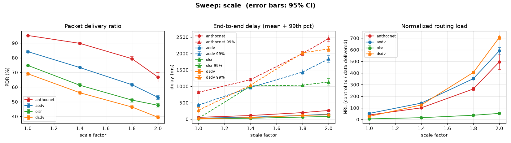
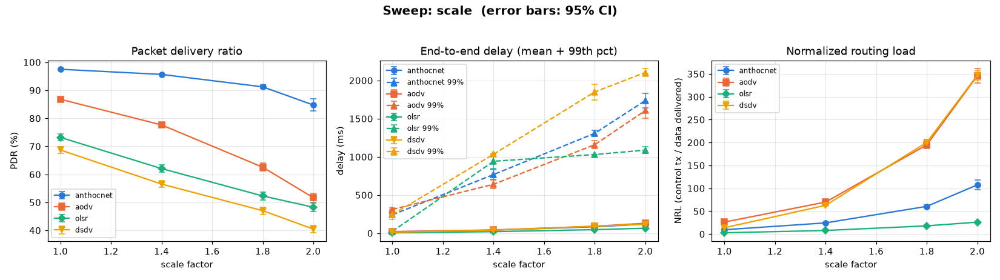

# Sweep: scale

**Varies:** scale factor f — terrain ×f, nodes ×f² (50 → 200 nodes).

[← Benchmark index](../../benchmarks.md) · [Metrics](../metrics.md) · [Methodology](../methodology.md)

> **Provenance — measured at `v1.3.0`.** Every number on this page was
> produced by the campaign runs named below, all of which predate the
> [`v1.3.0`](https://github.com/danieljoppi/AntHocNet/releases/tag/v1.3.0) tag
> (`19009be`). No commit between `v1.2.0` and that tag changes routing
> behaviour, so **checking out `v1.3.0` reproduces these cells.** The default
> branch will not: it has since changed the pheromone weighting
> ([#327](https://github.com/danieljoppi/AntHocNet/issues/327), `betaAnts`/
> `betaData` 2.0 → 20) and the per-seed RNG stream assignment
> ([#352](https://github.com/danieljoppi/AntHocNet/issues/352)), either of
> which moves measured values. See
> [Provenance](../methodology.md#provenance-which-version-a-number-was-measured-at)
> and [#365](https://github.com/danieljoppi/AntHocNet/issues/365).

> **Restated on CBR sources ([#521](https://github.com/danieljoppi/AntHocNet/issues/521)).** The pinned table below was
> measured at half the documented offered load. A 20-seed re-measure on
> `main` is under [Restated on CBR sources](#restated-on-cbr-sources-521)
> at the end of this page.

> **OLSR's PDR column is inflated ([#510](https://github.com/danieljoppi/AntHocNet/issues/510)).** These cells
> predate the fix that counts a send stock OLSR *refuses* at the source as an
> offered packet ([PR #511](https://github.com/danieljoppi/AntHocNet/pull/511), `f480d0ae`). Before it, OLSR's PDR
> was computed over the ticks it had a route for. This page stays pinned to
> `v1.3.0` and is not re-measured. The offered-based value below is estimated
> from this table's own columns, as
> `thrput_olsr / thrput_aodv × PDR_aodv`. On these aggregate rows the same
> estimate reproduces AntHocNet's and DSDV's reported PDR to within ~0.6 pp,
> which is the throughput rounding.
>
> | scale f | OLSR PDR as published | offered-based estimate | DSDV PDR |
> |---|---|---|---|
> | 1.0 | 74.8 | ≈ 73.1 (-1.7) | 69.1 |
> | 1.4 | 61.3 | ≈ 61.2 (-0.0) | 56.1 |
> | 1.8 | 51.2 | ≈ 50.7 (-0.5) | 46.4 |
> | 2.0 | 47.6 | ≈ 47.2 (-0.4) | 39.4 |
>
> The correction reaches 1.7 pp. Where it brings OLSR within about
> 2 pp of DSDV, do not quote an OLSR-over-DSDV ordering from this page.
> AntHocNet, AODV and DSDV are unaffected.

## What it varies

Reproduces **Fig. 3** of the AntHocNet paper (Di Caro/Ducatelle/Gambardella,
PPSN VIII 2004, §4): terrain is scaled by f and node count by f², holding node
density roughly constant while the network grows. Unlike the paper (AODV only),
every baseline is run on identical realisations.

Defined as `SWEEPS["scale"]` in
[`ns3/tools/run-scenarios.py`](../../../ns3/tools/run-scenarios.py) — the points
are f = 1.0 (50 nodes, 1500×500 m), 1.4 (98, 2100×700), 1.8 (162, 2700×900) and
2.0 (200, 3000×1000).

## How it is produced

Sweeps are **too heavy for the per-merge `benchmarks` workflow**, which runs
only the discrete scenarios. They come from the manual **Scenario matrix +
charts** workflow (`scenario-matrix.yml`), which renders `sweep-scale.png` into
[`docs/benchmarks/`](../) and uploads the classified CSV; the table below is
filled in by pointing `update-benchmarks.py` at that CSV.

Raw sweep data rescued from expired artifacts lives in
[`results/campaign/`](../../../results/campaign/) and is summarizable with the `benchmark-results`
skill's `sweep_summary.py`. This sweep is the one that had to be **seed-split**
to run at all — see the provenance note below.

## Results

> **Post-#88/#169, 20 seeds, 95% CIs.** These numbers include the `T_hop`
> = 3 ms fix ([#88](https://github.com/danieljoppi/AntHocNet/issues/88), PR
> #167) and the reactive-hop-cap removal
> ([#169](https://github.com/danieljoppi/AntHocNet/issues/169), PR #170), and
> meet the [methodology](../methodology.md#statistical-policy-293) runs floor.
> AntHocNet leads delivery at **every** point (+11.0 to +17.8 pp, intervals
> disjoint except at f = 2.0) while carrying **16–29 % lower** normalized
> routing load. The `delay99` column is worse throughout — the confirmed #21
> tail, whose remediation is tracked in
> [#308](https://github.com/danieljoppi/AntHocNet/issues/308) against a
> like-for-like `p99Common` target. Do not quote `path_div_*`/`entropy` from
> these cells ([#230](https://github.com/danieljoppi/AntHocNet/issues/230)).

### Provenance — and why this sweep needed seed-splitting

Dispatched 2026-08-03/04 on `main`, `scenario-matrix.yml`, `3.42-opt` image,
900 s, range/disk PHY, 20 seeds per point. The f = 1.0 point ran as a single
20-seed job; the other three **exceed the 340-minute step ceiling at 20 seeds**
and were run as multiple dispatches over disjoint seed ranges using the
`runFirst` input ([#126](https://github.com/danieljoppi/AntHocNet/issues/126),
PR #322), then recombined with
[`pool_runs.py`](../../../tools/bench/pool_runs.py), which
recomputes each mean and standard deviation from the pooled per-run rows
([#319](https://github.com/danieljoppi/AntHocNet/issues/319)) rather than
combining split aggregates. Seed coverage was verified as exactly 1–20 per
protocol per point, with no gaps and no duplicates.

| point | nodes | dispatches | run IDs |
|---|---|---|---|
| f = 1.0 | 50 | 1 × 20 seeds | `30854990473` |
| f = 1.4 | 98 | 2 × 10 seeds | `30876649282`, `30876656386` |
| f = 1.8 | 162 | 6 × 3 + 1 × 2 seeds | `30898626094`, `30898635717`, `30898646523`, `30898656990`, `30898670257`, `30898680790`, `30898694649` |
| f = 2.0 | 200 | 18 × 1 + 1 × 2 seeds | `30898711742`, `30898724984`, `30898736284`, `30898751349`, `30898769563`, `30898781607`, `30898794804`, `30898809114`, `30898820499`, `30898833922`, `30898846247`, `30898858035`, `30898870503`, `30898882109`, `30898892224`, `30898902277`, `30898913177`, `30898925485`, `30876743751` |

The pooled inputs are committed as
`results/campaign/pooled-scale-{1.4,1.8,2.0}-20260804.csv` (plus their per-run
siblings); f = 1.0 predates #319 and has no sibling, so it is published from
its aggregate CSV unchanged.

**Measured simulation cost per seed, by field size** (900 s sim, `-opt` image,
queue-delayed jobs excluded so these are compute time, not wall-clock):

| point | nodes | min/seed | growth exponent vs previous point |
|---|---|---|---|
| f = 1.0 | 50 | 5.0 | — |
| f = 1.4 | 98 | 20.7 | 2.12 |
| f = 1.8 | 162 | 98.2 | **3.09** |
| f = 2.0 | 200 | 186.4 | **3.04** |

Cost grows **faster than quadratically** in node count, and the exponent itself
rises with field size — which is why the first seed-split attempt (sized by
extrapolating the 50 → 98-node curve) still lost its f = 1.8 and f = 2.0 chunks
to the ceiling, and why the successful sizing came from measuring per-seed cost
*at each field size*. The whole sweep is ≈ 116 CPU-hours. Anyone re-running it
should size chunks from the table above rather than from a two-point
extrapolation.

<!-- BENCHMARK-TABLE-START -->
_Sweep `scale` — mean of 20 run(s) per point, every baseline on identical realisations; ± is the 95% CI half-width (#293). Generated by `run-scenarios.py`; chart by `make-charts.py`._

| scale factor | protocol | PDR % ±95 | mean delay (ms) ±95 | 99th delay (ms) ±95 | throughput (kbps) | NRL ±95 | jitter (ms) | dOff90 (ms) |
|---:|----------|----------:|--------------------:|--------------------:|------------------:|--------:|------------:|------------:|
| 1.0 | anthocnet | 95.2 ± 0.3 | 54.9 ± 2.3 | 816.6 ± 25.7 | 6.25 | 38.963 ± 0.46 | 88.32 | 283.6 |
| 1.0 | aodv | 84.2 ± 0.6 | 29.8 ± 1.5 | 429.1 ± 25.5 | 5.55 | 52.419 ± 0.89 | 43.91 | inf |
| 1.0 | dsdv | 69.1 ± 1.1 | 14.3 ± 0.8 | 270.6 ± 82.1 | 4.59 | 27.127 ± 0.49 | 22.65 | inf |
| 1.0 | olsr | 74.8 ± 0.9 | 7.9 ± 0.4 | 26.5 ± 0.9 | 4.82 | 5.572 ± 0.09 | 10.68 | inf |
| 1.4 | anthocnet | 89.8100 ± 0.6 | 110.3200 ± 4.8 | 1205.3000 ± 42.5 | 5.9485 | 100.4570 ± 2.40 | 164.9015 | inf |
| 1.4 | aodv | 73.3150 ± 1.0 | 59.2650 ± 3.2 | 965.3000 ± 37.6 | 4.8160 | 141.1965 ± 3.47 | 84.7745 | inf |
| 1.4 | dsdv | 56.1500 ± 0.9 | 45.9450 ± 2.8 | 1033.7500 ± 3.9 | 3.7230 | 125.0810 ± 2.19 | 79.5920 | inf |
| 1.4 | olsr | 61.2550 ± 1.2 | 26.8300 ± 1.9 | 1011.2000 ± 1.3 | 4.0215 | 15.8410 ± 0.32 | 42.3560 | inf |
| 1.8 | anthocnet | 79.3600 ± 1.5 | 199.2450 ± 10.6 | 2001.2000 ± 58.3 | 5.2315 | 262.8115 ± 15.74 | 275.6305 | inf |
| 1.8 | aodv | 61.6100 ± 0.8 | 113.6750 ± 5.4 | 1434.7500 ± 89.1 | 4.0890 | 351.4885 ± 10.59 | 158.7285 | inf |
| 1.8 | dsdv | 46.4200 ± 1.3 | 111.3800 ± 3.2 | 2019.4500 ± 3.3 | 3.0610 | 405.1405 ± 10.59 | 188.1960 | inf |
| 1.8 | olsr | 51.1600 ± 1.3 | 62.9050 ± 4.7 | 1035.3500 ± 3.3 | 3.3620 | 36.8080 ± 0.96 | 102.3335 | inf |
| 2.0 | anthocnet | 66.7850 ± 3.2 | 263.9800 ± 18.9 | 2458.6500 ± 102.2 | 4.4380 | 496.3050 ± 66.88 | 346.9210 | inf |
| 2.0 | aodv | 53.0000 ± 1.3 | 153.5750 ± 9.4 | 1834.5500 ± 100.3 | 3.5090 | 591.2330 ± 29.58 | 205.7745 | inf |
| 2.0 | dsdv | 39.4200 ± 1.1 | 134.8800 ± 6.6 | 2138.9000 ± 74.2 | 2.6145 | 706.8070 ± 19.55 | 222.6235 | inf |
| 2.0 | olsr | 47.6050 ± 1.3 | 81.9950 ± 3.9 | 1133.2500 ± 99.5 | 3.1260 | 52.7170 ± 1.53 | 134.3915 | inf |

<!-- BENCHMARK-TABLE-END -->

## Restated on CBR sources (#521)

> **Re-measured on constant-bit-rate sources.** Until
> [#521](https://github.com/danieljoppi/AntHocNet/issues/521) every source ran ns-3's default 1 s on / 1 s off, so the
> pinned table above was taken at half the documented offered load. That
> table stays as the dated `v1.3.0` record.
>
> **Provenance.** `main` @ `3edbab6a`, `3.42-opt`, 900 s, range/disk PHY,
> 20 seeds per point (seeds 1–20 at every point, checked per arm). The
> large points were seed-split under the 340-minute step ceiling and pooled
> with [`pool_runs.py`](../../../tools/bench/pool_runs.py):
>
> | point | nodes | dispatches | runs |
> |---|---|---|---|
> | f = 1.0 | 50 | 1 × 20 seeds | [`37233299992`](https://github.com/danieljoppi/AntHocNet/actions/runs/37233299992) |
> | f = 1.4 | 98 | 4 × 5 seeds | `37233301825`, `37233303652`, `37233305484`, `37233307071` |
> | f = 1.8 | 162 | 1 + 6 × 3 + 1 seeds | `37233308743`, `37245033305`, `37245034720`, `37245035898`, `37245037135`, `37245038377`, `37245039781`, `37245041291` |
> | f = 2.0 | 200 | 20 × 1 seed | `37233310160`, `37245045391`, `37245046905`, `37245048133`, `37245049690`, `37245051438`, `37245052799`, `37245054608`, `37245056047`, `37245058610`, `37245060289`, `37245061876`, `37245063971`, `37245065248`, `37245066748`, `37245068375`, `37245069836`, `37245071215`, `37245072592`, `37245073899` |
>
> Pooled inputs: `results/campaign/pooled-scale-{1.4,1.8,2.0}-20261005.csv`
> plus their `-runs.csv` per-seed siblings; f = 1.0 is
> `results/campaign/37233299992-run.csv` unchanged.
> `scenario_check.py results`: 0 FAIL; the 4 WARNs are the #230
> path-diversity window caveat. OLSR's PDR is offered-based ([#510](https://github.com/danieljoppi/AntHocNet/issues/510)), so the
> estimate table at the top of this page does not apply to this block.
>
> **Attribution.** This is not a CBR-only A/B. `3edbab6a` also carries
> every change after `v1.3.0` that the provenance note names (#327
> pheromone weighting, #352 RNG streams), plus #510 (OLSR accounting) and
> #522 (TTL compensation). `sweep_summary.py --vs` the pinned CSVs reports
> its baseline control as FAIL, as expected: every arm's offered load
> doubled. Quote this block's within-point orderings and paired deltas,
> not its difference from the pinned table.
>
> _Sweep `scale` — mean of 20 run(s) per point, every baseline on identical realisations; ± is the 95% CI half-width (#293). Rendered with `update-benchmarks.py`'s sweep builder from the pooled CSVs._
>
> 
>
> | scale factor | protocol | PDR % ±95 | mean delay (ms) ±95 | 99th delay (ms) ±95 | throughput (kbps) | NRL ±95 | jitter (ms) | dOff90 (ms) |
> |---:|----------|----------:|--------------------:|--------------------:|------------------:|--------:|------------:|------------:|
> | 1.0 | anthocnet | 97.5 ± 0.2 | 18.3 ± 0.7 | 241.6 ± 9.4 | 12.84 | 9.394 ± 0.28 | 27.33 | 42.4 |
> | 1.0 | aodv | 86.8 ± 0.8 | 21.7 ± 1.0 | 311.1 ± 19.1 | 11.43 | 26.101 ± 0.47 | 32.24 | inf |
> | 1.0 | olsr | 73.2 ± 1.1 | 6.2 ± 0.5 | 24.6 ± 1.7 | 9.64 | 2.768 ± 0.04 | 7.94 | inf |
> | 1.0 | dsdv | 68.7 ± 1.3 | 13.4 ± 1.0 | 244.4 ± 59.8 | 9.04 | 13.736 ± 0.26 | 20.42 | inf |
> | 1.4 | anthocnet | 95.6650 ± 0.3 | 40.9600 ± 1.8 | 768.5000 ± 59.8 | 12.6005 | 24.3580 ± 0.82 | 59.5450 | 172.3000 |
> | 1.4 | aodv | 77.6350 ± 0.9 | 42.7700 ± 2.2 | 641.0000 ± 54.6 | 10.2240 | 69.9130 ± 1.68 | 61.1590 | inf |
> | 1.4 | dsdv | 56.5350 ± 1.2 | 39.9500 ± 1.9 | 1034.2500 ± 3.7 | 7.4450 | 62.7480 ± 1.25 | 65.0425 | inf |
> | 1.4 | olsr | 62.0600 ± 1.3 | 20.3600 ± 1.4 | 942.5000 ± 94.0 | 8.1730 | 7.7995 ± 0.16 | 31.7790 | inf |
> | 1.8 | anthocnet | 91.2250 ± 0.6 | 84.4500 ± 4.8 | 1308.4500 ± 42.7 | 12.0180 | 60.4910 ± 3.16 | 116.5865 | 690.9350 |
> | 1.8 | aodv | 62.5450 ± 1.4 | 91.5650 ± 4.9 | 1159.3500 ± 50.8 | 8.2380 | 194.7925 ± 7.88 | 117.3245 | inf |
> | 1.8 | dsdv | 47.0450 ± 1.3 | 91.7600 ± 3.7 | 1849.8500 ± 101.8 | 6.1985 | 200.3500 ± 5.37 | 139.2750 | inf |
> | 1.8 | olsr | 52.2950 ± 1.4 | 46.8350 ± 2.8 | 1030.3500 ± 2.9 | 6.8865 | 17.9105 ± 0.52 | 74.4665 | inf |
> | 2.0 | anthocnet | 84.7500 ± 2.1 | 119.6700 ± 7.8 | 1736.8500 ± 98.3 | 11.1610 | 107.4875 ± 10.03 | 158.8540 | 117.1500 |
> | 2.0 | aodv | 51.6850 ± 1.6 | 130.7000 ± 6.0 | 1606.0500 ± 98.4 | 6.8055 | 346.0735 ± 15.48 | 155.4535 | inf |
> | 2.0 | dsdv | 40.4750 ± 1.3 | 119.7900 ± 5.4 | 2105.2500 ± 49.5 | 5.3290 | 347.2165 ± 10.60 | 168.6730 | inf |
> | 2.0 | olsr | 48.2700 ± 1.5 | 65.4800 ± 3.5 | 1088.4500 ± 41.1 | 6.3575 | 26.0180 ± 0.73 | 103.7370 | inf |
>
> **Paired per-seed deltas,** AntHocNet minus each baseline unless named
> (mean ± 95 % CI half-width, 20 seeds; *ns* = the CI spans zero):
>
> | scale f | ΔPDR − aodv (pp) | ΔPDR − olsr (pp) | ΔPDR − dsdv (pp) | Δ`delay99` − aodv (ms) | Δ`delay99` − olsr (ms) | Δ`delay99` − dsdv (ms) | ΔNRL − aodv | ΔPDR olsr − dsdv (pp) |
> |---:|---|---|---|---|---|---|---|---|
> | 1.0 | **+10.8 ± 0.7** | **+24.3 ± 1.0** | **+28.9 ± 1.2** | **−70 ± 20** | +217 ± 9 | −3 ± 59 (ns) | **−16.71 ± 0.37** | +4.57 ± 0.52 |
> | 1.4 | **+18.0 ± 0.7** | **+33.6 ± 1.1** | **+39.1 ± 1.1** | +128 ± 69 | **−174 ± 94** | **−266 ± 59** | **−45.56 ± 1.53** | +5.52 ± 0.53 |
> | 1.8 | **+28.7 ± 1.1** | **+38.9 ± 1.0** | **+44.2 ± 1.0** | +149 ± 71 | +278 ± 41 | **−541 ± 88** | **−134.30 ± 7.04** | +5.25 ± 0.65 |
> | 2.0 | **+33.1 ± 1.6** | **+36.5 ± 1.7** | **+44.3 ± 1.9** | +131 ± 101 | +648 ± 94 | **−368 ± 84** | **−238.59 ± 11.14** | +7.79 ± 0.53 |
>
> **What holds and what changed versus the pinned table:**
> - **The delivery ordering holds:** AntHocNet > AODV > OLSR > DSDV at
>   every point.
> - **AntHocNet's lead over AODV now widens all the way to f = 2.0:**
>   +10.8, +18.0, +28.7, +33.1 pp. Pinned, it peaked at f = 1.8
>   (+17.8 pp) and fell back to +13.8 pp at f = 2.0, where AntHocNet
>   delivered 66.8 %. On CBR AntHocNet delivers 84.8 % at f = 2.0, with a
>   ±2.1 pp CI against ±3.2 pinned.
> - **AntHocNet's NRL stays below AODV's at every point,** and the gap
>   grows with the network: −16.7 at f = 1.0 to −238.6 at f = 2.0.
> - **Tails:** AntHocNet's `delay99` is below AODV's only at f = 1.0; at
>   f = 1.4 to 2.0 it is 128 to 149 ms above. It is below DSDV's at
>   f = 1.4 to 2.0, and below OLSR's only at f = 1.4.
> - **OLSR over DSDV holds** (+4.6 to +7.8 pp, each significant), as the
>   #510 estimate on the pinned page predicted.
> - **OLSR's and DSDV's `delay99` sit near 1030 ms with a CI of a few ms**
>   at f = 1.4 (both) and f = 1.8 (OLSR). The pinned table shows the same
>   plateau, so it predates #521 and is not investigated here.
