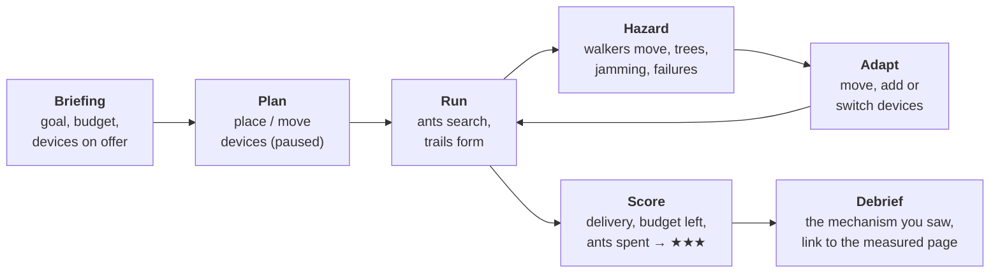
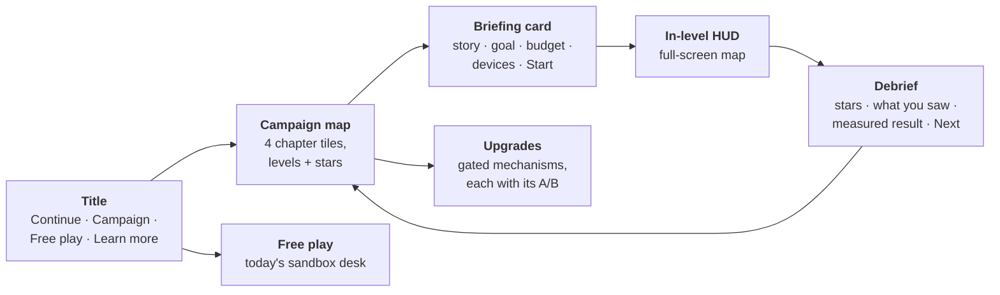
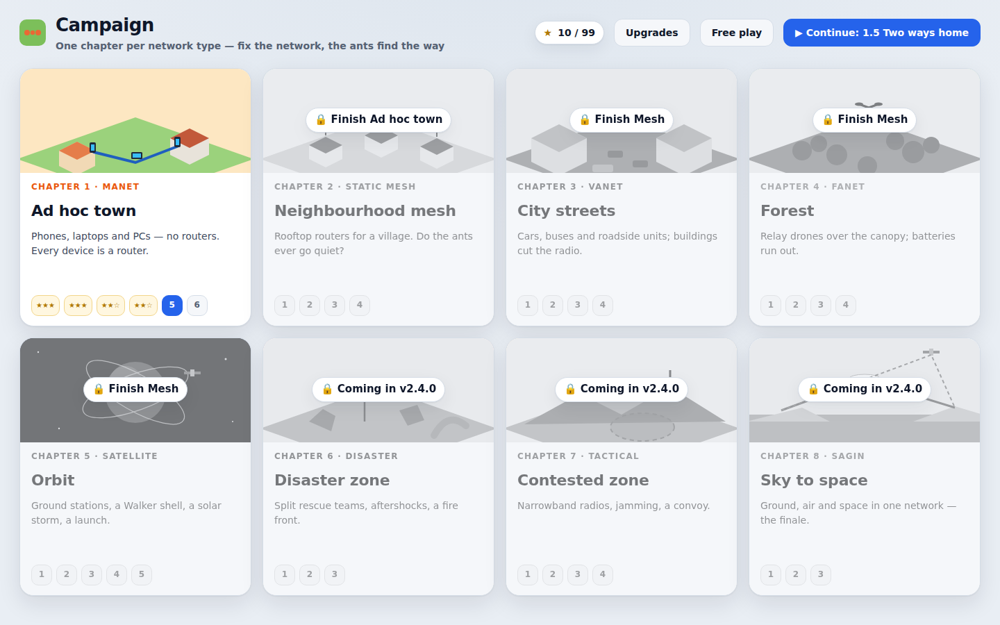
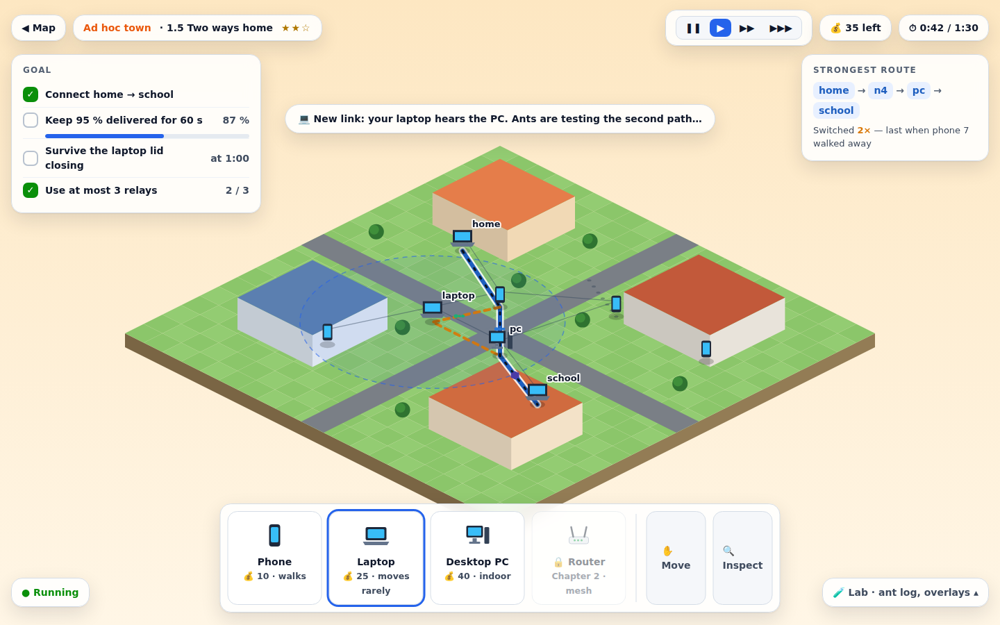
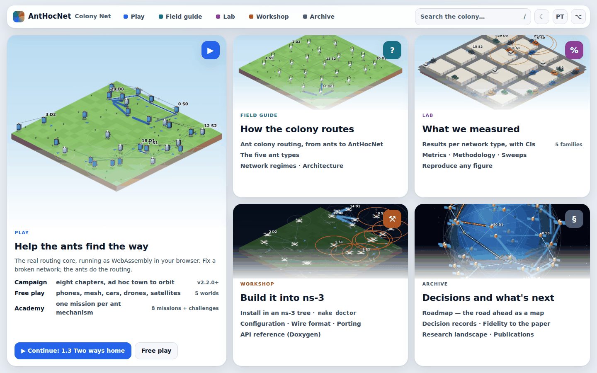
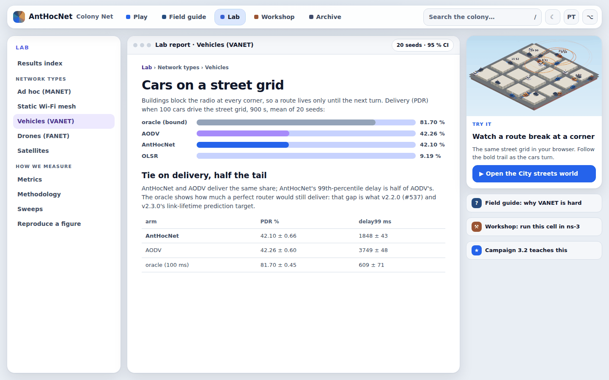
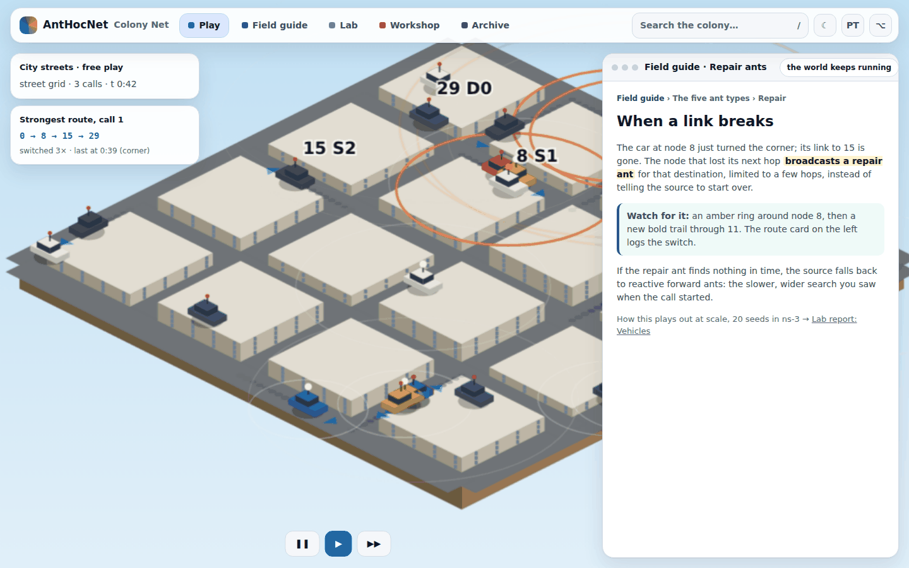
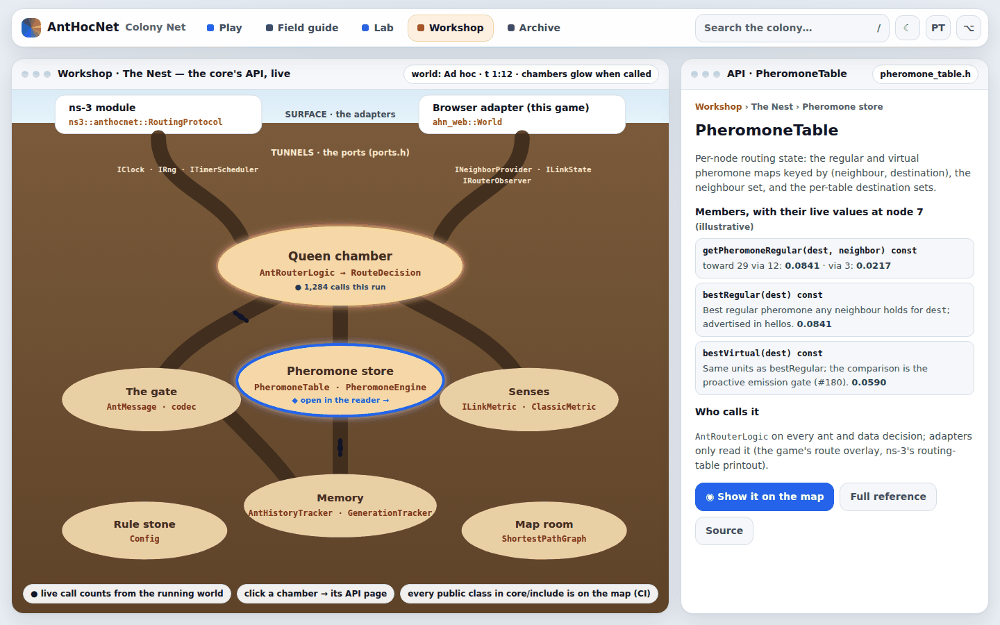
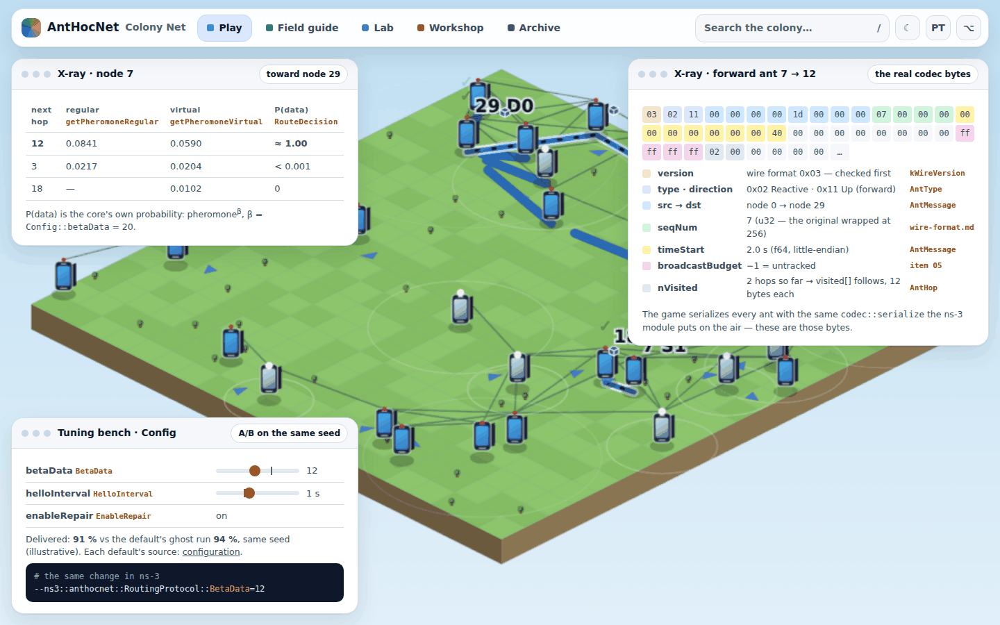
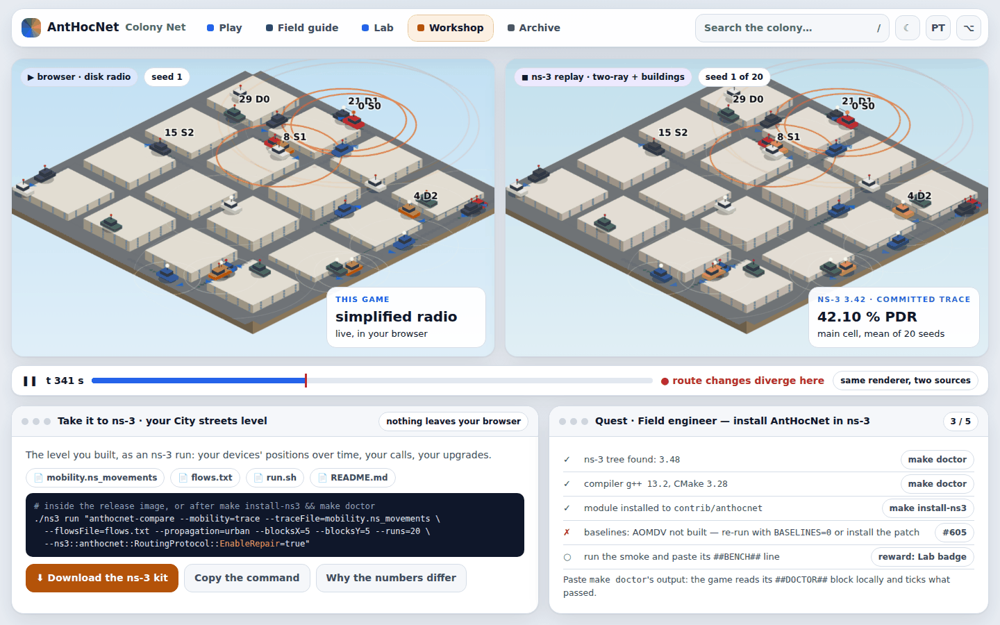

# Learn site: campaign mode (design, accepted 2026-10-09)

> **Status:** accepted 2026-10-09 as part of the
> [post-v2.0.0 replan](roadmap.md#replan-after-v200-accepted-2026-10-09).
> It is tracked by the campaign epic [#562](https://github.com/danieljoppi/AntHocNet/issues/562).
> It builds on the learn site that ships today: the game at the site root, the
> core compiled to WebAssembly, and 8 Academy missions plus 4 world challenges
> ([ADR-0021](adr/0021-the-browser-is-an-adapter.md)).

## 1. The idea in one paragraph

The player is the **network planner**. In each level a network is broken:
- a town where two phones cannot reach each other;
- a street where buildings cut the cars' radio;
- a forest where trees eat the signal;
- an orbit with a gap in coverage.
 The player fixes it by **placing, moving and powering devices**
within a budget. The **ants do the routing**: the player never picks a route.
They watch the reactive ants find the gap they just bridged, the strongest
trail form and switch, and the repair ants patch a break. The campaign covers **every network type the project supports**, one chapter
each:
- Chapter 1 is pure ad hoc: phones, laptops and PCs, with no infrastructure.
- Each later chapter brings in one more network type, with its own devices
  and hazards.
- It ends in space.

This keeps the rule ADR-0021 is built on: **the game teaches the real
protocol.**
- Every route the player sees is chosen by `core/`.
- The player's tools only change the *scenario*: where devices are, which ones
  are on, what the terrain does to the radio.

## 2. Core loop



- **Objectives** are read from core events only, as the missions do today:
  - deliver ≥ X % of a flow between A and B for T seconds;
  - keep the strongest route alive through an event;
  - connect within N seconds.
- **Budget:** each device has a cost. Stars reward money left over and ants
  spent (routing overhead): a cheap, quiet network beats a carpet of relays.
- **Hints** cost a star, as now.
- **Progress** is a chapter map. Levels unlock in order, and stars are saved
  per browser (already done today in `localStorage`).
- **Sandbox** stays: every unlocked device and hazard is available to free
  play.

## 3. The campaign — one chapter per network type

Every network type the repository supports gets a chapter, and so does every
type the replan adds. **Chapter 1 is ad hoc only**: phones, laptops and PCs
talking directly, with no routers and no infrastructure. It is the network
the AntHocNet papers were written for. Each later chapter adds exactly one
network type, so the player meets one new idea at a time.

| # | chapter | network type (measured page) | setting | devices | hazards | ships in |
|---|---|---|---|---|---|---|
| **1** | **Ad hoc town** | MANET ([grid](benchmarks/grid.md)) | streets, houses, a café, a school | phone (walks, short range, cheap), laptop (moved now and then), desktop PC (static, indoor) — all in ad hoc mode | people walk away, a laptop's lid closes | v2.2.0 |
| **2** | **Neighbourhood mesh** | static Wi-Fi mesh ([static mesh](benchmarks/static-mesh.md)) | rooftops of a village | rooftop router, repeater, home gateway | a storm takes a router down; ants that never stop sampling | v2.2.0 |
| **3** | **City streets** | VANET ([VANET](benchmarks/scenarios/vanet.md)) | a Manhattan grid with tall buildings | car, bus (fixed line), roadside unit (static, at intersections) | buildings block the radio at every corner | v2.3.0 |
| **4** | **Forest** | FANET ([FANET](benchmarks/scenarios/fanet.md)) | canopy, clearings, a ranger station | relay drone (3-D, battery), ranger radio, sensor post | foliage cuts range; batteries run out | v2.3.0 |
| **5** | **Orbit** | satellite: ISL grid and moving Walker shell ([isl-grid](benchmarks/satellite/isl-grid.md), [leo-walker](benchmarks/satellite/leo-walker.md)) | the globe and a Walker shell | ground station, launched satellite (choose its plane) | a handover every 15 s, a failed link, a solar storm | v2.3.0 |
| **6** | **Disaster zone** | disaster / emergency response (new family, v2.4.0) | a town after an earthquake, then a wildfire front | rescue-team radio, portable mast, relay drone | teams split and re-merge; aftershocks destroy devices; the fire front advances | v2.4.0 |
| **7** | **Contested zone** | tactical narrowband (v2.4.0 tactical cell; v3.0.0 security) | a valley with roads and ridges | narrowband radio (long range, very low rate), relay vehicle (follows roads), mast | jamming areas, relays going dark, a convoy moving out of range; *adversary nodes from v3.0.0* | v2.4.0 (+ v3.0.0) |
| **8** | **Sky to space** | space-air-ground, SAGIN (new family, v2.4.0) | a remote village, the sea, the city | ground station, HAPS, relay drone, satellites | links in three layers with very different delays | v2.4.0 |

**Unlocking.**
1. Chapter 1, then Chapter 2.
2. Chapters 3, 4 and 5 unlock together, so the player can pick a vehicle, a
   drone or a satellite path next.
3. Chapters 6–8 unlock once Chapter 5 is done, as each one ships.

The Contested zone chapter is about keeping a network up under jamming and
failures. No level rewards harming anyone; the hazards are things that happen
to the radio.

### Levels — what each one teaches

Every level names its mechanism. Each debrief links to the doc page, the API
symbol and the measured result. The work done so far is folded in, not
thrown away:
- the 8 Academy missions become Chapter 1;
- the 4 world challenges become levels in Chapters 2–5, marked ⟲ below.

**Chapter 1: Ad hoc town (MANET).** No routers; every device is a router.

| # | level | the broken network | the player fixes it by | mechanism taught |
|---|---|---|---|---|
| 1.1 | First hello | two phones just out of reach | moving one closer | hellos and neighbour tables |
| 1.2 | Across the street | a call between houses fails | carrying a laptop to the middle as a relay | reactive forward ants, backward ants, pheromone |
| 1.3 | Follow the scent | three neighbours, one call | predicting which way the next packet goes | pheromone^β forwarding |
| 1.4 | The café | phones walk in and out; the call drops | putting a desktop PC where walkers pass | proactive ants; the strongest route switching |
| 1.5 | Two ways home | one laptop carries everything | adding a second path, then the level closes a lid | multipath and repair |
| 1.6 | Rush hour (boss) | three calls, a crowd, a small budget | placement under budget, ≥ 95 % delivery | everything above; the overhead ("ants spent") score |

**Chapter 2: Neighbourhood mesh (static Wi-Fi mesh)**

| # | level | the broken network | the player fixes it by | mechanism taught |
|---|---|---|---|---|
| 2.1 | Rooftops | houses with no link to the gateway | placing rooftop routers | routes found once on a static topology |
| 2.2 | Does it ever go quiet? ⟲ | routes are found, yet ants keep flying | predicting, then unlocking **Quiet mode** | proactive sampling cost on stable links |
| 2.3 | Storm | one router goes down | a repeater that keeps a second path warm | repair in a static network |
| 2.4 | Wire the village (boss) | every house must reach the gateway | covering the village under budget | multipath + overhead score |

**Chapter 3: City streets (VANET)**

| # | level | the broken network | the player fixes it by | mechanism taught |
|---|---|---|---|---|
| 3.1 | Around the corner ⟲ | a link dies as a car turns | watching, then predicting the break | buildings and link lifetime |
| 3.2 | Roadside units | cars lose each other between blocks | placing roadside units at intersections | static relays in a mobile network |
| 3.3 | Bus line | a predictable bus could carry the link | timing roadside units along its route | repair vs predictable mobility; **Look-ahead** upgrade |
| 3.4 | Traffic jam (boss) | a dense, then sparse, street grid | placement for both densities | reconvergence (the #537 finding) |

**Chapter 4: Forest (FANET)**

| # | level | the broken network | the player fixes it by | mechanism taught |
|---|---|---|---|---|
| 4.1 | Under the canopy | trees halve radio range | finding clearings for ranger radios | link quality vs distance |
| 4.2 | Eyes in the sky | a valley no ground radio crosses | flying a relay drone over it; swapping it before the battery dies | 3-D links, link expiry, **Battery saver** |
| 4.3 | Faster than the tables ⟲ | drones at 20 m/s outrun routes | adding drones where routes break | why reactive repair beats stale tables at speed |
| 4.4 | Lost hiker (boss) | a search pattern with gaps | a drone formation that keeps the hiker's radio connected | partitions in a 3-D swarm |

**Chapter 5: Orbit (satellite)**

| # | level | the broken network | the player fixes it by | mechanism taught |
|---|---|---|---|---|
| 5.1 | First contact | a city cannot reach the shell | placing a ground station; watching the 15 s handover | handover; scheduled link changes |
| 5.2 | Across the ocean | two cities, no common satellite | placing ground stations | multi-hop over ISLs; propagation delay; **Long-haul timing** |
| 5.3 | The failed link ⟲ | an ISL fails mid-flow | cutting a link and timing the recovery | reconvergence on a deterministic topology |
| 5.4 | Solar storm | 10 % of satellites fail | nothing to build: watch, then predict | mass-failure repair (the S1 storm cell) |
| 5.5 | Launch window (boss) | a coverage gap | choosing the orbital plane for one extra satellite | why orbits differ; same-plane vs cross-plane links |

**Chapter 6: Disaster zone (v2.4.0)**

| # | level | the broken network | the player fixes it by | mechanism taught |
|---|---|---|---|---|
| 6.1 | Split teams | rescue teams search separate blocks | portable masts that bridge the teams as they move | partition and re-merge |
| 6.2 | Aftershock | devices are destroyed in waves | redundancy placed before the next wave | repair under cascading failure |
| 6.3 | Fire front (boss) | the wildfire advances on the relays | moving the evacuation channel ahead of the fire | everything under time pressure |

**Chapter 7: Contested zone (v2.4.0; 7.4 at v3.0.0)**

| # | level | the broken network | the player fixes it by | mechanism taught |
|---|---|---|---|---|
| 7.1 | Radio silence | narrowband radios: ants compete with data | fewer, better relays | control overhead as the binding cost (NRL) |
| 7.2 | Jammed | a jamming area cuts the valley's links | routing around it with masts on the ridges | link failure and re-discovery |
| 7.3 | Convoy | relay vehicles move along the road | timing and placing masts along it | mobility along roads |
| 7.4 | *Trust no one* (v3.0.0) | an adversary node attracts traffic and drops it | finding it, and enabling **Shield** | blackhole/grayhole attacks; the security profile (ADR-0020) |

**Chapter 8: Sky to space (SAGIN, v2.4.0)**

| # | level | the broken network | the player fixes it by | mechanism taught |
|---|---|---|---|---|
| 8.1 | Three layers | a remote village, a city, and three ways to join them | choosing ground, air (HAPS/drone) or space links | pheromone choosing between very different link delays |
| 8.2 | Ocean crossing | no ground path, the satellite path is slow | a HAPS chain vs the satellite path | delay-aware trails across layers |
| 8.3 | One network (finale) | everything from Chapters 1–7 on one map | connecting all of them under one budget | the whole protocol, every network type |

## 4. Upgrades are real gated mechanisms

A "research" screen unlocks **upgrades**. Each one is a **real default-off
mechanism** from the v2.3.0 release, switched on as a labelled mission knob,
as level 7 ("Keep it fresh") already switches `enableProactive` today. An
upgrade never exists in the game alone: if the core does not have it, the
game does not offer it.

| upgrade | the gated mechanism | where it pays off |
|---|---|---|
| Quiet mode | proactive back-off on stable topologies | Ch 2 Mesh (unlocked in 2.2) |
| Look-ahead | link-lifetime prediction | Ch 3 City streets (3.3), Ch 7 convoy |
| Battery saver | energy-aware link metric (#145) | Ch 4 Forest drones (4.2), Ch 6 |
| Long-haul timing | propagation-dominated timing (#205) | Ch 5 Orbit (5.2), Ch 8 |
| Shield (v3.0.0) | the security profile (#302) | Ch 7 Contested (7.4) |

Each upgrade card shows what the measured A/B found ("on the static mesh,
quiet mode cut ants per packet by …"). This makes the gated-mechanism work
of v2.3.0 visible, and it keeps the [ADR-0019](adr/0019-network-families-change-the-evaluation-not-the-protocol.md)
rule: the defaults stay the paper's, and the upgrade is an explicit, labelled
choice.

## 5. What the browser adapter must add

These are scenario and radio features only: **no routing logic in `web/`**
([web/README.md](https://github.com/danieljoppi/AntHocNet/blob/main/web/README.md)
rules). Each one extends the native-vs-WASM parity gate.

| feature | for | sketch |
|---|---|---|
| device classes with **per-node radio range** | every chapter | link iff `dist ≤ min(range_a, range_b)` on the disk channel; class = range + mobility + sprite |
| **attenuation zones** (polygons that scale range inside them) | Ch 4 canopy, Ch 6 rubble | a range multiplier per zone; deterministic arithmetic only |
| **jamming zones** (links touching the zone fail) | Ch 7 Contested | the urban channel's line-of-sight test, reused |
| **scripted events** (device destroyed / restored at t, zone moves) | Ch 2 storm, Ch 5 solar storm, Ch 6 aftershocks and fire, Ch 7 | the front end schedules `setNodeUp`; a moving zone is a scenario timeline |
| **battery** (a device switches off after its energy budget) | Ch 4, Ch 6 drones | an adapter timer; it never touches routing |
| **orbit binding** (`setMobility` for `Orbit` with plane parameters) | Ch 5 launch window (5.5) | exposes the `MobilityKind::Orbit` that the satellite world already uses |
| **ground stations + handover** | Ch 5 (5.1–5.2), Ch 8 |
| **fixed-route mobility** (a bus line) and **static devices inside a mobile world** | Ch 3 bus, roadside units | waypoints along streets; the Manhattan model already exists |
| **mixed layers in one world** (ground, air, space nodes together) | Ch 8 | one world with disk, 3-D and ISL links; per-node range covers most of it | ground↔satellite links by elevation, as `leo-walker` does, simplified |
| **adversary nodes** | Ch 7 (7.4) | needs the v3.0.0 core profile; not before |

## 6. Front-end work

- **Campaign map:** a chapter-select screen in the city-builder style. Each
  chapter is an illustrated tile, with stars per level and locked chapters
  greyed out.
- **Level format:** levels are data, extending `missions-data.js`. Each one
  holds the world script, budget, device palette, objectives, hazards, hints
  and debrief links.
- **Build palette:** the Build tool becomes a device palette with costs; the
  budget is shown in the status bar.
- **Art:** the new device sprites (laptop, PC, router, ranger radio, sensor
  post, vehicle, mast, ground station, HAPS) go beside the existing phone,
  drone, car and satellite. They are procedural canvas art, no image assets,
  as today. Terrain needs canopy, a fire front, jam fields and ridges.
- **Accessibility:** the existing axe gate (day and night). Every level must be
  playable by keyboard; placement accepts the selected-node arrow keys.
- **Translations** ([#622](https://github.com/danieljoppi/AntHocNet/issues/622)): all text goes through a string layer from the
  first campaign level, so briefings and debriefs are never hard-coded in
  English. Portuguese (pt-BR) is the first second language.
- **Offline and size budget** ([#624](https://github.com/danieljoppi/AntHocNet/issues/624)): the game is cached for offline use
  (classrooms with poor Wi-Fi), and CI fails if the game download grows past
  its budget (starting at 512 KB raw / 160 KB gzipped; 378 KB raw today).

## 7. User interface

The current page is a city-builder **desk**: windows around a map, made for
exploring a sandbox. A campaign needs a **game UI**:
- the map fills the screen;
- the player always knows the goal, the budget and the clock;
- everything else comes in only when needed.

The sandbox keeps today's desk layout, as the "Free play" mode.

### Screens



- **Title.** A full-bleed live scene with ants walking a trail in the
  background. It offers four buttons:
  - Continue (the last level, highlighted);
  - Campaign;
  - Free play;
  - Learn more (the docs).

  This replaces today's welcome card on the front page.
- **Campaign map.** One illustrated tile per chapter, eight in all: Ad hoc
  town → Mesh → City streets / Forest / Orbit → Disaster → Contested → Sky to
  space.
  - Each tile shows its levels as stops on a path, with stars per level.
  - Locked chapters are greyed out, with "finish Ad hoc town to unlock" or
    "coming in v2.4.0".
  - A total-stars counter sits at the top.
- **Briefing card.** A modal over the frozen level. It shows:
  - one line of story ("The café's Wi-Fi died; two friends want to call");
  - the goal, written as a checklist;
  - the budget;
  - the device cards on offer;
  - Start.

  The game starts **paused in Plan phase**, so the player can place devices
  before the clock runs.
- **In-level HUD.** Described below.
- **Debrief.** The stars animate in, with three lines:
  - what happened ("the reactive ants found your laptop relay in 38 ms");
  - the mechanism, with a link to its doc page;
  - the measured result on the real simulator, with a link to the results page.

  Buttons: Retry, Next level, Map.
- **Upgrades.** A card grid of the gated mechanisms. Each card shows:
  - what the mechanism does;
  - the measured A/B number;
  - which chapters it helps;
  - an on/off toggle per level.

### In-level HUD

```
┌──────────────────────────────────────────────────────────────────────────┐
│ ◀ Map   Ad hoc town · 1.4 The café ★★☆   ⏸ ▶ ▶▶      💰 120   ⏱ 0:42 / 1:30 │  top bar
├──────────────────────────────────────────────────────────────────────────┤
│ ┌Goal───────────────┐                                    ┌Strongest route┐│
│ │✓ connect A → B    │                                    │ A→n4→n9→B     ││
│ │◻ 95 % for 60 s 87%│          full-screen map           │ switched 2×   ││
│ │◻ ≤ 3 relays   2/3 │                                    └───────────────┘│
│ └───────────────────┘                                                     │
│                                                                           │
│   toast: "Phone 7 walked out of range. Repair ants are on it."            │
├──────────────────────────────────────────────────────────────────────────┤
│ [📱 Phone 10] [💻 Laptop 25] [🖥 PC 40] [📶 Router 60]   │ ✋ Move │ 🔍 Inspect │  device dock
└──────────────────────────────────────────────────────────────────────────┘
```

- **Top bar:**
  - back to the map;
  - the level name;
  - live stars (the score the player would get if the level ended now);
  - speed controls;
  - the budget;
  - the level clock.
- **Goal tracker (top left):** the objectives as a checklist, each with a live
  progress value. When an objective is met it ticks green with a short
  animation.
- **Route card (top right):** the strongest pheromone route as a hop chain,
  plus a switch counter. It flashes amber when the route switches, the same
  signal as on the map.
- **Device dock (bottom):** device cards with icon, name and cost.
  - Drag a card onto the map, or tap a card and then tap the map.
  - Cards the player cannot afford are greyed out.
  - While a card is dragged, its radio range shows as a ghost ring, so
    placement is a visual decision.
  - Move and Inspect are tools at the end of the dock.
- **Toasts:** one at a time, in plain language, each tied to an event
  ("Phone 7 walked out of range").
- **Inspector:** a slide-in panel when a device is tapped:
  - its routing table;
  - "moving / standing still";
  - its battery, if it has one;
  - a Remove button that refunds part of the cost.
- **The ant log and the overlays** move into a collapsible "Lab" drawer. They
  are for the curious and stay out of the way.

### Feel

- **Feedback for every action.** Placing a device pulses its range ring; a
  new link draws in; reaching an objective plays a short chime. Sound is off
  by default, with a toggle.
- **Plan / Run phases.** The clock waits until the player presses Run, then
  shows "Running". The pause between waves of hazards is the Adapt moment.
- **Readable at a glance.** Status is never shown by colour alone; every
  status also has a shape or a symbol, as today.
- **Mobile first-class:**
  - the dock becomes a bottom sheet;
  - goal and route cards collapse to chips;
  - touch: drag to place, pinch to zoom, two-finger pan.
- **Accessibility:**
  - keyboard: the number keys pick a device; the arrow keys move the
    placement cursor; Enter places;
  - screen readers get a live region for toasts;
  - the axe gate covers every new screen, by day and by night;
  - motion is reduced when the reader asks for it (`prefers-reduced-motion`).
- **Style:** it continues the modern look shipped in #558 (cards, pills,
  glass), with a chapter colour per chapter:
  - Ad hoc town: warm orange;
  - Mesh: teal;
  - City streets: slate;
  - Forest: green;
  - Orbit: indigo;
  - Disaster: red;
  - Contested: amber;
  - Sky to space: sky blue.

The [mockups](#mockups) below show the campaign map and the in-level HUD.

### Mockups

Static mockups, not the implementation. Both are rendered from a standalone
HTML file in the repository's style.





## 8. Tests

- **Smoke** (`web/test/smoke.mjs`): one level per chapter played to the end
  with scripted input, as mission 2 is today.
- **Parity:** every new adapter feature is exercised by a built-in scenario,
  so the native-vs-WASM trace gate covers it.
- **Fairness check:** each level's par solution (the designer's placement)
  must clear its objective on 5 seeds, so a level is never impossible on an
  unlucky seed.

## 9. Release mapping

| release | learn-site work |
|---|---|
| **v2.1.0** | **the whole site is the game** (§10): one top bar and five places across the game, the docs and the API; docs pages as game windows; the in-game reader; two-way links checked in CI. **Workshop** (§11): the Nest (the API as a live nest map) and the install quest |
| **v2.2.0** | the game UI (title, campaign map, briefing, in-level HUD with device dock, debrief; the sandbox kept as Free play); campaign engine (level format, budget, objectives); device classes + per-node range in the adapter; **Chapter 1: Ad hoc town** (absorbs the Academy) and **Chapter 2: Neighbourhood mesh**; translations (pt-BR first); offline play and the size budget; **Workshop:** X-ray, the tuning bench, and the export-to-ns-3 kit |
| **v2.3.0** | **Chapter 3: City streets**, **Chapter 4: Forest**, **Chapter 5: Orbit** (the three families already measured), with attenuation zones, battery, fixed-route mobility, ground stations and the orbit binding; the **upgrades** screen, wired to the gated mechanisms that ship in v2.3.0; the **classroom pack** (lab worksheets built on the missions); **Workshop:** ns-3 replay beside the browser run |
| **v2.4.0** | **Chapter 6: Disaster zone**, **Chapter 7: Contested zone** (7.1–7.3) and **Chapter 8: Sky to space**: the same release as the disaster/tactical and SAGIN families they draw on |
| **v3.0.0** | Contested level **7.4** and the **Shield** upgrade, on the security profile |
| **v3.3.0** | **Chapter 9: Red team.** The player places attackers (blackhole, wormhole, Sybil, pheromone poisoner) to break a working network, then switches defences on and watches delivery recover. Every attack and defence is a real gated mechanism from v3.0.0–v3.3.0. |

### Issues

| work | issue |
|---|---|
| game UI | [#566](https://github.com/danieljoppi/AntHocNet/issues/566) |
| campaign engine | [#567](https://github.com/danieljoppi/AntHocNet/issues/567) |
| device classes (per-node range) | [#568](https://github.com/danieljoppi/AntHocNet/issues/568) |
| scenario features, chapters 3–5 | [#575](https://github.com/danieljoppi/AntHocNet/issues/575) |
| scenario features, chapters 6–8 | [#582](https://github.com/danieljoppi/AntHocNet/issues/582) |
| upgrades screen | [#579](https://github.com/danieljoppi/AntHocNet/issues/579) |
| Ch 1 Ad hoc town · Ch 2 Mesh | [#569](https://github.com/danieljoppi/AntHocNet/issues/569) · [#570](https://github.com/danieljoppi/AntHocNet/issues/570) |
| Ch 3 City streets · Ch 4 Forest · Ch 5 Orbit | [#576](https://github.com/danieljoppi/AntHocNet/issues/576) · [#577](https://github.com/danieljoppi/AntHocNet/issues/577) · [#578](https://github.com/danieljoppi/AntHocNet/issues/578) |
| Ch 6 Disaster · Ch 7 Contested · Ch 8 Sky to space | [#583](https://github.com/danieljoppi/AntHocNet/issues/583) · [#584](https://github.com/danieljoppi/AntHocNet/issues/584) · [#585](https://github.com/danieljoppi/AntHocNet/issues/585) |
| level 7.4 + Shield | [#590](https://github.com/danieljoppi/AntHocNet/issues/590) |
| Ch 9 Red team | [#602](https://github.com/danieljoppi/AntHocNet/issues/602) |
| translations (pt-BR first) | [#622](https://github.com/danieljoppi/AntHocNet/issues/622) |
| offline play + download-size budget | [#624](https://github.com/danieljoppi/AntHocNet/issues/624) |
| classroom pack (lab worksheets) | [#623](https://github.com/danieljoppi/AntHocNet/issues/623) |

Each chapter lands with the release that measures its network type. That
way every debrief links to a measured page, not a promise.


## 10. The whole site is the game (v2.1.0)

**Maintainer decision 2026-10-09:** everything is part of the game.
Epic [#626](https://github.com/danieljoppi/AntHocNet/issues/626).

Since #558 the game is the front page, but the site is still three sites,
each with its own look and navigation:
- the game at `/`;
- the docs at `/docs/` (mkdocs-material, about 90 pages);
- the API reference at `/api/` (Doxygen).

The game links out to the docs, and the reader leaves the game to read. From
v2.1.0 they are one game. The docs become places in it, and any page can open
over a running world.

### The five places

One top bar sits on every page of the site: game, docs and API alike. It holds
the brand, the five places, search, day/night and the language switch
([#622](https://github.com/danieljoppi/AntHocNet/issues/622)).

| place | what is there | today's docs group |
|---|---|---|
| **Play** | campaign (from v2.2.0), free play (the five worlds), academy missions | the game |
| **Field guide** | how the colony routes: ant colony routing, the five ant types, architecture, software layers, network regimes | "Understand the protocol" |
| **Lab** | what we measured: results per network type with CIs, metrics, methodology, sweeps, reproduce a figure | "Measure & reproduce" |
| **Workshop** | building it into ns-3: install, `make doctor`, configuration, wire format, porting, the API reference | "Build, port, extend" + `/api/` |
| **Archive** | decisions and what's next: roadmap, ADRs, fidelity to the paper, research landscape, publications | "Research provenance & fidelity" + "Decisions & process" |



### A docs page is a game window

The docs stay mkdocs, so these keep working:
- the strict build, with link and anchor validation;
- search;
- mermaid;
- the checks in `lint.yml`.

The theme is overridden (`theme.custom_dir`) so each page is a game screen:
- the place's page list on the left;
- the page in a window with a title bar and breadcrumbs by place;
- on the right, a **Try it** rail.

The rail comes from front matter (`try:` for a world or mission; `related:`
for the other places). It sends the reader straight back into the game: from
the VANET results page to the City streets world at the same seed.



### Read without leaving the world

The **reader** opens any docs page in a window over the running world:
1. It fetches the same-origin page, extracts the article and rewrites its links.
2. It shows the article in a dockable window.
3. The simulation keeps running underneath.

It is opened by:
- a "?" on every world and mission card;
- the debrief links;
- the `?` key;
- search from the game, which queries mkdocs' own search index.

The reader is presentation only: it never touches the simulation, so parity
is unaffected (golden rule 9).



### Links both ways, checked

- Every world and Academy mission carries `read:` (docs pages).
- Every family results page carries `try:` (a world).
- A checker in `lint.yml` fails on a missing or dangling link in either
  direction. Without it, the two halves drift apart as soon as a page or a
  mission is added.

### What does not change

- **URLs.** `/docs/...` and `/api/...` stay where they are, so citations, the
  Zenodo records, the papers repo and every README link keep working. The
  places are presentation, not paths.
- **No JavaScript needed to read.** A docs page is still a plain HTML page; only
  the game needs JavaScript.
- **The checks.** mkdocs strict, check-links, the redirect test and the smoke +
  axe gates all keep running. The smoke adds a docs page, an API page and the
  reader, day and night.

### Issues

| work | issue |
|---|---|
| site shell: places, one top bar, docs nav regrouped | [#627](https://github.com/danieljoppi/AntHocNet/issues/627) |
| hub screen (the game's home) | [#628](https://github.com/danieljoppi/AntHocNet/issues/628) |
| docs pages as game windows + Try it rail | [#629](https://github.com/danieljoppi/AntHocNet/issues/629) |
| in-game reader + search from the game | [#630](https://github.com/danieljoppi/AntHocNet/issues/630) |
| two-way links, checked in CI | [#631](https://github.com/danieljoppi/AntHocNet/issues/631) |
| API reference in the game's chrome | [#632](https://github.com/danieljoppi/AntHocNet/issues/632) |

The campaign's title screen ([#566](https://github.com/danieljoppi/AntHocNet/issues/566), v2.2.0) builds on the hub. Its "Learn
more" button becomes the places in the top bar.

The mockups are static HTML ([`site-in-game-mockup.html`](images/site-in-game-mockup.html),
`?screen=hub|page|reader`). The world frames come from
`web/tools/readme-figures.mjs`, and the numbers on the lab-report mockup are
the published VANET main cell.


## 11. The Workshop: the API and ns-3 inside the game

§10 puts the API reference and the install guide *inside* the game's frame,
but you still only read them there. The Workshop goes further, using
something almost no API reference has: the game **is** the core, running
live (ADR-0021). So the API can be explored on running objects, and anything
built in the game can be carried into ns-3. Epic [#634](https://github.com/danieljoppi/AntHocNet/issues/634).

### The Nest — the API as an ant nest (v2.1.0)

The core's architecture is drawn as a cross-section of a nest:
- the two adapters on the surface (`ns3::anthocnet::RoutingProtocol`, the
  browser's `ahn_web::World`);
- the ports of `ports.h` as tunnels (`IClock`, `IRng`, `ITimerScheduler`,
  `INeighborProvider`, `ILinkState`, `IRouterObserver`);
- the components as chambers:

| chamber | classes |
|---|---|
| Queen chamber | `AntRouterLogic` → `RouteDecision` |
| Pheromone store | `PheromoneTable`, `PheromoneEngine` |
| Gate | `AntMessage`, the codec |
| Senses | `ILinkMetric`, `ClassicMetric` |
| Memory | `AntHistoryTracker`, `GenerationTracker` |
| Rule stone | `Config` |
| Map room | `ShortestPathGraph` |

Chambers glow as the running world exercises them (from the event stream:
it shows activity, it is not a profiler). Clicking one opens its API page in
the reader. For the selected node, members with a binding show their live
values. The page index comes from Doxygen's XML output. A CI check fails if
a public class in `core/include` has no chamber, so the map cannot fall
behind the code. [#635](https://github.com/danieljoppi/AntHocNet/issues/635).



### X-ray and the tuning bench (v2.2.0)

- **X-ray** ([#637](https://github.com/danieljoppi/AntHocNet/issues/637)):
  - **Node X-ray.** The Inspect tool's pheromone table names its columns by
    API member.
  - **Ant X-ray.** Click an ant in flight to see the bytes the core's codec
    actually produced. The adapter serializes every ant with the same
    `codec::serialize` the ns-3 module puts on the air. Each field is
    coloured and linked to [wire-format.md](wire-format.md).
  - It is read-only, so parity is untouched.
- **Tuning bench** ([#638](https://github.com/danieljoppi/AntHocNet/issues/638)). Every `Config` field the browser exposes
  (`alpha`, `betaAnts`, `betaData`, `enableMultipath`, `enableProactive`,
  `enableRepair`, `helloInterval`, `proactiveInterval`) gets a slider with:
  - its doc comment;
  - its default and that default's provenance
    ([configuration.md](configuration.md));
  - its ns-3 attribute.

  A ghost run with the defaults, on the same seed, shows what the change
  did. The bench ends with the exact `--ns3::anthocnet::RoutingProtocol::<Attr>=`
  line. The campaign's upgrades ([#579](https://github.com/danieljoppi/AntHocNet/issues/579)) are switches on this bench.



### The game meets ns-3 (v2.1.0–v2.3.0)

- **Install quest** ([#636](https://github.com/danieljoppi/AntHocNet/issues/636), v2.1.0). The install guide becomes a quest.
  `make doctor` ([#605](https://github.com/danieljoppi/AntHocNet/issues/605)) prints a machine-readable `##DOCTOR##` line; the
  user pastes it, and the game ticks or explains each step **locally**,
  pointing at the fix. The install page and the quest are generated from one
  step list.
- **Take it to ns-3** ([#640](https://github.com/danieljoppi/AntHocNet/issues/640), v2.2.0). Any world or campaign level exports
  as an ns-3 kit, built in the browser:
  - the devices' movements as an ns-2 trace;
  - the calls as a flow list;
  - the bench's Config as attributes;
  - a `run.sh` for `anthocnet-compare`.

  This needs the harness to replay a trace and a flow list ([#639](https://github.com/danieljoppi/AntHocNet/issues/639), which
  also finishes [#61](https://github.com/danieljoppi/AntHocNet/issues/61)).
- **ns-3 replay** ([#641](https://github.com/danieljoppi/AntHocNet/issues/641), v2.3.0). The harness writes a compact trace
  (positions, `RouteChanged` events, drops) for one seed of every published
  cell, committed under `results/` ([#615](https://github.com/danieljoppi/AntHocNet/issues/615)). The game replays it with its
  own renderer, side by side with the browser run of the same scene, and
  marks where the strongest routes diverge. That divergence is the
  simplified radio, made visible.



**Considered, not planned:** ns-3 itself compiled to WebAssembly. Its size,
threads and Python bindings make it a research project of its own. Export
and replay give the player ns-3's real behaviour without it.

**Honest about the radio.** Every browser-to-ns-3 comparison says that the
browser's channel is simplified, and links the measured page.

The mockups are static HTML ([`workshop-mockup.html`](images/workshop-mockup.html),
`?screen=nest|xray|bench`). In them:
- the pheromone values, the call count and the tuning-bench delivery are
  illustrative;
- the ant bytes are a correct encoding of the fields shown;
- the 42.10 % is the published VANET main cell.
