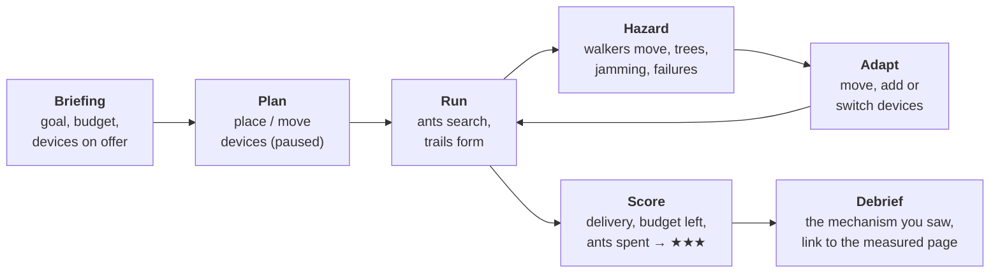
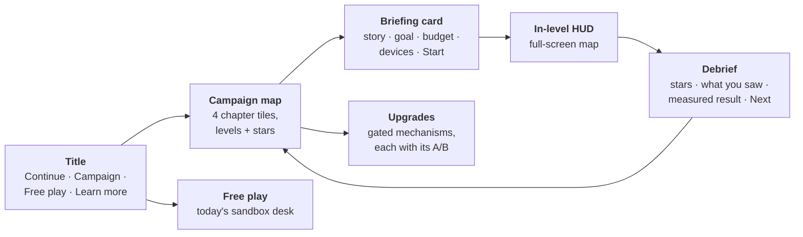

# Learn site: campaign mode (design, proposed 2026-10-09)

> **Status:** proposed, awaiting the maintainer's decision, as part of the
> [post-v2.0.0 replan](roadmap.md#replan-after-v200-proposed-2026-10-09).
> It builds on the learn site that ships today: the game at the site root, the
> core compiled to WebAssembly, and 8 Academy missions plus 4 world challenges
> ([ADR-0021](adr/0021-the-browser-is-an-adapter.md)).

## 1. The idea in one paragraph

The player is the **network planner**. In each level a network is broken: a
town where two phones cannot reach each other, a forest where trees eat the
signal, a contested area where relays get jammed, an orbit with a gap in
coverage. The player fixes it by **placing, moving and powering devices**
within a budget. The **ants do the routing**: the player never picks a route.
They watch the reactive ants find the gap they just bridged, the strongest
trail form and switch, and the repair ants patch a break. The campaign starts
in a small town with phones and laptops and ends in space; each chapter adds
a network type, device types and hazards.

This keeps the rule ADR-0021 is built on: **the game teaches the real
protocol.**
- Every route the player sees is chosen by `core/`.
- The player's tools only change the *scenario*: where devices are, which ones
  are on, what the terrain does to the radio.

## 2. Core loop



- **Objectives** are read from core events only, as the missions do today:
  - deliver ≥ X % of a flow between A and B for T seconds;
  - keep the strongest route alive through an event;
  - connect within N seconds.
- **Budget:** each device has a cost. Stars reward money left over and ants
  spent (routing overhead): a cheap, quiet network beats a carpet of relays.
- **Hints** cost a star, as now.
- **Progress** is a chapter map. Levels unlock in order, and stars are saved
  per browser (already done today in `localStorage`).
- **Sandbox** stays: every unlocked device and hazard is available to free
  play.

## 3. The campaign

| chapter | setting | network type (measured page) | devices | hazards | releases |
|---|---|---|---|---|---|
| **1. Town** | streets, houses, a café, a school | MANET + static mesh ([grid](benchmarks/grid.md), [static mesh](benchmarks/static-mesh.md)) | phone (walks, short range, cheap), laptop (moved now and then), desktop PC (static, indoor), Wi-Fi router (static, longer range) | people walking away, a router unplugged | v2.2.0 |
| **2. Forest** | canopy, clearings, a ranger station, a wildfire | FANET + disaster response ([FANET](benchmarks/scenarios/fanet.md); disaster family, v2.4.0) | ranger radio, sensor post, relay drone (3-D, battery), ranger station | foliage cuts range; drone batteries run out; the fire front destroys devices | v2.3.0 |
| **3. Contested zone** | a valley with roads and ridges | tactical narrowband (v2.4.0 disaster/tactical cell) | narrowband radio (long range, very low rate), relay vehicle (follows roads), mast | jamming areas; relays destroyed; a convoy moving out of range; *adversary nodes from v3.0.0* | v2.4.0 (+ v3.0.0) |
| **4. Space** | the globe, a Walker shell, ground stations | satellite + space-air-ground ([leo-walker](benchmarks/satellite/leo-walker.md); SAGIN, v2.4.0) | ground station, HAPS, launched satellite (choose its plane) | handover every 15 s; a solar storm takes out satellites | v2.4.0 |

The contested chapter is about keeping a network up under jamming and
failures. No level rewards harming anyone; the hazards are things that happen
to the radio.

### Levels — what each one teaches

Every level names its mechanism. Each debrief links to the doc page, the API
symbol and the measured result, as the Academy missions do now. The current 8
Academy missions are folded into the Town chapter, not thrown away.

**Chapter 1: Town**

| # | level | the broken network | the player fixes it by | mechanism taught |
|---|---|---|---|---|
| T1 | First hello | two phones just out of reach | moving one closer | hellos and neighbour tables |
| T2 | Across the street | a call between houses fails | placing one laptop as a relay | reactive forward ants, backward ants, pheromone |
| T3 | The café | phones walk in and out; the call drops | putting a router where walkers pass | proactive ants; the strongest route switching |
| T4 | Two ways home | one relay carries everything | adding a second path, then the level unplugs one | multipath and repair |
| T5 | Rush hour (boss) | three calls, a crowd, a small budget | placement under budget, ≥ 95 % delivery | everything above; the overhead ("ants spent") score |

**Chapter 2: Forest**

| # | level | the broken network | the player fixes it by | mechanism taught |
|---|---|---|---|---|
| F1 | Under the canopy | trees halve radio range | finding clearings for relays | link quality vs distance |
| F2 | Eyes in the sky | a valley no ground radio crosses | flying a relay drone over it, and swapping it before its battery dies | 3-D links, link expiry, repair |
| F3 | Lost hiker | a search team split into groups | bridging groups as they move | partition and re-merge (the v2.4.0 disaster family) |
| F4 | Wildfire | the fire front destroys devices | keeping the evacuation channel alive | repair under cascading failure |

**Chapter 3: Contested zone**

| # | level | the broken network | the player fixes it by | mechanism taught |
|---|---|---|---|---|
| W1 | Radio silence | narrowband radios: ants compete with data | fewer, better relays | control overhead as the binding cost (NRL) |
| W2 | Jammed | a jamming area cuts the valley's links | routing around it with masts on the ridges | link failure and re-discovery |
| W3 | Convoy | relay vehicles move along the road | timing and placing masts along it | mobility along roads (VANET-style link life) |
| W4 | *Trust no one* (v3.0.0) | an adversary node attracts traffic and drops it | finding it, and enabling the defence profile | blackhole/grayhole attacks; the security profile (ADR-0020) |

**Chapter 4: Space**

| # | level | the broken network | the player fixes it by | mechanism taught |
|---|---|---|---|---|
| S1 | First contact | a city cannot reach the shell | placing a ground station; watching the 15 s handover | handover; scheduled link changes |
| S2 | Across the ocean | two cities, no common satellite | placing ground stations and a HAPS | multi-hop over ISLs; propagation delay |
| S3 | Solar storm | 10 % of satellites fail | nothing to build: watch, then predict | mass-failure repair (the S1 storm cell) |
| S4 | Launch window | a coverage gap | choosing the orbital plane for one extra satellite | why orbits differ; same-plane vs cross-plane links |

## 4. Upgrades are real gated mechanisms

A "research" screen unlocks **upgrades**. Each one is a **real default-off
mechanism** from the v2.3.0 release, switched on as a labelled mission knob,
as level 7 ("Keep it fresh") already switches `enableProactive` today. An
upgrade never exists in the game alone: if the core does not have it, the
game does not offer it.

| upgrade | the gated mechanism | where it pays off |
|---|---|---|
| Quiet mode | proactive back-off on stable topologies | Town (static PCs and routers) |
| Look-ahead | link-lifetime prediction | Forest drones, convoy |
| Long-haul timing | propagation-dominated timing (#205) | Space |
| Battery saver | energy-aware link metric (#145) | Forest drones |
| Shield (v3.0.0) | the security profile (#302) | Contested W4 |

Each upgrade card shows what the measured A/B found ("on the static mesh,
quiet mode cut ants per packet by …"). This makes the gated-mechanism work
of v2.3.0 visible, and it keeps the [ADR-0019](adr/0019-network-families-change-the-evaluation-not-the-protocol.md)
rule: the defaults stay the paper's, and the upgrade is an explicit, labelled
choice.

## 5. What the browser adapter must add

These are scenario and radio features only: **no routing logic in `web/`**
([web/README.md](https://github.com/danieljoppi/AntHocNet/blob/main/web/README.md)
rules). Each one extends the native-vs-WASM parity gate.

| feature | for | sketch |
|---|---|---|
| device classes with **per-node radio range** | every chapter | link iff `dist ≤ min(range_a, range_b)` on the disk channel; class = range + mobility + sprite |
| **attenuation zones** (polygons that scale range inside them) | Forest canopy | a range multiplier per zone; deterministic arithmetic only |
| **jamming zones** (links touching the zone fail) | Contested | the urban channel's line-of-sight test, reused |
| **scripted events** (device destroyed / restored at t, zone moves) | Forest fire, Contested, Space storm | the front end schedules `setNodeUp`; a moving zone is a scenario timeline |
| **battery** (a device switches off after its energy budget) | Forest drones | an adapter timer; it never touches routing |
| **orbit binding** (`setMobility` for `Orbit` with plane parameters) | Space S4 | exposes the `MobilityKind::Orbit` that the satellite world already uses |
| **ground stations + handover** | Space S1–S2 | ground↔satellite links by elevation, as `leo-walker` does, simplified |
| **adversary nodes** | Contested W4 | needs the v3.0.0 core profile; not before |

## 6. Front-end work

- **Campaign map:** a chapter-select screen in the city-builder style. Each
  chapter is an illustrated tile, with stars per level and locked chapters
  greyed out.
- **Level format:** levels are data, extending `missions-data.js`. Each one
  holds the world script, budget, device palette, objectives, hazards, hints
  and debrief links.
- **Build palette:** the Build tool becomes a device palette with costs; the
  budget is shown in the status bar.
- **Art:** the new device sprites (laptop, PC, router, ranger radio, sensor
  post, vehicle, mast, ground station, HAPS) go beside the existing phone,
  drone, car and satellite. They are procedural canvas art, no image assets,
  as today. Terrain needs canopy, a fire front, jam fields and ridges.
- **Accessibility:** the existing axe gate (day and night). Every level must be
  playable by keyboard; placement accepts the selected-node arrow keys.

## 7. User interface

The current page is a city-builder **desk**: windows around a map, made for
exploring a sandbox. A campaign needs a **game UI**:
- the map fills the screen;
- the player always knows the goal, the budget and the clock;
- everything else comes in only when needed.

The sandbox keeps today's desk layout, as the "Free play" mode.

### Screens



- **Title.** A full-bleed live scene with ants walking a trail in the
  background. It offers four buttons:
  - Continue (the last level, highlighted);
  - Campaign;
  - Free play;
  - Learn more (the docs).

  This replaces today's welcome card on the front page.
- **Campaign map.** One illustrated tile per chapter: Town → Forest →
  Contested → Space.
  - Each tile shows its levels as stops on a path, with stars per level.
  - Locked chapters are greyed out, with "finish Town to unlock".
  - A total-stars counter sits at the top.
- **Briefing card.** A modal over the frozen level. It shows:
  - one line of story ("The café's Wi-Fi died; two friends want to call");
  - the goal, written as a checklist;
  - the budget;
  - the device cards on offer;
  - Start.

  The game starts **paused in Plan phase**, so the player can place devices
  before the clock runs.
- **In-level HUD.** Described below.
- **Debrief.** The stars animate in, with three lines:
  - what happened ("the reactive ants found your laptop relay in 38 ms");
  - the mechanism, with a link to its doc page;
  - the measured result on the real simulator, with a link to the results page.

  Buttons: Retry, Next level, Map.
- **Upgrades.** A card grid of the gated mechanisms. Each card shows:
  - what the mechanism does;
  - the measured A/B number;
  - which chapters it helps;
  - an on/off toggle per level.

### In-level HUD

```
┌──────────────────────────────────────────────────────────────────────────┐
│ ◀ Map   Town · T3 The café        ★★☆   ⏸ ▶ ▶▶      💰 120   ⏱ 0:42 / 1:30 │  top bar
├──────────────────────────────────────────────────────────────────────────┤
│ ┌Goal───────────────┐                                    ┌Strongest route┐│
│ │✓ connect A → B    │                                    │ A→n4→n9→B     ││
│ │◻ 95 % for 60 s 87%│          full-screen map           │ switched 2×   ││
│ │◻ ≤ 3 relays   2/3 │                                    └───────────────┘│
│ └───────────────────┘                                                     │
│                                                                           │
│   toast: "Phone 7 walked out of range. Repair ants are on it."            │
├──────────────────────────────────────────────────────────────────────────┤
│ [📱 Phone 10] [💻 Laptop 25] [🖥 PC 40] [📶 Router 60]   │ ✋ Move │ 🔍 Inspect │  device dock
└──────────────────────────────────────────────────────────────────────────┘
```

- **Top bar:**
  - back to the map;
  - the level name;
  - live stars (the score the player would get if the level ended now);
  - speed controls;
  - the budget;
  - the level clock.
- **Goal tracker (top left):** the objectives as a checklist, each with a live
  progress value. When an objective is met it ticks green with a short
  animation.
- **Route card (top right):** the strongest pheromone route as a hop chain,
  plus a switch counter. It flashes amber when the route switches, the same
  signal as on the map.
- **Device dock (bottom):** device cards with icon, name and cost.
  - Drag a card onto the map, or tap a card and then tap the map.
  - Cards the player cannot afford are greyed out.
  - While a card is dragged, its radio range shows as a ghost ring, so
    placement is a visual decision.
  - Move and Inspect are tools at the end of the dock.
- **Toasts:** one at a time, in plain language, each tied to an event
  ("Phone 7 walked out of range").
- **Inspector:** a slide-in panel when a device is tapped:
  - its routing table;
  - "moving / standing still";
  - its battery, if it has one;
  - a Remove button that refunds part of the cost.
- **The ant log and the overlays** move into a collapsible "Lab" drawer. They
  are for the curious and stay out of the way.

### Feel

- **Feedback for every action.** Placing a device pulses its range ring; a
  new link draws in; reaching an objective plays a short chime. Sound is off
  by default, with a toggle.
- **Plan / Run phases.** The clock waits until the player presses Run, then
  shows "Running". The pause between waves of hazards is the Adapt moment.
- **Readable at a glance.** Status is never shown by colour alone; every
  status also has a shape or a symbol, as today.
- **Mobile first-class:**
  - the dock becomes a bottom sheet;
  - goal and route cards collapse to chips;
  - touch: drag to place, pinch to zoom, two-finger pan.
- **Accessibility:**
  - keyboard: the number keys pick a device; the arrow keys move the
    placement cursor; Enter places;
  - screen readers get a live region for toasts;
  - the axe gate covers every new screen, by day and by night;
  - motion is reduced when the reader asks for it (`prefers-reduced-motion`).
- **Style:** it continues the modern look shipped in #558 (cards, pills,
  glass), with a chapter colour per chapter:
  - Town: warm;
  - Forest: green;
  - Contested: amber;
  - Space: indigo.

The [mockups](#mockups) below show the campaign map and the in-level HUD.

### Mockups

Static mockups, not the implementation. Both are rendered from a standalone
HTML file in the repository's style.


## 8. Tests

- **Smoke** (`web/test/smoke.mjs`): one level per chapter played to the end
  with scripted input, as mission 2 is today.
- **Parity:** every new adapter feature is exercised by a built-in scenario,
  so the native-vs-WASM trace gate covers it.
- **Fairness check:** each level's par solution (the designer's placement)
  must clear its objective on 5 seeds, so a level is never impossible on an
  unlucky seed.

## 9. Release mapping

| release | learn-site work |
|---|---|
| **v2.2.0** | the game UI (title, campaign map, briefing, in-level HUD with device dock, debrief; the sandbox kept as Free play); campaign engine (level format, budget, objectives); device classes + per-node range in the adapter; **Chapter 1: Town** (absorbs the Academy) |
| **v2.3.0** | **Chapter 2: Forest** (attenuation zones, drone battery, fire events); the **upgrades** screen, wired to the gated mechanisms that ship in v2.3.0 |
| **v2.4.0** | **Chapter 3: Contested zone** (jamming zones, narrowband class, convoy) and **Chapter 4: Space** (ground stations, HAPS, launch) — the same release as the disaster/tactical and SAGIN families they draw on |
| **v3.0.0** | Contested **W4** and the **Shield** upgrade, on the security profile |

Each chapter lands with the release that measures its network type. That
way every debrief links to a measured page, not a promise.
