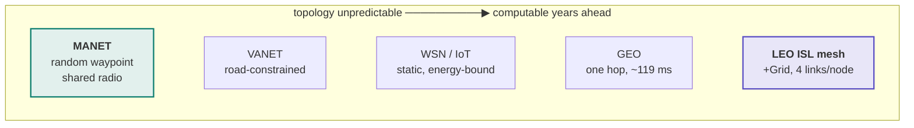
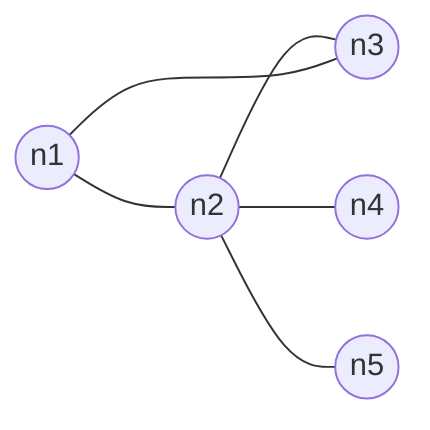
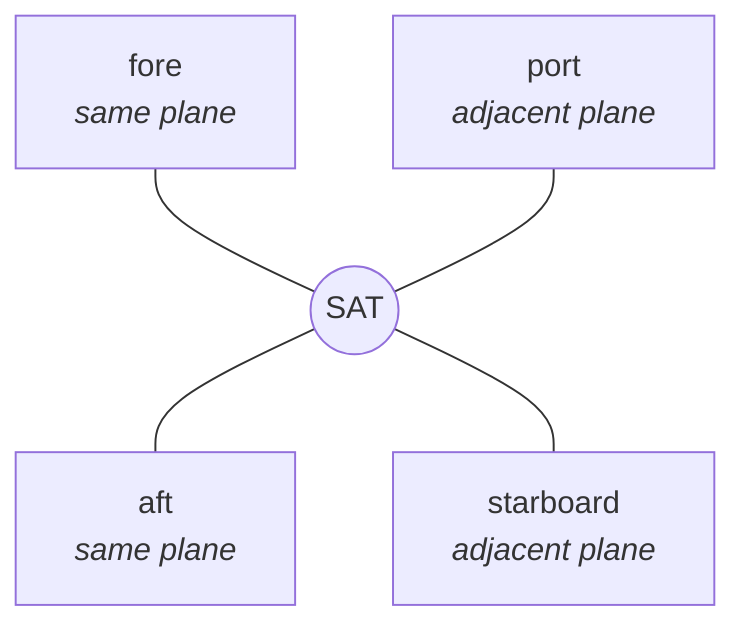

# MANET and satellite are not the same problem

Both are multi-hop wireless networks without fixed infrastructure. Almost every
other property differs — and the differences decide which routing mechanisms
make sense, what the benchmark must control for, and what may honestly be
claimed.

This page exists because the satellite track
([#192](https://github.com/danieljoppi/AntHocNet/issues/192)) kept producing
findings whose real cause was "this regime does not work like the one the
protocol was designed for". Rather than re-derive that each time, it is written
down once. Every row of the difference table below changed a concrete decision
in this repository — a defect, a parameter, a benchmark control, or an
architectural call.

## 1. Where the two regimes sit

Infrastructure-free networks, ordered by how knowable the topology is. The two
this repository cares about are at opposite ends.



GEO sits near the deterministic end but is a different shape again: a bent-pipe
hop to a gateway, with essentially no path to choose. That is why SNS3 — the
most mature ns-3 satellite module — is the wrong substrate for routing work
([#199](https://github.com/danieljoppi/AntHocNet/issues/199)).

## 2. The two topologies

**A MANET node's degree depends on who happens to be nearby.** Neighbours are
unknown until a hello arrives, and there is one interface on one shared
broadcast domain.



`n2` has degree 4 here, `n4` degree 1 — and both change as the nodes move.

**A satellite's degree is fixed by construction:** two intra-plane links (fore
and aft, near-constant length) and two cross-plane links (port and starboard,
length varying with latitude).



Tiled, that is a **+Grid torus** — the standard LEO abstraction, and what
[`ns3/examples/isl-grid.cc`](../ns3/examples/isl-grid.cc) builds:

```
        ┌───────────────────────────┐   ← cross-plane wrap
        │                           │
    ────●───────●───────●───────●────┐  ← intra-plane wrap
        │       │       │       │    │
    ────●───────●───────●───────●────┤
        │       │       │       │    │
    ────●───────●───────●───────●────┘
        │                           │
        └───────────────────────────┘

    every node: exactly 4 ISLs, each on its own /30 subnet
```

Measured on the 4×4 harness: **16 nodes, 32 links** — exactly 2 contributed per
node, hence degree 4. That count is asserted on every run
([#226](https://github.com/danieljoppi/AntHocNet/issues/226)), because a
silently-wrong torus still delivers ~100% of packets and would produce entirely
plausible numbers for the wrong network.

## 3. The inversion that explains everything else

| | What is **unknown** | What is **given** |
|---|---|---|
| **MANET** | the topology — nodes move unpredictably, links appear and vanish, no node can know the graph | traffic demand is usually treated as given |
| **LEO constellation** | the traffic — where demand lands (ocean crossings, ground-station clustering, diurnal peaks) does not follow from orbits | the topology, for any second of the next decade, from the orbital elements |

**Move a routing protocol from one regime to the other and you take away the
problem it was designed to solve, then hand it a different one.**

That is why a claim about ant-colony routing on a constellation has to be about
**congestion and disruption**, never about finding routes — the conclusion
reached independently in
[`satellite-routing-prior-art.md`](satellite-routing-prior-art.md) §3, where the
published ACO-on-LEO literature turns out to have converged on load balancing
for exactly this reason.

## 4. The differences that bite

| Property | MANET | LEO satellite | Consequence in this repo |
|---|---|---|---|
| **Topology** | unknown, stochastic | deterministic from orbital elements | the control to beat is a precomputed shortest path (or OPSPF), **not** AODV — [#216](https://github.com/danieljoppi/AntHocNet/issues/216) |
| **Medium** | shared broadcast radio, 802.11 DCF, contention | point-to-point ISL, one peer per link | no contention ⇒ expected values are **analytic**, not literature-derived — the satellite anchors in [`benchmarks/methodology.md`](benchmarks/methodology.md) |
| **Interfaces per node** | one | four, each on its own `/30` | exposed a real defect: the data path used interface 0 for *every* next hop — [#203](https://github.com/danieljoppi/AntHocNet/issues/203) |
| **Node degree** | varies with density, 1 to many | exactly 4 | degree becomes an assertable invariant — [#226](https://github.com/danieljoppi/AntHocNet/issues/226) |
| **Loss** | collisions, retry exhaustion | essentially none on the link itself | anything under 100 % delivery indicts the stack, not the channel |
| **Delay** | queueing/contention dominated; `T_hop` = 3 ms | propagation dominated; 3–18 ms per ISL, GEO ~119 ms | delay becomes predictable: 2 hops × 5 ms → measured **10.39 ms**. Also means the 802.11-calibrated timers are mis-sized — [#205](https://github.com/danieljoppi/AntHocNet/issues/205) |
| **Neighbour discovery** | hello beacons are the only way to know | the peer is fixed and known from geometry | 1 Hz hello on a known peer is overhead: **NRL 12.18** with nothing to discover — [#204](https://github.com/danieljoppi/AntHocNet/issues/204) |
| **Link failure** | random, mobility-driven, constant | mostly **scheduled** (polar seams, visibility windows) | only *unscheduled* failure is interesting; the scheduled kind is already in the control's tables |
| **Scale** | tens of nodes, diameter ~5 | ~1584 per shell, diameter 20–40 | reactive flooding cost is the open scaling question — [#207](https://github.com/danieljoppi/AntHocNet/issues/207) |
| **Congestion signal** | wifi MAC queue occupancy | no wifi MAC exists on an ISL | the A2 metric is inert on satellites until the signal is generalised — [#206](https://github.com/danieljoppi/AntHocNet/issues/206) |
| **Realistic baseline** | AODV, OLSR, DSDV | snapshot routing, OPSPF, segment routing | terrestrial protocols become a sanity row, never the claim — §2.2 of the prior-art survey |

## 5. What this means for the algorithm

AntHocNet's mechanisms split cleanly along this line:

- **Reactive discovery** — flooding forward ants to find a path nobody knows —
  is its answer to *unknown topology*. A constellation does not have that
  problem. On 1584 nodes with four links each, the flood is cost without
  benefit.
- **Multipath with delay-weighted pheromone** is a different mechanism
  entirely: it responds to *load*, and load is precisely what orbits cannot
  predict.

So the defensible position is not "ACO works on satellites" but **"one half of
it addresses a problem that exists there, and the other half addresses one that
does not"**. That is narrower, more honest, and testable.

It is also contested. Segment routing already performs congestion-aware traffic
engineering on deployed hardware without per-packet stochastic decisions. What
remains distinctive is that pheromone needs **no central traffic view** — which
matters exactly when that view is stale or unreachable, i.e. under unpredicted
failure and handover churn rather than under steady-state congestion. See
[`satellite-routing-prior-art.md`](satellite-routing-prior-art.md) §5.1.

## Provenance of the numbers

Measurements are from this repository's own CI, not from the literature:
`isl-grid` on a 4×4 torus gives **10.39 ms** mean delay against a **10 ms**
analytic floor (2 hops × 5 ms) and **5.1 ms** at one hop, with **32** links
across **16** nodes and **NRL 12.18** on a churn-free grid
([#214](https://github.com/danieljoppi/AntHocNet/issues/214),
[#237](https://github.com/danieljoppi/AntHocNet/issues/237)).

`T_hop` = 3 ms is the 2007 Ducatelle thesis value
([#88](https://github.com/danieljoppi/AntHocNet/issues/88)). The protocol
landscape and the ~119 ms GEO figure are sourced in
[`satellite-routing-prior-art.md`](satellite-routing-prior-art.md), which also
records which of its claims have been checked against a full text and which
have not.
