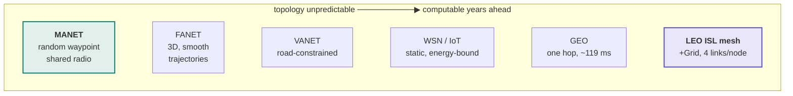
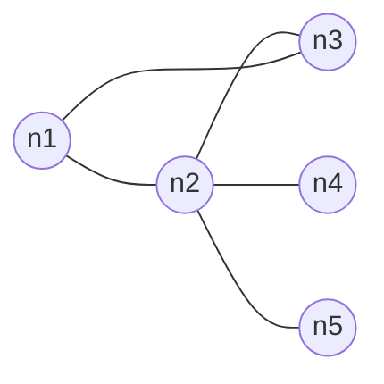
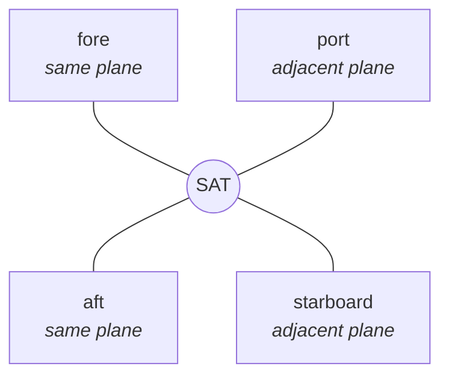

# MANET and satellite are not the same problem

Both are multi-hop wireless networks without fixed infrastructure. Almost every
other property differs — and the differences decide which routing mechanisms
make sense, what the benchmark must control for, and what may honestly be
claimed.

This page exists because the satellite track
([#192](https://github.com/danieljoppi/AntHocNet/issues/192)) kept producing
findings whose real cause was "this regime does not work like the one the
protocol was designed for". Rather than re-derive that each time, it is written
down once. Every row of the difference table below changed a concrete decision
in this repository — a defect, a parameter, a benchmark control, or an
architectural call.

## 1. Where the two regimes sit

Infrastructure-free networks, ordered by how knowable the topology is. The two
this repository cares about are at opposite ends.



GEO sits near the deterministic end but is a different shape again: a bent-pipe
hop to a gateway, with essentially no path to choose. That is why SNS3 — the
most mature ns-3 satellite module — is the wrong substrate for routing work
([#199](https://github.com/danieljoppi/AntHocNet/issues/199)).

The intermediate families change the *evaluation*, not the protocol: the same
binary runs everywhere, but each family constrains mobility differently, so
each needs its own mobility model, scenario shape, and — sometimes — metrics
before a number from it means anything.

| Family | Mobility | What it changes | Status in this repo |
|---|---|---|---|
| **MANET** | unconstrained random (RWP), 1–20 m/s, 2D | nothing — the regime the 2004/2007 sources designed and tuned for | supported: the paper and thesis fields ([benchmarks](benchmarks.md)) |
| **FANET** | 3D smooth trajectories (Gauss-Markov standard), 10–30 m/s, sparse | third dimension (our nodes sit at z = 0 today), faster link churn, energy budgets that matter | not yet: Gauss-Markov + 3D are the [#61](https://github.com/danieljoppi/AntHocNet/issues/61)/[#295](https://github.com/danieljoppi/AntHocNet/issues/295) scope. Priority rationale: 2024–2026 FANET surveys evaluate AntHocNet directly and rate it strongest among the classical protocols they test — the family where the protocol's reputation is currently made |
| **VANET** | road-constrained (Manhattan, SUMO traces), 10–40 m/s, platooning | churn is fast but street-shaped; density swings block-by-block; RSU/infrastructure hybrids common | not yet: Manhattan / SUMO trace-driven mobility is in [#61](https://github.com/danieljoppi/AntHocNet/issues/61)/[#295](https://github.com/danieljoppi/AntHocNet/issues/295) scope |
| **WSN / IoT** | static or near-static, energy-bound | routing problem becomes energy/sleep scheduling, not topology discovery | out of scope (energy-aware `ILinkMetric` is the nearest hook, [#145](https://github.com/danieljoppi/AntHocNet/issues/145)) |
| **LEO ISL mesh** | deterministic orbits | the §3 inversion: topology known, traffic unknown | supported as a static +Grid snapshot; dynamics are epic [#297](https://github.com/danieljoppi/AntHocNet/issues/297) |

## 2. The two topologies

**A MANET node's degree depends on who happens to be nearby.** Neighbours are
unknown until a hello arrives, and there is one interface on one shared
broadcast domain.



`n2` has degree 4 here, `n4` degree 1 — and both change as the nodes move.

**A satellite's degree is fixed by construction:** two intra-plane links (fore
and aft, near-constant length) and two cross-plane links (port and starboard,
length varying with latitude).



Tiled, that is a **+Grid torus** — the standard LEO abstraction, and what
[`ns3/examples/isl-grid.cc`](../ns3/examples/isl-grid.cc) builds:

```
        ┌───────────────────────────┐   ← cross-plane wrap
        │                           │
    ────●───────●───────●───────●────┐  ← intra-plane wrap
        │       │       │       │    │
    ────●───────●───────●───────●────┤
        │       │       │       │    │
    ────●───────●───────●───────●────┘
        │                           │
        └───────────────────────────┘

    every node: exactly 4 ISLs, each on its own /30 subnet
```

Measured on the 4×4 harness: **16 nodes, 32 links** — exactly 2 contributed per
node, hence degree 4. That count is asserted on every run
([#226](https://github.com/danieljoppi/AntHocNet/issues/226)), because a
silently-wrong torus still delivers ~100% of packets and would produce entirely
plausible numbers for the wrong network.

## 3. The inversion that explains everything else

| | What is **unknown** | What is **given** |
|---|---|---|
| **MANET** | the topology — nodes move unpredictably, links appear and vanish, no node can know the graph | traffic demand is usually treated as given |
| **LEO constellation** | the traffic — where demand lands (ocean crossings, ground-station clustering, diurnal peaks) does not follow from orbits | the topology, for any second of the next decade, from the orbital elements |

**Move a routing protocol from one regime to the other and you take away the
problem it was designed to solve, then hand it a different one.**

That is why a claim about ant-colony routing on a constellation has to be about
**congestion and disruption**, never about finding routes — the conclusion
reached independently in
[`satellite-routing-prior-art.md`](satellite-routing-prior-art.md) §3, where the
published ACO-on-LEO literature turns out to have converged on load balancing
for exactly this reason.

## 4. The differences that bite

| Property | MANET | LEO satellite | Consequence in this repo |
|---|---|---|---|
| **Topology** | unknown, stochastic | deterministic from orbital elements | the control to beat is a precomputed shortest path (or OPSPF), **not** AODV — [#216](https://github.com/danieljoppi/AntHocNet/issues/216) |
| **Medium** | shared broadcast radio, 802.11 DCF, contention | point-to-point ISL, one peer per link | no contention ⇒ expected values are **analytic**, not literature-derived — the satellite anchors in [`benchmarks/methodology.md`](benchmarks/methodology.md) |
| **Interfaces per node** | one | four, each on its own `/30` | exposed a real defect: the data path used interface 0 for *every* next hop — [#203](https://github.com/danieljoppi/AntHocNet/issues/203) |
| **Node degree** | varies with density, 1 to many | exactly 4 | degree becomes an assertable invariant — [#226](https://github.com/danieljoppi/AntHocNet/issues/226) |
| **Loss** | collisions, retry exhaustion | essentially none on the link itself | anything under 100 % delivery indicts the stack, not the channel |
| **Delay** | queueing/contention dominated; `T_hop` = 3 ms | propagation dominated; 3–18 ms per ISL, GEO ~119 ms | delay becomes predictable: 2 hops × 5 ms → measured **10.39 ms**. Also means the 802.11-calibrated timers are mis-sized — [#205](https://github.com/danieljoppi/AntHocNet/issues/205) |
| **Neighbour discovery** | hello beacons are the only way to know | the peer is fixed and known from geometry | 1 Hz hello on a known peer is overhead: **NRL 12.18** with nothing to discover — [#204](https://github.com/danieljoppi/AntHocNet/issues/204) |
| **Link failure** | random, mobility-driven, constant | mostly **scheduled** (polar seams, visibility windows) | only *unscheduled* failure is interesting; the scheduled kind is already in the control's tables |
| **Scale** | tens of nodes, diameter ~5 | ~1584 per shell, diameter 20–40 | reactive flooding cost is the open scaling question — [#207](https://github.com/danieljoppi/AntHocNet/issues/207) |
| **Congestion signal** | wifi MAC queue occupancy | no wifi MAC exists on an ISL | the A2 metric is inert on satellites until the signal is generalised — [#206](https://github.com/danieljoppi/AntHocNet/issues/206) |
| **Realistic baseline** | AODV, OLSR, DSDV | snapshot routing, OPSPF, segment routing | terrestrial protocols become a sanity row, never the claim — §2.2 of the prior-art survey |

## 5. What this means for the algorithm

AntHocNet's mechanisms split cleanly along this line:

- **Reactive discovery** — flooding forward ants to find a path nobody knows —
  is its answer to *unknown topology*. A constellation does not have that
  problem: the +Grid is a known graph and every node can compute where a
  destination *is*.

  Be precise about what that does and does not buy, though. Knowing the topology
  is not the same as a node already holding a **next hop** for a given
  destination: it still has to acquire direction, and on 1584 nodes with four
  links each, acquiring it by flooding is the expensive way. The correction is
  not "discovery is free" — it is that discovery here is *steerable* rather than
  blind, because the direction is derivable instead of unknown.

  That is exactly the gap `enableDirectedReactive`
  ([`configuration.md`](configuration.md)) probes, and it does so without
  assuming a constellation: it steers along the diffused virtual gradient, which
  is pheromone the node already received, not a coordinate. So the same switch
  is testable on a MANET, where it degrades to "no gradient yet, flood as
  before" rather than to "wrong answer".
- **Multipath with delay-weighted pheromone** is a different mechanism
  entirely: it responds to *load*, and load is precisely what orbits cannot
  predict.

So the defensible position is not "ACO works on satellites" but **"one half of
it addresses a problem that exists there, and the other half addresses one that
does not"**. That is narrower, more honest, and testable.

It is also contested. Segment routing already performs congestion-aware traffic
engineering on deployed hardware without per-packet stochastic decisions. What
remains distinctive is that pheromone needs **no central traffic view** — which
matters exactly when that view is stale or unreachable, i.e. under unpredicted
failure and handover churn rather than under steady-state congestion. See
[`satellite-routing-prior-art.md`](satellite-routing-prior-art.md) §5.1.

## 6. What runs where — mechanism × regime

Section 5 gives the argument; this table gives the inventory. One attribute set
(defaults in [`configuration.md`](configuration.md)) serves both regimes — no
per-regime build, no per-regime preset. What differs is which mechanisms are
*live*: some bind to the Wi-Fi MAC and physically cannot fire on a
point-to-point ISL, and some answer a question the regime doesn't ask. The
harnesses set **no** protocol attributes; every A/B arm goes through explicit
`--ns3::anthocnet::RoutingProtocol::<Attr>=<v>` overrides
([#177](https://github.com/danieljoppi/AntHocNet/issues/177)), so a table row
below describes the *default* run of that regime's harness.

| Mechanism (attribute) | Default | MANET (Wi-Fi broadcast) | Satellite ISL (p2p grid) |
|---|---|---|---|
| Reactive forward-ant flood (`EnableReactive`) | on | **live, essential** — the only way to learn a topology nobody knows | live, but steerable-not-blind is the honest framing (§5): the flood re-derives direction the geometry already gives |
| Proactive ants (`EnableProactive`, `ProactiveInterval` 10 s) + diffusion (`EnableDiffusion`) | on | live — path maintenance and improvement during a session | live — diffusion carries the virtual gradient across the grid; it is what `EnableDirectedReactive` would steer along |
| Proactive emission gate (`ProactiveVirtualMargin`) | **0 = off** | off deliberately — the thesis's 10% gate measured harmful ([#180](https://github.com/danieljoppi/AntHocNet/issues/180)) | same |
| Hello beacons (`HelloInterval` 1 Hz) | on | live, essential — sole neighbour-discovery mechanism | live but **redundant**: one fixed, known peer per link; measured cost NRL 12.18 on a churn-free grid ([#204](https://github.com/danieljoppi/AntHocNet/issues/204)) |
| Multipath acceptance (`EnableMultipath`, a1 `AntAcceptanceFactor` 0.9, a2 `AntAcceptanceFactorNewHop` 2.0) | on | live — disjoint paths when density allows | live — the torus has equal-length corridors by construction; this is the half of the protocol with a real satellite claim (§5) |
| Local repair ants (`EnableRepair`, `RepairWaitFactor` 5, `RepairTimeout` 1 s) | on | live, constantly exercised — mobility breaks links | live, exercised only by *unscheduled* failure — the `--breakLink` cell ([#260](https://github.com/danieljoppi/AntHocNet/issues/260)); scheduled failure belongs to the control's tables |
| Link-failure notifications (`EnableLinkFail`, cooldown `LinkfailNotifyInterval` 5 s) | on | live | live |
| Failure detector A — hello timeout | always on | live | live (and sufficient: `Ipv4::SetDown` on a cut link also raises the interface event) |
| Failure detector D — Wi-Fi MAC transmit failures (`EnableMacFailureDetector`, `TxFailureThreshold` 3) | on | live — the fast detector ([ADR-0008](adr/0008-neighbour-liveness-two-detectors.md)) | **inert** — subscription requires a `WifiNetDevice`; a p2p ISL has none |
| A2 congestion metric (`EnableMacMetric`, `MacServiceAlpha` 0.7) | **off** | available — reads `WifiMacQueue` (AC_BE_NQOS) occupancy | **inert even if enabled** — no Wi-Fi MAC queue to read; needs a generalised congestion signal ([#206](https://github.com/danieljoppi/AntHocNet/issues/206)); the corridor experiments ([#216](https://github.com/danieljoppi/AntHocNet/issues/216)) exposed the deeper attribution gap ([#292](https://github.com/danieljoppi/AntHocNet/issues/292)) |
| Directed reactive discovery (`EnableDirectedReactive`) | **off** | A/B arm — no gradient yet ⇒ degrades to the stock flood | A/B arm — the regime this switch exists to probe (§5, [#245](https://github.com/danieljoppi/AntHocNet/issues/245)) |
| Pending-queue timing (`QueueTimeout` 3 s, `ReconvHoldCap` 1 s, `RepairHoldCap` 0, `ReactiveRetryInterval` 0.25 s) | #21/#103 frontier values | live — tuned on this regime's delay tail | live but calibrated against 802.11 contention delays, not 5–18 ms propagation floors ([#205](https://github.com/danieljoppi/AntHocNet/issues/205)) |
| Goodness timing reference (`HopTime` 3 ms) | thesis value ([#88](https://github.com/danieljoppi/AntHocNet/issues/88)) | live — matches an unloaded 802.11 hop | mis-sized — an ISL hop is 5 ms of pure propagation before queueing ([#205](https://github.com/danieljoppi/AntHocNet/issues/205)) |
| Pheromone dynamics (`Alpha` 0.7, `Gamma` 0.7, `BetaAnts` 20, `BetaData` 20) | shipped values (the β exponents are the thesis's, adopted on a measured A/B — [#179](https://github.com/danieljoppi/AntHocNet/issues/179)) | live | live — and on a static grid the closed-form orbit of these constants is exactly reproducible ([#216](https://github.com/danieljoppi/AntHocNet/issues/216) derivation) |

Reading the table column-wise gives each regime's honest summary. **MANET:**
everything live; the protocol is in its design regime. **Satellite ISL:** the
discovery half runs but answers a solved problem, two Wi-Fi-coupled mechanisms
(detector D, A2 metric) are inert, hello pays overhead for nothing, and the
timing constants are calibrated for a medium that isn't there — while the
multipath/load-response half faces exactly the problem the regime does have.
That asymmetry is the satellite research programme
([#192](https://github.com/danieljoppi/AntHocNet/issues/192)), not a defect
list.

## Provenance of the numbers

Measurements are from this repository's own CI, not from the literature:
`isl-grid` on a 4×4 torus gives **10.39 ms** mean delay against a **10 ms**
analytic floor (2 hops × 5 ms) and **5.1 ms** at one hop, with **32** links
across **16** nodes and **NRL 12.18** on a churn-free grid
([#214](https://github.com/danieljoppi/AntHocNet/issues/214),
[#237](https://github.com/danieljoppi/AntHocNet/issues/237)).

`T_hop` = 3 ms is the 2007 Ducatelle thesis value
([#88](https://github.com/danieljoppi/AntHocNet/issues/88)). The protocol
landscape and the ~119 ms GEO figure are sourced in
[`satellite-routing-prior-art.md`](satellite-routing-prior-art.md), which also
records which of its claims have been checked against a full text and which
have not.
