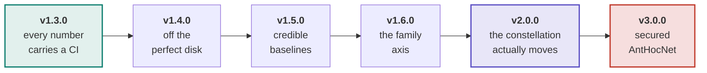
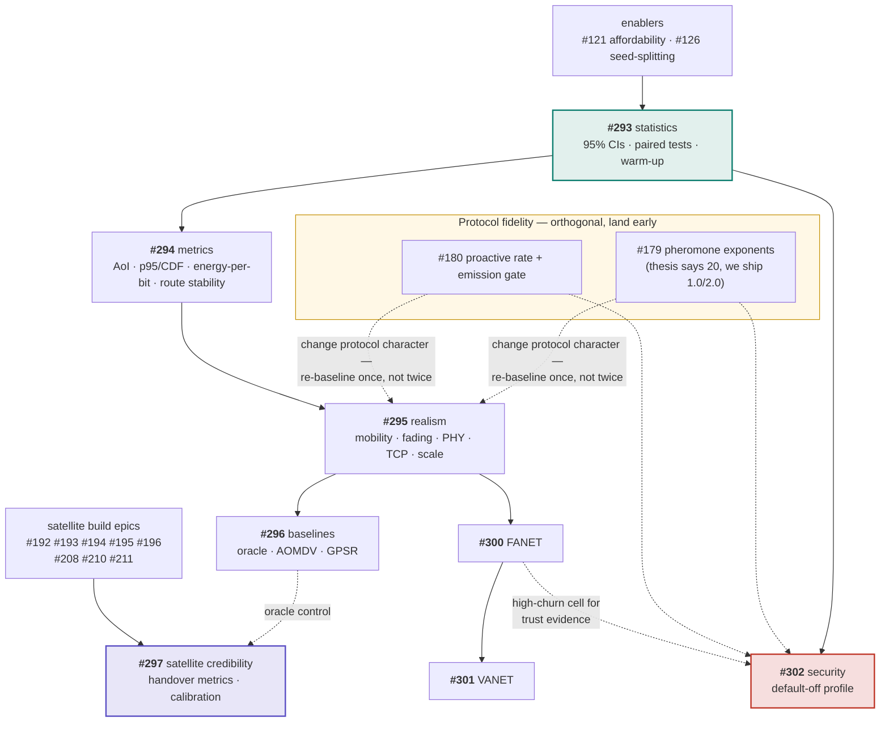

# Roadmap

The plan in one page. The authoritative, living version is
[#298](https://github.com/danieljoppi/AntHocNet/issues/298) — it carries the
literature gap analysis the epics came from, and issue state is always truer
than a checked-in diagram. This page exists because the *ordering constraints*
are the part that is hard to hold in your head, and a graph shows them better
than prose.

## Release ladder

The order is not arbitrary — statistics come first because every later claim is
quoted with a confidence interval, and realism comes before baselines because
adding a baseline to a scenario set you are about to change means measuring
twice.

## Epics and what blocks what

Solid arrows are hard dependencies; dashed are "derisks / informs".

**The one sequencing rule worth memorising:** the fidelity fixes (#179, #180)
change the protocol's character, so they must land *before* v1.4.0's expensive
realism campaigns — otherwise every published grid is measured twice. They are
otherwise independent of the epic chain.

## What each release must show to ship

| Release | Exit criteria |
|---|---|
| **v1.3.0** | Every published table carries a 95 % CI; `bench_parse --ab` reports paired-difference verdicts; runs-floor and warm-up policy documented. |
| **v1.4.0** | Headline grid under ≥2 mobility × ≥2 channel models with a ranking-stability statement; TCP arm; a published 200-node point. |
| **v1.5.0** | Oracle control in both suites; AOMDV and GPSR spikes resolved (working arm **or** a written infeasibility verdict with threat-to-validity text). |
| **v1.6.0** | README family table shows ≥4 supported families, each with a results page, plus a cross-family ranking-stability statement. |
| **v2.0.0** | A committed time-varying Walker result: scheduled handovers, failure overlay, oracle + geographic comparators, handover metric family, calibration deltas vs Hypatia/LENS. |
| **v3.0.0** | Four-protocol vulnerability table under blackhole/grayhole; defense profile recovering PDR under attack while reading **NOISE** in benign scenarios; `EnableSecurity=false` path proven byte-identical. |

## Deliberate non-goals

Recorded with the reasoning that would reverse each — see the rationale comment
on [#298](https://github.com/danieljoppi/AntHocNet/issues/298). Briefly: a DRL
baseline is *planned but gated* (a leaky comparison would damage credibility);
Sionna RT ray tracing is an upgrade path, not a goal; WSN/IoT (RPL's problem),
DTN store-carry-forward (a capability the protocol structurally lacks), and
NR-V2X sidelink (a different L2/PHY stack) are out.

Security was a non-goal and was **reversed** by converting the objection into a
design constraint ([ADR-0020](adr/0020-security-is-a-default-off-profile.md)) —
that is the template for revisiting any of the others.

## See also

- [#298](https://github.com/danieljoppi/AntHocNet/issues/298) — the roadmap issue: gap analysis, the three literature surveys, live status.
- [ADR-0019](adr/0019-network-families-change-the-evaluation-not-the-protocol.md) — why family support is scenario work, never per-family protocol defaults.
- [ADR-0020](adr/0020-security-is-a-default-off-profile.md) — why security is a default-off profile rather than a fork.
- [`network-regimes.md`](network-regimes.md) · [`software-layers.md`](software-layers.md) · [`ant-types.md`](ant-types.md) — the regime and mechanism references the epics build on.
