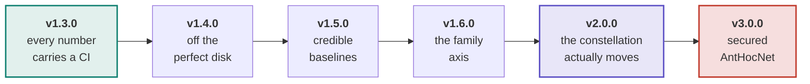
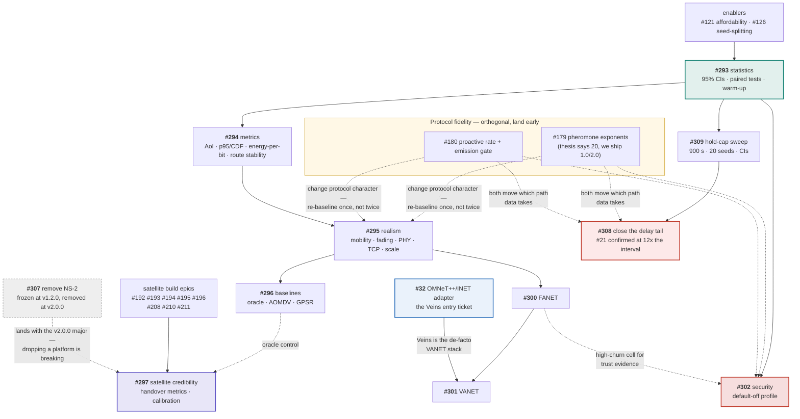

# Roadmap

The plan in one page. The authoritative, living version is
[#298](https://github.com/danieljoppi/AntHocNet/issues/298) — it carries the
literature gap analysis the epics came from, and issue state is always truer
than a checked-in diagram. This page exists because the *ordering constraints*
are the part that is hard to hold in your head, and a graph shows them better
than prose.

## How this plan is tracked

Each roadmap issue carries a **`release:` label**, so every column of this plan
is a live query rather than a diagram that drifts:

| Release | Board |
|---|---|
| v1.3.0 | [`release:v1.3.0`](https://github.com/danieljoppi/AntHocNet/issues?q=is%3Aopen+label%3A%22release%3Av1.3.0%22) |
| v1.4.0 | [`release:v1.4.0`](https://github.com/danieljoppi/AntHocNet/issues?q=is%3Aopen+label%3A%22release%3Av1.4.0%22) |
| v1.5.0 | [`release:v1.5.0`](https://github.com/danieljoppi/AntHocNet/issues?q=is%3Aopen+label%3A%22release%3Av1.5.0%22) |
| v1.6.0 | [`release:v1.6.0`](https://github.com/danieljoppi/AntHocNet/issues?q=is%3Aopen+label%3A%22release%3Av1.6.0%22) |
| v2.0.0 | [`release:v2.0.0`](https://github.com/danieljoppi/AntHocNet/issues?q=is%3Aopen+label%3A%22release%3Av2.0.0%22) |
| v3.0.0 | [`release:v3.0.0`](https://github.com/danieljoppi/AntHocNet/issues?q=is%3Aopen+label%3A%22release%3Av3.0.0%22) |
| all epics | [`epic`](https://github.com/danieljoppi/AntHocNet/issues?q=is%3Aopen+label%3Aepic) |

Labels, not milestones or a Projects board, because a label is visible in every
issue list and search without leaving the issues view, and because it survives
being edited by anyone with write access rather than needing project-level
permissions. A Projects v2 board over the same labels is a strict addition if
one is ever wanted — it would read these labels, not replace them.

Only issues the ladder actually gates are labelled. Most of the ~90 open issues
are unscheduled work that lands whenever it lands; putting a `release:` on
everything would make the query useless.

## Release ladder

The order is not arbitrary — statistics come first because every later claim is
quoted with a confidence interval, and realism comes before baselines because
adding a baseline to a scenario set you are about to change means measuring
twice.

## Epics and what blocks what

Solid arrows are hard dependencies; dashed are "derisks / informs".

**The one sequencing rule worth memorising:** the fidelity fixes (#179, #180)
change the protocol's character, so they must land *before* v1.4.0's expensive
realism campaigns — otherwise every published grid is measured twice. They are
otherwise independent of the epic chain.

## What each release must show to ship

| Release | Exit criteria |
|---|---|
| **v1.3.0** | Every published table carries a 95 % CI — **met**: headline ([#110](https://github.com/danieljoppi/AntHocNet/issues/110)), hold-cap ([#309](https://github.com/danieljoppi/AntHocNet/issues/309)) and the pause/area/scale sweeps are all 20-seed with intervals, and the per-merge taxonomy runs at the 10-run floor ([#318](https://github.com/danieljoppi/AntHocNet/issues/318)); `bench_parse --ab` reports paired-difference CIs + Wilcoxon; runs-floor, CI-method-per-metric and warm-up policy documented in [methodology.md](benchmarks/methodology.md#statistical-policy-293). Remaining: cut the release. |
| **v1.4.0** | Headline grid under ≥2 mobility × ≥2 channel models with a ranking-stability statement; TCP arm; a published 200-node point. **Plus a verdict on the delay tail** ([#308](https://github.com/danieljoppi/AntHocNet/issues/308)) — either a measured statement that it is the price of the delivery advantage, or a change that reduces it. |
| **v1.5.0** | Oracle control in both suites; AOMDV and GPSR spikes resolved (working arm **or** a written infeasibility verdict with threat-to-validity text). |
| **v1.6.0** | README family table shows ≥4 supported families, each with a results page, plus a cross-family ranking-stability statement. **Plus the OMNeT++/INET adapter** ([#32](https://github.com/danieljoppi/AntHocNet/issues/32)) — VANET evaluation runs on Veins, so the adapter is what makes #301 a real arm rather than an ns-3 approximation of one. |
| **v2.0.0** | A committed time-varying Walker result: scheduled handovers, failure overlay, oracle + geographic comparators, handover metric family, calibration deltas vs Hypatia/LENS. **Also the NS-2 removal** ([#307](https://github.com/danieljoppi/AntHocNet/issues/307)) — dropping a supported platform is breaking, so it lands with a major. |
| **v3.0.0** | Four-protocol vulnerability table under blackhole/grayhole; defense profile recovering PDR under attack while reading **NOISE** in benign scenarios; `EnableSecurity=false` path proven byte-identical. |

## Platform support

**NS-2 is being retired.** `v1.2.0` is the **last release in which NS-2 was
actively supported** ([#307](https://github.com/danieljoppi/AntHocNet/issues/307)):
the adapter is frozen — no new NS-2 work lands — but it still ships through the
rest of the `v1.x` line, and the **removal itself lands at v2.0.0** (dropping a
platform is breaking, so it needs a major). Anyone who needs NS-2 should pin the `v1.2.0` tag or its
immutable images (`ghcr.io/danieljoppi/anthocnet-ns2:2.34-v1.2.0` /
`:2.35-v1.2.0`) — already-published tags are not withdrawn, and v1.2.0 stays
citable at its version DOI.

The reasoning is in #307; the short version is that NS-2 is the only target
requiring edits inside the simulator's own tree, it never got a benchmark
harness (#25), and contemporary reviewers read NS-2 in a 2026 paper as a
reproducibility red flag rather than a credential.

What this does **not** change: the simulator-agnostic core, the ports seam, and
the "no NS headers in `core/`" golden rule all stay.

### Why OMNeT++ (#32) is scheduled at v1.6.0, not v2.0.0

The obvious reason to build a second adapter is to keep proving the core is
simulator-agnostic once NS-2 is gone. That reason is **weaker than it looks**:
`v1.2.0` is tagged, immutable and DOI-pinned, so the two-adapter demonstration
stays permanently citable after removal. Nobody can claim the seam was never
exercised — they can check out the tag and exercise it.

The reason that does hold up is **audience**. VANET evaluation happens on
Veins (OMNeT++ + SUMO); it is the de-facto stack for the family, and ns-3 has
no equal-status counterpart. OMNeT++/INET is also co-dominant with ns-3 in
contemporary MANET protocol comparisons. So the adapter is not overhead paid
to defend an architectural claim — it is the entry ticket to the VANET epic
([#301](https://github.com/danieljoppi/AntHocNet/issues/301)), which is why it
is scheduled with the family axis at **v1.6.0** rather than alongside the NS-2
removal at v2.0.0.

Satellite is the counter-case and the reason not to schedule it any earlier:
LEO/constellation work is overwhelmingly ns-3 (Hypatia, ns-3-leo), so #297
gains nothing from an OMNeT++ adapter.

**Honest caveat on the usage claim.** No bibliometric study we found reports
2024–2026 simulator shares for this field, so "co-dominant" and "de-facto" are
judgements from the recent MANET/VANET evaluation literature and from which
toolchains those papers actually run on — not measured percentages. They
should not be quoted as statistics in a publication.

## Deliberate non-goals

Recorded with the reasoning that would reverse each — see the rationale comment
on [#298](https://github.com/danieljoppi/AntHocNet/issues/298). Briefly: a DRL
baseline is *planned but gated* (a leaky comparison would damage credibility);
Sionna RT ray tracing is an upgrade path, not a goal; WSN/IoT (RPL's problem),
DTN store-carry-forward (a capability the protocol structurally lacks), and
NR-V2X sidelink (a different L2/PHY stack) are out.

Security was a non-goal and was **reversed** by converting the objection into a
design constraint ([ADR-0020](adr/0020-security-is-a-default-off-profile.md)) —
that is the template for revisiting any of the others.

## See also

- [#298](https://github.com/danieljoppi/AntHocNet/issues/298) — the roadmap issue: gap analysis, the three literature surveys, live status.
- [ADR-0019](adr/0019-network-families-change-the-evaluation-not-the-protocol.md) — why family support is scenario work, never per-family protocol defaults.
- [ADR-0020](adr/0020-security-is-a-default-off-profile.md) — why security is a default-off profile rather than a fork.
- [`network-regimes.md`](network-regimes.md) · [`software-layers.md`](software-layers.md) · [`ant-types.md`](ant-types.md) — the regime and mechanism references the epics build on.
