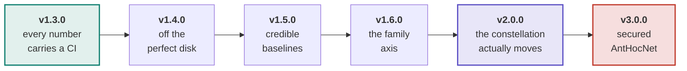
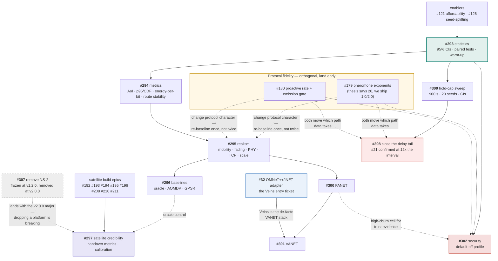

# Roadmap

The plan in one page. The authoritative, living version is
[#298](https://github.com/danieljoppi/AntHocNet/issues/298) — it carries the
literature gap analysis the epics came from, and issue state is always truer
than a checked-in diagram. This page exists because the *ordering constraints*
are the part that is hard to hold in your head, and a graph shows them better
than prose.

## How this plan is tracked

Each roadmap issue carries a **`release:` label**, so every column of this plan
is a live query rather than a diagram that drifts:

| Release | Board |
|---|---|
| v1.3.0 | [`release:v1.3.0`](https://github.com/danieljoppi/AntHocNet/issues?q=is%3Aopen+label%3A%22release%3Av1.3.0%22) |
| v1.4.0 | [`release:v1.4.0`](https://github.com/danieljoppi/AntHocNet/issues?q=is%3Aopen+label%3A%22release%3Av1.4.0%22) |
| v1.5.0 | [`release:v1.5.0`](https://github.com/danieljoppi/AntHocNet/issues?q=is%3Aopen+label%3A%22release%3Av1.5.0%22) |
| v1.6.0 | [`release:v1.6.0`](https://github.com/danieljoppi/AntHocNet/issues?q=is%3Aopen+label%3A%22release%3Av1.6.0%22) |
| v2.0.0 | [`release:v2.0.0`](https://github.com/danieljoppi/AntHocNet/issues?q=is%3Aopen+label%3A%22release%3Av2.0.0%22) |
| v3.0.0 | [`release:v3.0.0`](https://github.com/danieljoppi/AntHocNet/issues?q=is%3Aopen+label%3A%22release%3Av3.0.0%22) |
| all epics | [`epic`](https://github.com/danieljoppi/AntHocNet/issues?q=is%3Aopen+label%3Aepic) |

Labels, not milestones or a Projects board, because a label is visible in every
issue list and search without leaving the issues view, and because it survives
being edited by anyone with write access rather than needing project-level
permissions. A Projects v2 board over the same labels is a strict addition if
one is ever wanted — it would read these labels, not replace them.

Only issues the ladder actually gates are labelled. Most of the ~90 open issues
are unscheduled work that lands whenever it lands; putting a `release:` on
everything would make the query useless.

## Release ladder

The order is not arbitrary — statistics come first because every later claim is
quoted with a confidence interval, and realism comes before baselines because
adding a baseline to a scenario set you are about to change means measuring
twice.

## Epics and what blocks what

Solid arrows are hard dependencies; dashed are "derisks / informs".

**The one sequencing rule worth memorising:** the fidelity fixes (#179, #180)
change the protocol's character, so they must land *before* v1.4.0's expensive
realism campaigns — otherwise every published grid is measured twice. They are
otherwise independent of the epic chain.

## What each release must show to ship

| Release | Exit criteria |
|---|---|
| **v1.3.0** | Every published table carries a 95 % CI — **met**: headline ([#110](https://github.com/danieljoppi/AntHocNet/issues/110)), hold-cap ([#309](https://github.com/danieljoppi/AntHocNet/issues/309)) and the pause/area/scale sweeps are all 20-seed with intervals, and the per-merge taxonomy runs at the 10-run floor ([#318](https://github.com/danieljoppi/AntHocNet/issues/318)); `bench_parse --ab` reports paired-difference CIs + Wilcoxon; runs-floor, CI-method-per-metric and warm-up policy documented in [methodology.md](benchmarks/methodology.md#statistical-policy-293). **Shipped** — tag cut 2026-08-04; [#110](https://github.com/danieljoppi/AntHocNet/issues/110), [#121](https://github.com/danieljoppi/AntHocNet/issues/121) and [#293](https://github.com/danieljoppi/AntHocNet/issues/293) closed with it. `v1.3.0` is also the **provenance pin for the whole published corpus** — see [Provenance](benchmarks/methodology.md#provenance-which-version-a-number-was-measured-at). |
| **v1.4.0** | Headline grid under ≥2 mobility × ≥2 channel models with a ranking-stability statement; TCP arm; a published 200-node point. **Plus a verdict on the delay tail** ([#308](https://github.com/danieljoppi/AntHocNet/issues/308)) — either a measured statement that it is the price of the delivery advantage, or a change that reduces it. **Status:** 200-node point ✅ (published as `scale` f = 2.0, [#110](https://github.com/danieljoppi/AntHocNet/issues/110)). Delay-tail verdict ✅ — the [#308 hold-cap ablation](https://github.com/danieljoppi/AntHocNet/issues/308#issuecomment-5211529535) shows causally, at 20 seeds with AODV byte-identical across arms, that the tail and the delivery advantage are one mechanism; it also found the 1 s default is not on the efficient frontier ([#371](https://github.com/danieljoppi/AntHocNet/issues/371)). Grid ✅ — [six cells](https://github.com/danieljoppi/AntHocNet/issues/295#issuecomment-5225587376) at 20 seeds, {`rwp`, `ssrwp`, `gaussmarkov`} × {`tworay`, `nakagami`} ([#61](https://github.com/danieljoppi/AntHocNet/issues/61), [#60](https://github.com/danieljoppi/AntHocNet/issues/60)). **Ranking-stability statement, scoped:** the *delivery* and *overhead* rankings are stable in every cell (ΔPDR +11.0…+22.1 pp, ΔNRL −26.9…−30.1, all intervals disjoint, all p ≤ 9.6e-05) — but the ***tail* ranking inverts with the channel**: OLSR holds the best `delay99` under two-ray (22–69 ms) and the **worst** under fading (2685–2961 ms), while AntHocNet moves from 4th to 2nd. A tail claim that does not name its channel is unsupported. TCP arm ✅ **published** ([tcp.md](benchmarks/tcp.md), [#391](https://github.com/danieljoppi/AntHocNet/issues/391)) — 20 seeds at `0b42c89`, same-commit UDP control reproducing the published `rwp × tworay` cell exactly (all 80 per-seed rows field-for-field): AntHocNet leads goodput (+319.2 kbps over AODV, 95 % CI [+256.4, +382.1], 20/20 seeds, p = 1.9 × 10⁻⁶) but **ties OLSR** (+10.1, p = 0.43), and **the TCP ranking reorders the UDP one** — AODV falls from 3rd to last, DSDV rises past it. A transport claim that does not name its transport is unsupported; the published delivery ordering is a UDP/CBR ordering. Instrumentation for that arm ✅ — [#389](https://github.com/danieljoppi/AntHocNet/issues/389) widened the data-packet predicate so `drop_mac`/`drop_chan` and the route-quality family stop reading structurally zero under TCP, [confirmed by a pre-registered A/B](https://github.com/danieljoppi/AntHocNet/issues/389#issuecomment-5232649715) (UDP arm byte-identical; TCP drop-cause `sum` 93.3–96.0 → 97.2–100.0). **Shipped** — tag cut 2026-08-09 ([release v1.4.0](https://github.com/danieljoppi/AntHocNet/releases/tag/v1.4.0), install bundle + checksums published; the version DOI awaits the manual Zenodo backfill into `CITATION.cff`). All exit criteria met; closeout decisions recorded 2026-08-09. The delay-tail verdict closed [#308](https://github.com/danieljoppi/AntHocNet/issues/308)/[#21](https://github.com/danieljoppi/AntHocNet/issues/21) — the tail is the price of the delivery advantage, one mechanism, causally shown — and v1.4.0 ships at the 1 s `ReconvHoldCap` (delivery-biased end of the measured frontier; the 200 ms default change [scheduled into the v1.5.0 re-baseline](https://github.com/danieljoppi/AntHocNet/issues/371#issuecomment-5233019767) has since landed as the [#371](https://github.com/danieljoppi/AntHocNet/issues/371) flip, and the operating point is documented in [configuration.md](configuration.md)). [#365](https://github.com/danieljoppi/AntHocNet/issues/365) closed by accepting the version pins. The fading drop-attribution pair ([#386](https://github.com/danieljoppi/AntHocNet/issues/386)/[#377](https://github.com/danieljoppi/AntHocNet/issues/377)) moved to `v1.5.0` — not in the exit criteria, and the columns it concerns are withheld from every published table, so no wrong number ships. |
| **v1.5.0** | Oracle control in both suites; AOMDV and GPSR spikes resolved (working arm **or** a written infeasibility verdict with threat-to-validity text). **Plan:** four workstreams want the same cells at defaults that are themselves changing — the [#371](https://github.com/danieljoppi/AntHocNet/issues/371) hold-cap flip, the [#386](https://github.com/danieljoppi/AntHocNet/issues/386) re-injection cap sweep, its publishable detector A/B, and [#296](https://github.com/danieljoppi/AntHocNet/issues/296)'s oracle arm. [`v1.5.0-campaign.md`](benchmarks/v1.5.0-campaign.md) sequences them into **one** campaign (flip → re-baseline → cap×detector → oracle) so nothing is measured twice at three different configurations — the [#365](https://github.com/danieljoppi/AntHocNet/issues/365) failure, avoided prospectively. **All phases complete (2026-08-15).** Phase 0: [#402](https://github.com/danieljoppi/AntHocNet/issues/402) landed ([#407](https://github.com/danieljoppi/AntHocNet/pull/407)). Phase 1: the flip merged as [#411](https://github.com/danieljoppi/AntHocNet/pull/411) (`a1daa7a`) and the six-cell grid is [re-baselined and republished](benchmarks/grid.md) at the 200 ms default with baselines byte-identical to the v1.4.0 corpus ([#371 readout](https://github.com/danieljoppi/AntHocNet/issues/371#issuecomment-5273092510)). Phase 2: the cap × detector sweep ran at 20 seeds and is [published](benchmarks/reinjection.md) — the detector A/B confirms **+5.55/+6.54 pp PDR**, the duplicate rate is **65–67 %** by direct measurement, and neither pre-registered auto-criterion fired, so `MaxReinjectPerPacket` stays unlimited ([#386 readout](https://github.com/danieljoppi/AntHocNet/issues/386#issuecomment-5279088201)). Phase 3: the oracle control is [measured in both suites](benchmarks/grid.md) — **100 % of AntHocNet's two-ray PDR shortfall is routing rather than channel** (95.5–95.8 % under fading), and the exact `approx=0` [ISL torus](benchmarks/satellite/isl-grid.md) shows every arm already at the bound there ([#415 readout](https://github.com/danieljoppi/AntHocNet/issues/415#issuecomment-5297098438)). **Exit criteria met — with both spikes resolved as verdicts, not as arms.** The oracle runs in both suites ✅. AOMDV ✅ and GPSR ✅ each ended in a written infeasibility verdict with the threat-to-validity text the criterion requires ([#414](https://github.com/danieljoppi/AntHocNet/pull/414), [#427](https://github.com/danieljoppi/AntHocNet/pull/427), [methodology](benchmarks/methodology.md#the-resulting-threat-to-validity)). GPSR's verdict is the late one: [#412](https://github.com/danieljoppi/AntHocNet/pull/412) merged it on a green five-version matrix + ASan, and its first measurement — dispatched only after the campaign, because phase 3's protocol list never included it — put it at **0.00 % PDR on 40/40 seeds**, with the `aodv` control byte-identical to the corpus so the fault is inside the module ([#425](https://github.com/danieljoppi/AntHocNet/issues/425)). **So v1.5.0 ships with no geographic and no multipath arm**, both documented rather than silently absent, and the published comparison is the 2004–2005 anchors plus the global-knowledge upper bound. This is [#414](https://github.com/danieljoppi/AntHocNet/pull/414)'s lesson recurring in the very arm whose risk note cited it — hence the standing rule now recorded in [methodology.md](benchmarks/methodology.md): **no baseline merges without a smoke run showing non-zero delivery and a drop book that closes.** |
| **v1.6.0** | README family table shows ≥4 supported families, each with a results page, plus a cross-family ranking-stability statement. **Plus the OMNeT++/INET adapter** ([#32](https://github.com/danieljoppi/AntHocNet/issues/32)) — VANET evaluation runs on Veins, so the adapter is what makes #301 a real arm rather than an ns-3 approximation of one. |
| **v2.0.0** | A committed time-varying Walker result: scheduled handovers, failure overlay, oracle + geographic comparators, handover metric family, calibration deltas vs Hypatia/LENS. **Also the NS-2 removal** ([#307](https://github.com/danieljoppi/AntHocNet/issues/307)) — dropping a supported platform is breaking, so it lands with a major. |
| **v3.0.0** | Four-protocol vulnerability table under blackhole/grayhole; defense profile recovering PDR under attack while reading **NOISE** in benign scenarios; `EnableSecurity=false` path proven byte-identical. |

### What the v1.5.0 campaign left behind

The campaign shipped its exit criteria and generated a tail of work that is
**deliberately unscheduled** — per the labelling rule above, only issues the
ladder gates carry a `release:` label, and none of these gate a release. They
are listed here because they are the campaign's findings, and a reader deciding
what to pick up next should not have to reconstruct them from closed threads.

| issue | what it is | why it is not scheduled |
|---|---|---|
| [#425](https://github.com/danieljoppi/AntHocNet/issues/425) | the `gpsr` arm delivers zero packets — vendored, repaired, beacons, forwards nothing | **closed 2026-08-16** — [PR #441](https://github.com/danieljoppi/AntHocNet/pull/441): `RouteOutput` had no broadcast branch, so the port's own hellos were greedy-routed against an empty neighbour table and dropped on loopback (cold-start deadlock). PDR 0.0 → 67.1 on the delivery-gate scenario; the gate now proves the arm routes on every PR. The v1.5.0 published verdict stands for the v1.5.0 corpus; a geographic arm is available to future campaigns |
| [#429](https://github.com/danieljoppi/AntHocNet/issues/429) | enforce the baseline smoke-run rule with a gate | **closed 2026-08-16** — [PR #439](https://github.com/danieljoppi/AntHocNet/pull/439) merged `ns3/tools/check-arm-delivery.sh`: every arm the compare harness advertises runs per-PR on a static multi-hop field (3.42 leg), with an unconditional PDR floor, an oracle anchor, and gpsr/aomdv carried as expected-fails that fail the gate the moment they start delivering |
| [#416](https://github.com/danieljoppi/AntHocNet/issues/416) | the AOMDV `Path*` aliasing audit | **closed 2026-08-16** — [PR #446](https://github.com/danieljoppi/AntHocNet/pull/446): three `RecvReply` defects (RREQ-id cache queried by RREP destination instead of origin, forward paths installed with the originator as next hop, the invalid-seqno acceptance rule present only as a comment) plus the aliasing crash they masked. Gate scenario SIGSEGV → 84.4 % PDR at hopsMean 5.21; `KNOWN_BROKEN` is now **empty** — every arm routes and is proven per-PR. The arm works but does not yet compete (18.6 % vs AODV 34.3 % on the wifi smoke); the Marina & Das directional-acceptance work stays in the issue thread for a future campaign. The v1.5.0 published verdict stands for the v1.5.0 corpus |
| [#431](https://github.com/danieljoppi/AntHocNet/issues/431) | the oracle is exact only on wired topologies | **reopened 2026-08-18; six-cell re-measure [complete](https://github.com/danieljoppi/AntHocNet/issues/431#issuecomment-5339246820) 2026-08-19.** [PR #457](https://github.com/danieljoppi/AntHocNet/pull/457) derived the fading adjacency from the installed PHY, but the re-measure meant to accept it failed the hop gate in all six cells — and auditing that failure found the cause was not the oracle. The harness drew flow start times from an arm-dependent RNG stream, so `##COMMON##`'s `(flow, seq)` keys named packets *sent at different times in each arm* ([PR #459](https://github.com/danieljoppi/AntHocNet/pull/459)). Re-measured on the fixed harness at 20 seeds the real arms reproduce to within ±0.015 hops while the oracle alone falls 0.50–0.81: **the hop bound now holds 20/20 seeds against every arm on all three two-ray cells** — the first time it has held un-suppressed on wifi, and the bar this issue set. It still fails on the three fading cells, but narrowly and identically across them (oracle above olsr +0.028…+0.038, above dsdv +0.149…+0.167, 20/20 seeds), which is the measured size of `p50-approx`'s missing links rather than a defect in any arm. The delivery bound held 120/120 seeds throughout. **Stays open for the fading half only**, now a sharper question than when filed: the two acceptance constraints pull in opposite directions — shrink the radius and the oracle's hops exceed its subjects, grow it and its PDR falls below them (the refuted link-budget rule, 30.4 % PDR) — so if no fading radius satisfies both, the answer is an ETX-shaped graph or an accepted limit, not more tuning |
| [#460](https://github.com/danieljoppi/AntHocNet/issues/460) | every published `##COMMON##` identity-matched number was measured on a time-scrambled matched set | **filed 2026-08-19**, the blast radius of the #459 defect, split out so the fix and the affected claims are tracked apart. `grid.md`'s matched-hop and matched-latency tables and `methodology.md`'s hop-bound paragraph are restated in [PR #463](https://github.com/danieljoppi/AntHocNet/pull/463); the `metrics.md` precondition shipped in [PR #461](https://github.com/danieljoppi/AntHocNet/pull/461); the satellite suite was cleared outright (it never emitted `##COMMON##`). Per-arm statistics — PDR, delay, delay99 as reported, NRL, the delivery decomposition's *ranking* — are unaffected. **Two items remain**: the ICNS3 paper's identity-matched row (`+395.2 ± 30.6 ms`) needs its own 900 s/20-seed dispatch on ≥ #459, and `grid.md`'s gap decomposition needs a decision on which oracle it divides by — #457's derived radius moves the channel term from 0.00–0.59 pp to 1.80–4.00 pp and the routing share from 95.5–98.3 % to 67.0–88.4 %, and the 300 m disk is the more conservative delivery reference while the derived radius is the better adjacency model |
| [#432](https://github.com/danieljoppi/AntHocNet/issues/432) | run the satellite adversarial cells with the oracle arm | corridor + failcell **measured and [published](benchmarks/satellite/isl-grid.md#the-adversarial-cells-corridor-and-failcell-432) 2026-08-16** ([PR #442](https://github.com/danieljoppi/AntHocNet/pull/442)) — the suite's first discriminating results: AntHocNet beats the congestion-blind bound on corridor delay (paired −41.6 ms CI [−60.9, −22.2], quotable only with the lock-in caveat), and the failcell's reconvergence instrument puts AntHocNet/AODV on the oracle's 0.86 s floor with OLSR 5× slower. Item 3 closed it out ([PR #453](https://github.com/danieljoppi/AntHocNet/pull/453)/[#455](https://github.com/danieljoppi/AntHocNet/pull/455), 2026-08-17): the designed seam cell — a 6×6 torus with the wrap seam cut, wrong choices priced at +20 ms — **also ties the exact oracle floor at 20 seeds**, so static irregularity cannot discriminate either; static-suite discrimination comes only from load or event instruments, and the dynamics residue is subsumed by [#297](https://github.com/danieljoppi/AntHocNet/issues/297). **Issue closed** |
| [#430](https://github.com/danieljoppi/AntHocNet/issues/430) | a re-injection remedy that distinguishes redundant from delivering | capping by count was measured and rejected; the waste is real but the first remedy tried was the wrong instrument |
| [#433](https://github.com/danieljoppi/AntHocNet/issues/433) | `RepairHoldCap`, the unmeasured half of the hold-cap frontier | changing it supersedes the corpus again — **fold into whatever campaign next re-baselines the grid**, exactly as #371 was folded into this one |
| [#423](https://github.com/danieljoppi/AntHocNet/issues/423) | `##ORACLE##` missing from the compact block; oracle `noRoute` in no drop bucket | item 1 closed by [PR #438](https://github.com/danieljoppi/AntHocNet/pull/438) (re-emit added, and the marker re-emit list is now CI-gated). **Item 2 is now settled, and this row previously mis-stated it** ([evidence](https://github.com/danieljoppi/AntHocNet/issues/423#issuecomment-5455265085)): the `noRoute` packets are neither retried nor mis-bucketed — `RouteOutput` returns `nullptr`, the send fails at the socket layer, and the packet reaches neither the drop book nor the PDR denominator. Measured: **100.0 % PDR on a seed with 4512 refused sends**. It is a validity defect in the arm the delivery decomposition divides by, not a diagnostic, and it does touch a published number — the v1.5.0 grid ran under the 300 m disk and carried `noRoute` of 225/44/25/12/8/2, making its oracle PDR optimistic by ≈0.2 pp. Carried forward as [#464](https://github.com/danieljoppi/AntHocNet/issues/464) |
| [#464](https://github.com/danieljoppi/AntHocNet/issues/464) | the oracle's refused sends are absent from both the drop book and the PDR denominator | **filed 2026-08-23**, out of #423 item 2. **117 of the 120** re-measured grid seeds carry no refusals; three fading seeds carry 2, 2 and 30 failed lookups (#457's PHY-derived radii keep the field connected where the 300 m disk did not, but not everywhere). Nothing published from the #431 re-measure moves at the precision it is quoted to — 34 refused lookups against ~120 000 offered packets per cell is worth hundredths of a point — and the matched-hop tables are untouched regardless, since a refused packet is delivered by no arm and so can never enter the `##COMMON##` intersection. Wants three things: count refused sends as offered, make `scenario_check.py` FAIL the `noRoute > 0` ∧ `route == 0.00` contradiction (today it is a WARN among twenty, which is how a gate stops being read), and give the counter the a-priori control the #229/#230 rule requires |
| [#230](https://github.com/danieljoppi/AntHocNet/issues/230) | the interleaving path-diversity counter | the gate is fixed and the columns are marked unpublishable; the clean instrument still wants a CI dispatch to validate |

**The one lesson worth carrying forward.** Two of the three non-reference arms
attempted in this campaign compiled, passed a five-version matrix and ASan, and
did not forward a single packet. The oracle did not fail that way because
delivery numbers were in its acceptance criteria and a smoke run was required
before merge. That difference — not diligence, not luck — is why #429 exists,
and it is the rule the next vendored baseline should inherit. Since 2026-08-16
the rule is enforced per-PR ([#439](https://github.com/danieljoppi/AntHocNet/pull/439)),
and the sibling failure class — the hand-maintained module/arm/marker
allowlists whose fifth silent miss blocked the v1.5.0 release images
([#435](https://github.com/danieljoppi/AntHocNet/issues/435)) — is gated
against tree-derived ground truth in the same pass
([#438](https://github.com/danieljoppi/AntHocNet/pull/438)).

## Platform support

**NS-2 is being retired.** `v1.2.0` is the **last release in which NS-2 was
actively supported** ([#307](https://github.com/danieljoppi/AntHocNet/issues/307)):
the adapter is frozen — no new NS-2 work lands — but it still ships through the
rest of the `v1.x` line, and the **removal itself lands at v2.0.0** (dropping a
platform is breaking, so it needs a major). Anyone who needs NS-2 should pin the `v1.2.0` tag or its
immutable images (`ghcr.io/danieljoppi/anthocnet-ns2:2.34-v1.2.0` /
`:2.35-v1.2.0`) — already-published tags are not withdrawn, and v1.2.0 stays
citable at its version DOI.

The reasoning is in #307; the short version is that NS-2 is the only target
requiring edits inside the simulator's own tree, it never got a benchmark
harness (#25), and contemporary reviewers read NS-2 in a 2026 paper as a
reproducibility red flag rather than a credential.

What this does **not** change: the simulator-agnostic core, the ports seam, and
the "no NS headers in `core/`" golden rule all stay.

### Why OMNeT++ (#32) is scheduled at v1.6.0, not v2.0.0

The obvious reason to build a second adapter is to keep proving the core is
simulator-agnostic once NS-2 is gone. That reason is **weaker than it looks**:
`v1.2.0` is tagged, immutable and DOI-pinned, so the two-adapter demonstration
stays permanently citable after removal. Nobody can claim the seam was never
exercised — they can check out the tag and exercise it.

The reason that does hold up is **audience**. VANET evaluation happens on
Veins (OMNeT++ + SUMO); it is the de-facto stack for the family, and ns-3 has
no equal-status counterpart. OMNeT++/INET is also co-dominant with ns-3 in
contemporary MANET protocol comparisons. So the adapter is not overhead paid
to defend an architectural claim — it is the entry ticket to the VANET epic
([#301](https://github.com/danieljoppi/AntHocNet/issues/301)), which is why it
is scheduled with the family axis at **v1.6.0** rather than alongside the NS-2
removal at v2.0.0.

Satellite is the counter-case and the reason not to schedule it any earlier:
LEO/constellation work is overwhelmingly ns-3 (Hypatia, ns-3-leo), so #297
gains nothing from an OMNeT++ adapter.

**Honest caveat on the usage claim.** No bibliometric study we found reports
2024–2026 simulator shares for this field, so "co-dominant" and "de-facto" are
judgements from the recent MANET/VANET evaluation literature and from which
toolchains those papers actually run on — not measured percentages. They
should not be quoted as statistics in a publication.

## Deliberate non-goals

Recorded with the reasoning that would reverse each — see the rationale comment
on [#298](https://github.com/danieljoppi/AntHocNet/issues/298). Briefly: a DRL
baseline is *planned but gated* (a leaky comparison would damage credibility);
Sionna RT ray tracing is an upgrade path, not a goal; WSN/IoT (RPL's problem),
DTN store-carry-forward (a capability the protocol structurally lacks), and
NR-V2X sidelink (a different L2/PHY stack) are out.

Security was a non-goal and was **reversed** by converting the objection into a
design constraint ([ADR-0020](adr/0020-security-is-a-default-off-profile.md)) —
that is the template for revisiting any of the others.

## See also

- [#298](https://github.com/danieljoppi/AntHocNet/issues/298) — the roadmap issue: gap analysis, the three literature surveys, live status.
- [ADR-0019](adr/0019-network-families-change-the-evaluation-not-the-protocol.md) — why family support is scenario work, never per-family protocol defaults.
- [ADR-0020](adr/0020-security-is-a-default-off-profile.md) — why security is a default-off profile rather than a fork.
- [`network-regimes.md`](network-regimes.md) · [`software-layers.md`](software-layers.md) · [`ant-types.md`](ant-types.md) — the regime and mechanism references the epics build on.
