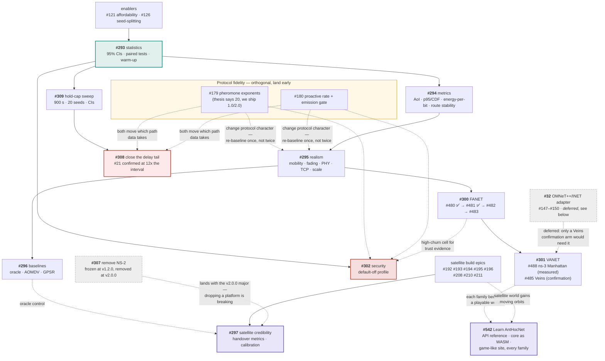

# Roadmap

The plan in one page. The authoritative, living version is
[#298](https://github.com/danieljoppi/AntHocNet/issues/298) — it carries the
literature gap analysis the epics came from, and issue state is always truer
than a checked-in diagram. This page exists because the *ordering constraints*
are the part that is hard to hold in your head, and a graph shows them better
than prose.

## How this plan is tracked

Each roadmap issue carries a **`release:` label**, so every column of this plan
is a live query rather than a diagram that drifts:

| Release | Board |
|---|---|
| v1.3.0 | [`release:v1.3.0`](https://github.com/danieljoppi/AntHocNet/issues?q=is%3Aopen+label%3A%22release%3Av1.3.0%22) |
| v1.4.0 | [`release:v1.4.0`](https://github.com/danieljoppi/AntHocNet/issues?q=is%3Aopen+label%3A%22release%3Av1.4.0%22) |
| v1.5.0 | [`release:v1.5.0`](https://github.com/danieljoppi/AntHocNet/issues?q=is%3Aopen+label%3A%22release%3Av1.5.0%22) |
| v1.6.0 | [`release:v1.6.0`](https://github.com/danieljoppi/AntHocNet/issues?q=is%3Aopen+label%3A%22release%3Av1.6.0%22) |
| v1.7.0 | [`release:v1.7.0`](https://github.com/danieljoppi/AntHocNet/issues?q=is%3Aopen+label%3A%22release%3Av1.7.0%22) |
| v1.8.0 | [`release:v1.8.0`](https://github.com/danieljoppi/AntHocNet/issues?q=is%3Aopen+label%3A%22release%3Av1.8.0%22) |
| v1.9.0 | [`release:v1.9.0`](https://github.com/danieljoppi/AntHocNet/issues?q=is%3Aopen+label%3A%22release%3Av1.9.0%22) |
| v2.0.0 | [`release:v2.0.0`](https://github.com/danieljoppi/AntHocNet/issues?q=is%3Aopen+label%3A%22release%3Av2.0.0%22) |
| v2.2.0 | [`release:v2.2.0`](https://github.com/danieljoppi/AntHocNet/issues?q=is%3Aopen+label%3A%22release%3Av2.2.0%22) |
| v2.3.0 | [`release:v2.3.0`](https://github.com/danieljoppi/AntHocNet/issues?q=is%3Aopen+label%3A%22release%3Av2.3.0%22) |
| v2.4.0 | [`release:v2.4.0`](https://github.com/danieljoppi/AntHocNet/issues?q=is%3Aopen+label%3A%22release%3Av2.4.0%22) |
| v2.5.0 | [`release:v2.5.0`](https://github.com/danieljoppi/AntHocNet/issues?q=is%3Aopen+label%3A%22release%3Av2.5.0%22) |
| v3.1.0 | [`release:v3.1.0`](https://github.com/danieljoppi/AntHocNet/issues?q=is%3Aopen+label%3A%22release%3Av3.1.0%22) |
| v3.2.0 | [`release:v3.2.0`](https://github.com/danieljoppi/AntHocNet/issues?q=is%3Aopen+label%3A%22release%3Av3.2.0%22) |
| v3.3.0 | [`release:v3.3.0`](https://github.com/danieljoppi/AntHocNet/issues?q=is%3Aopen+label%3A%22release%3Av3.3.0%22) |
| v3.0.0 | [`release:v3.0.0`](https://github.com/danieljoppi/AntHocNet/issues?q=is%3Aopen+label%3A%22release%3Av3.0.0%22) |
| all epics | [`epic`](https://github.com/danieljoppi/AntHocNet/issues?q=is%3Aopen+label%3Aepic) |

Labels, not milestones or a Projects board, because a label is visible in every
issue list and search without leaving the issues view, and because it survives
being edited by anyone with write access rather than needing project-level
permissions. A Projects v2 board over the same labels is a strict addition if
one is ever wanted — it would read these labels, not replace them.

Only issues the ladder actually gates are labelled. Most of the ~90 open issues
are unscheduled work that lands whenever it lands; putting a `release:` on
everything would make the query useless.

## Release ladder

```mermaid
flowchart LR
    V13["<b>v1.3.0</b><br/>every number<br/>carries a CI"]
    V14["<b>v1.4.0</b><br/>off the<br/>perfect disk"]
    V15["<b>v1.5.0</b><br/>credible<br/>baselines"]
    V16["<b>v1.6.0</b><br/>fix + feature<br/>roll-up"]
    V17["<b>v1.7.0</b><br/>family axis I:<br/>FANET + static mesh"]
    V18["<b>v1.8.0</b><br/>fix + restatement<br/>roll-up (CBR, #521)"]
    V19["<b>v1.9.0</b><br/>family axis II:<br/>VANET (ns-3)"]
    V20["<b>v2.0.0</b><br/>the constellation<br/>actually moves<br/>+ learn site"]
    V21["<b>v2.1.0</b><br/>game as front page<br/>+ orbits roll-up"]
    V22["<b>v2.2.0</b><br/>close the<br/>measured gaps"]
    V23["<b>v2.3.0</b><br/>regime-gated<br/>mechanisms"]
    V24["<b>v2.4.0</b><br/>family axis III:<br/>disaster + SAGIN"]
    V25["<b>v2.5.0</b><br/>adaptive-routing<br/>comparators"]
    V30["<b>v3.0.0</b><br/>secured<br/>AntHocNet"]
    V31["<b>v3.1.0</b><br/>secure-routing<br/>comparators"]
    V32["<b>v3.2.0</b><br/>secure swarm<br/>comparators"]
    V33["<b>v3.3.0</b><br/>wider threat<br/>model"]

    V13 --> V14 --> V15 --> V16 --> V17 --> V18 --> V19 --> V20 --> V21 --> V22 --> V23 --> V24 --> V25 --> V30 --> V31 --> V32 --> V33

    style V13 fill:#e2f0ed,stroke:#0f7f70,stroke-width:2px
    style V20 fill:#e8e6f8,stroke:#5b4fc4,stroke-width:2px
    style V22 fill:#fff8e6,stroke:#c48f00,stroke-dasharray:4 3
    style V23 fill:#fff8e6,stroke:#c48f00,stroke-dasharray:4 3
    style V24 fill:#fff8e6,stroke:#c48f00,stroke-dasharray:4 3
    style V25 fill:#fff8e6,stroke:#c48f00,stroke-dasharray:4 3
    style V31 fill:#fff8e6,stroke:#c48f00,stroke-dasharray:4 3
    style V32 fill:#fff8e6,stroke:#c48f00,stroke-dasharray:4 3
    style V33 fill:#fff8e6,stroke:#c48f00,stroke-dasharray:4 3
    style V30 fill:#f6dede,stroke:#c0392b,stroke-width:2px
```

Amber releases are the **post-v2.0.0 replan, accepted 2026-10-09** (#561) and
not yet started — see [Replan after v2.0.0](#replan-after-v200-accepted-2026-10-09).

The order is not arbitrary — statistics come first because every later claim is
quoted with a confidence interval, and realism comes before baselines because
adding a baseline to a scenario set you are about to change means measuring
twice.

## Epics and what blocks what

Solid arrows are hard dependencies; dashed are "derisks / informs".

```mermaid
flowchart TB
    subgraph FID["Protocol fidelity — orthogonal, land early"]
        F179["#179 pheromone exponents<br/>(thesis says 20, we ship 1.0/2.0)"]
        F180["#180 proactive rate + emission gate"]
    end

    E293["<b>#293</b> statistics<br/>95% CIs · paired tests · warm-up"]
    E294["<b>#294</b> metrics<br/>AoI · p95/CDF · energy-per-bit · route stability"]
    E295["<b>#295</b> realism<br/>mobility · fading · PHY · TCP · scale"]
    E296["<b>#296</b> baselines<br/>oracle · AOMDV · GPSR"]
    E300["<b>#300</b> FANET<br/>#480 ✅ → #481 ✅ → #482 → #483"]
    E301["<b>#301</b> VANET<br/>#488 ns-3 Manhattan (measured)<br/>#485 Veins (confirmation)"]
    E297["<b>#297</b> satellite credibility<br/>handover metrics · calibration"]
    E302["<b>#302</b> security<br/>default-off profile"]
    E307["<b>#307</b> remove NS-2<br/>frozen at v1.2.0, removed at v2.0.0"]
    E32["<b>#32</b> OMNeT++/INET adapter<br/>#147–#150 · <i>deferred</i>, see below"]
    E542["<b>#542</b> Learn AntHocNet<br/>API reference · core as WASM ·<br/>game-like site, every family"]

    SATBUILD["satellite build epics<br/>#192 #193 #194 #195 #196<br/>#208 #210 #211"]
    ENABLE["enablers<br/>#121 affordability · #126 seed-splitting"]
    I309["<b>#309</b> hold-cap sweep<br/>900 s · 20 seeds · CIs"]
    E308["<b>#308</b> close the delay tail<br/>#21 confirmed at 12x the interval"]

    ENABLE --> E293
    E293 --> I309
    I309 --> E308
    F179 & F180 -.->|"both move which path<br/>data takes"| E308
    F179 & F180 -.->|"change protocol character —<br/>re-baseline once, not twice"| E295
    E293 --> E294 --> E295 --> E296
    E295 --> E300 --> E301
    E296 -.->|"oracle control"| E297
    SATBUILD --> E297
    E293 --> E302
    F179 & F180 -.-> E302
    E307 -.->|"lands with the v2.0.0 major —<br/>dropping a platform is breaking"| E297
    E32 -.->|"deferred: only a Veins<br/>confirmation arm would need it"| E301
    E300 -.->|"high-churn cell for<br/>trust evidence"| E302
    E301 -.->|"each family becomes<br/>a playable world"| E542
    SATBUILD -.->|"satellite world gains<br/>moving orbits"| E542

    style E293 fill:#e2f0ed,stroke:#0f7f70,stroke-width:2px
    style E297 fill:#e8e6f8,stroke:#5b4fc4,stroke-width:2px
    style E302 fill:#f6dede,stroke:#c0392b,stroke-width:2px
    style E307 fill:#eee,stroke:#888,stroke-dasharray:4 3
    style E32 fill:#eee,stroke:#888,stroke-dasharray:4 3
    style E542 fill:#e8e6f8,stroke:#5b4fc4,stroke-width:2px
    style E308 fill:#fde9e9,stroke:#c0392b,stroke-width:2px
    style FID fill:#fff8e6,stroke:#c48f00
```

**The one sequencing rule worth memorising:** the fidelity fixes (#179, #180)
change the protocol's character, so they must land *before* v1.4.0's expensive
realism campaigns — otherwise every published grid is measured twice. They are
otherwise independent of the epic chain.

## What each release must show to ship

| Release | Exit criteria |
|---|---|
| **v1.3.0** | Every published table carries a 95 % CI — **met**: headline ([#110](https://github.com/danieljoppi/AntHocNet/issues/110)), hold-cap ([#309](https://github.com/danieljoppi/AntHocNet/issues/309)) and the pause/area/scale sweeps are all 20-seed with intervals, and the per-merge taxonomy runs at the 10-run floor ([#318](https://github.com/danieljoppi/AntHocNet/issues/318)); `bench_parse --ab` reports paired-difference CIs + Wilcoxon; runs-floor, CI-method-per-metric and warm-up policy documented in [methodology.md](benchmarks/methodology.md#statistical-policy-293). **Shipped** — tag cut 2026-08-04; [#110](https://github.com/danieljoppi/AntHocNet/issues/110), [#121](https://github.com/danieljoppi/AntHocNet/issues/121) and [#293](https://github.com/danieljoppi/AntHocNet/issues/293) closed with it. `v1.3.0` is also the **provenance pin for the whole published corpus** — see [Provenance](benchmarks/methodology.md#provenance-which-version-a-number-was-measured-at). |
| **v1.4.0** | Headline grid under ≥2 mobility × ≥2 channel models with a ranking-stability statement; TCP arm; a published 200-node point. **Plus a verdict on the delay tail** ([#308](https://github.com/danieljoppi/AntHocNet/issues/308)) — either a measured statement that it is the price of the delivery advantage, or a change that reduces it. **Status:** 200-node point ✅ (published as `scale` f = 2.0, [#110](https://github.com/danieljoppi/AntHocNet/issues/110)). Delay-tail verdict ✅ — the [#308 hold-cap ablation](https://github.com/danieljoppi/AntHocNet/issues/308#issuecomment-5211529535) shows causally, at 20 seeds with AODV byte-identical across arms, that the tail and the delivery advantage are one mechanism; it also found the 1 s default is not on the efficient frontier ([#371](https://github.com/danieljoppi/AntHocNet/issues/371)). Grid ✅ — [six cells](https://github.com/danieljoppi/AntHocNet/issues/295#issuecomment-5225587376) at 20 seeds, {`rwp`, `ssrwp`, `gaussmarkov`} × {`tworay`, `nakagami`} ([#61](https://github.com/danieljoppi/AntHocNet/issues/61), [#60](https://github.com/danieljoppi/AntHocNet/issues/60)). **Ranking-stability statement, scoped:** the *delivery* and *overhead* rankings are stable in every cell (ΔPDR +11.0…+22.1 pp, ΔNRL −26.9…−30.1, all intervals disjoint, all p ≤ 9.6e-05) — but the ***tail* ranking inverts with the channel**: OLSR holds the best `delay99` under two-ray (22–69 ms) and the **worst** under fading (2685–2961 ms), while AntHocNet moves from 4th to 2nd. A tail claim that does not name its channel is unsupported. TCP arm ✅ **published** ([tcp.md](benchmarks/tcp.md), [#391](https://github.com/danieljoppi/AntHocNet/issues/391)) — 20 seeds at `0b42c89`, same-commit UDP control reproducing the published `rwp × tworay` cell exactly (all 80 per-seed rows field-for-field): AntHocNet leads goodput (+319.2 kbps over AODV, 95 % CI [+256.4, +382.1], 20/20 seeds, p = 1.9 × 10⁻⁶) but **ties OLSR** (+10.1, p = 0.43), and **the TCP ranking reorders the UDP one** — AODV falls from 3rd to last, DSDV rises past it. A transport claim that does not name its transport is unsupported; the published delivery ordering is a UDP/CBR ordering. Instrumentation for that arm ✅ — [#389](https://github.com/danieljoppi/AntHocNet/issues/389) widened the data-packet predicate so `drop_mac`/`drop_chan` and the route-quality family stop reading structurally zero under TCP, [confirmed by a pre-registered A/B](https://github.com/danieljoppi/AntHocNet/issues/389#issuecomment-5232649715) (UDP arm byte-identical; TCP drop-cause `sum` 93.3–96.0 → 97.2–100.0). **Shipped** — tag cut 2026-08-09 ([release v1.4.0](https://github.com/danieljoppi/AntHocNet/releases/tag/v1.4.0), install bundle + checksums published; version DOI `10.5281/zenodo.21863774`, recorded in the [DOI table](../CONTRIBUTING.md#doi-record)). All exit criteria met; closeout decisions recorded 2026-08-09. The delay-tail verdict closed [#308](https://github.com/danieljoppi/AntHocNet/issues/308)/[#21](https://github.com/danieljoppi/AntHocNet/issues/21) — the tail is the price of the delivery advantage, one mechanism, causally shown — and v1.4.0 ships at the 1 s `ReconvHoldCap` (delivery-biased end of the measured frontier; the 200 ms default change [scheduled into the v1.5.0 re-baseline](https://github.com/danieljoppi/AntHocNet/issues/371#issuecomment-5233019767) has since landed as the [#371](https://github.com/danieljoppi/AntHocNet/issues/371) flip, and the operating point is documented in [configuration.md](configuration.md)). [#365](https://github.com/danieljoppi/AntHocNet/issues/365) closed by accepting the version pins. The fading drop-attribution pair ([#386](https://github.com/danieljoppi/AntHocNet/issues/386)/[#377](https://github.com/danieljoppi/AntHocNet/issues/377)) moved to `v1.5.0` — not in the exit criteria, and the columns it concerns are withheld from every published table, so no wrong number ships. |
| **v1.5.0** | Oracle control in both suites; AOMDV and GPSR spikes resolved (working arm **or** a written infeasibility verdict with threat-to-validity text). **Plan:** four workstreams want the same cells at defaults that are themselves changing — the [#371](https://github.com/danieljoppi/AntHocNet/issues/371) hold-cap flip, the [#386](https://github.com/danieljoppi/AntHocNet/issues/386) re-injection cap sweep, its publishable detector A/B, and [#296](https://github.com/danieljoppi/AntHocNet/issues/296)'s oracle arm. [`v1.5.0-campaign.md`](benchmarks/v1.5.0-campaign.md) sequences them into **one** campaign (flip → re-baseline → cap×detector → oracle) so nothing is measured twice at three different configurations — the [#365](https://github.com/danieljoppi/AntHocNet/issues/365) failure, avoided prospectively. **All phases complete (2026-08-15).** Phase 0: [#402](https://github.com/danieljoppi/AntHocNet/issues/402) landed ([#407](https://github.com/danieljoppi/AntHocNet/pull/407)). Phase 1: the flip merged as [#411](https://github.com/danieljoppi/AntHocNet/pull/411) (`a1daa7a`) and the six-cell grid is [re-baselined and republished](benchmarks/grid.md) at the 200 ms default with baselines byte-identical to the v1.4.0 corpus ([#371 readout](https://github.com/danieljoppi/AntHocNet/issues/371#issuecomment-5273092510)). Phase 2: the cap × detector sweep ran at 20 seeds and is [published](benchmarks/reinjection.md) — the detector A/B confirms **+5.55/+6.54 pp PDR**, the duplicate rate is **65–67 %** by direct measurement, and neither pre-registered auto-criterion fired, so `MaxReinjectPerPacket` stays unlimited ([#386 readout](https://github.com/danieljoppi/AntHocNet/issues/386#issuecomment-5279088201)). Phase 3: the oracle control is [measured in both suites](benchmarks/grid.md) — **100 % of AntHocNet's two-ray PDR shortfall is routing rather than channel** (95.5–95.8 % under fading), and the exact `approx=0` [ISL torus](benchmarks/satellite/isl-grid.md) shows every arm already at the bound there ([#415 readout](https://github.com/danieljoppi/AntHocNet/issues/415#issuecomment-5297098438)). **Exit criteria met — with both spikes resolved as verdicts, not as arms.** The oracle runs in both suites ✅. AOMDV ✅ and GPSR ✅ each ended in a written infeasibility verdict with the threat-to-validity text the criterion requires ([#414](https://github.com/danieljoppi/AntHocNet/pull/414), [#427](https://github.com/danieljoppi/AntHocNet/pull/427), [methodology](benchmarks/methodology.md#the-resulting-threat-to-validity)). GPSR's verdict is the late one: [#412](https://github.com/danieljoppi/AntHocNet/pull/412) merged it on a green five-version matrix + ASan, and its first measurement — dispatched only after the campaign, because phase 3's protocol list never included it — put it at **0.00 % PDR on 40/40 seeds**, with the `aodv` control byte-identical to the corpus so the fault is inside the module ([#425](https://github.com/danieljoppi/AntHocNet/issues/425)). **So v1.5.0 ships with no geographic and no multipath arm**, both documented rather than silently absent, and the published comparison is the 2004–2005 anchors plus the global-knowledge upper bound. This is [#414](https://github.com/danieljoppi/AntHocNet/pull/414)'s lesson recurring in the very arm whose risk note cited it — hence the standing rule now recorded in [methodology.md](benchmarks/methodology.md): **no baseline merges without a smoke run showing non-zero delivery and a drop book that closes.** |
| **v1.6.0** | *Not a roadmap goal.* Commitizen computes the version from commit types, and the `feat:` commits that followed v1.5.0 (#439, #447, #453, #457, #472, #474) made the next release a minor bump before the family axis had started. **Shipped 2026-09-26** as a fix-and-feature roll-up ([release v1.6.0](https://github.com/danieljoppi/AntHocNet/releases/tag/v1.6.0)); the family axis moved to v1.7.0–v1.9.0 ([#298 renumber](https://github.com/danieljoppi/AntHocNet/issues/298#issuecomment-5841671474)). |
| **v1.7.0** | **Family axis I — FANET + static mesh.** FANET ([#300](https://github.com/danieljoppi/AntHocNet/issues/300)) runs deterministically as `--scenario=fanet`, passes preflight, has its own anchor, and publishes a results page with CIs plus a MANET-vs-FANET ranking-stability statement. Work order: 3D plumbing [#480](https://github.com/danieljoppi/AntHocNet/issues/480) → 3D preflight [#481](https://github.com/danieljoppi/AntHocNet/issues/481) → preset + anchor [#482](https://github.com/danieljoppi/AntHocNet/issues/482) → campaign + page [#483](https://github.com/danieljoppi/AntHocNet/issues/483). The static Wi-Fi mesh family gets its results page from the existing `sparse-static` cell ([#484](https://github.com/danieljoppi/AntHocNet/issues/484), no harness work). FANET goes first because it has the direct literature hook and derisks the mobility plumbing VANET reuses. **Status (2026-10-02): exit criteria met.** • FANET ✅ ([#300](https://github.com/danieljoppi/AntHocNet/issues/300)), [results page](benchmarks/scenarios/fanet.md): &nbsp;&nbsp;– `--scenario=fanet` sourced preset and two analytic 3-D anchors ([#482](https://github.com/danieljoppi/AntHocNet/issues/482), PR #505). &nbsp;&nbsp;– Six-arm 20-seed campaign ([#483](https://github.com/danieljoppi/AntHocNet/issues/483)): AOMDV, the oracle at 100 ms ([#506](https://github.com/danieljoppi/AntHocNet/issues/506)), energy per delivered bit (PR #508). &nbsp;&nbsp;– AntHocNet leads every protocol in both cells: 94.41 % PDR in the main cell, 2.70 pp under the oracle, +11.48 pp over AODV. &nbsp;&nbsp;– MANET-vs-FANET ranking-stability statement: AntHocNet-first holds in every mobile cell measured. The classical protocols' order does not: OLSR falls from 74–89 % on MANET to 47.85 % at FANET speeds. &nbsp;&nbsp;– No geographic arm in 3-D (GPSR is planar), recorded as a threat to validity. • 3D plumbing ✅ ([#480](https://github.com/danieljoppi/AntHocNet/issues/480), PR #491) and 3D preflight ✅ ([#481](https://github.com/danieljoppi/AntHocNet/issues/481), PR #492). • Static mesh ✅ ([#484](https://github.com/danieljoppi/AntHocNet/issues/484)): [results page](benchmarks/static-mesh.md). Its `ReconvHoldCap` finding was the [#496](https://github.com/danieljoppi/AntHocNet/issues/496) hello-timer artifact; every pre-#496 AntHocNet ns-3 number carries it. • Found on the way, [#510](https://github.com/danieljoppi/AntHocNet/issues/510): stock OLSR's PDR omitted source-refused sends (the oracle's #464 defect). It read 2–5 pp high on the grid and 23.5 pp high on sparse FANET. Fixed in PR #511, and the grid page is restated from 20-seed OLSR re-runs. One grid ordering flips: AODV over OLSR in gaussmarkov-tworay. • Next: cut v1.7.0. **Shipped 2026-10-02.** **Restated after release ([#521](https://github.com/danieljoppi/AntHocNet/issues/521)).** Every data source ran ns-3's default 1 s on / 1 s off, so the v1.7.0 numbers above were measured at half the documented offered load. Every affected page is restated on the fix (PRs #524–#530, satellite also #531/#532); the FANET main cell now reads 94.43 % PDR, +8.32 pp over AODV. The figures in this row are the release-time record. |
| **v1.8.0** | *Not a roadmap goal* — a fix-and-restatement roll-up, as v1.6.0 was. The `feat:` commits after v1.7.0 (#519, #523) make the next release a minor bump, and the fixes it carries change what the v1.7.0 artifact measures: CBR sources at the documented rate ([#521](https://github.com/danieljoppi/AntHocNet/issues/521)), arm-independent flow schedules on the ISL grid ([#517](https://github.com/danieljoppi/AntHocNet/issues/517)), OLSR refused sends counted on the ISL grid ([#513](https://github.com/danieljoppi/AntHocNet/issues/513)), loopback TTL compensation ([#522](https://github.com/danieljoppi/AntHocNet/issues/522)), and per-seed route stability as `##ROUTE##` ([#294](https://github.com/danieljoppi/AntHocNet/issues/294) item 4). Every page those fixes touch is restated on them. **Shipped 2026-10-06** ([release v1.8.0](https://github.com/danieljoppi/AntHocNet/releases/tag/v1.8.0); version DOI `10.5281/zenodo.23187497`). The OMNeT++/INET adapter that held this slot is **deferred** (decision 2026-10-06; [below](#why-omnet-32-is-deferred)). |
| **v1.9.0** | **Family axis II — VANET** ([#301](https://github.com/danieljoppi/AntHocNet/issues/301)), on ns-3 (maintainer decision 2026-09-26; the Veins arm deferred 2026-10-06). **Measured arm:** ns-3 Manhattan grid ([#488](https://github.com/danieljoppi/AntHocNet/issues/488)): `--mobility=manhattan` waypoint generation and the `--propagation=urban` building channel, `--scenario=vanet`, its own anchor, a results page with CIs. (Trace ingestion — BonnMotion/SUMO via `Ns2MobilityHelper` — was the plan here and was not needed for the exit; it is the open remainder of [#61](https://github.com/danieljoppi/AntHocNet/issues/61).) It carries the numbers because the cross-family statement is only valid inside one simulator: [ADR-0019](adr/0019-network-families-change-the-evaluation-not-the-protocol.md) holds the protocol fixed so a ranking change is the network's, and that fails if the MAC/PHY/simulator changes too ([cross-validation.md](cross-validation.md): cross-simulator is qualitative). It does not depend on #32 and can start once #480/#481 land. **Confirmation arm:** Veins ([#485](https://github.com/danieljoppi/AntHocNet/issues/485)) is **deferred** with the OMNeT++ adapter it needs ([below](#why-omnet-32-is-deferred)); it is not an exit criterion. Exit: the README family table shows ≥4 supported families (MANET, static mesh, FANET, VANET), each with a results page, plus a cross-family ranking-stability statement on ns-3 — the criterion the old v1.6.0 row carried.  **Status (2026-10-07): exit criteria met.** • `--scenario=vanet` ✅ ([#488](https://github.com/danieljoppi/AntHocNet/issues/488)): Manhattan mobility and the urban building channel (PR #535), the road-aware preflight, the sourced preset and two analytic anchors (PR #536). It runs deterministically, passes preflight and is gated in CI. • Results ✅ ([VANET page](benchmarks/scenarios/vanet.md)): seven arms, 20 seeds, a main and a sparse cell. AntHocNet ties AODV on delivery (42.1 vs 42.3 %) with half its `delay99`; the oracle delivers 81.7 %. • Four-family ranking-stability statement ✅ (on the VANET page): AntHocNet beats AODV on the tail in every family and leads delivery on the open mobile fields; it ties AODV on the street grid and trails OLSR on the static mesh. • Found on the way: 36 % of AntHocNet's VANET traffic is lost to reconvergence, and the preflight's distance-only link-lifetime rule overestimates link life under buildings ([#537](https://github.com/danieljoppi/AntHocNet/issues/537)). • **Shipped 2026-10-07** ([release v1.9.0](https://github.com/danieljoppi/AntHocNet/releases/tag/v1.9.0); version DOI `10.5281/zenodo.23223132`). |
| **v2.0.0** | A committed time-varying Walker result: scheduled handovers, failure overlay, oracle + geographic comparators, handover metric family, calibration deltas vs Hypatia/LENS. **Also the NS-2 removal** ([#307](https://github.com/danieljoppi/AntHocNet/issues/307)) — dropping a supported platform is breaking, so it lands with a major. **And the teaching site** ([#542](https://github.com/danieljoppi/AntHocNet/issues/542), maintainer decision 2026-10-08): `/learn/` on the Pages site, a canvas game whose simulation is `core/` compiled to WebAssembly (the browser is a third adapter, parity-tested against native, [#544](https://github.com/danieljoppi/AntHocNet/issues/544)), with a mission for every core mechanism on the default ad hoc MANET world and one world per supported family; plus the Doxygen API reference at `/api/` ([#543](https://github.com/danieljoppi/AntHocNet/issues/543)). Independent of the constellation work — it can land in any order with it. **Status (2026-10-08):** • Teaching site ✅ and API reference ✅ (#551). • Moving constellation ✅ ([#297](https://github.com/danieljoppi/AntHocNet/issues/297), [results page](benchmarks/satellite/leo-walker.md)): `leo-walker` on stock ns-3.48 LEO mobility ([ADR-0022](adr/0022-satellite-substrate-is-stock-ns3-leo.md), #552); walker16, Starlink S1 and an S1 storm at 20 seeds with the hop and delay oracles and an idealised geo-greedy arm. AntHocNet beats AODV by +15.5 / +28.2 / +32.3 pp PDR; Hypatia median inside the published band, LENS confirms the 15 s handover phase. • NS-2 removal ✅ ([#307](https://github.com/danieljoppi/AntHocNet/issues/307)): the adapter, its CI jobs and images are gone; [ns2-support.md](ns2-support.md) says where to get it ([ADR-0023](adr/0023-one-core-one-simulator-adapter.md)). • **Shipped 2026-10-08** ([release v2.0.0](https://github.com/danieljoppi/AntHocNet/releases/tag/v2.0.0); version DOI `10.5281/zenodo.23250180`). |
| **v2.1.0** | *Not a roadmap goal* — a roll-up, as v1.6.0 and v1.8.0 were. The `feat:` commits after v2.0.0 make it a minor bump: • the game as the Pages front page, with docs at `/docs/` and redirects (#558); • walking phones, orbiting satellites and the strongest-route overlay (#559); • the walker16 OLSR cell (#560). Exit: the release run, as for every roll-up. |
| **v2.2.0** | **Close the measured gaps** — the weak spots v1.9.0 and v2.0.0 measured, fixed in **one** re-baseline so nothing is measured twice: • [#537](https://github.com/danieljoppi/AntHocNet/issues/537): 36 % of VANET traffic lost to reconvergence. • [#433](https://github.com/danieljoppi/AntHocNet/issues/433): `RepairHoldCap`, about 168 ms of tail. • [#181](https://github.com/danieljoppi/AntHocNet/issues/181): the SINR link metric the thesis headline results use, through the [#142](https://github.com/danieljoppi/AntHocNet/issues/142)/[#144](https://github.com/danieljoppi/AntHocNet/issues/144) seam. Exit criteria: • each change A/B'd on identical seeds in **every** family; • a default moves only where the delta holds everywhere (ADR-0019); otherwise it ships gated and off; • every family page restated on the result. **Learn site** ([campaign design](learn-campaign.md)): the game UI (title, campaign map, briefing, in-level HUD with device dock, debrief; the sandbox kept as Free play), the campaign engine, device classes with per-node radio range in the browser adapter, **Chapter 1: Ad hoc town** (MANET only: phones, laptops, PCs, no infrastructure; it absorbs the Academy missions) and **Chapter 2: Neighbourhood mesh** (static mesh). |
| **v2.3.0** | **Regime-gated mechanisms** — per-regime improvements, as ADR-0019 allows them: default-off switches, byte-identical when off (the ADR-0020 check). The mechanisms: • propagation-dominated timing ([#205](https://github.com/danieljoppi/AntHocNet/issues/205)); • ISL hello suppression ([#204](https://github.com/danieljoppi/AntHocNet/issues/204)); • a quiet mode for stable topologies ([#571](https://github.com/danieljoppi/AntHocNet/issues/571)); • adaptive evaporation ([#572](https://github.com/danieljoppi/AntHocNet/issues/572)); • link-lifetime prediction ([#574](https://github.com/danieljoppi/AntHocNet/issues/574); it needs the position port and its ADR first, [#573](https://github.com/danieljoppi/AntHocNet/issues/573)); • an energy-aware metric ([#145](https://github.com/danieljoppi/AntHocNet/issues/145)). Exit criteria: • the mechanism × regime table in [network-regimes.md](network-regimes.md) gains a measured row per mechanism; • each mechanism shows a paired improvement in its target family, with no significant regression in the others. **Learn site:** the three families already measured — **Chapter 3: City streets** (VANET), **Chapter 4: Forest** (FANET) and **Chapter 5: Orbit** (satellite) — and the **upgrades** screen, where each upgrade is one of this release's gated mechanisms. |
| **v2.4.0** | **Family axis III — disaster/emergency response and space-air-ground (SAGIN).** Both run on the ns-3 substrate already in use. • **Disaster:** partitioned first-responder teams, composite rescue mobility and indoor/outdoor shadowing, building on [#62](https://github.com/danieljoppi/AntHocNet/issues/62). It includes one tactical narrowband cell. • **SAGIN:** the `leo-walker` shell with a HAPS/UAV relay layer. Exit criteria: • for each family: a `--scenario` preset, preflight rules, an anchor and a results page with CIs; • a six-family ranking-stability statement; • a learn-site chapter for each new family: **Chapter 6: Disaster zone**, **Chapter 7: Contested zone** (tactical) and **Chapter 8: Sky to space** (SAGIN). |
| **v2.5.0** | **Adaptive-routing comparators** — the families of adaptive routing compared under identical conditions, which no published study has done: • **swarm:** ARA (Güneş et al. 2002, purely reactive ants); • **stigmergic:** Termite (Roth & Wicker 2005, routing state carried inside data packets, no control ants); • **learned:** tabular Q-routing, then a multi-agent DRL arm via ns3-gym/ns3-ai. This lifts the "planned but gated" DRL non-goal under its conditions: training and test seeds disjoint, one held-out family, training budget reported. Stretch, not exit criteria: BeeAdHoc (Wedde et al. 2005, bee-inspired source routing; a much larger implementation) and HOPNET (ants + zone routing; a 2007 thesis claiming better scaling than AntHocNet). Every new arm must, before its numbers count (the #425/#416 lesson: two vendored arms once compiled, passed CI and forwarded nothing): • live in its own ns-3 module, like `ns3/aomdv` and `ns3/gpsr`, written from the original paper with a fidelity sheet of its parameters; • pass the per-PR delivery smoke ([#439](https://github.com/danieljoppi/AntHocNet/pull/439)); • reproduce its own paper's headline trend against AODV as an anchor. The #244 ant-type ablation (AntHocNet with proactive/repair ants off) is a cheap complement, never reported as ARA. Exit criteria: ARA, Termite and both learned arms pass the gates above; a paired comparison on every family page. |
| **v3.0.0** | Four-protocol vulnerability table under blackhole/grayhole; defense profile recovering PDR under attack while reading **NOISE** in benign scenarios; `EnableSecurity=false` path proven byte-identical. Learn site: Contested level **7.4 "Trust no one"** and the **Shield** upgrade, on the security profile. |
| **v3.1.0** | **Secure-routing comparators.** v3.0.0's vulnerability table compares AntHocNet's defence with *unprotected* AODV, OLSR and DSDV. That shows a defence works, not that it is competitive. This release adds the established secure protocols, each built on an ns-3 module this repo already runs: • **SAODV**, signed AODV (cryptographic); • **SEAD**, hash-chain DSDV (cryptographic); • **TAODV**, trust-based AODV (the trust side of the cryptographic-vs-trust axis); • stretch: **Ariadne** (secure DSR) and **ARAN** (certificates). No ns-3 study comparing them was found; past comparisons ran on NS-2, GloMoSim or hardware, pairwise. Cryptography is modelled as per-operation delay plus bytes on the wire, with the delay measured on stated hardware. Same gates as v2.5.0: a fidelity sheet, the #439 smoke, and a paper anchor. Exit: the v3.0.0 attack grid re-run with these arms; delivery under attack, benign-case cost (NRL bytes, delay) and detection rate, all with CIs. |
| **v3.2.0** | **Secure swarm comparators**, the closest relatives of a secured AntHocNet: • **BeeSec / BeeAIS** (Mazhar & Farooq 2007): asymmetric-key and artificial-immune-system security on BeeAdHoc. This makes BeeAdHoc, a stretch arm in v2.5.0, a prerequisite. • **Trust-weighted ACO**: ants deposit pheromone only through trusted nodes (Simaremare et al., ICC 2014). Built as ARA (v2.5.0) plus trust, from the paper. • **ACO + watchdog** (Kalinin et al. 2018). The literature here is mostly small-venue, with self-reported simulations. Every arm needs the anchor gate before its numbers count, and an arm that cannot reproduce its paper is published as a written infeasibility verdict, as AOMDV and GPSR were in v1.5.0. Exit: one table placing AntHocNet's v3.0.0 profile among secure swarm *and* secure classic protocols, on identical attacks and seeds. |
| **v3.3.0** | **Wider threat model**: the attacks #302 deliberately left out of scope. • **Wormhole** (packet leashes, Hu, Perrig & Johnson, as the reference defence); • **rushing**; • **Sybil** (bound to the v3.0.0 key model); • **coordinated pheromone poisoning**, where colluding nodes forge or inflate trails. Ant routing has its own attack surface, and no evaluation of this attack was found. Each attack gets an attacker arm, metrics and the must-fire / must-not-fire tests that #302 phase 1 sets up. Each defence is a gated, default-off mechanism (ADR-0020). Exit: the attack × defence × protocol grid, run on every v3.1.0 and v3.2.0 arm. **Learn site:** a **Red team** chapter, where the player plays the attacker and then switches the defences on. |

### What the v1.5.0 campaign left behind

The campaign shipped its exit criteria and generated a tail of work that is
**deliberately unscheduled** — per the labelling rule above, only issues the
ladder gates carry a `release:` label, and none of these gate a release. They
are listed here because they are the campaign's findings, and a reader deciding
what to pick up next should not have to reconstruct them from closed threads.

| issue | what it is | why it is not scheduled |
|---|---|---|
| [#425](https://github.com/danieljoppi/AntHocNet/issues/425) | the `gpsr` arm delivers zero packets — vendored, repaired, beacons, forwards nothing | **closed 2026-08-16** — [PR #441](https://github.com/danieljoppi/AntHocNet/pull/441): `RouteOutput` had no broadcast branch, so the port's own hellos were greedy-routed against an empty neighbour table and dropped on loopback (cold-start deadlock). PDR 0.0 → 67.1 on the delivery-gate scenario; the gate now proves the arm routes on every PR. The v1.5.0 published verdict stands for the v1.5.0 corpus; a geographic arm is available to future campaigns |
| [#429](https://github.com/danieljoppi/AntHocNet/issues/429) | enforce the baseline smoke-run rule with a gate | **closed 2026-08-16** — [PR #439](https://github.com/danieljoppi/AntHocNet/pull/439) merged `ns3/tools/check-arm-delivery.sh`: every arm the compare harness advertises runs per-PR on a static multi-hop field (3.42 leg), with an unconditional PDR floor, an oracle anchor, and gpsr/aomdv carried as expected-fails that fail the gate the moment they start delivering |
| [#416](https://github.com/danieljoppi/AntHocNet/issues/416) | the AOMDV `Path*` aliasing audit | **closed 2026-08-16** — [PR #446](https://github.com/danieljoppi/AntHocNet/pull/446): three `RecvReply` defects (RREQ-id cache queried by RREP destination instead of origin, forward paths installed with the originator as next hop, the invalid-seqno acceptance rule present only as a comment) plus the aliasing crash they masked. Gate scenario SIGSEGV → 84.4 % PDR at hopsMean 5.21; `KNOWN_BROKEN` is now **empty** — every arm routes and is proven per-PR. The arm works but does not yet compete (18.6 % vs AODV 34.3 % on the wifi smoke); the Marina & Das directional-acceptance work stays in the issue thread for a future campaign. The v1.5.0 published verdict stands for the v1.5.0 corpus |
| [#431](https://github.com/danieljoppi/AntHocNet/issues/431) | the oracle is exact only on wired topologies | **reopened 2026-08-18; six-cell re-measure [complete](https://github.com/danieljoppi/AntHocNet/issues/431#issuecomment-5339246820) 2026-08-19.** [PR #457](https://github.com/danieljoppi/AntHocNet/pull/457) derived the fading adjacency from the installed PHY, but the re-measure meant to accept it failed the hop gate in all six cells — and auditing that failure found the cause was not the oracle. The harness drew flow start times from an arm-dependent RNG stream, so `##COMMON##`'s `(flow, seq)` keys named packets *sent at different times in each arm* ([PR #459](https://github.com/danieljoppi/AntHocNet/pull/459)). Re-measured on the fixed harness at 20 seeds the real arms reproduce to within ±0.015 hops while the oracle alone falls 0.50–0.81: **the hop bound now holds 20/20 seeds against every arm on all three two-ray cells** — the first time it has held un-suppressed on wifi, and the bar this issue set. It still fails on the three fading cells, but narrowly and identically across them (oracle above olsr +0.028…+0.038, above dsdv +0.149…+0.167, 20/20 seeds), which is the measured size of `p50-approx`'s missing links rather than a defect in any arm. The delivery bound held 120/120 seeds throughout. **Stays open for the fading half only**, now a sharper question than when filed: the two acceptance constraints pull in opposite directions — shrink the radius and the oracle's hops exceed its subjects, grow it and its PDR falls below them (the refuted link-budget rule, 30.4 % PDR) — so if no fading radius satisfies both, the answer is an ETX-shaped graph or an accepted limit, not more tuning |
| [#460](https://github.com/danieljoppi/AntHocNet/issues/460) | every published `##COMMON##` identity-matched number was measured on a time-scrambled matched set | **filed 2026-08-19**, the blast radius of the #459 defect, split out so the fix and the affected claims are tracked apart. `grid.md`'s matched-hop and matched-latency tables and `methodology.md`'s hop-bound paragraph are restated in [PR #463](https://github.com/danieljoppi/AntHocNet/pull/463); the `metrics.md` precondition shipped in [PR #461](https://github.com/danieljoppi/AntHocNet/pull/461); the satellite suite was cleared outright (it never emitted `##COMMON##`). Per-arm statistics — PDR, delay, delay99 as reported, NRL, the delivery decomposition's *ranking* — are unaffected. **Two items remain**: the ICNS3 paper's identity-matched row (`+395.2 ± 30.6 ms`) needs its own 900 s/20-seed dispatch on ≥ #459, and `grid.md`'s gap decomposition needs a decision on which oracle it divides by — #457's derived radius moves the channel term from 0.00–0.59 pp to 1.80–4.00 pp and the routing share from 95.5–98.3 % to 67.0–88.4 %, and the 300 m disk is the more conservative delivery reference while the derived radius is the better adjacency model |
| [#432](https://github.com/danieljoppi/AntHocNet/issues/432) | run the satellite adversarial cells with the oracle arm | corridor + failcell **measured and [published](benchmarks/satellite/isl-grid.md#the-adversarial-cells-corridor-and-failcell-432) 2026-08-16** ([PR #442](https://github.com/danieljoppi/AntHocNet/pull/442)) — the suite's first discriminating results: AntHocNet beats the congestion-blind bound on corridor delay (paired −41.6 ms CI [−60.9, −22.2], quotable only with the lock-in caveat), and the failcell's reconvergence instrument puts AntHocNet/AODV on the oracle's 0.86 s floor with OLSR 5× slower. Item 3 closed it out ([PR #453](https://github.com/danieljoppi/AntHocNet/pull/453)/[#455](https://github.com/danieljoppi/AntHocNet/pull/455), 2026-08-17): the designed seam cell — a 6×6 torus with the wrap seam cut, wrong choices priced at +20 ms — **also ties the exact oracle floor at 20 seeds**, so static irregularity cannot discriminate either; static-suite discrimination comes only from load or event instruments, and the dynamics residue is subsumed by [#297](https://github.com/danieljoppi/AntHocNet/issues/297). **Issue closed** |
| [#430](https://github.com/danieljoppi/AntHocNet/issues/430) | a re-injection remedy that distinguishes redundant from delivering | capping by count was measured and rejected; the waste is real but the first remedy tried was the wrong instrument |
| [#433](https://github.com/danieljoppi/AntHocNet/issues/433) | `RepairHoldCap`, the unmeasured half of the hold-cap frontier | changing it supersedes the corpus again — **fold into whatever campaign next re-baselines the grid**, exactly as #371 was folded into this one |
| [#423](https://github.com/danieljoppi/AntHocNet/issues/423) | `##ORACLE##` missing from the compact block; oracle `noRoute` in no drop bucket | item 1 closed by [PR #438](https://github.com/danieljoppi/AntHocNet/pull/438) (re-emit added, and the marker re-emit list is now CI-gated). **Item 2 is now settled, and this row previously mis-stated it** ([evidence](https://github.com/danieljoppi/AntHocNet/issues/423#issuecomment-5455265085)): the `noRoute` packets are neither retried nor mis-bucketed — `RouteOutput` returns `nullptr`, the send fails at the socket layer, and the packet reaches neither the drop book nor the PDR denominator. Measured: **100.0 % PDR on a seed with 4512 refused sends**. It is a validity defect in the arm the delivery decomposition divides by, not a diagnostic, and it does touch a published number — the v1.5.0 grid ran under the 300 m disk and carried `noRoute` of 225/44/25/12/8/2, making its oracle PDR optimistic by ≈0.2 pp. Carried forward as [#464](https://github.com/danieljoppi/AntHocNet/issues/464) |
| [#464](https://github.com/danieljoppi/AntHocNet/issues/464) | the oracle's refused sends are absent from both the drop book and the PDR denominator | **filed 2026-08-23**, out of #423 item 2. **117 of the 120** re-measured grid seeds carry no refusals; three fading seeds carry 2, 2 and 30 failed lookups (#457's PHY-derived radii keep the field connected where the 300 m disk did not, but not everywhere). Nothing published from the #431 re-measure moves at the precision it is quoted to — 34 refused lookups against ~120 000 offered packets per cell is worth hundredths of a point — and the matched-hop tables are untouched regardless, since a refused packet is delivered by no arm and so can never enter the `##COMMON##` intersection. Wants three things: count refused sends as offered, make `scenario_check.py` FAIL the `noRoute > 0` ∧ `route == 0.00` contradiction (today it is a WARN among twenty, which is how a gate stops being read), and give the counter the a-priori control the #229/#230 rule requires |
| [#230](https://github.com/danieljoppi/AntHocNet/issues/230) | the interleaving path-diversity counter | the gate is fixed and the columns are marked unpublishable; the clean instrument still wants a CI dispatch to validate |

**The one lesson worth carrying forward.** Two of the three non-reference arms
attempted in this campaign compiled, passed a five-version matrix and ASan, and
did not forward a single packet. The oracle did not fail that way because
delivery numbers were in its acceptance criteria and a smoke run was required
before merge. That difference — not diligence, not luck — is why #429 exists,
and it is the rule the next vendored baseline should inherit. Since 2026-08-16
the rule is enforced per-PR ([#439](https://github.com/danieljoppi/AntHocNet/pull/439)),
and the sibling failure class — the hand-maintained module/arm/marker
allowlists whose fifth silent miss blocked the v1.5.0 release images
([#435](https://github.com/danieljoppi/AntHocNet/issues/435)) — is gated
against tree-derived ground truth in the same pass
([#438](https://github.com/danieljoppi/AntHocNet/pull/438)).

## Replan after v2.0.0 (accepted 2026-10-09)

**Status: accepted 2026-10-09** ([#561](https://github.com/danieljoppi/AntHocNet/pull/561)). Each
release has a `release:` label (table above), and the new work is filed as
issues #562–#602:
- [#562](https://github.com/danieljoppi/AntHocNet/issues/562): the campaign epic;
- [#563](https://github.com/danieljoppi/AntHocNet/issues/563): the comparator epic;
- [#564](https://github.com/danieljoppi/AntHocNet/issues/564): the wider-threat-model epic;
- [#580](https://github.com/danieljoppi/AntHocNet/issues/580) and [#581](https://github.com/danieljoppi/AntHocNet/issues/581): the two new families.

Existing issues were labelled into the releases they belong to. The sources
behind every choice are in [research-landscape-2026.md](research-landscape-2026.md).

**Why this order.**

1. **Fix before you extend.** v2.2.0 changes protocol behaviour, so it lands
   before any new family is measured. This is the same lesson as the #179/#180
   sequencing rule above: otherwise every new family page is measured twice.
2. **Mechanisms before families.** v2.3.0's gated mechanisms come before
   v2.4.0's families, so the new families can evaluate them from their first
   campaign.
3. **The comparators span every family.** The swarm, stigmergic and learned
   comparators come after the families, so they can be measured on all six.
   They are also the riskiest credibility item — a weak re-implementation of a
   competitor is a strawman — and the families give the learned arm a
   held-out test set.
4. **Security stays last.** v3.0.0 keeps its place: it wants the high-churn
   cells (FANET, disaster) as trust evidence.
5. **After v3.0.0: compare, then widen.** These steps follow the same
   discipline as v2.5.0.
   - **v3.1.0** puts the defence next to established secure protocols. They
     are cheapest to build because each extends an ns-3 module this repo
     already runs.
   - **v3.2.0** puts it next to the secure *swarm* protocols, which need the
     v2.5.0 swarm arms first.
   - **v3.3.0** only then widens the threat model, so every new attack is run
     against every arm at once.

**What v2.0.0 measured that this targets.** Every number below is on a
published page:

| measured gap | number | page | release |
|---|---|---|---|
| VANET reconvergence | 36 % of traffic lost; the oracle delivers 81.7 % vs AntHocNet's 42.1 % | [vanet.md](benchmarks/scenarios/vanet.md) | v2.2.0 (#537), v2.3.0 (link lifetime) |
| path length on LEO shells | 15.5 pp under the delay oracle on S1, 7.0 pp on walker16 | [leo-walker.md](benchmarks/satellite/leo-walker.md) | v2.3.0 (#205, #204) |
| static mesh overhead | OLSR 99.82 % PDR at NRL 1.78 vs AntHocNet 99.34 % at 4.51 | [static-mesh.md](benchmarks/static-mesh.md) | v2.3.0 (quiet mode) |
| re-injection waste | ~65–67 % of re-injections are duplicates | [reinjection.md](benchmarks/reinjection.md) | unscheduled ([#430](https://github.com/danieljoppi/AntHocNet/issues/430)) |
| fidelity: link metric | thesis headline results use SINR; this repo does not | [fidelity.md](fidelity.md) | v2.2.0 (#181) |

**The learn site evolves with the ladder.** The sandbox becomes a **campaign**: the
player fixes a broken network by placing, moving and powering devices on a
budget, and the ants (the real core) find the routes. There is **one chapter
per supported network type**:
1. Ad hoc town (MANET only);
2. Neighbourhood mesh;
3. City streets (VANET);
4. Forest (FANET);
5. Orbit (satellite);
6. Disaster zone;
7. Contested zone (tactical);
8. Sky to space (SAGIN).

Each chapter lands with the release that measures its network type, so every
debrief links to a measured page.
The full design is in [learn-campaign.md](learn-campaign.md): core loop,
levels, device classes, the game UI with mockups, adapter features, tests.

**Families considered and not adopted** (reasons in the research page, §2):

- **Underwater acoustic:** a research spike only. Aqua-Sim NG is a third-party
  module pinned to ns-3.40, and it would need a whole new PHY/MAC.
- **LoRa mesh:** out, as WSN/IoT is. Ants may not fit a 1 % duty cycle.
- **Maritime:** out until DTN is.
- **mmWave directional:** out. It breaks the broadcast assumption, so it is a
  protocol redesign, not a family.

**What would change this plan.**

- If v2.2.0's #537 work closes most of the VANET gap without a position port,
  link-lifetime prediction drops out of v2.3.0.
- If the disaster family shows the oracle failing too (partition-bound loss),
  DTN store-carry-forward is reconsidered as a gated mechanism, and maritime
  comes with it.

## Infrastructure track

Epic [#603](https://github.com/danieljoppi/AntHocNet/issues/603) runs alongside the ladder. The goals are an easy ns-3 install,
faster CI and clean release packages. None of it changes protocol behaviour,
so it is never what gates a release's exit criteria, but each item carries the
`release:` label of the release it should ship with.

| release | issue | what |
|---|---|---|
| v2.1.0 | [#604](https://github.com/danieljoppi/AntHocNet/issues/604) | release package ships the benchmark tools in `tools/bench/`, keeps agent files out, and a CI gate checks the contents |
| v2.1.0 | [#605](https://github.com/danieljoppi/AntHocNet/issues/605) | `make doctor` (checks the ns-3 tree and toolchain) and `BASELINES=0` to install without the comparison baselines |
| v2.1.0 | [#606](https://github.com/danieljoppi/AntHocNet/issues/606) | a drop-in ns-3 module tarball per release, plus a generated `ns3-module` branch |
| v2.1.0 | [#607](https://github.com/danieljoppi/AntHocNet/issues/607) | docs-only PRs skip the heavy matrix, behind one required gate job |
| v2.1.0 | [#618](https://github.com/danieljoppi/AntHocNet/issues/618) | a SessionStart hook, so cloud agent sessions can run every check (lint, docs, parity, smoke) from the first command |
| v2.2.0 | [#608](https://github.com/danieljoppi/AntHocNet/issues/608) | `ns3/` layout: `ns3/anthocnet/` + `ns3/baselines/`, checks in `tools/checks/` |
| v2.2.0 | [#609](https://github.com/danieljoppi/AntHocNet/issues/609) | ccache for the ns-3 matrix builds |
| v2.2.0 | [#610](https://github.com/danieljoppi/AntHocNet/issues/610) | shared setup as composite actions; `ci.yml` split |
| v2.2.0 | [#611](https://github.com/danieljoppi/AntHocNet/issues/611) | nightly build against ns-3-dev |
| v2.2.0 | [#35](https://github.com/danieljoppi/AntHocNet/issues/35) | clang-format: one-time reformat (after [#608](https://github.com/danieljoppi/AntHocNet/issues/608)) + CI enforcement |
| v2.2.0 | [#619](https://github.com/danieljoppi/AntHocNet/issues/619) | CodeQL and clang-tidy for the C++ (after [#35](https://github.com/danieljoppi/AntHocNet/issues/35)) |
| v2.2.0 | [#620](https://github.com/danieljoppi/AntHocNet/issues/620) | core speed benchmarks (cost per ant, per routing decision) tracked on every merge, before v2.3.0's mechanisms add work |
| v2.2.0 | [#333](https://github.com/danieljoppi/AntHocNet/issues/333) | coverage badge from the existing gcov job (visibility only: [#162](https://github.com/danieljoppi/AntHocNet/issues/162)'s no-threshold policy stands) |
| v2.3.0 | [#612](https://github.com/danieljoppi/AntHocNet/issues/612) | one benchmark workflow with inputs; results open a PR |
| v2.3.0 | [#613](https://github.com/danieljoppi/AntHocNet/issues/613) | ns-3 App Store listing and `bakeconf.xml` (part of [#328](https://github.com/danieljoppi/AntHocNet/issues/328)) |
| v2.3.0 | [#614](https://github.com/danieljoppi/AntHocNet/issues/614) | signed artifacts and images, SBOM, provenance attestations (part of [#328](https://github.com/danieljoppi/AntHocNet/issues/328)) |
| v2.3.0 | [#615](https://github.com/danieljoppi/AntHocNet/issues/615) | `results/` for benchmark data; charts rendered in the Pages build |
| v2.3.0 | [#616](https://github.com/danieljoppi/AntHocNet/issues/616) | merge queue / auto-merge for green PRs |
| v2.3.0 | [#621](https://github.com/danieljoppi/AntHocNet/issues/621) | `make reproduce FIG=<name>`: every published figure re-rendered from committed data, or re-run from scratch (after [#615](https://github.com/danieljoppi/AntHocNet/issues/615), [#612](https://github.com/danieljoppi/AntHocNet/issues/612)) |
| v3.0.0 | [#625](https://github.com/danieljoppi/AntHocNet/issues/625) | re-check JOSS eligibility; submission was deferred in [#117](https://github.com/danieljoppi/AntHocNet/issues/117) for reasons only time and use can fix |

**Why this order.** The v2.1.0 items are the ones a new user hits first:
installing into an existing ns-3 tree and getting a package that holds what it
claims. The layout move ([#608](https://github.com/danieljoppi/AntHocNet/issues/608)) waits for v2.2.0 so it does not collide with
the re-baseline. Distribution channels and signing (v2.3.0) come last because
they want the final layout. The C++ quality gates ([#35](https://github.com/danieljoppi/AntHocNet/issues/35), [#619](https://github.com/danieljoppi/AntHocNet/issues/619)) follow
the layout move for the same reason, and the core speed benchmarks ([#620](https://github.com/danieljoppi/AntHocNet/issues/620))
land before v2.3.0 so its new mechanisms are measured against a baseline.

**Learn-site additions** (under the campaign epic [#562](https://github.com/danieljoppi/AntHocNet/issues/562), mapped in
[learn-campaign.md](learn-campaign.md#9-release-mapping)): translations,
starting with Portuguese ([#622](https://github.com/danieljoppi/AntHocNet/issues/622), v2.2.0); offline play and a download-size
budget ([#624](https://github.com/danieljoppi/AntHocNet/issues/624), v2.2.0); a classroom pack of lab worksheets ([#623](https://github.com/danieljoppi/AntHocNet/issues/623), v2.3.0).

## Platform support

**NS-2 was retired in v2.0.0** ([#307](https://github.com/danieljoppi/AntHocNet/issues/307)).
`v1.2.0` was the **last release in which NS-2 was actively supported**; the
frozen adapter shipped through the rest of the `v1.x` line (last in v1.9.0) and
was removed at v2.0.0 (dropping a platform is breaking, so it needed a major).
Anyone who needs NS-2 should pin the `v1.2.0` tag or its immutable images
(`ghcr.io/danieljoppi/anthocnet-ns2:2.34-v1.2.0` / `:2.35-v1.2.0`) —
already-published tags are not withdrawn, and v1.2.0 stays citable at its
version DOI. [ns2-support.md](ns2-support.md) has the details.

The reasoning is in #307; the short version is that NS-2 was the only target
requiring edits inside the simulator's own tree, it never got a benchmark
harness (#25), and contemporary reviewers read NS-2 in a 2026 paper as a
reproducibility red flag rather than a credential.

What this did **not** change: the simulator-agnostic core, the ports seam, and
the "no NS headers in `core/`" golden rule all stay
([ADR-0023](adr/0023-one-core-one-simulator-adapter.md)).

### Why OMNeT++ (#32) is deferred

**Decision 2026-10-06:** the OMNeT++/INET adapter ([#32](https://github.com/danieljoppi/AntHocNet/issues/32), [#147](https://github.com/danieljoppi/AntHocNet/issues/147)–[#150](https://github.com/danieljoppi/AntHocNet/issues/150)) and the
Veins confirmation arm it would enable ([#485](https://github.com/danieljoppi/AntHocNet/issues/485)) leave the release ladder. They
were slotted at v1.8.0 (originally v1.6.0) on the reasoning below; re-read
against what the adapter would actually deliver, it does not justify the cost.

- **The architecture argument is weak.** Keeping a second adapter alive to prove
  the core is simulator-agnostic adds nothing: `v1.2.0` is tagged, immutable and
  DOI-pinned with two adapters, so the seam stays permanently checkable.
- **The audience argument does not need it yet.** VANET evaluation does happen on
  Veins (OMNeT++ + SUMO), but the VANET *numbers* come from the ns-3 arm
  ([#488](https://github.com/danieljoppi/AntHocNet/issues/488)), because a cross-family statement is only valid inside one
  simulator ([ADR-0019](adr/0019-network-families-change-the-evaluation-not-the-protocol.md)).
  Veins would only confirm that ranking.
- **It cannot produce comparable numbers.** MAC and PHY differ across simulators,
  so cross-simulator agreement is qualitative by design
  ([cross-validation.md](cross-validation.md)): a "same trend" check.
- **It is the largest item in the v1.x line**: ports, routing module, link-failure
  hook, observability, a toolchain image and a CI job, plus a third adapter to
  maintain while NS-2 still ships until v2.0.0.
- **Satellite gains nothing from it**: LEO/constellation work is overwhelmingly
  ns-3 (Hypatia, ns-3-leo), so [#297](https://github.com/danieljoppi/AntHocNet/issues/297) does not need it.

**What would reverse it:** the ns-3 VANET results ([#488](https://github.com/danieljoppi/AntHocNet/issues/488)) are worth
publishing *and* a target venue or reviewer asks for Veins confirmation. Then
#32 and #485 return to the ladder as one release, sized from #147–#150. The
issues stay open, unlabelled, with this rationale linked.

**Honest caveat on the usage claim.** No bibliometric study we found reports
2024–2026 simulator shares for this field, so "co-dominant" and "de-facto" are
judgements from the recent MANET/VANET evaluation literature and from which
toolchains those papers actually run on — not measured percentages. They
should not be quoted as statistics in a publication.

## Deliberate non-goals

Recorded with the reasoning that would reverse each — see the rationale comment
on [#298](https://github.com/danieljoppi/AntHocNet/issues/298). Briefly: a DRL
baseline is *planned but gated* (a leaky comparison would damage credibility);
Sionna RT ray tracing is an upgrade path, not a goal; WSN/IoT (RPL's problem),
DTN store-carry-forward (a capability the protocol structurally lacks), and
NR-V2X sidelink (a different L2/PHY stack) are out. The OMNeT++/INET adapter
and its Veins arm are **deferred**, not out, with the trigger that would bring
them back recorded [above](#why-omnet-32-is-deferred). The
[post-v2.0.0 replan](#replan-after-v200-accepted-2026-10-09) lifts
the DRL gate at v2.5.0 under stated conditions, alongside swarm comparators, and records the trigger that
would reopen DTN.

Security was a non-goal and was **reversed** by converting the objection into a
design constraint ([ADR-0020](adr/0020-security-is-a-default-off-profile.md)) —
that is the template for revisiting any of the others.

## See also

- [#298](https://github.com/danieljoppi/AntHocNet/issues/298) — the roadmap issue: gap analysis, the three literature surveys, live status.
- [ADR-0019](adr/0019-network-families-change-the-evaluation-not-the-protocol.md) — why family support is scenario work, never per-family protocol defaults.
- [ADR-0020](adr/0020-security-is-a-default-off-profile.md) — why security is a default-off profile rather than a fork.
- [`network-regimes.md`](network-regimes.md) · [`software-layers.md`](software-layers.md) · [`ant-types.md`](ant-types.md) — the regime and mechanism references the epics build on.
