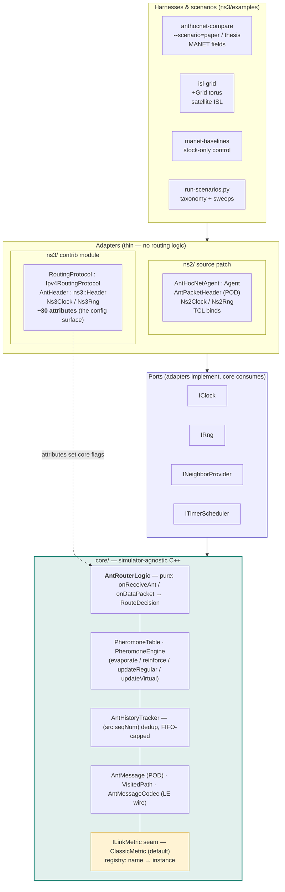
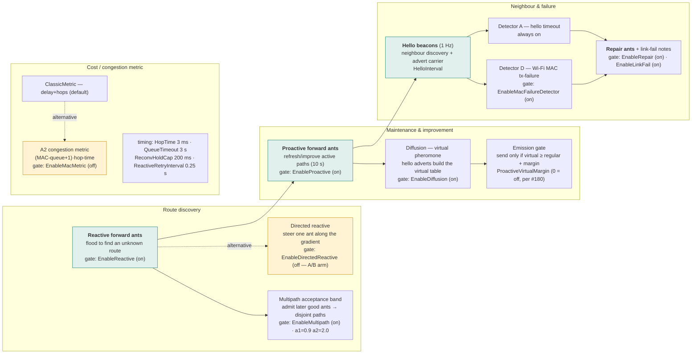
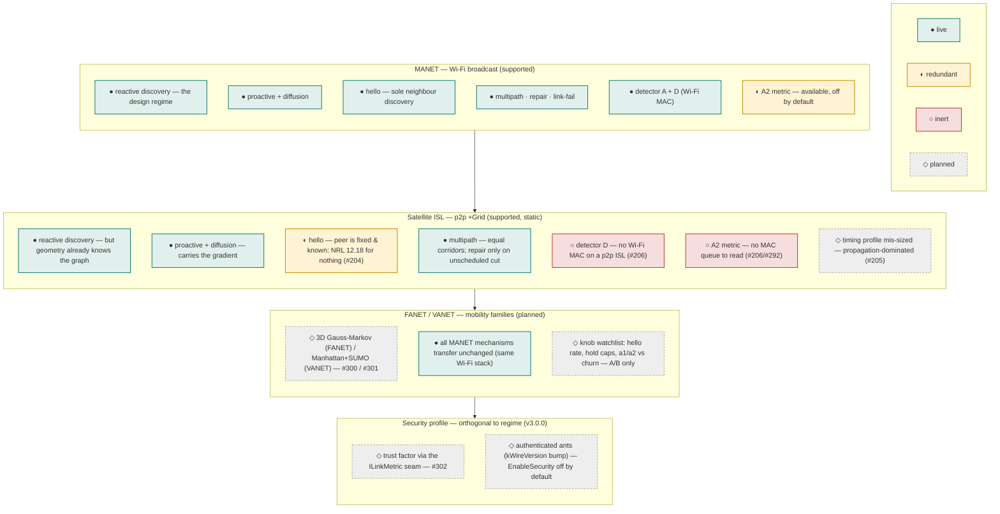

# Software layers and per-regime function support

How the one implementation is stacked, which ant mechanisms each configuration
switch gates, and what is live, inert, or planned in each network regime. This
is the visual companion to [`architecture.md`](architecture.md) (the core/adapter
split in detail) and [`network-regimes.md`](network-regimes.md) §6 (the
mechanism × regime table in prose). The rule everything below obeys: **one
binary, one attribute set — regimes and families change the *evaluation*, not
the protocol.**

Three diagrams, because one would be unreadable: (1) the software stack, (2) the
ant mechanisms and the switches that gate them, (3) what runs in each regime.

## 1. The software stack

Bottom-up: the simulator-agnostic algorithm, the ports that keep it I/O-free,
the per-simulator adapters, and the harnesses that drive scenarios. Nothing in
`core/` includes a simulator header; no adapter reimplements routing logic.

The **`ILinkMetric` seam** (highlighted) is the designed extension point:
`ClassicMetric` is the paper's Eq.2 default; energy-aware and fuzzy-composite
metrics (#145/#146) and the future trust factor (#302) plug in here without the
core learning about them. The **~30 ns-3 attributes** are the entire
configuration surface — the next diagram groups them by the mechanism they gate.

## 2. Ant mechanisms and their configuration gates

Every AntHocNet mechanism is an ant family plus the switch that turns it on and
the knobs that tune it. Defaults are the shipped values
([`configuration.md`](configuration.md) has provenance for each). **Master
switches** gate whole mechanisms; **tuning knobs** shape them.

Green = on by default (the paper-faithful protocol). Amber = default-off A/B
arms you opt into with an attribute. Everything is one `--ns3::anthocnet::RoutingProtocol::<Attr>=<v>`
away; the harnesses set none of these themselves (#177).

## 3. What runs in each regime

Same stack, same switches — but a mechanism can be **live**, **redundant**
(runs, pays a cost, buys nothing), **inert** (physically cannot fire), or
**planned**. The full argument per row is
[`network-regimes.md`](network-regimes.md) §6; this is the map.

Reading it column-wise gives each regime's honest one-liner. **MANET:**
everything live — the protocol is in its design regime. **Satellite:** the
discovery half runs but answers a solved problem, hello pays for nothing, the
two Wi-Fi-coupled mechanisms (detector D, A2) are inert, and the timing is
mis-sized — while the multipath/load half faces the real problem
([#192](https://github.com/danieljoppi/AntHocNet/issues/192) research
programme). **FANET/VANET:** no protocol change — the entire Wi-Fi mechanism set
transfers; the work is mobility models, presets, anchors, and a knob *watchlist*
resolved by measurement, not pre-tuning
([#300](https://github.com/danieljoppi/AntHocNet/issues/300)/[#301](https://github.com/danieljoppi/AntHocNet/issues/301)).
**Security:** orthogonal to all of them — it enters through the `ILinkMetric`
seam and an authenticated-ant wire field, default-off and byte-identical when
off ([#302](https://github.com/danieljoppi/AntHocNet/issues/302)).

## See also

- [`architecture.md`](architecture.md) — the core/adapter split and decision flow in detail.
- [`network-regimes.md`](network-regimes.md) — why the regimes differ (§1–§5) and the mechanism × regime table (§6).
- [`configuration.md`](configuration.md) — every attribute, its default, its provenance, and the calibration loop.
- [README “Supported network regimes”](../README.md#supported-network-regimes) — the family and side-by-side comparison tables.
